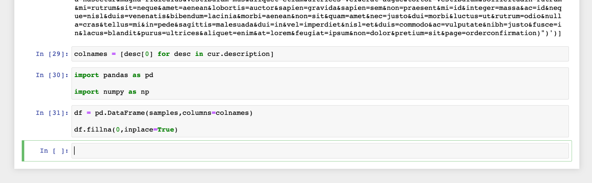

# Connect [!DNL Jupyter Notebook] to Query Service

This document covers the steps required to connect [!DNL Jupyter Notebook] with Adobe Experience Platform Query Service.

## Getting started

This guide requires that you already have access to [!DNL Jupyter Notebook] and are familiar with its interface. To download [!DNL Jupyter Notebook] or for more information, see the [official [!DNL Jupyter Notebook] documentation](https://jupyter.org/).

To acquire the necessary credentials for connecting [!DNL Jupyter Notebook] to Experience Platform, you must have access to the [!UICONTROL Queries] workspace in the Platform UI. Please contact your organization administrator if you do not currently have access to the [!UICONTROL Queries] workspace.

>[!TIP]
>
>[!DNL Anaconda Navigator] is a desktop graphical user interface (GUI) that provides an easier way to install and launch common [!DNL Python] programs such as [!DNL Jupyter Notebook]. It also helps to manage packages, environments, and channels without using command-line commands.
>You can [install your preferred version of the application](https://docs.anaconda.com/anaconda/install/) from their website. 
>Follow the guided installation process. From the Anaconda Navigator home screen, select **[!DNL Jupyter Notebook]** from the list of supported applications to launch the program.
>![The [!DNL Anaconda Navigator] home screen with [!DNL Jupyter Notebook] highlighted.](../images/clients/jupyter-notebook/anaconda-navigator-home.png)
>More information can be found in their [official documentation](https://docs.anaconda.com/anaconda/navigator/).

## Launch [!DNL Jupyter Notebook]

After you have opened a new [!DNL Jupyter Notebook] web application, select the **[!DNL New]** dropdown followed by **[!DNL Python 3]** to create a new Notebook. The [!DNL Notebook] editor appears.

![The [!DNL Jupiter Notebook] File tab with the [!DNL New] dropdown and [!DNL Python] 3 highlighted.](../images/clients/jupyter-notebook/new-notebook.png)

On the first line of the [!DNL Notebook] editor, enter the following value: `pip install psycopg2-binary` and select **[!DNL Run]** from the command bar. A success message appears below the input line. 

>[!IMPORTANT]
>
>As part of this process to form a connection, you must select **[!DNL Run]** to execute each line of code.

![The [!DNL Notebook] UI with the install libraries command highlighted.](../images/clients/jupyter-notebook/install-library.png)

Next, import a [!DNL PostgreSQL] database adapter for [!DNL Python]. Enter the value: `import psycopg2`and select **[!DNL Run]**. There is no success message for this process. If there is no error message, continue to the next step. 

![The [!DNL Notebook] UI with the import database driver code highlighted.](../images/clients/jupyter-notebook/import-dbdriver.png)

You must now provide your Adobe Experience Platform credentials by entering the value: `conn = psycopg2.connect("{YOUR_CREDENTIALS}")`. Your connection credentials can be found in the [!UICONTROL Queries] section, under the [!UICONTROL Credentials] tab of the Platform UI. See the documentation on how to [find your organization credentials](../ui/credentials.md) for detailed instructions.

The use of non-expiring credentials is recommended when using third-party clients to save the effort of repeatedly entering your details. See the documentation for instructions on [how to generate and use non-expiring credentials](../ui/credentials.md#non-expiring-credentials).

>[!IMPORTANT]
>
>When copying credentials from the Platform UI, ensure that there is no additional formatting of the credentials. They should all be in one line, with a single space between the properties and values. The credentials are enclosed in quotation marks and **not** comma-separated.

![The [!DNL Notebook] UI with the connection credentials highlighted.](../images/clients/jupyter-notebook/provide-credentials.png)

Your [!DNL Jupyter Notebook] instance is now connected to Query Service.

## Example query execution

Now that you have connected [!DNL Jupyter Notebook] to Query Service, you can perform queries on your datasets using your [!DNL Notebook] inputs. The following example uses a simple query to demonstrate the process.

Enter the following values: 

```console
cur = conn.cursor()
cur.execute('''{YOUR_QUERY_HERE}''')
data = [r for r in cur]
```

Next, call the parameter (`data` in the example above) to display the query results in an unformatted response.

![The [!DNL Notebook] UI with commands to return and display SQL results within the Notebook.](../images/clients/jupyter-notebook/example-query.png)

To format the results in a more human-readable way, use the following commands:

- `colnames = [desc[0] for desc in cur.description]`
- `import pandas as pd`
- `import numpy as np`

These commands do not generate a success message. If there is no error message you can then use a function to output the results of your SQL query in a table format.



Enter and run the `df.head()` function to see the tabularized query results.

![Tabularized results of your SQL query within [!DNL Jupyter Notebook].](../images/clients/jupyter-notebook/format-results-output.png)

## Next steps

Now that you've connected with Query Service, you can use [!DNL Jupyter Notebook] to write queries. For more information on how to write and run queries, please read the [running queries guide](../best-practices/writing-queries.md).
