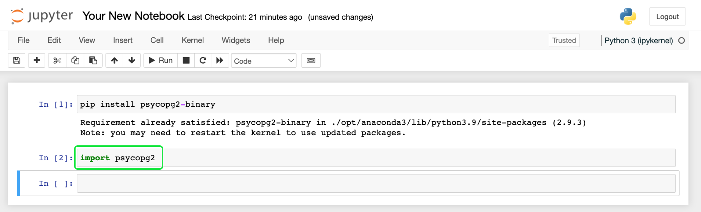

# Connect Jupyter Notebook to Query Service

This document covers the steps to connect [!DNL Jupyter Notebook] with Adobe Experience Platform Query Service.

## Getting started

This guide requires that you already have access to [!DNL Jupyter Notebook] and are familiar with its interface. To download [!DNL Jupyter Notebook] or for more information, see the [official [!DNL Jupyter Notebook] documentation](https://jupyter.org/).

To acquire the necessary credentials for connecting [!DNL Jupyter Notebook] to Experience Platform, you must have access to the [!UICONTROL Queries] workspace in the Platform UI. Please contact your organization administrator if you do not currently have access to the [!UICONTROL Queries] workspace.

>[!TIP]
>
>[!DNL Anaconda Navigator] is a desktop graphical user interface (GUI) that provides an easier way to install and launch common Python programs such as [!DNL Jupyter Notebook]. It also helps to manage packages, environments, and channels without using command-line commands. More information can be found in their [official documentation](https://docs.anaconda.com/anaconda/navigator/).

## Launch [!DNL Jupyter Notebook]

After you have opened a new [!DNL Jupyter Notebook] web application, select the **[!UICONTROL New]** dropdown followed by **[!UICONTROL Python 3]** to create a new Notebook. The Notebook editor appears.

On the first line of the notebook editor, enter the following value: `pip install psycopg2-binary` and select **[!UICONTROL Run]** from the command bar. A success message appears below the input line. 

>[!IMPORTANT]
>
>As part of this process to form a connection, you must select **[!UICONTROL Run]** to execute each line of code.

Next, import a PostgreSQL database adapter for Python. Enter the value: `import psycopg2`and select **[!UICONTROL Run]**. There is no success message for this process. If there is no error message, continue to the next step. 

You must now provide your Adobe Experience Platform credentials by entering the value: `conn = psycopg2.connect("{YOUR_CREDENTIALS}")`. Your connection credentials can be found in the [!UICONTROL Queries] [!UICONTROL Credentials] section of the Platform UI. See the documentation on how to [find your organization credentials](../ui/credentials.md) for detailed instructions.

>[!IMPORTANT]
>
>When copying credentials from the Platform UI, ensure that there is no additional formatting of the credentials. They should all be in one line, with a single space between the properties and values. The credentials are enclosed in quotation marks and **not** comma separated.

Your [!DNL Jupyter Notebook] instance is now connected to Query Service. 

## Next steps

Now that you've connected with Query Service, you can use [!DNL Jupyter Notebook] to write queries. For more information on how to write and run queries, please read the [running queries guide](../best-practices/writing-queries.md).
