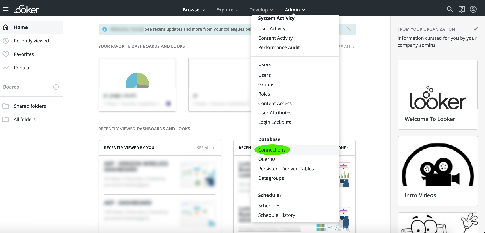
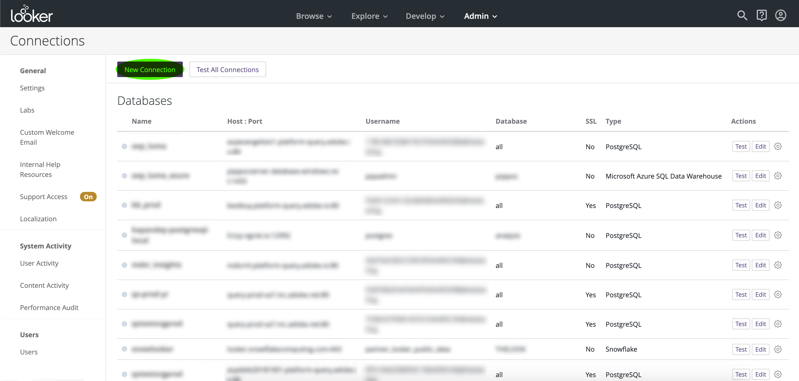
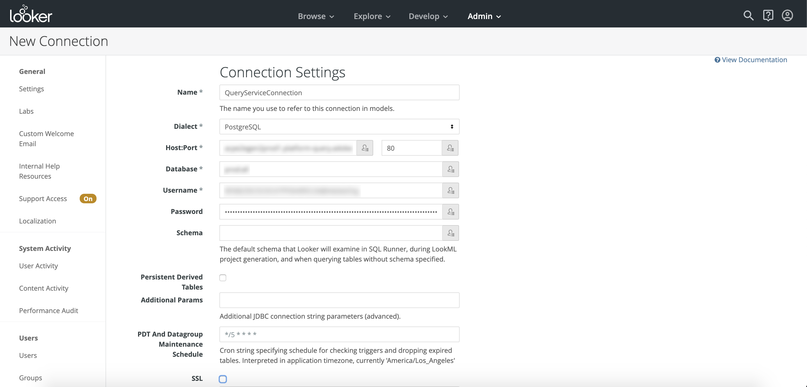
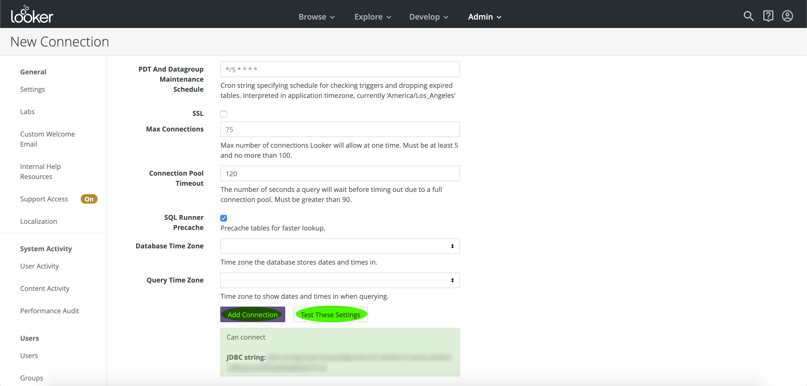

# Connect [!DNL Looker] to Query Service

This document covers the steps for connecting [!DNL Looker] with Adobe Experience Platform [!DNL Query Service].

>[!NOTE]
>
> This guide assumes you already have access to [!DNL Looker] and are familiar with how to navigate its interface. More information about [!DNL Looker] can be found in the [official [!DNL Looker] documentation](https://docs.looker.com/).

After logging into [!DNL Looker], select **[!DNL Admin]**, followed by **[!DNL Connections]**.

On this page, select **[!DNL New Connection]**.

   
From here, you can fill out the details for the connection settings.

- **[!DNL Name]:** The name of your connection.
- **[!DNL Dialect]:** The dialect used for the SQL database. [!DNL Query Service] uses **[!DNL PostgreSQL]**.
- **[!DNL Host and Port]:** The host endpoint and its port for [!DNL Query Service]. 
- **[!DNL Database]:** The database that will be used. 
- **[!DNL Username and Password]:** The login credentials that will be used. The username will be in the form of `ORG_ID@AdobeOrg`.
- **SSL**: Enable SSL to ensure a secure connection across the network. 

>[!IMPORTANT]
>
>See the [[!DNL Query Service] SSL documentation](./ssl-modes.md) to learn about SSL support for third-party connections to Adobe Experience Platform Query Service, and how to connect using `verify-full` SSL mode.

For more information on finding your host and port, database name, and login credentials, please read the [credentials guide](../ui/credentials.md). To find your credentials, log in to [!DNL Platform], then select **[!UICONTROL Queries]**, followed by **[!UICONTROL Credentials]**.

After inputting your connection details, select **[!DNL Test These Settings]** to ensure your credentials work properly. If they do, a message indicating that you can connect will appear below. If your connection is indeed successful, select **[!DNL Add Connection]** to create your connection.

## Next steps

Now that you've connected with [!DNL Query Service], you can use [!DNL Looker] to write queries. For more information on how to write and run queries, please read the [running queries guide](../best-practices/writing-queries.md).
