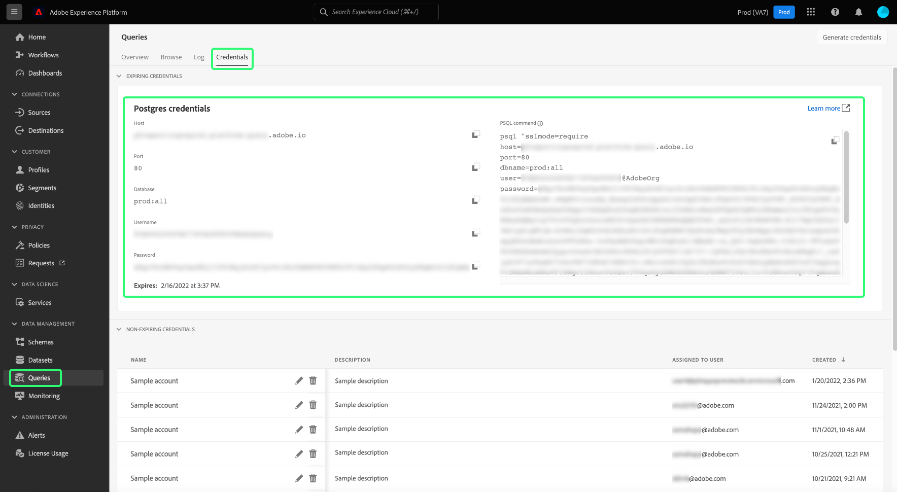

# Connect [!DNL Looker] to Query Service

This document covers the steps for connecting [!DNL Looker] with Adobe Experience Platform [!DNL Query Service].

>[!NOTE]
>
> This guide assumes you already have access to [!DNL Looker] and are familiar with how to navigate its interface. More information about [!DNL Looker] can be found in the [official [!DNL Looker] documentation](https://docs.looker.com/).

## Create a new database connection {#create-connection}

After logging into [!DNL Looker], select **[!DNL Admin]**, followed by **[!DNL Connections]**. The [!DNL Connections] page opens. On the [!DNL Connections] page, select **[!DNL Add Connection]**.
   
From here, enter the details for the connection settings listed below. See the official Looker documentation for [instructions to create a new database connection and descriptions of the available properties](https://cloud.google.com/looker/docs/connecting-to-your-db#creating_a_new_database_connection).

- **[!DNL Name]:** The name of your connection.
- **[!DNL Dialect]:** The dialect used for the SQL database. [!DNL Query Service] uses **[!DNL PostgreSQL]**.
- **[!DNL Host and Port]:** The host endpoint and its port for [!DNL Query Service]. 
- **[!DNL Database]:** The database that will be used. 
- **[!DNL Username and Password]:** The login credentials that will be used. The username will be in the form of `ORG_ID@AdobeOrg`.
- **SSL**: Enable SSL to ensure a secure connection across the network. 

To find the credentials necessary to connect Looker with Query Service, log in to the Platform UI and select **[!UICONTROL Queries]** from the left navigation, followed by **[!UICONTROL Credentials]**. For more information on finding your **host**, **port**, **database**, **username**, and **password** credentials, please read the [credentials guide](../ui/credentials.md). 

>[!IMPORTANT]
>
>[!DNL Query Service] also offers non-expiring credentials to allow for a one-time setup with third-party clients. See the documentation for [full instructions on how to generate and use non-expiring credentials](../ui/credentials.md#non-expiring-credentials). It is necessary to complete this process if you wish to connect Looker as a one-time setup. The `credential` and `technicalAccountId` values acquired comprise the value for the Looker `password` parameter.

To learn about SSL support for third-party connections in Adobe Experience Platform, see the [[!DNL Query Service] SSL documentation](./ssl-modes.md). This document provides instructions on how to connect using `verify-full` SSL mode.

After you have entered your connection details, select **[!DNL Test These Settings]** to ensure your credentials work properly. More information on [testing your connection settings](https://cloud.google.com/looker/docs/connecting-to-your-db#testing_your_connection_settings) are provided in the official Looker documentation. Upon a successful connection, a message appears on screen to indicate that you can connect. Once your connection is successful, select **[!DNL Add Connection]** to create your connection.

## Next steps

Now that you've connected with [!DNL Query Service], you can use [!DNL Looker] to write queries. For more information on how to write and run queries, please read the [running queries guide](../best-practices/writing-queries.md).
