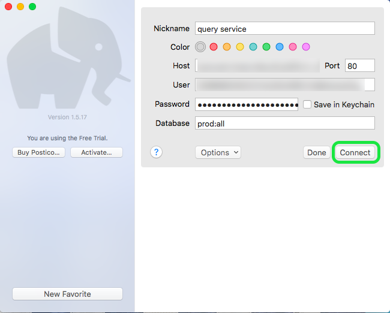
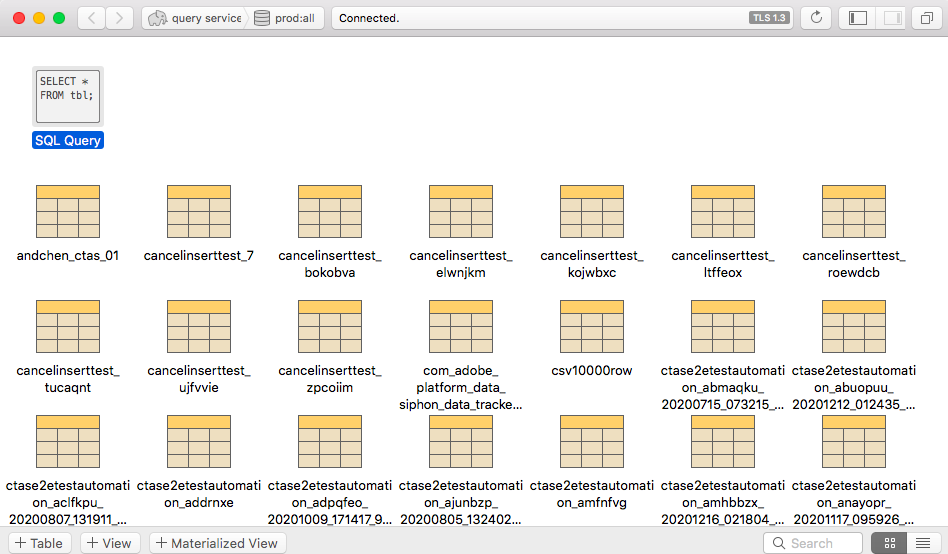
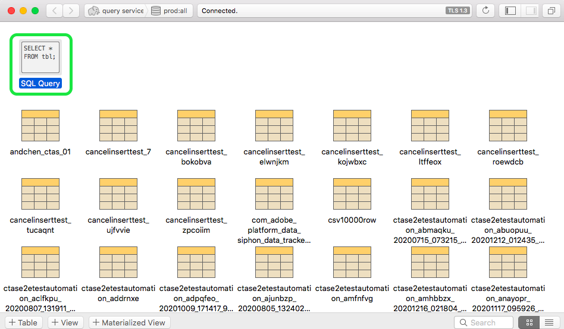
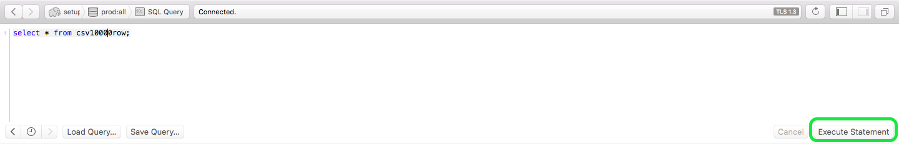
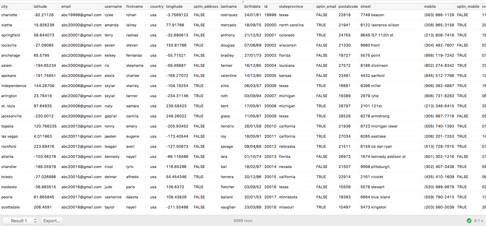

# Connect [!DNL Postico] to Query Service (Mac)

This document covers the steps for connecting [!DNL Postico] with Adobe Experience Platform [!DNL Query Service].

>[!NOTE]
>
> This guide assumes you already have access to [!DNL Postico] and are familiar with how to navigate its interface. More information about [!DNL Postico] can be found in the [official [!DNL Postico] documentation](https://eggerapps.at/postico/docs).
> 
> Additionally, [!DNL Postico] is **only** available on macOS devices.

To connect [!DNL Postico] to Query Service, open [!DNL Postico] and select **[!DNL New Favorite]**.

You can now enter values to connect with Adobe Experience Platform. 

For more information on finding your database name, host, port, and login credentials, please read the [credentials guide](../ui/credentials.md). To find your credentials, log in to [!DNL Platform], then select **[!UICONTROL Queries]**, followed by **[!UICONTROL Credentials]**.

After inserting your credentials, select **[!DNL Connect]** to connect with Query Service.

After connecting to Platform, you'll be able to see a list of all the relations previously made with Query Service.

## Create SQL statements

To create a new SQL query, select and open "SQL Query".

A box appears, and from here you can type in the query you want to execute. When finished, select **[!DNL Execute Statement]** to run the query.

A table appears, showing the results of your completed query run.

## Next steps

Now that you've connected with [!DNL Query Service], you can use [!DNL Postico] to write queries. For more information on how to write and run queries, please read the [running queries guide](../best-practices/writing-queries.md).
