# Connect Power BI to Query Service

This document covers the steps for connecting Power BI Desktop with Adobe Experience Platform Query Service.

## Getting started

This guide requires that you already have access to the Power BI desktop app and are familiar with how to navigate its interface. To download Power BI Desktop or for more information, see the [official Power BI documentation](https://docs.microsoft.com/en-us/power-bi/).

>[!IMPORTANT]
>
> The Power BI desktop application is **only** available on Windows devices.

To acquire the necessary credentials for connecting Power BI to Experience Platform, you must have access to the Queries workspace in the Platform UI. Please contact your IMS Organization administrator if you do not currently have access to the Queries workspace. 

After installing Power BI, you will need to install `Npgsql`, a .NET driver package for PostgreSQL. More information about Npgsql can be found in the [Npgsql documentation](https://www.npgsql.org/doc/index.html).

>[!IMPORTANT]
>
>You must download v4.0.10 or lower, as newer versions result in errors.

Under "[!DNL Npgsql GAC Installation]" on the custom setup screen, select **[!DNL Will be installed on local hard drive]**. 

To ensure that Npgsql has been properly installed, please restart your computer before proceeding to the next steps.

## Connect Power BI to Query Service {#connect-power-bi}

To connect Power BI to Query Service, open Power BI and select **[!DNL Get Data]** in the top menu ribbon.

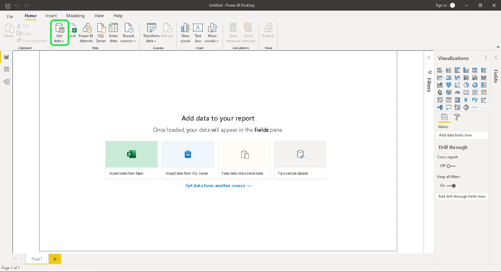

Enter "PostgreSQL" in the search bar to narrow the list of data sources. Under the results that appear, select **[!DNL PostgreSQL database]**, followed by **[!DNL Connect]**.

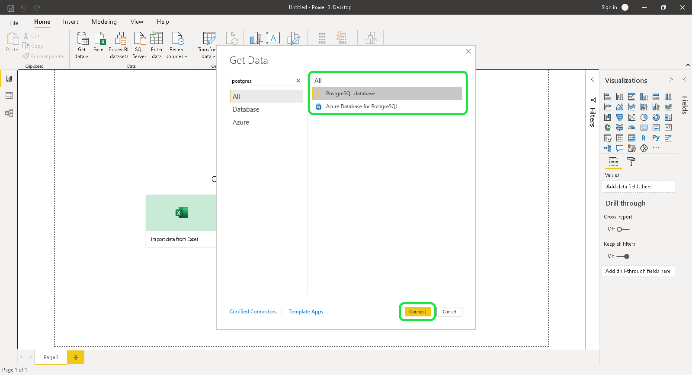

The PostgreSQl database dialog appears, requesting values for your server and database. These values are taken from your Adobe Experience Platform credentials. To find your credentials, log in to the Platform UI and select **[!UICONTROL Queries]** from the left navigation, followed by **[!UICONTROL Credentials]**. For more information on finding your database name, host, port, and login credentials, please read the [credentials guide](../ui/credentials.md). 

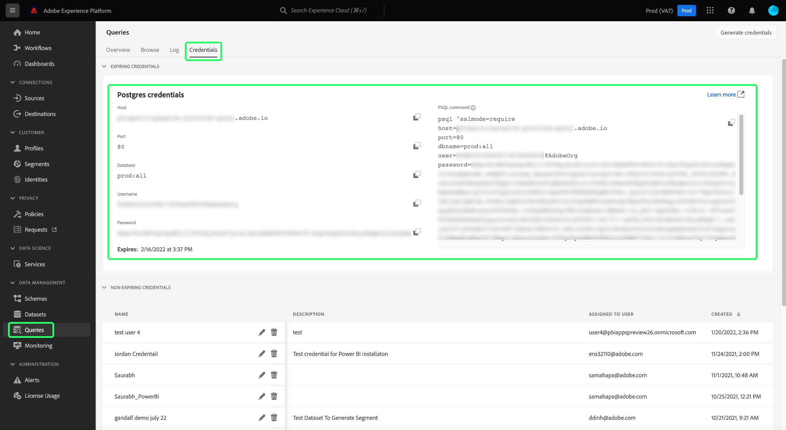

For the **[!DNL Server]** field in Power BI, enter the value for the host found in the Query Service Credentials section. For production, add port `:80` to the end of the host string. For example, `made-up.platform-query.adobe.io:80`.

The **[!DNL Database]** field can be either "all" or a dataset table name. For example, `prod:all`.

>[!IMPORTANT]
>
>Nested data structures in third-party BI tools can be flattened to improve their usability and reduce the required workload to retrieve, analyze, transform and report data. See the documentation on the[`FLATTEN` feature](../best-practices/flatten-nested-data.md) for instructions on how to activate this setting when connecting to a database.

### Data Connectivity mode

Next, you can select your **[!DNL Data Connectivity mode]**. Select **[!DNL Import]** followed by **[!DNL OK]** to display a list of all available tables, or select **[!DNL DirectQuery]** to query the data source directly without importing or copying data directly into Power BI. 

To learn more about **[!DNL Import]** mode, please read the section on [importing a table](#import). To learn more about **[!DNL DirectQuery]** mode, please read the section on [querying a dataset without importing data](#direct-query). 

Select **[!DNL OK]** after confirming your database details.

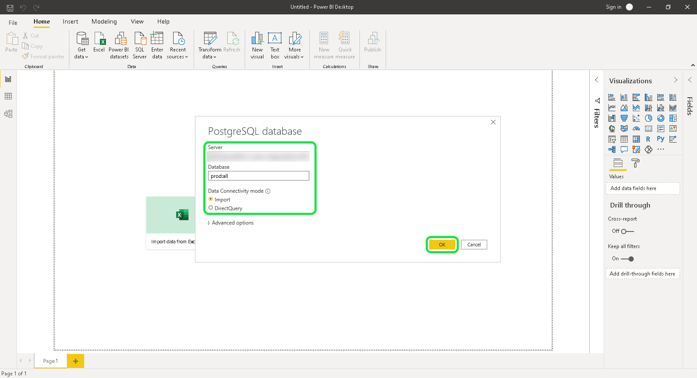

### Authentication

A prompt asking for your username, password, and application settings appears. The username in this case is your Organization ID and the password is your authentication token. Both can be found on the Query Service credentials page.

Fill in these details, then select **[!DNL Connect]** to continue to the next step. 

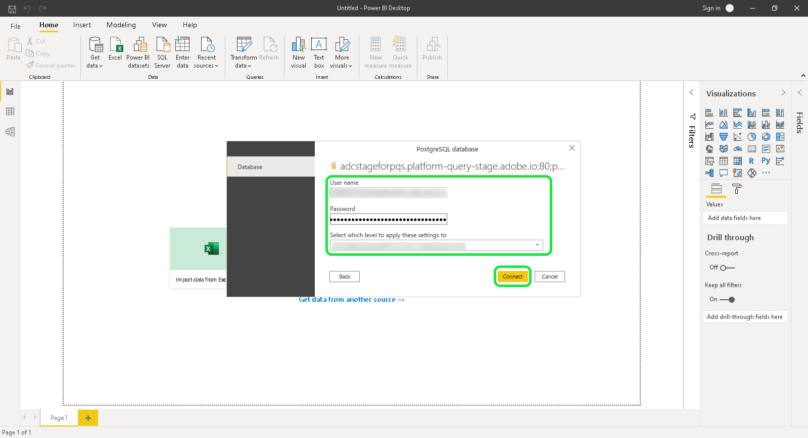

## Import a table {#import}

By selecting the **[!DNL Import]** [!DNL Data Connectivity mode], the full dataset is imported which allows you to use the selected tables and columns within the Power BI desktop application as-is.

>[!IMPORTANT]
>
>To see data changes that have occurred since the initial import, you must refresh the data within Power BI by importing the full dataset again.

To import a table, enter the server and database details [as described above](#connect-power-bi) and select the **[!DNL Import]** [!DNL Data Connectivity mode], followed by **[!DNL OK]**. A dialog appears, displaying a list of all the available tables. Select the table you want to preview, followed by **[!DNL Load]** to bring the dataset into Power BI.

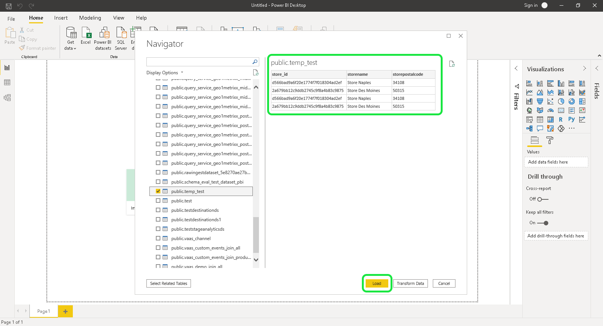

The table is now imported into Power BI. 

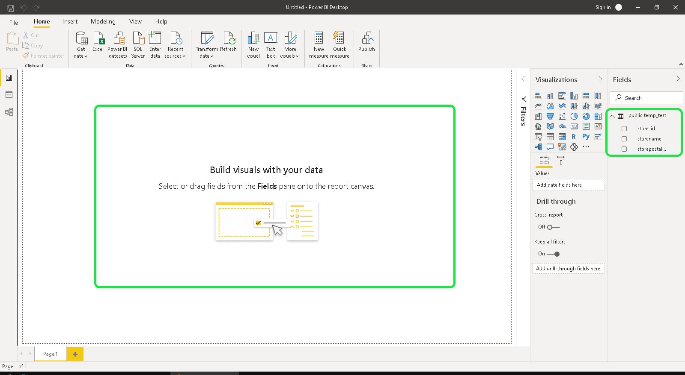

### Import tables using custom SQL

Power BI and other third-party tools like Tableau do not currently allow users to import nested objects, such as XDM objects in Platform. To account for this, Power BI allows you to use custom SQL to access these nested fields and create a flattened view of the data. Power BI then loads this flattened view of the previously nested data as a normal table.

From the PostgreSQL database popover, select **[!DNL Advanced options]** to enter a custom SQL query in the **[!DNL SQL statement]** section. This custom query should be used to flatten your JSON name-value pairs into a table format.

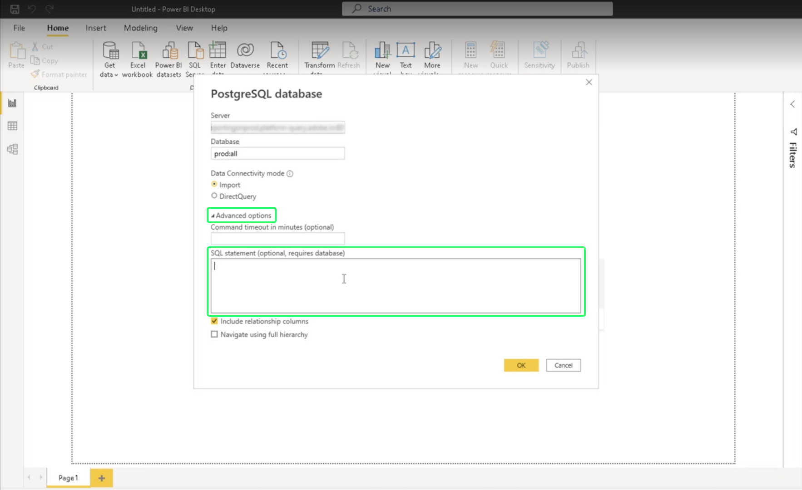

After you have entered your customized query, select **[!DNL OK]** to continue with connecting your database. See the [authentication](#authentication) section above for guidance on connecting a database from this part of the workflow.

Once authentication is complete, a preview of the flattened data appears in the Power BI Desktop dashboard as a table. The server and database name are listed at the top of the dialog. Select **[!DNL Load]** to complete the import process.

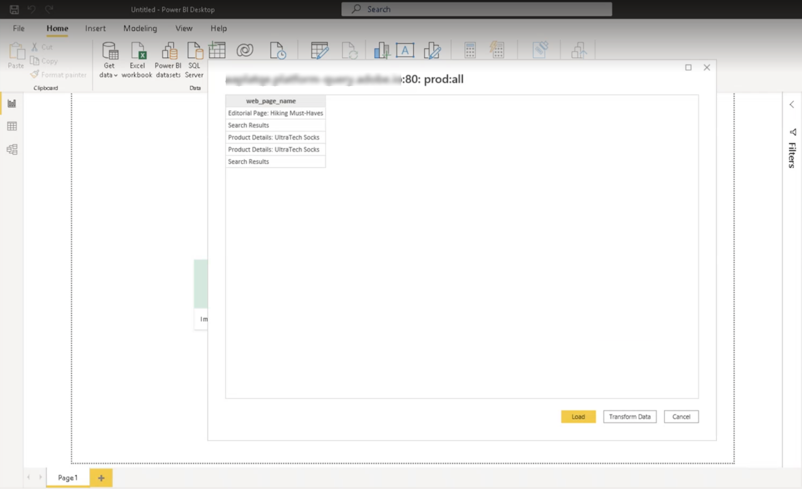

The visualizations are now available for editing and exporting from the Power BI Desktop app. 

## Query the dataset without importing data {#direct-query}
 
The **[!DNL DirectQuery]** [!DNL Data Connectivity mode] queries the data source directly without importing or copying data into the Power BI Desktop. Using this connection mode, you can refresh all visualizations with current data through the UI. However, the time required to produce or refresh the visualization will vary depending on the performance of the underlying data source.

To use this [!DNL Data Connectivity mode], select the **[!DNL DirectQuery]** toggle then **[!DNL Advanced options]** to enter a custom SQL query in the **[!DNL SQL statement]** section. Ensure that **[!DNL Include relationship columns]** is selected. Once you have completed your query, select **[!DNL OK]** to continue.

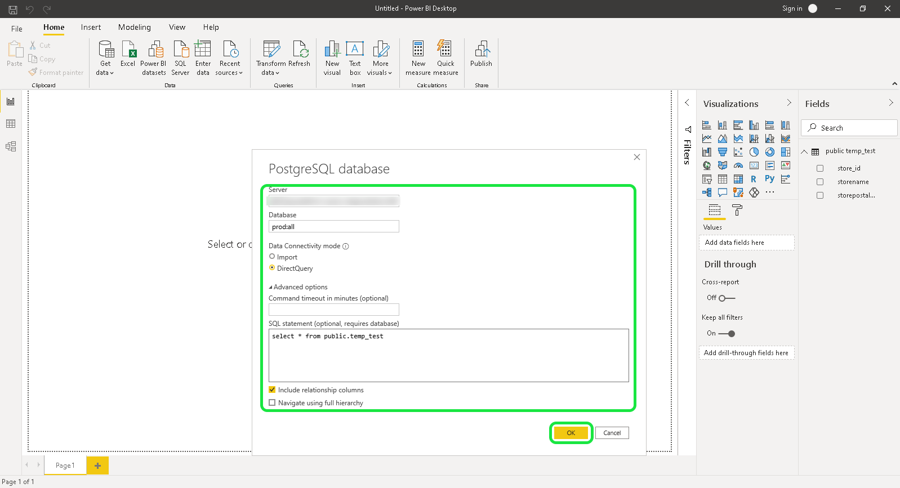

A preview of your query appears. Select **[!DNL Load]** to see the results of the query.

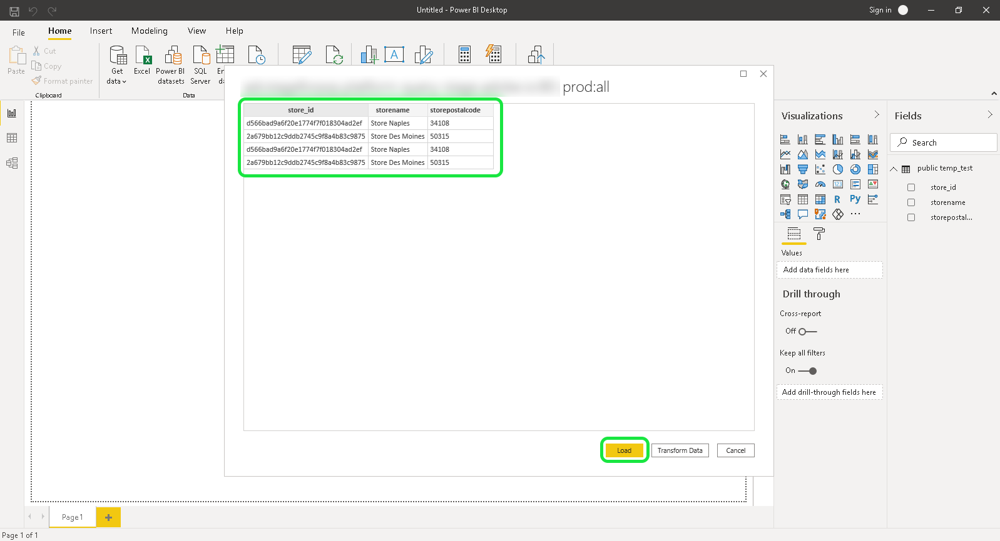

## Next steps

By reading this document, you should now understand how to connect to the Power BI Desktop app and the different data connection modes available. For more information on how to write and run queries, refer to the [guidance for query execution](../best-practices/writing-queries.md).
