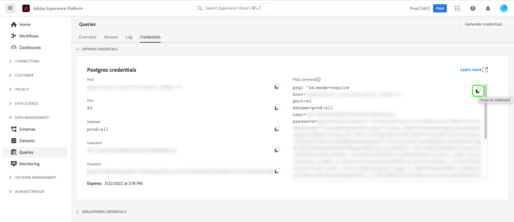

# Connect with PSQL

PSQL is a command-line interface that comes when you install [!DNL Postgres] on your machine. You can install it by following these instructions. 

## Install Postgres on a Mac

Open a terminal window and issue these three commands:

```shell
/usr/bin/ruby -e "$(curl -fsSL https://raw.githubusercontent.com/Homebrew/install/master/install)"
```

```shell
brew install postgres
```

```shell
which psql
```

After issuing these commands, you should see the following:

```shell
/usr/local/bin/psql
```

## Install [!DNL Postgres] on a PC

Download and install [!DNL Postgres] from this [location](https://www.postgresql.org/download/windows/).

Edit your path variable:


    
Add the two lines shown that include "[!DNL Postgres]."
    
Save your updates, then open a command prompt and type:

```shell
psql -V
```

You should see something like this:

```shell
psql (PostgreSQL) 9.5.14
```

## Connect PSQL and [!DNL Query Service]

Return to the [!DNL Platform] UI on the **[!UICONTROL Connect BI Tools]** page. 

Click **[!UICONTROL copy]** for **[!UICONTROL PSQL Command]**.
    


>[!IMPORTANT]
>
>If you are on a PC, use a text editor to remove the line breaks in the command string, then copy the string. Additionally, if you are using version 12.0 or greater, you will need to add `PGGSSENCMODE=disable` to your connection string.

Paste the command string into a terminal or command window and press Enter.

You should see a result like this:

```shell
psql (10.5, server 0.1.0)
SSL connection (protocol: TLSv1.2, cipher: ECDHE-RSA-AES256-GCM-SHA384, bits: 256, compression: off)
Type "help" for help.
all=>
```

If you don't see at least version 10.5, then you need to download that version or newer.