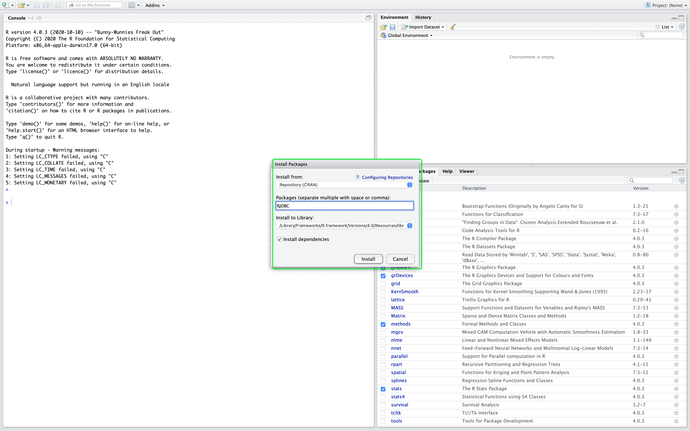

# Connect [!DNL RStudio] to Query Service

This document walks through the steps for connecting [!DNL RStudio] with Adobe Experience Platform [!DNL Query Service].

>[!NOTE]
>
> This guide assumes you already have access to [!DNL RStudio] and are familiar with how to use it. More information about [!DNL RStudio] can be found in the [official [!DNL RStudio] documentation](https://rstudio.com/products/rstudio/).
> 
> Additionally, to use [!DNL RStudio] with Query Service, you need to install the [!DNL PostgreSQL] JDBC 4.2 Driver. You can download the JDBC Driver from the [[!DNL PostgreSQL] official site](https://jdbc.postgresql.org/download/).

## Create a [!DNL Query Service] connection in the [!DNL RStudio] interface

After installing [!DNL RStudio], you need to install the RJDBC package. Go to the **[!DNL Packages]** pane, and select **[!DNL Install]**. 

![The [!DNL RStudio] dashboard with Packages and Install highlighted.](../images/clients/rstudio/install-package.png)

A pop up appears, showing the **[!DNL Install Packages]** screen. Ensure that **[!DNL Repository (CRAN)]** is selected for the **[!DNL Install from]** section. The value for **[!DNL Packages]** should be `RJDBC`. Ensure **[!DNL Install dependencies]** is selected. After confirming all the values are correct, select **[!DNL Install]** to install the packages.



Now that the RJDBC package has been installed, restart [!DNL RStudio] to complete the installation process.

After [!DNL RStudio] has restarted, you can now connect to Query Service. Select the **[!DNL RJDBC]** package in the **[!DNL Packages]** pane, and enter the following command in the console:

```console
pgsql <- JDBC("org.postgresql.Driver", "{PATH TO THE POSTGRESQL JDBC JAR}", "`")
```

Where `{PATH TO THE POSTGRESQL JDBC JAR}` represents the path to the [!DNL PostgreSQL] JDBC JAR that was installed on your computer.

Now, you can create your connection to Query Service. Enter the following command in the console:

```console
qsconnection <- dbConnect(pgsql, "jdbc:postgresql://{HOSTNAME}:{PORT}/{DATABASE_NAME}?user={USERNAME}&password={PASSWORD}&sslmode=require")
```

>[!IMPORTANT]
>
>See the [[!DNL Query Service] SSL documentation](./ssl-modes.md) to learn about SSL support for third-party connections to Adobe Experience Platform Query Service, and how to connect using `verify-full` SSL mode.

For more information on finding your database name, host, port, and login credentials, please read the [credentials guide](../ui/credentials.md). To find your credentials, log in to [!DNL Platform], then select **[!UICONTROL Queries]**, followed by **[!UICONTROL Credentials]**.

![The console output in [!DNL RStudio] from the connection to Query Service.](../images/clients/rstudio/connection-rjdbc.png)

## Writing queries

Now that you have connected to [!DNL Query Service], you can write queries to execute and edit SQL statements. For example, you can use `dbGetQuery(con, sql)` to execute queries, where `sql` is the SQL query you want to run.

The following query uses a dataset containing [Experience Events](../../xdm/classes/experienceevent.md) and creates a histogram of page views of a website, given the device's screen height.

```sql
df_pageviews <- dbGetQuery(con,
"SELECT t.range AS buckets, 
 Count(*) AS pageviews 
FROM (SELECT CASE 
 WHEN device.screenheight BETWEEN 0 AND 99 THEN '0 - 99' 
 WHEN device.screenheight BETWEEN 100 AND 199 THEN '100-199' 
 WHEN device.screenheight BETWEEN 200 AND 299 THEN '200-299' 
 WHEN device.screenheight BETWEEN 300 AND 399 THEN '300-399' 
 WHEN device.screenheight BETWEEN 400 AND 499 THEN '400-499' 
 WHEN device.screenheight BETWEEN 500 AND 599 THEN '500-599' 
 ELSE '600-699' 
 end AS range 
 FROM aa_post_vals_3) t 
GROUP BY t.range 
ORDER BY buckets 
LIMIT 1000000")
```

A successful response returns the results of the query: 

```r
df_pageviews
 buckets pageviews
1 0 - 99 198985
2 500-599 67138
3 300-399 2147
4 200-299 354
5 400-499 6947
6 100-199 4415
7 600-699 3097040
```

## Next steps

For more information on how to write and run queries, please read the guide on [running queries](../best-practices/writing-queries.md).
