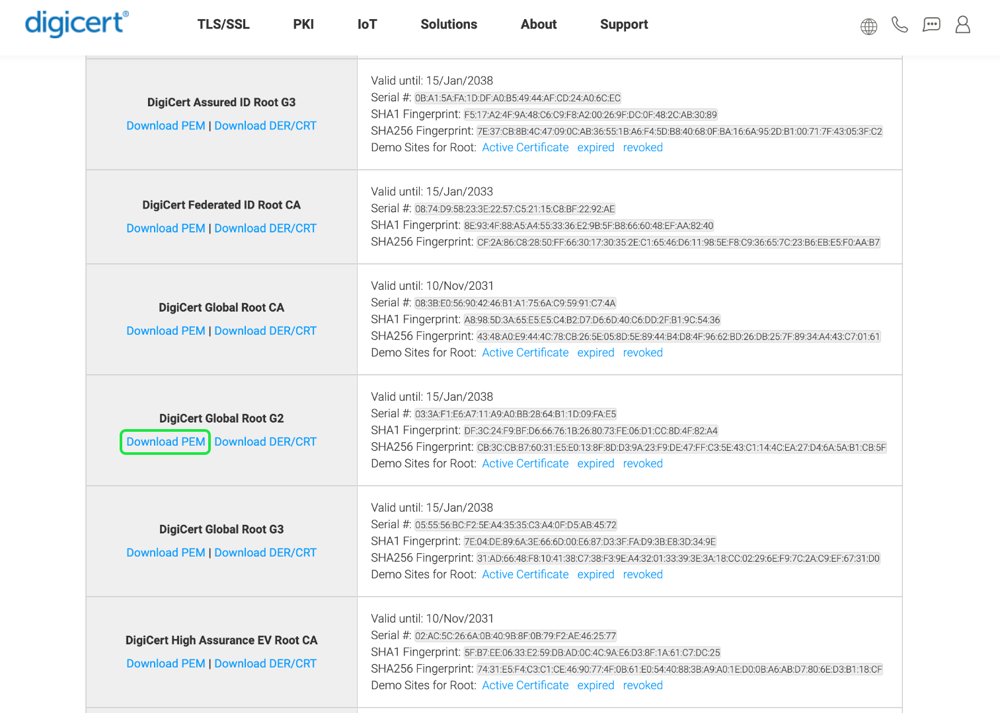

# [!DNL Query Service] SSL options

For increased security, Adobe Experience Platform [!DNL Query Service] provides native support for SSL connections to encrypt client/server communications. This document covers the available SSL options for third-party client connections to [!DNL Query Service] and how to connect using the `verify-full` SSL parameter value.

## Prerequisites

This document assumes that you have already downloaded a third-party desktop client application for use with your Platform data. Specific instructions on how to incorporate SSL security when connecting with a third-party client are found in their respective connection guide documentation. For a list of all [!DNL Query Service] supported clients, see the [client connections overview](./overview.md).

## Available SSL options {#available-ssl-options}

Platform supports various SSL options to suit your data security needs and balance the processing overhead of encryption and key exchange. 

The different `sslmode` parameter values provide different levels of protection. By encrypting your data in motion with SSL certificates, it helps to prevent "man-in-the-middle" (MITM) attacks, eavesdropping, and impersonation. The table below provides a breakdown of the different SSL modes available and the level of protection they provide.

>[!NOTE]
>
> The SSL value `disable` is not supported by Adobe Experience Platform due to the requisite data protection compliance. 

|  sslmode |  Eavesdropping protection | MITM protection  | Description  |
|---|---|---|---|
| `allow`  | Partial  | No  | Security is not a priority, speed and a low processing overhead are more important. This mode only opts for encryption if the server insists on it.  |
| `prefer`  | Partial  | No  | Encryption is not required but the communication will be encrypted if the server supports it.  |
| `require`  | Yes  | No  | Encryption is required on all communications. The network is trusted to connect to the correct server. Server SSL certificate validation is not required. |
| `verify-ca`  | Yes  | Depends on CA-policy  | Encryption is required on all communications. Server validation is required before data is shared. This requires you to set up a root certificate in your [!DNL PostgreSQL] home directory. [Details are provided below](#instructions) |
| `verify-full`  | Yes  | Yes  | Encryption is required on all communications. Server validation is required before data is shared. This requires you to set up a root certificate in your [!DNL PostgreSQL] home directory. [Details are provided below](#instructions).  |

>[!NOTE]
>
>The difference between `verify-ca` and `verify-full` depends on the policy of the root certificate authority (CA). If you have created your own local CA to issue private certificates for your applications, using `verify-ca` often provides enough protection. If using a public CA, `verify-ca` allows connections to a server that somebody else may have registered with the CA. `verify-full` should always be used with a public root CA.

When establishing a third-party connection to a Platform database, you are recommended to use `sslmode=require` at a minimum to ensure a secure connection for your data in motion. The `verify-full` SSL mode is recommended for use in most security-sensitive environments.

## Set up a root certificate for sever verification {#root-certificate}

>[!IMPORTANT]
>
>The TLS/SSL certificates on Production environments for the Query Service Interactive Postgres API were refreshed on Wednesday 24th January 2024. Although this is an annual requirement, on this occasion the root certificate in the chain has also changed as Adobe's TLS/SSL certificate provider have updated their certificate hierarchy. This can impact certain Postgres clients if their list of Certificate Authorities are missing the root cert. For example, a PSQL CLI client may need to have the root certs added to an explicit file `~/postgresql/root.crt`, otherwise this can result in an error. For example, `psql: error: SSL error: certificate verify failed`. See the [official PostgreSQL documentation](https://www.postgresql.org/docs/current/libpq-ssl.html#LIBQ-SSL-CERTIFICATES) for more information on this issue. The root certificate to add can be downloaded from [https://cacerts.digicert.com/DigiCertGlobalRootG2.crt.pem](https://cacerts.digicert.com/DigiCertGlobalRootG2.crt.pem).

To ensure a secure connection, SSL usage must be configured on both the client and the server before the connection is made. If the SSL is only configured on the server, the client might send sensitive information such as passwords before it is established that the server requires high security.

By default, [!DNL PostgreSQL] does not perform any verification of the server certificate. To verify the server's identity and ensure a secure connection before any sensitive data is sent (as part of the SSL `verify-full` mode), you must place a root (self-signed) certificate on your local machine (`root.crt`) and a leaf certificate signed by the root certificate on the server.

If the `sslmode` parameter is set to `verify-full`, libpq will verify that the server is trustworthy by checking the certificate chain up to the root certificate stored on the client. It then verifies that the hostname matches the name stored in the server certificate.

To allow server certificate verification, you must place one or more root certificates (`root.crt`) in the [!DNL PostgreSQL] file in your home directory. The file path would be similar to `~/.postgresql/root.crt`.

## Enable verify-full SSL mode for use with a third-party [!DNL Query Service] connection {#instructions}

If you need stricter security control than `sslmode=require`, you can follow the steps highlighted to connect a third-party client to [!DNL Query Service] using `verify-full` SSL mode.

>[!NOTE]
>
>There are many options available to attain an SSL certificate. Due to a growing trend in rogue certificates, DigiCert is used in this guide as they are a trusted global provider of high-assurance TLS/SSL, PKI, IoT, and signing solutions. 

1. Navigate to [the list of available DigiCert root certificates](https://www.digicert.com/kb/digicert-root-certificates.htm)
1. Search for "[!DNL DigiCert Global Root G2]" from the list of available certificates.
1. Select [!DNL **Download PEM**] to download the file to your local machine.

1. Rename the security certificate file to `root.crt`.
1. Copy the file to the [!DNL PostgreSQL] folder. The necessary file path is different depending on your operating system. If the folder does not already exist, create the folder. 
    - If you are using macOS, the path is `/Users/<username>/.postgresql`
    - If you are using Windows, the path is `%appdata%\postgresql`

>[!TIP]
>
>To find your `%appdata%` file location on a Windows operating system, press ⊞ **Win + R** and input `%appdata%` into the search field.

After the [!DNL DigiCert Global Root G2] CRT file is available in your [!DNL PostgreSQL] folder, you can connect to [!DNL Query Service] using the `sslmode=verify-full` or `sslmode=verify-ca` option.

## Next steps

By reading this document, you have a better understanding of the available SSL options for connecting a third-party client to [!DNL Query Service], and also how to enable the `verify-full` SSL option to encrypt your data in motion.

If you have not done so already, follow the guidance on [connecting a third-party client to [!DNL Query Service]](./overview.md).
