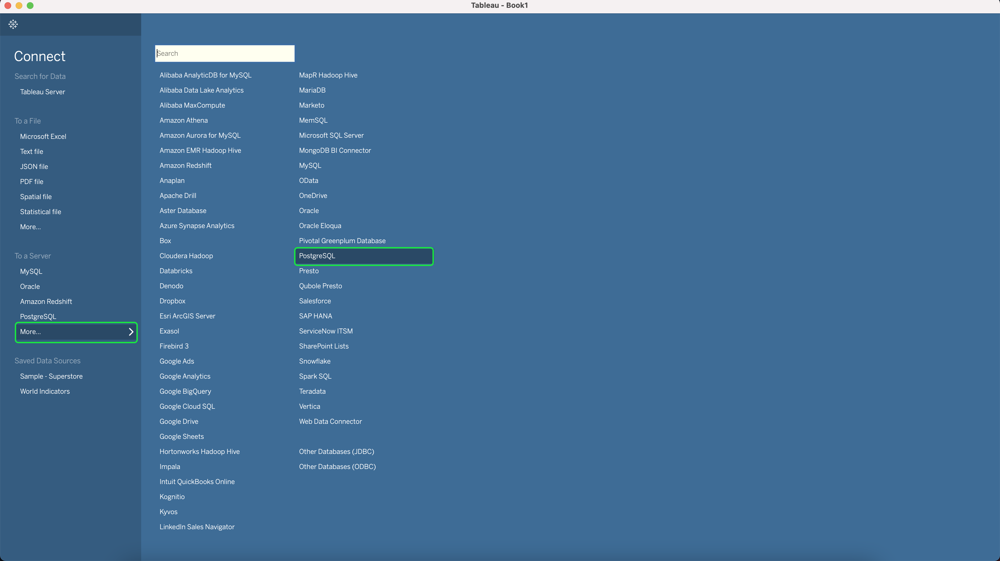
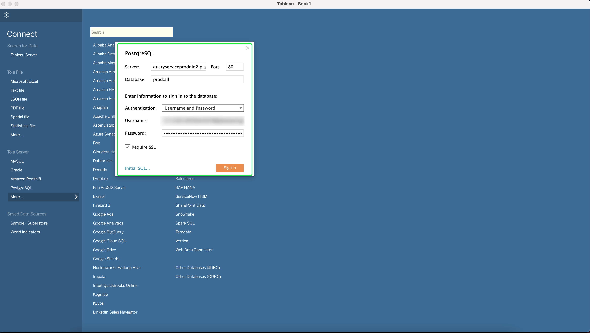
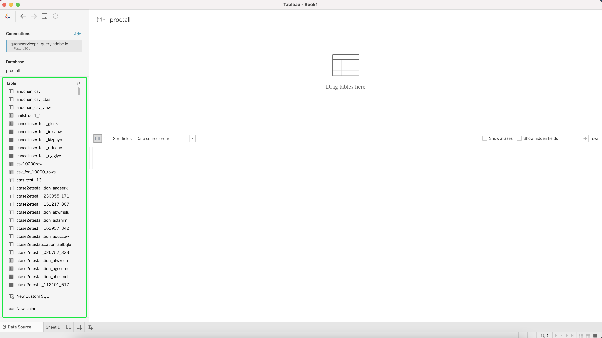

# Connect [!DNL Tableau] to Query Service

This document covers the steps for connecting Tableau with Adobe Experience Platform [!DNL Query Service].

>[!NOTE]
>
> This guide assumes you already have access to [!DNL Tableau] and are familiar with how to navigate its interface. More information about [!DNL Tableau] can be found in the [official [!DNL Tableau] documentation](https://help.tableau.com/current/pro/desktop/en-us/default.htm).

To connect [!DNL Tableau] to [!DNL Query Service], open [!DNL Tableau], and in the **[!DNL To a Server]** section select **[!DNL More]** followed by **[!DNL PostgreSQL]** 

You can now enter values to connect with Adobe Experience Platform. For more information on finding your database name, host, port, and login credentials, please read the [credentials guide](../ui/credentials.md). To find your credentials, log in to [!DNL Platform], then select **[!UICONTROL Queries]**, followed by **[!UICONTROL Credentials]**.

Ensure that you have checked the **[!UICONTROL Require SSL]** box before trying to connect.

>[!IMPORTANT]
>
>See the [[!DNL Query Service] SSL documentation](./ssl-modes.md) to learn about SSL support for third-party connections to Adobe Experience Platform Query Service, and how to connect using `verify-full` SSL mode.

    
>[!IMPORTANT]
>
>Nested data structures in third-party BI tools can be flattened to improve their usability and reduce the required workload to retrieve, analyze, transform and report data. See the documentation on the[`FLATTEN` feature](../best-practices/flatten-nested-data.md) for instructions on how to activate this setting when connecting to a database. 

After filling in all your credentials, select **[!DNL Sign In]** to continue.

You have now connected with Adobe Experience Platform, with a list of your tables displayed on the side.

## Next steps

Now that you've connected with [!DNL Query Service], you can use [!DNL Tableau] to write queries. For more information on how to write and run queries, please read the guide on [running queries](../best-practices/writing-queries.md).
