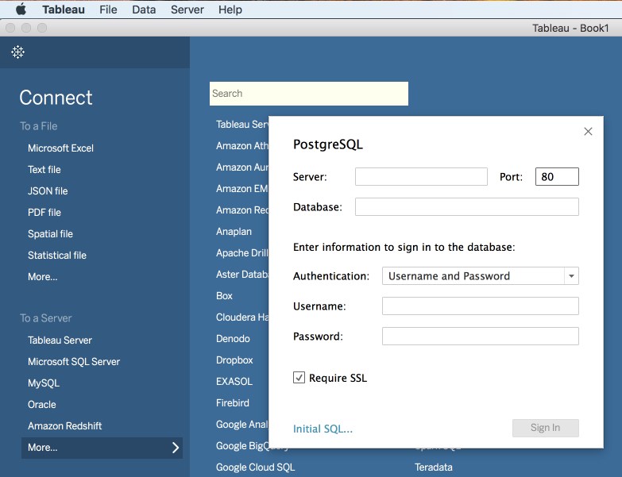

# Connect with [!DNL Tableau]

Install [!DNL Tableau], if it is not already installed.

>[!NOTE]
>
>You can get a 14-day trial of "[!DNL Tableau] Desktop" [here](https://www.tableau.com/products/desktop/download).
>    
> The version `2018.1.2 (20181.18.0615.1128 64 bit)` has been successful in connecting to [!DNL Query Service].

Run [!DNL Tableau], and on the opening screen click to open a [!DNL Postgres] connection.

Individually copy `Host, Port, Database, Username, Password` from the [!DNL Platform] UI's **[!UICONTROL Connect BI Tools]** page into the corresponding Tableau fields.

Confirm that you have checked the **[!UICONTROL SSL Required]** box before trying to connect.
    
