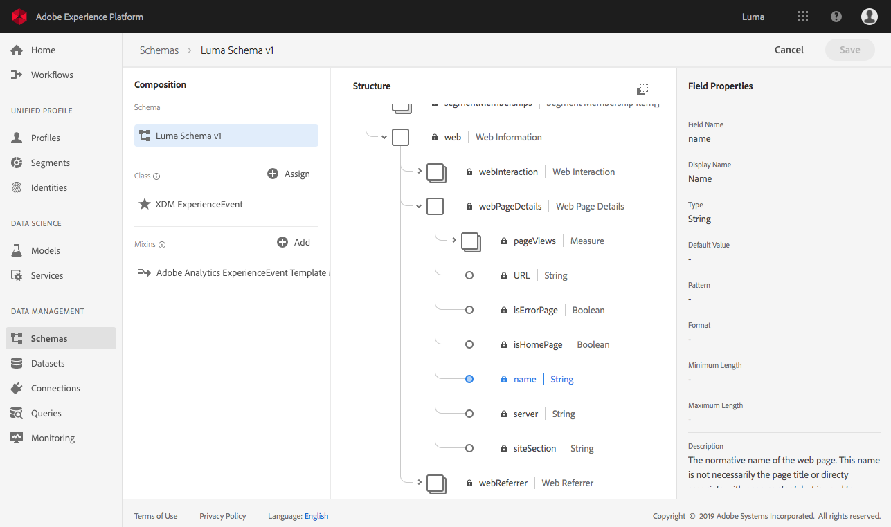

# Datasets vs tables and schemas

Review the list of datasets available in the [Adobe Experience Platform UI](https://platform.adobe.com/datasets), being sure to observe the dataset names. 
>[!NOTE]
>
>Some dataset names have spaces and might otherwise not be SQL safe. 


Review the hierarchical structure of the Dataset schema in the UI by clicking on a schema name in the dataset table. 



Open the PSQL command line and use the connection details from here: [https://platform.adobe.com/query/configuration](https://platform.adobe.com/query/configuration).


To view the available tables on [!DNL Platform] with SQL, you can use either `\d` or `SHOW TABLES;`.


`\d` displays the standard PostgreSQL view

```sql
             List of relations
 Schema |       Name      | Type  |  Owner   
--------+-----------------+-------+----------
 public | luma_midvalues  | table | postgres
 public | luma_postvalues | table | postgres
(2 rows)
```

`SHOW TABLES;` is a custom command that gives a more detailed view and presents the table, as well as the dataset name found in the [!DNL Platform] UI.

```sql
       name      |        dataSetId         |     dataSet    | description | resolved 
-----------------+--------------------------+----------------+-------------+----------
 luma_midvalues  | 5bac030c29bb8d12fa992e58 | Luma midValues |             | false
 luma_postvalues | 5c86b896b3c162151785b43c | Luma midValues |             | false
(2 rows)
```

To view the root schema of a table use the `\d table_name` command.

>[!NOTE]
>
>The schema presented shows the root fields, most of which are complex, referred to an Object type in the Dataset schema UI. 

`\d luma_midvalues`

```sql
                         Table "public.luma_midvalues"
      Column       |             Type            | Collation | Nullable | Default 
-------------------+-----------------------------+-----------+----------+---------
 timestamp         | timestamp                   |           |          | 
 _id               | text                        |           |          | 
 productlistitems  | anyarray                    |           |          | 
 commerce          | luma_midvalues_commerce     |           |          | 
 receivedtimestamp | timestamp                   |           |          | 
 enduserids        | luma_midvalues_enduserids   |           |          | 
 datasource        | datasource                  |           |          | 
 web               | luma_midvalues_web          |           |          | 
 placecontext      | luma_midvalues_placecontext |           |          | 
 identitymap       | anymap                      |           |          | 
 marketing         | marketing                   |           |          | 
 environment       | luma_midvalues_environment  |           |          | 
 _experience       | luma_midvalues__experience  |           |          | 
 device            | device                      |           |          | 
 search            | search                      |           |          | 
```

To go further into the schema, use underscores (`_`) to declare the column in the table you want to describe. For example, `\d table_name_column`

`\d luma_midvalues_web`

```sql
                 Composite type "public.luma_midvalues_web"
     Column     |               Type                | Collation | Nullable | Default 
----------------+-----------------------------------+-----------+----------+---------
 webpagedetails | luma_midvalues_web_webpagedetails |           |          | 
 webreferrer    | web_webreferrer                   |           |          | 
```