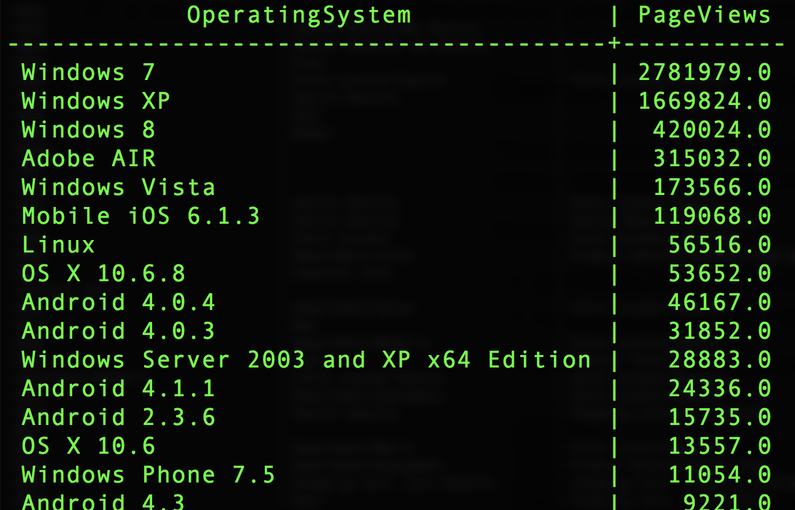

# Joining datasets

Joining datasets allows you to include data from other datasets in your query. This example uses a custom operating system dataset to map the `operatingsystemID` to the `operatingsystem` value.

Datasets:
- your_analytics_table
- custom_operating_system_lookup

Create a `SELECT` statement for the top 50 operating systems by number of page views.

```sql
SELECT 
  b.operatingsystem AS OperatingSystem,
  SUM(a.web.webPageDetails.pageviews.value) AS PageViews
FROM your_analytics_table a 
     JOIN custom_operating_system_lookup b 
      ON a._experience.analytics.environment.operatingsystemID = b.operatingsystemid 
WHERE _ACP_YEAR=2018 
GROUP BY OperatingSystem 
ORDER BY PageViews DESC
LIMIT 50;
```

