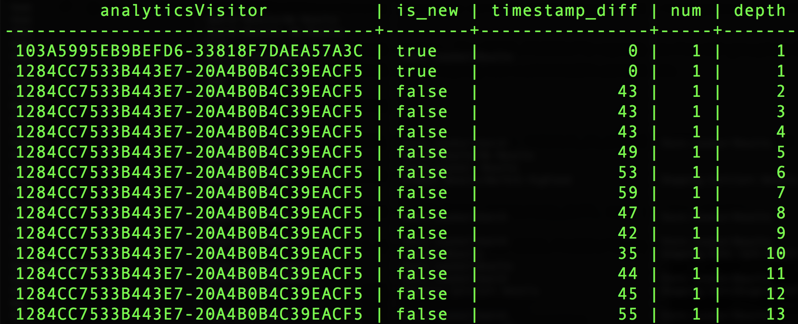
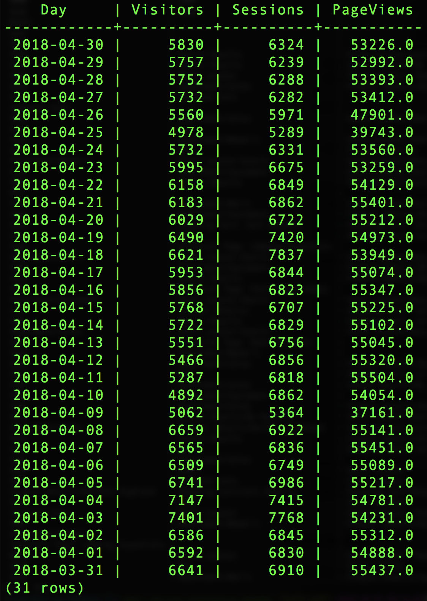
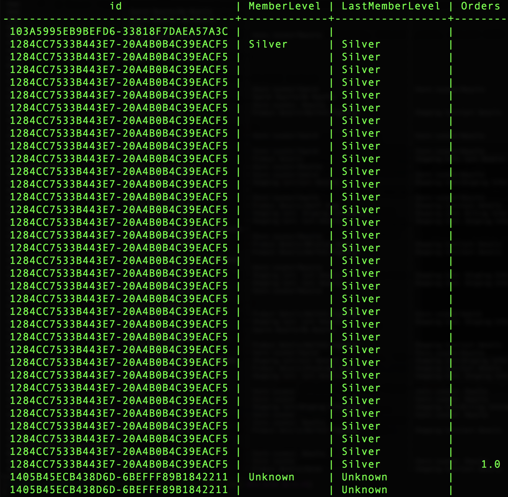
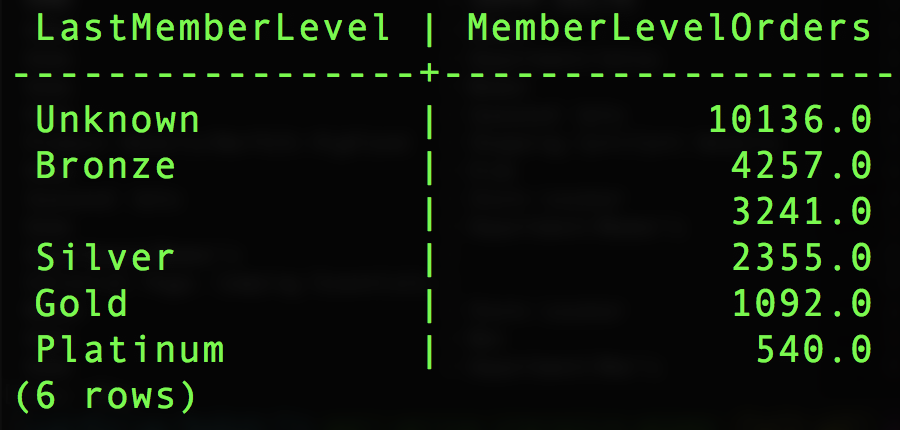
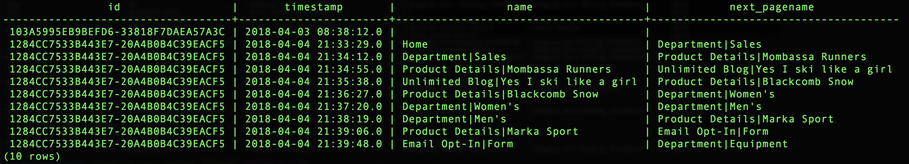

# Using Adobe-defined functions

One of Adobe's big differentiators is that they understand experience data and what customers need to be able to do with that data. You can use this understanding to build helper functions that make your job easier.

This document covers Adobe-defined functions (ADFs) to support three key [!DNL Analytics] activities:
- [Sessionization](#sessionization)
- [Attribution](#attribution)
- [Pathing](#pathing)

## Sessionization

The `SESS_TIMEOUT()` reproduces the visit groupings found with Adobe Analytics. It performs a similar time-based grouping, but with customizable parameters.

**Syntax:**

`SESS_TIMEOUT(timestamp, timeout_in_seconds) OVER ([partition] [order] [frame])`

**Returns:**

Structure with fields `(timestamp_diff, num, is_new, depth)`

### Explore the row-level `SESS_TIMEOUT()` and output

```sql
SELECT analyticsVisitor,
      session.is_new,
      session.timestamp_diff,
      session.num,
      session.depth
FROM  (
        SELECT endUserIDs._experience.aaid.id as analyticsVisitor,
        SESS_TIMEOUT(timestamp, 60 * 30)
        OVER (PARTITION BY endUserIDs._experience.aaid.id
        ORDER BY timestamp
        ROWS BETWEEN UNBOUNDED PRECEDING AND CURRENT ROW)
        AS session
        FROM your_analytics_table
        WHERE _ACP_YEAR = 2018
      )
LIMIT 100;
```



### Create a new trended report with visitors, sessions, and page views

```sql
SELECT
      date_format( from_utc_timestamp(timestamp, 'EDT') , 'yyyy-MM-dd') as Day,
      COUNT(DISTINCT analyticsVisitor ) as Visitors,
      COUNT(DISTINCT analyticsVisitor || session.num ) as Sessions,
      SUM( PageViews ) as PageViews
FROM
    (
      SELECT
          timestamp,
          endUserIDs._experience.aaid.id as analyticsVisitor,
          SESS_TIMEOUT(timestamp, 60 * 30)
      OVER (PARTITION BY endUserIDs._experience.aaid.id
      ORDER BY timestamp
      ROWS BETWEEN UNBOUNDED PRECEDING AND CURRENT ROW)
      AS session,
          web.webPageDetails.pageviews.value as PageViews
      FROM your_analytics_table
      WHERE _ACP_YEAR = 2018
    )
GROUP BY Day 
ORDER BY Day DESC 
LIMIT 31;
```



## Attribution

Attribution is how you allocate metrics or conversions like revenue, order, or sign-ups to your marketing efforts.

In Adobe Analytics, attribution settings are configured using variables like eVars and are generated as data is ingested.

The Attribution ADFs found in [!DNL Query Service] allow those allocations to be defined and generated at query time.

This example focuses on last-touch attribution, but Adobe also offers first-touch attribution. 

>[!NOTE]
>
>Other options with timeouts and event-based expiration will be available in future versions of [!DNL Query Service].

**Syntax:**

`ATTRIBUTION_LAST_TOUCH(timestamp, [channel_name], column) OVER ([partition] [order] [frame])`

**Returns:**

Structure with field `(value)`

### Explore the row-level attribution

```sql
SELECT
  endUserIds._experience.aaid.id,
  _experience.analytics.customDimensions.evars.evar10 as MemberLevel,
  ATTRIBUTION_LAST_TOUCH(timestamp, 'eVar10', _experience.analytics.customDimensions.evars.evar10)
      OVER(PARTITION BY endUserIds._experience.aaid.id
           ORDER BY timestamp
           ROWS BETWEEN UNBOUNDED PRECEDING AND CURRENT ROW).value
      AS LastMemberLevel,
  commerce.purchases.value as Orders
FROM your_analytics_table 
WHERE _ACP_YEAR=2018 AND _ACP_MONTH=4
LIMIT 50;
```



### Create a breakdown of orders by Last Member Level (eVar10)

```sql
SELECT
  LastMemberLevel,
  SUM(Orders) as MemberLevelOrders
FROM 
(SELECT
  ATTRIBUTION_LAST_TOUCH(timestamp, 'eVar10', _experience.analytics.customDimensions.evars.evar10)
      OVER(PARTITION BY endUserIds._experience.aaid.id
           ORDER BY timestamp
           ROWS BETWEEN UNBOUNDED PRECEDING AND CURRENT ROW).value
      AS LastMemberLevel,
  commerce.purchases.value as Orders
FROM your_analytics_table 
WHERE _ACP_YEAR=2018 AND _ACP_MONTH=4
)
GROUP BY LastMemberLevel 
ORDER BY MemberLevelOrders DESC
LIMIT 25;
```



## Pathing

Pathing helps to understand how customers navigate your site. The `NEXT()` and `PREVIOUS()` ADFs make this possible.

**Syntax:**

```sql
NEXT(key, [shift, [ignoreNulls]]) OVER ([partition] [order] [frame])
PREVIOUS(key, [shift, [ignoreNulls]]) OVER ([partition] [order] [frame])
```

**Returns:**

Structure with field `(value)`

### Select the current page and next page

```sql
SELECT 
      endUserIds._experience.aaid.id,
      timestamp,
      web.webPageDetails.name,
      NEXT(web.webPageDetails.name, 1, true)
          OVER(PARTITION BY endUserIds._experience.aaid.id
              ORDER BY timestamp
              ROWS BETWEEN CURRENT ROW AND UNBOUNDED FOLLOWING).value
          AS next_pagename
FROM your_analytics_table
WHERE _ACP_YEAR=2018 
LIMIT 10;
```



### Create a breakdown report for the top five page names on entry of the session

```sql
  SELECT 
    PageName,
    PageName_2,
    PageName_3,
    PageName_4,
    PageName_5,
    SUM(PageViews) as PageViews
  FROM
    (SELECT
      PageName,
      NEXT(PageName, 1, true)
        OVER(PARTITION BY VisitorID, session.num
              ORDER BY timestamp
              ROWS BETWEEN CURRENT ROW AND UNBOUNDED FOLLOWING).value
        AS PageName_2,
      NEXT(PageName, 2, true)
        OVER(PARTITION BY VisitorID, session.num
              ORDER BY timestamp
              ROWS BETWEEN CURRENT ROW AND UNBOUNDED FOLLOWING).value
        AS PageName_3,
      NEXT(PageName, 3, true)
         OVER(PARTITION BY VisitorID, session.num
              ORDER BY timestamp
              ROWS BETWEEN CURRENT ROW AND UNBOUNDED FOLLOWING).value
        AS PageName_4,
      NEXT(PageName, 4, true)
         OVER(PARTITION BY VisitorID, session.num
              ORDER BY timestamp
              ROWS BETWEEN CURRENT ROW AND UNBOUNDED FOLLOWING).value
        AS PageName_5,
      PageViews,
      session.depth AS SessionPageDepth
    FROM
      (SELECT
        endUserIds._experience.aaid.id as VisitorID,
        timestamp,
        web.webPageDetails.pageviews.value AS PageViews,
        web.webPageDetails.name AS PageName,
        SESS_TIMEOUT(timestamp, 60 * 30) 
          OVER (PARTITION BY endUserIDs._experience.aaid.id 
                ORDER BY timestamp 
                ROWS BETWEEN UNBOUNDED PRECEDING AND CURRENT ROW) 
        AS session
      FROM your_analytics_table
      WHERE _ACP_YEAR=2018)
    )
  WHERE SessionPageDepth=1
  GROUP BY PageName, PageName_2, PageName_3, PageName_4, PageName_5
  ORDER BY PageViews DESC
  LIMIT 100;
```


## Additional resources

The following video shows how to run queries in the Adobe Experience Platform interface and in a PSQL client. Additionally, the video also uses examples involving individual properties in an XDM object, using Adobe-defined functions, and using CREATE TABLE AS SELECT (CTAS).

>[!VIDEO](https://video.tv.adobe.com/v/29796?quality=12&learn=on)

