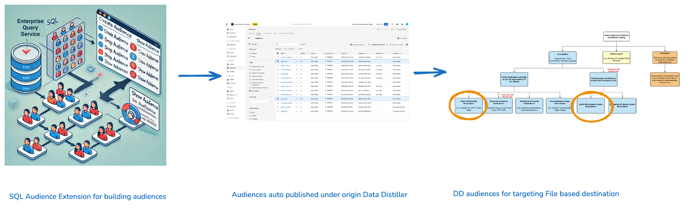
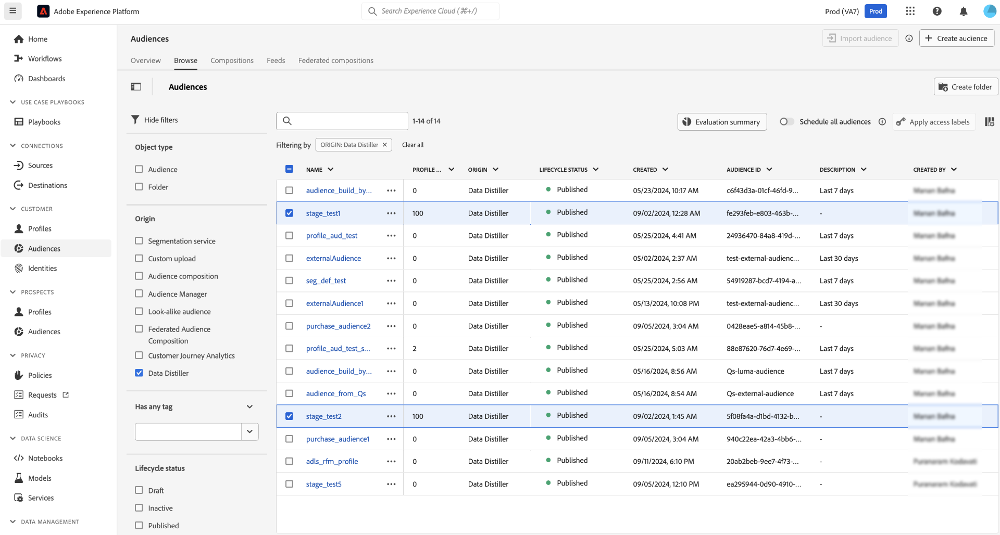
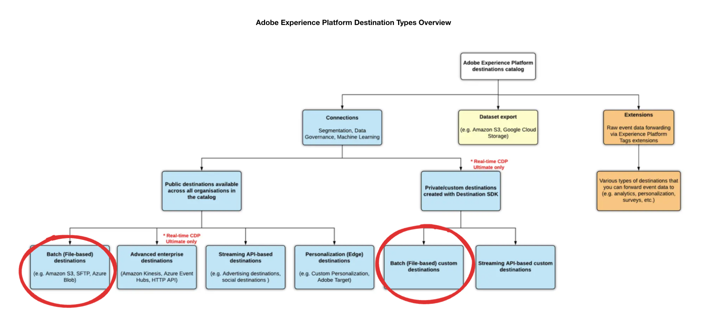

# Build audiences using SQL

Use the SQL audience extension to build audiences with data from the data lake, including any existing dimension entities (such as customer attributes or product information).

Using this SQL extension improves your ability to create audiences as you don't need raw data in your profiles when defining audience segments. Audiences created using this method are automatically registered in the Audience workspace, where you can further target them to file-based destinations.



This document covers how to use the SQL audience extension in Adobe Experience Platform's Data Distiller to create, manage, and publish audiences using SQL commands.

## Audience creation lifecycle in Data Distiller {#audience-creation-lifecycle}

Follow these steps to create, manage, and activate your audiences. Created audiences integrate seamlessly into the 'audience flow,' so you can build segments from base audiences and target file-based destinations (for example, CSV uploads or cloud storage locations) for customer outreach. 'Audience flow' refers to the complete process of creating, managing, and activating audiences, ensuring seamless integration across destinations. 

As part of your 'audience flow,' use the following SQL commands to [create](#create-audience), [modify](#add-profiles-to-audience), and [delete](#delete-audience) audiences within Adobe Experience Platform.

### Create an audience {#create-audience}

Use the `CREATE AUDIENCE AS SELECT` command to define a new audience. The created audience is saved in a dataset and registered in the [!UICONTROL Audiences] workspace under Data Distiller.

```sql
CREATE AUDIENCE table_name  
WITH (primary_identity='IdentitycolName', identity_namespace='Namespace for the identity used', [schema='target_schema_title'])
AS (select_query)
```

**Parameters**

Use these parameters to define your SQL audience creation query:

| Parameter          | Description                                                      |
|--------------------|------------------------------------------------------------------|
| `schema`           | Optional. Defines the XDM schema for the dataset created by the query. |
| `table_name`       | Name of the table and audience.                                  |
| `primary_identity` | Specifies the primary identity column for the audience.          |
| `identity_namespace` | Namespace of the identity. You can use an existing namespace or create a new one. To see available namespaces, use the `SHOW NAMESPACES` command. To create a new namespace, use `CREATE NAMESPACE`. For example: `CREATE NAMESPACE lumaCrmId WITH (code='testns', TYPE='Email')`. |
| `select_query`     | A SELECT statement defining the audience. The syntax of the SELECT query can be found in the [SELECT queries](../sql/syntax.md#select-queries) section. |

{style="table-layout:auto"}

>[!NOTE]
>
>To provide greater flexibility for complex data structures, you can nest enriched attributes when defining audiences. Enriched attributes, such as `orders`, `total_revenue`, `recency`, `frequency`, and `monetization`, can be used to filter audiences as needed.

**Example:**

The following example demonstrates how to structure your SQL audience creation query:

```sql
CREATE Audience aud_test
WITH (primary_identity=userId, identity_namespace=lumaCrmId)
AS SELECT userId, orders, total_revenue, recency, frequency, monetization FROM profile_dim_customer;
```

In this example, the `userId` column is identified as the identity column, and an appropriate namespace (`lumaCrmId`) is assigned. The remaining columns (`orders`, `total_revenue`, `recency`, `frequency`, and `monetization`) are enriched attributes that provide additional context for the audience.

**Limitations:**

Be aware of the following limitations when using SQL for audience creation:

- The primary identity column **must** be at the highest level of the dataset, without being nested within other attributes or categories.
- External audiences created using SQL commands have a retention period of 30 days. After 30 days, these audiences are automatically deleted, which is an important consideration for planning audience management strategies.

### Add profiles to an existing audience {#add-profiles-to-audience}

Use the `INSERT INTO` command to add profiles (or entire audiences) to an existing audience.

```sql
INSERT INTO table_name
SELECT select_query
```

**Parameters**

The table below explains the parameters required for the `INSERT INTO` command:

| Parameter      | Description                                                                    |
|----------------|--------------------------------------------------------------------------------|
| `table_name`   | The name of the table that was created as part of the create audience command. |
| `select_query` | A SELECT statement. The syntax of the SELECT query can be found in the SELECT queries section. |

{style="table-layout:auto"}

**Example:**

The following example demonstrates how to add profiles to an existing audience with the `INSERT INTO` command:

```sql
INSERT INTO Audience aud_test
SELECT userId, orders, total_revenue, recency, frequency, monetization FROM customer_ds;
```

### RFM model audience example {#rfm-model-audience-example}

The following example demonstrates how to create an audience using the Recency, Frequency, and Monetization (RFM) model. This example segments customers based on their recency, frequency, and monetization scores to identify key groups, such as loyal customers, new customers, and high-value customers.

<!--  Q) Since the focus of this document is on external audiences, or should I just include this temporarily? We could simply provide a link to the separate RFM modeling documentation rather than including the full example here. (Add link to new RFM document when it is published) -->

The following query creates a schema for the RFM audience. The statement sets up fields to hold customer information such as `userId`, `days_since_last_purchase`, `orders`, `total_revenue`, and so on.

```sql
CREATE Audience adls_rfm_profile
WITH (primary_identity=userId, identity_namespace=lumaCrmId) AS
SELECT
    cast(NULL AS string) userId,
    cast(NULL AS integer) days_since_last_purchase,
    cast(NULL AS integer) orders,
    cast(NULL AS decimal(18,2)) total_revenue,
    cast(NULL AS integer) recency,
    cast(NULL AS integer) frequency,
    cast(NULL AS integer) monetization,
    cast(NULL AS string) rfm_model
WHERE false;
```

After creating the audience, populate it with customer data and segment the profiles based on their RFM scores. The SQL statement below uses the `NTILE(4)` function to rank customers into quartiles based on their RFM (Recency, Frequency, Monetization) scores. These scores categorize customers into six segments, such as 'Core,' 'Loyal,' and 'Whales.' The segmented customer data is then inserted into the audience `adls_rfm_profile` table."

```sql
INSERT INTO Audience adls_rfm_profile
SELECT
    userId,
    days_since_last_purchase,
    orders,
    total_revenue,
    recency,
    frequency,
    monetization,
    CASE
        WHEN Recency=1 AND Frequency=1 AND Monetization=1 THEN '1. Core - Your Best Customers'
        WHEN Recency IN(1,2,3,4) AND Frequency=1 AND Monetization IN (1,2,3,4) THEN '2. Loyal - Your Most Loyal Customers'
        WHEN Recency IN(1,2,3,4) AND Frequency IN (1,2,3,4) AND Monetization=1 THEN '3. Whales - Your Highest Paying Customers'
        WHEN Recency IN(1,2,3,4) AND Frequency IN(1,2,3) AND Monetization IN(2,3,4) THEN '4. Promising - Faithful Customers'
        WHEN Recency=1 AND Frequency=4 AND Monetization IN (1,2,3,4) THEN '5. Rookies - Your Newest Customers'
        WHEN Recency IN (2,3,4) AND Frequency=4 AND Monetization IN (1,2,3,4) THEN '6. Slipping - Once Loyal, Now Gone'
    END AS rfm_model
FROM (
    SELECT
        userId,
        days_since_last_purchase,
        orders,
        total_revenue,
        NTILE(4) OVER (ORDER BY days_since_last_purchase) AS recency,
        NTILE(4) OVER (ORDER BY orders DESC) AS frequency,
        NTILE(4) OVER (ORDER BY total_revenue DESC) AS monetization
    FROM (
        SELECT
            userid,
            DATEDIFF(current_date, MAX(purchase_date)) AS days_since_last_purchase,
            COUNT(purchaseid) AS orders,
            CAST(SUM(total_revenue) AS double) AS total_revenue
        FROM (
            SELECT DISTINCT
                ENDUSERIDS._EXPERIENCE.EMAILID.ID AS userid,
                commerce.`ORDER`.purchaseid AS purchaseid,
                commerce.`ORDER`.pricetotal AS total_revenue,
                TO_DATE(timestamp) AS purchase_date
            FROM sample_data_for_ootb_templates
            WHERE commerce.`ORDER`.purchaseid IS NOT NULL
        ) AS b
        GROUP BY userId
    )
);
```

### Delete an audience (DROP AUDIENCE) {#delete-audience}

Use the `DROP AUDIENCE` command to delete an existing audience. If the audience does not exist, an exception occurs unless `IF EXISTS` is specified.

```sql
DROP AUDIENCE [IF EXISTS] [db_name.]table_name
```

**Parameters**

The table contains the parameters required for the `DROP AUDIENCE` command:

| Parameter      | Description                                                                            |
|----------------|----------------------------------------------------------------------------------------|
| `IF EXISTS`    | Optional. If specified, in the event that the table is not found, no exception is raised. |
| `db_name`      | Specifies the data group used to qualify the audience dataset.                         |
| `table_name`   | The name of the table that was created as part of the create audience command.         |

{style="table-layout:auto"}

**Example:**

The following example demonstrates how to delete an audience using the DROP AUDIENCE command:

```sql
DROP AUDIENCE IF EXISTS aud_test;
```

### Automatic audience registration and availability {#registration-and-availability}

Audiences created using the SQL extension are automatically registered under the Data Distiller [!UICONTROL Origin] in the Audience workspace. Once registered, these audiences are available for targeting in file-based destinations, enhancing segmentation and targeting strategies. This process requires no additional configuration, streamlining audience management. For more details on how to view, manage, and create audiences within the Experience Platform UI, see the [Audience Portal overview](../../segmentation/ui/audience-portal.md).

<!-- Q) Do you know how long it takes for the audience to register? This info would help manage user expectations. -->



## Activate audiences to destinations {#activate-audiences}

Activate your audiences by targeting them to any file-based destination, such as [!DNL Amazon S3], [!DNL SFTP], or [!DNL Azure Blob]. The enriched audience attributes are available for further refinement and filtering as needed.



## Feature clarifications {#faqs}

This section addresses frequently asked questions about creating and managing external audiences using SQL in Data Distiller.

**Questions**:

- Is audience creation supported only for flat datasets?
  
+++Answer

Currently, audience creation is limited to flat (root-level) attributes when defining the audience.

+++

- Does audience creation result in a single dataset or multiple datasets, or does it vary depending on the configuration?

+++Answer

There is a one-to-one mapping between an audience and a dataset.

+++

- Is the dataset created during audience creation marked for Profile?

+++Answer

No, the dataset created during audience creation is not marked for Profile.

+++

- Is the dataset created on the data lake?                                                                               

+++Answer

Yes, the dataset associated with the audience is created on the data lake. The attributes from this dataset are available in the Audience Composer and destination flow as enriched attributes.

+++

- Are attributes in the audience restricted to enterprise batch file-based destinations? (Yes or No)             

+++Answer

No. Enriched attributes in the audience are available for use in both enterprise batch and file-based destinations. If you encounter an error like "The following segment IDs have namespaces that are not allowed for this destination: e917f626-a038-42f7-944c-xyxyxyx," create a new segment in Data Distiller and use it with any available destination.

+++

- Can I create an audience of audiences that uses a Data Distiller audience?                                         

+++Answer

Yes, you can create an audience of audiences that uses a Data Distiller audience.

+++

- Do these audiences appear in Adobe Journey Optimizer? If not, what happens when I create a new audience in the rule builder that includes all members of this audience? 

+++Answer

Data Distiller audiences are also available in Adobe Journey Optimizer. You can use Data Distiller audiences in Adobe Journey Optimizer and filter the results based on the enriched attributes.

+++

- Are Data Distiller audiences deleted every 30 days since they are external audiences?                              

+++Answer

Yes, Data Distiller audiences are deleted every 30 days since they are external audiences.

+++

## Next steps

After reading this document, you have learned how to use the SQL audience extension in Data Distiller to effectively create, manage, and publish audiences using SQL commands. You can now customize audience definitions based on your unique business requirements and activate them across various destinations, optimizing your marketing strategies and data-driven decisions.

Next, you could read the following documentation to further develop and optimize your Platform audience management strategies:

- **Explore Audience Evaluation**: Learn about the [audience evaluation methods in Adobe Experience Platform](../../segmentation/home.md#evaluate-segments): streaming segmentation for real-time updates, batch segmentation for scheduled or on-demand processing, and edge segmentation for instant evaluation on the Edge Network.
- **Integrate with Destinations**: Read the guide on how to [export files on-demand to batch destinations](../../destinations/ui/export-file-now.md) using the Platform Destinations UI.
- **Review Audience Performance**: Analyze how your SQL-defined audiences perform across different channels. Use data insights to adjust and improve your audience definitions and targeting strategies. Read the document on [Audience insights](../../dashboards/insights/audiences.md) to learn how to access and adapt the SQL queries for audience insights in Adobe Real-Time CDP. You can then create your own insights and transform raw data into actionable information by customizing the Audiences dashboard to effectively visualize and use these insights for better decision-making.

