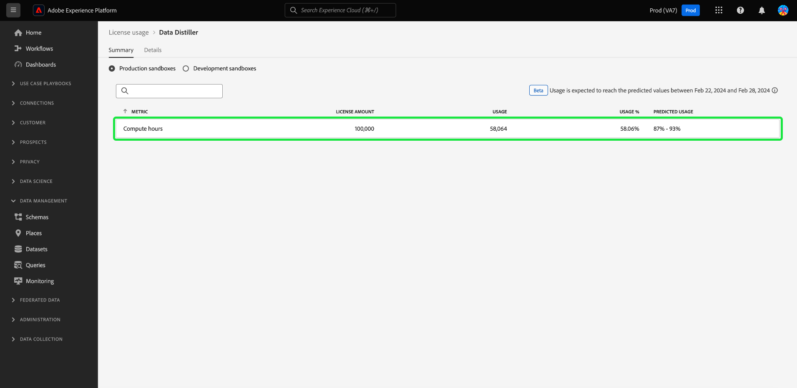

# (Alpha) Monitor batch query license usage {#monitor-license-usage}

>[!IMPORTANT]
>
>The ability to monitor batch query license usage through the UI is not available to all users yet. This feature is in alpha and still being tested. This document is subject to change.

The Adobe Experience Platform user interface (UI) provides a dashboard through which you can view important information about your organization's Query Service license usage.

For detailed instructions on how to access and interact with the license usage dashboard in the UI, as well as to learn more about the available metrics displayed in the dashboard, please visit the [license usage dashboard guide](../../dashboards/guides/license-usage.md).

Please read the [dashboards overview](../../dashboards/home.md) for a summary of all the dashboard features within Experience Platform.

## Widgets {#widgets}

The license usage dashboard is composed of widgets, which display read-only metrics providing important information regarding your organization's license usage. The visible metrics depend on your organization's specific licensing.

Select a radio button to choose a sandbox for analysis and use the dropdown to select a time period for the analysis. The available options are a 30 day, 90 day, 12 month period, the last year, the full contract period, or a custom date.

## Compute hours {#compute-hours}

The [!UICONTROL Compute hours] widget uses a line graph to visualize your organization's batch query processing time each day. The widget displays three metrics indicated by a number in the top left of the widget. These are  

- [!UICONTROL Actual]: The total number of computational hours for the time period chosen in the overview dropdown. This metric is also indicated on the graph by a solid line. 
- [!UICONTROL Licensed]: The total number of computational hours allowed by your organization's license agreement. This metric is also indicated on the graph by a dotted line.
- [!UICONTROL Usage]: This is the percentage of your usage relative to the maximum computational hours agreed by your license.

>[!IMPORTANT]
>
>The [!UICONTROL Compute hours] widget is only applicable to customers with the Data Distiller license for batch queries.

