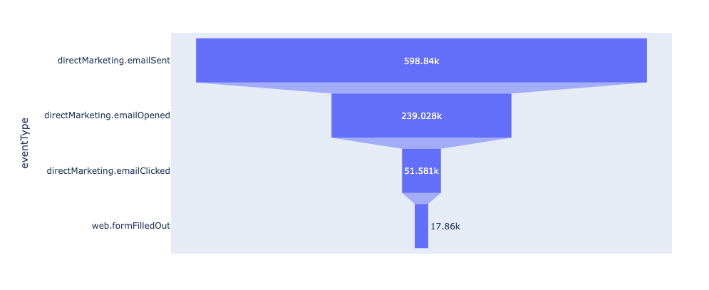
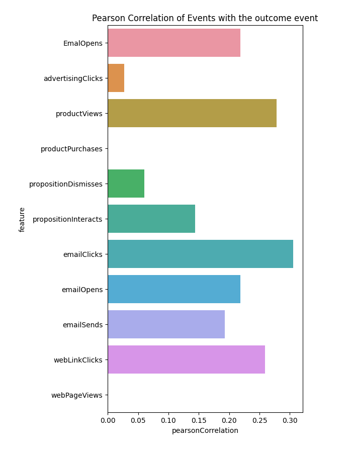

# Exploratory data analysis

This document provides some basic examples and best practices for using Data Distiller to explore and analyze data from a [!DNL Python] notebook.

## Getting Started

Before you continue with this guide, ensure that you have created a connection to Data Distiller in your [!DNL Python] notebook. See the documentation for instructions on how to [connect a [!DNL Python] notebook to Data Distiller](./establish-connection.md).

## Acquire basic statistics {#basic-statistics}

Use the code below to retrieve the number of rows and distinct profiles in a dataset.

```python
table_name = 'ecommerce_events'

basic_statistics_query = f"""
SELECT
    COUNT(_id) as "totalRows",
    COUNT(DISTINCT _id) as "distinctUsers"
FROM {table_name}"""

df = qs_cursor.query(basic_statistics_query, output="dataframe")
df
```

**Sample output**

|     | totalRows   |  distinctUsers |
| --- | ----------- | -------------- |
| 0   |   1276563   | 1276563        |

## Create a sampled version of large datasets {#create-dataset-sample}

If the dataset you wish to query is very large, or if exact results from exploratory queries are not necessary, use the [sampling functionality](../../essential-concepts/dataset-samples.md) available for Data Distiller queries. This is a two-step process:

- First, **analyze** the dataset to create a sampled version with a specified sampling ratio
- Next, query the sampled version of the dataset. Depending on the functions you apply to the sampled dataset, you may wish to scale the output to the numbers to the full dataset

### Create a 5% sample {#create-sample}

The example below analyzes the dataset and creates a 5% sample:

```python
# A sampling rate of 10 is 100% in Query Service, so for 5% use a sampling rate 0.5
sampling_rate = 0.5

analyze_table_query=f"""
SET aqp=true;
ANALYZE TABLE {table_name} TABLESAMPLE SAMPLERATE {sampling_rate}"""

qs_cursor.query(analyze_table_query, output="raw")
```

### View your samples {#view-sample}

You can use the `sample_meta` function to view any samples that have been created from a given dataset. The code snippet below demonstrates how to use the `sample_meta` function.

```python
sampled_version_of_table_query = f'''SELECT sample_meta('{table_name}')'''

df_samples = qs_cursor.query(sampled_version_of_table_query, output="dataframe")
df_samples
```

**Sample output**:

|   |  sample_table_name | sample_dataset_id  | parent_dataset_id  | sample_type  | sampling_rate | filter_condition_on_source_dataset | sample_num_rows  | created  |
|---|---|---|---|---|---|---|---|---|
| 0  | cmle_synthetic_data_experience_event_dataset_c…  |  650f7a09ed6c3e28d34d7fc2 | 64fb4d7a7d748828d304a2f4 | uniform  | 0.5 | 6427 | 23/09/2023 | 11:51:37 |

{style="table-layout:auto"}

### Query your sample {#query-sample-data}

You can directly query your sample by referencing the sample table name from the returned metadata. You can then multiply the results by the sampling ratio to get an estimate.

```python
sample_table_name = df_samples[df_samples["sampling_rate"] == sampling_rate]["sample_table_name"].iloc[0]

count_query=f'''SELECT count(*) as cnt from {sample_table_name}'''

df = qs_cursor.query(count_query, output="dataframe")
# Divide by the sampling rate to extrapolate to the full dataset
approx_count = df["cnt"].iloc[0] / (sampling_rate / 100)

print(f"Approximate count: {approx_count} using {sampling_rate *10}% sample")
```

**Sample output**

```console
Approximate count: 1284600.0 using 5.0% sample
```

## Email funnel analysis {#email-funnel-analysis}

A funnel analysis is a method of understanding the steps required to reach a target outcome, and how many users get through each of those steps. The example below illustrates a simple funnel analysis of the steps leading toward a user subscribing to a newsletter. The subscription outcome is represented by an event type of `web.formFilledOut`.

First, run a query to get the number of users at each step.

```python
simple_funnel_analysis_query = f'''SELECT eventType, COUNT(DISTINCT _id) as "distinctUsers",COUNT(_id) as "distinctEvents" FROM {table_name} GROUP BY eventType ORDER BY distinctUsers DESC'''

funnel_df = qs_cursor.query(simple_funnel_analysis_query, output="dataframe")
funnel_df
```

**Sample output**

|   | eventType  |  distinctUsers | distinctEvents  |
|---|---|---|---|
| 0  |   directMarketing.emailSent  |   598840  |   598840 | 
| 1  |   directMarketing.emailOpened  |   239028  |   239028 | 
| 2  |   web.webpagedetails.pageViews  |   120118  |   120118 | 
| 3  |   advertising.impressions  |   119669 |    119669 | 
| 4  |   directMarketing.emailClicked  |   51581  |   51581 | 
| 5  |   commerce.productViews  |   37915  |   37915 | 
| 6  |   decisioning.propositionDisplay  |   37650  |   37650 | 
| 7  |   web.webinteraction.linkClicks  |   37581  |   37581 | 
| 8  |   web.formFilledOut  |   17860  |   17860 | 
| 9  |   advertising.clicks  |   7610  |   7610 | 
| 10  |   decisioning.propositionInteract |    2964  |   2964 | 
| 11  |   decisioning.propositionDismiss  |   2889  |   2889 | 
| 12  |   commerce.purchases  |   2858  |   2858 | 

{style="table-layout:auto"}

### Plot query results {#plot-results}

Next, plot the query results using the [!DNL Python] `plotly` library:

```python
import plotly.express as px

email_funnel_events = ["directMarketing.emailSent", "directMarketing.emailOpened", "directMarketing.emailClicked", "web.formFilledOut"]
email_funnel_df = funnel_df[funnel_df["eventType"].isin(email_funnel_events)]

fig = px.funnel(email_funnel_df, y='eventType', x='distinctUsers')
fig.show()
```

**Sample output**



## Event correlations {#event-correlations}

Another common analysis is to compute correlations between event types and a target conversion event type. In this example, the subscription event is represented by `web.formFilledOut`. This example uses the [!DNL Spark] functions available in Data Distiller queries to achieve the following steps:

1. Count the number of events for each event type by profile.
2. Aggregate the counts of each event type across profiles and compute the correlations of each event type with `web,formFilledOut`.
3. Transform the dataframe of counts and correlations into a table of Pearson Correlation coefficients of each feature (event type counts) with the target event.
4. Visualize the results in a plot.

The [!DNL Spark] functions aggregate the data to return a small table of results, so you can execute this type of query on the full dataset.

```python
large_correlation_query=f'''
SELECT SUM(webFormsFilled) as webFormsFilled_totalUsers,
       SUM(advertisingClicks) as advertisingClicks_totalUsers,
       SUM(productViews) as productViews_totalUsers,
       SUM(productPurchases) as productPurchases_totalUsers,
       SUM(propositionDismisses) as propositionDismisses_totaUsers,
       SUM(propositionDisplays) as propositionDisplays_totaUsers,
       SUM(propositionInteracts) as propositionInteracts_totalUsers,
       SUM(emailClicks) as emailClicks_totalUsers,
       SUM(emailOpens) as emailOpens_totalUsers,
       SUM(webLinkClicks) as webLinksClicks_totalUsers,
       SUM(webPageViews) as webPageViews_totalusers,
       corr(webFormsFilled, emailOpens) as webForms_EmailOpens,
       corr(webFormsFilled, advertisingClicks) as webForms_advertisingClicks,
       corr(webFormsFilled, productViews) as webForms_productViews,
       corr(webFormsFilled, productPurchases) as webForms_productPurchases,
       corr(webFormsFilled, propositionDismisses) as webForms_propositionDismisses,
       corr(webFormsFilled, propositionInteracts) as webForms_propositionInteracts,
       corr(webFormsFilled, emailClicks) as webForms_emailClicks,
       corr(webFormsFilled, emailOpens) as webForms_emailOpens,
       corr(webFormsFilled, emailSends) as webForms_emailSends,
       corr(webFormsFilled, webLinkClicks) as webForms_webLinkClicks,
       corr(webFormsFilled, webPageViews) as webForms_webPageViews
FROM(
    SELECT _{tenant_id}.cmle_id as userID,
            SUM(CASE WHEN eventType='web.formFilledOut' THEN 1 ELSE 0 END) as webFormsFilled,
            SUM(CASE WHEN eventType='advertising.clicks' THEN 1 ELSE 0 END) as advertisingClicks,
            SUM(CASE WHEN eventType='commerce.productViews' THEN 1 ELSE 0 END) as productViews,
            SUM(CASE WHEN eventType='commerce.productPurchases' THEN 1 ELSE 0 END) as productPurchases,
            SUM(CASE WHEN eventType='decisioning.propositionDismiss' THEN 1 ELSE 0 END) as propositionDismisses,
            SUM(CASE WHEN eventType='decisioning.propositionDisplay' THEN 1 ELSE 0 END) as propositionDisplays,
            SUM(CASE WHEN eventType='decisioning.propositionInteract' THEN 1 ELSE 0 END) as propositionInteracts,
            SUM(CASE WHEN eventType='directMarketing.emailClicked' THEN 1 ELSE 0 END) as emailClicks,
            SUM(CASE WHEN eventType='directMarketing.emailOpened' THEN 1 ELSE 0 END) as emailOpens,
            SUM(CASE WHEN eventType='directMarketing.emailSent' THEN 1 ELSE 0 END) as emailSends,
            SUM(CASE WHEN eventType='web.webinteraction.linkClicks' THEN 1 ELSE 0 END) as webLinkClicks,
            SUM(CASE WHEN eventType='web.webinteraction.pageViews' THEN 1 ELSE 0 END) as webPageViews
    FROM {table_name}
    GROUP BY userId
)
'''
large_correlation_df = qs_cursor.query(large_correlation_query, output="dataframe")
large_correlation_df
```

**Sample output**:

|   | webFormsFilled_totalUsers |    advertisingClicks_totalUsers  |   productViews_totalUsers  |   productPurchases_totalUsers  |   propositionDismisses_totaUsers |    propositionDisplays_totaUsers  |   propositionInteracts_totalUsers  |   emailClicks_totalUsers  |   emailOpens_totalUsers  |   webLinksClicks_totalUsers  |   …  |   webForms_advertisingClicks|     webForms_productViews  |   webForms_productPurchases  |   webForms_propositionDismisses  |   webForms_propositionInteracts  |   webForms_emailClicks |    webForms_emailOpens   |  webForms_emailSends  |   webForms_webLinkClicks  |   webForms_webPageViews | 
|---|---|---|---|---|---|---|---|---|---|---|---|---|---|---|---|---|---|---|---|---|---|
| 0 |   17860 |   7610  |  37915  |  0  |  2889  |  37650  |  2964  |  51581 |   239028  |  37581  |  …  |  0.026805  |  0.2779  |  None  |  0.06014  |  0.143656  |  0.305657  |  0.218874  |  0.192836  |  0.259353  |  None |

{style="table-layout:auto"}

### Transform row into event type correlation {#event-type-correlation} 

Next, transform the single row of data in the query output above, into a table showing the correlations of each event type with the target subscription event:

```python
cols = large_correlation_df.columns
corrdf = large_correlation_df[[col for col in cols if ("webForms_"  in col)]].melt()
corrdf["feature"] = corrdf["variable"].apply(lambda x: x.replace("webForms_", ""))
corrdf["pearsonCorrelation"] = corrdf["value"]

corrdf.fillna(0)
```

**Sample output**:

|    | variable  |  value  |  feature  |  pearsonCorrelation |
| --- | ---  |  ---  |  ---  | --- |
| 0  |  `webForms_EmailOpens`  |  0.218874  |  EmailOpens  |  0.218874 |
| 1  |  `webForms_advertisingClicks` |   0.026805 |   advertisingClicks |   0.026805 |
| 2  |  `webForms_productViews`  |  0.277900  |  productViews |   0.277900 |
| 3  |  `webForms_productPurchases`  |  0.000000  |  productPurchases  |  0.000000 |
| 4  |  `webForms_propositionDismisses`  |  0.060140  |  propositionDismisses |   0.060140 |
| 5  |  `webForms_propositionInteracts` |   0.143656  |  propositionInteracts  |  0.143656 |
| 6  |  `webForms_emailClicks`  |  0.305657  |  emailClicks  |  0.305657 |
| 7  |  `webForms_emailOpens`  |  0.218874  |  emailOpens  |  0.218874 |
| 8  |  `webForms_emailSends`  |  0.192836  |  emailSends  |  0.192836 |
| 9  |  `webForms_webLinkClicks`  |  0.259353  |  webLinkClicks  |  0.259353 |
| 10  |  `webForms_webPageViews`  |  0.000000  |  webPageViews   | 0.000000 |


Finally, you can visualize the correlations with the `matplotlib` [!DNL Python] library:

```python
import matplotlib.pyplot as plt
fig, ax = plt.subplots(figsize=(5,10))
sns.barplot(data=corrdf.fillna(0), y="feature", x="pearsonCorrelation")
ax.set_title("Pearson Correlation of Events with the outcome event")
```



## Next Steps

By reading this document, you have learned how to use Data Distiller to explore and analyze data from a [!DNL Python] notebook. The next step in creating feature pipelines from Experience Platform to feed custom models in your machine learning environment is to [engineer features for machine learning](./feature-engineering.md).
