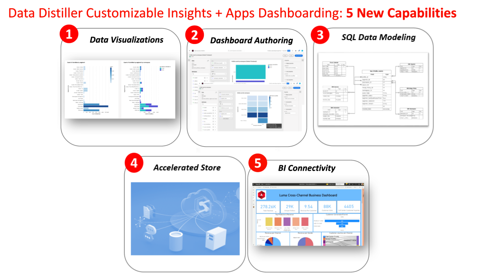
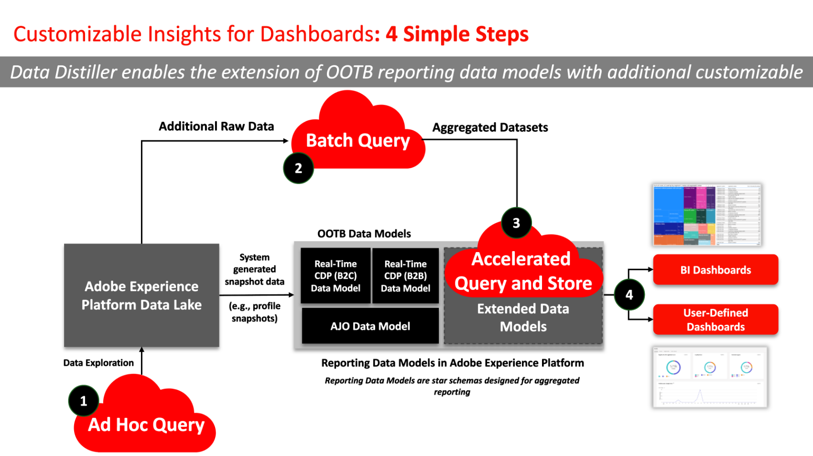

# SQL Insights

Create bespoke reporting data models to extract deeper insights, optimize strategies, and adapt analytics to meet specific business needs with Data Distiller's SQL Insights. Use the SQL Insights capability to enhance transparency and gain operational insights from your Adobe Experience Platform data across dimensions such as profiles, audiences, campaigns, journeys, entitlements, and consent. This capability provides a versatile, adaptive solution to tailor your organization's reporting data models to align with your specific business needs.

To [visualize your SQL Insights](../../../dashboards/sql-insights-query-pro-mode/overview.md) you can use [query pro mode](../../../dashboards/sql-insights-query-pro-mode/overview.md) to conduct complex analysis with custom SQL queries and transform your data into easily interpretable charts. Use query pro mode to create bespoke insights and visulaizations on your dashboards and cater to both technical and non-technical audiences by downloading your insights as CSV files. 

This document covers the use cases, essential capabilities, and required steps to develop an SQL insights dashboard with Data Distiller.

## Prerequisites

This tutorial uses user-defined dashboards to visualize data from your custom data model within the Experience Platform UI. See the [user-defined dashboards documentation](../../../dashboards/standard-dashboards.md) to learn more about this feature.

## Getting started 

The Data Distiller SKU is required to build a custom data model for your reporting insights and to extend the Real-Time CDP data models that hold enriched Experience Platform data. See the [packaging](../../packaging.md), [guardrails](../../guardrails.md#query-accelerated-store), and  [licensing](../../data-distiller/license-usage.md) documentation that relates to the Data Distiller SKU. If you do not have the Data Distiller SKU, contact your Adobe customer service representative for more information.

## SQL Insights use cases {#use-cases}

Below are common use cases that can be effectively addressed through SQL Insights in Data Distiller.

### Profile and audience usage transparency {#usage-transparency}

**Challenge:** How to break down Key Performance Indicators (KPIs) by specific criteria like business units, loyalty status, or Customer Lifetime Value (CLTV).

**SQL Insights Solution:** Data Distiller enables the extension of reporting data models in Adobe Experience Platform, facilitating [the addition of custom profile attributes such as CLTV](../../use-cases/customer-lifetime-value.md) or loyalty status.

### Consent anomaly tracking {#consent-anomaly-tracking}

**Challenge:** How to apply audience overlap and size trendline reports to customized consent attributes for channels like email, SMS, and phone.

**SQL Insights Solution:** The reporting data model can be extended to track changes in consent preferences over time. This involves building additional fact and dimension tables to trend consent preferences and scheduling [incremental data refresh](../../key-concepts/incremental-load.md).

### Optimize audience segmentation strategy {#optimize-audience-segmentation-strategy}

**Challenge:** How to integrate Machine Learning (ML) model-generated propensity scores into their audience KPI reports.

**SQL Insights Solution:** Data Distiller allows the inclusion of [propensity scores from custom ML models](../../use-cases/propensity-score.md), facilitating the calculation of aggregate scores at the audience level. This data can then be reported alongside standard KPIs.

### Audience expansion {#audience-expansion}

**Challenge:** How to acquire more than just profile counts in audience overlap reports and attain additional demographic data or preferences to guide audience expansion strategies.

**SQL Insights Solution:** By extending the reporting data model, users can incorporate additional profile attributes, enriching the audience overlap report with relevant demographic data and preferences.

## Key capabilities for generating SQL Insights {#key-capabilities}

The illustration below highlights several essential capabilities for generating SQL Insights. These capabilities include:

1. **Data visualizations:** Incorporating visual elements such as trends and bar charts for a comprehensive view of data trends.
1. **Dashboard authoring:** Enabling the creation of custom dashboards tailored to specific use cases, providing a more personalized and targeted analytics experience.
1. **Flexible SQL data modeling:** Use a versatile SQL data modeling approach that allows users to seamlessly combine and manipulate different datasets, enhancing adaptability, and analytical depth.
1. **Accelerated store:** Implementing an accelerated store mechanism to efficiently serve aggregated insights through SQL, ensuring streamlined and rapid access to valuable information.
1. **BI connectivity:** Facilitating seamless integration with popular Business Intelligence (BI) tools, including Power BI, Tableau, Looker, and Apache Superset. This connectivity ensures compatibility with diverse BI environments, offering users the flexibility to use their tool of choice for in-depth analysis and reporting.

## Steps to create SQL Insights {#steps-to-create}

To develop a SQL Insights dashboard within Data Distiller, follow the step-by-step instructions below.

1. **Ad hoc query exploration:** Begin by executing ad hoc `SELECT` queries to explore raw data on the data lake. This allows for on-the-fly, exploratory data analysis to experiment, and validates data where the results of the queries are not stored in the data lake.
1. **Batch query utilization:** Use batch queries to [create scheduled jobs](../../api/scheduled-queries.md#create-a-new-scheduled-query) for generating insights aggregate tables, ensuring a systematic and automated approach to data processing. Batch queries execute `INSERT TABLE AS SELECT` and `CREATE TABLE AS SELECT` queries to clean, shape, manipulate, and enrich data. The results of these queries are stored on the data lake.
1. **Aggregated insights loading:** Load the generated aggregated insights into the accelerated store and use SQL to test queries, and ensure the accuracy and efficiency of data retrieval. To learn how to [make stateless queries to the accelerated store](../../api/accelerated-queries.md), see the documentation.
1. **Access and integration:** Access the insights stored in the accelerated store seamlessly by integrating with Adobe Experience Platform [User-defined Dashboards](../../../dashboards/standard-dashboards.md) or other preferred Business Intelligence (BI) tools. These integrations with third-party clients facilitate a cohesive and intuitive experience for users.

## Next Steps

By reading this document, you now have a better understanding of the use cases, essential capabilities, and necessary steps to develop an SQL insights dashboard with Data Distiller. To continue learning about creating bespoke reporting data models, see the [reporting insights data model guide](./reporting-insights-data-model.md).
