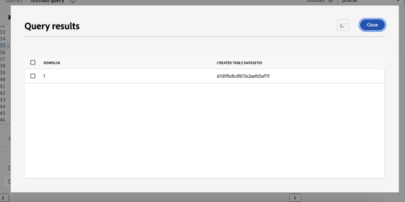

# Top tips to maximize value with Adobe Experience Platform Data Distiller

This page contains the sample dataset for you to apply what you learned in the session "OS656 - Top Tips to Maximize Value with Adobe Experience Platform Data Distiller". You will learn how to accelerate implementations of Adobe Real-Time Customer Data Platform and Journey Optimizer by enriching Real-Time Customer Profile data. This enrichment leverages deep insights into customer behavior patterns to build audiences for experience delivery and optimization.

Through the Luma case study, you will analyze user behavioral data and create a Recency, Frequency, Monetary (RFM) model—a marketing analysis technique for customer segmentation based on purchasing patterns.

<!-- [Select the link to download the sample CSV data](../resources/movie-data.csv) -->

## Prerequisite

To execute this use case, your Adobe Experience Platform instance must be licensed for [Data Distiller](./overview.md). Contact your Adobe representative for more information.

## Overview of the RFM model

RFM, short for Recency (R), Frequency (F), and Monetary (M), is a data-driven approach to customer segmentation and analysis. This methodology evaluates three key aspects of customer behavior: how recently a customer made a purchase, how often they engage, and how much they spend. By quantifying these factors, businesses can gain actionable insights into customer segments and develop targeted marketing strategies that better meet individual customer needs.

## Understanding customer behavior with the RFM model

<!-- ## How the RFM model defines customer value -->

The RFM model segments customers based on transactional behavior using three key parameters.

- **Recency** measures the time since a customer's last purchase, indicating engagement levels and future buying potential.
- **Frequency** tracks how often a customer interacts, serving as a clear indicator of loyalty and sustained engagement.
- **Monetary value** assesses the total spending by customers, highlighting their overall value to the business.

By combining these factors, businesses assign numerical scores (typically on a scale from `1` to `4`) to each customer. Lower scores indicate more favorable outcomes. For example, a customer scoring `1` in all categories is considered among the best, demonstrating recent activity, high engagement, and significant spending.

## Benefits and limitations of the RFM model

Every marketing modeling technique involves trade-offs, offering both benefits and limitations. RFM modeling is a valuable tool for understanding customer behavior and refining marketing strategies. Its advantages include segmenting customers to personalize messaging, optimize revenue, and improve response rates, retention, satisfaction, and Customer Lifetime Value (CLTV).

However, RFM modeling has limitations. It assumes uniformity within segments based on recency, frequency, and monetary value, which may oversimplify customer behavior. The model also assigns equal weight to these factors, potentially misrepresenting customer value. Additionally, it does not account for context, such as product-specific traits or customer preferences, which can lead to misinterpretations of purchasing behavior.

## Steps to build a dynamic RFM score-based SQL audience

Before starting the Luma case study, you need to ingest a sample dataset. First, [select the link to download the `luma_web_data.csv` dataset locally](../resources/luma_web_data.csv).

The sample dataset is provided in CSV format to align with the use case. In practice, you would typically source data from Adobe Analytics, Adobe Commerce, or Adobe Web/Mobile SDK.

Throughout this tutorial, you will use Data Distiller to extract relevant events and fields into a standardized CSV format. The goal is to include only essential fields while maintaining a flat data structure for efficiency and practicality.

<!-- ### Ingest the sample Luma web data -->

### Step 1: Load the CSV data into Experience Platform

Follow these steps to upload a CSV file to Adobe Experience Platform.

#### Create a dataset from a CSV file

In the Experience Platform UI, navigate to select **[!UICONTROL Workflows]** in the left navigation rail, and select **[!UICONTROL Create dataset from CSV file]** from the available options. A new sidebar appears on the right of the screen, select **[!UICONTROL Launch]**.

The [!UICONTROL Configure Dataset] panel appears. In the **[!UICONTROL Name]** field, input the dataset name as "luma_web_data" and select **[!UICONTROL Next]**.

The [!UICONTROL Add data] panel appears. Drag and drop the CSV file into the **[!UICONTROL Add data]** box, or select **[!UICONTROL Choose File]** to browse and upload the file.

#### Review and complete the upload

Once the file is uploaded, a data preview appears at the bottom of the UI. Select **[!UICONTROL Finish]** to complete the upload.


The dataset activities view for the "luma_web_data" dataset appears. The manual upload of the CSV file
is ingested as a batch, and identified by a [!UICONTROL Batch ID]. A panel on the right-side displays the table name as `luma_web_data`.

<!-- My table name is; luma_web_data_20250312_235611_817 Should we explain the suffix? -->

>[!NOTE]
>
>The SQL engine in Data Distiller queries the table name, not the dataset name.


Once the data has finished processing, select [!UICONTROL Preview dataset] in the top right corner to preview the dataset. The dataset preview looks like this:


#### Schema considerations

A structured XDM schema (for example, record, event, or B2B schemas) is not required because the data is imported as a raw CSV file. Instead, the dataset uses an Ad Hoc schema. 

While Data Distiller supports all schema types, the final dataset for ingestion into the Real-Time Customer Profile will use a Record XDM schema.

### Step 2: Connect to the data lake and explore available datasets

<!-- The objective of this step is to ... -->
The next objective in this process is to perform data exploration tasks in Adobe Experience Platform Data Lake to ensure data accuracy and integrity.

To generate meaningful insights, data must be accurate and complete. Errors, inconsistencies, or missing values can occur when transferring data between sources, making data verification and exploration essential.

You can verify dataset quality and completeness through various operations using Data Distiller.

To confirm that data was accurately translated during ingestion, execute SELECT queries to inspect, validate, and analyze it. This process helps identify and resolve discrepancies, inconsistencies, or missing information.

#### Perform a basic exploration query

In the Adobe Experience Platform UI, select [!UICONTROL Queries] in the left navigation rail then select **[!UICONTROL Create Query]**. The Query Editor appears.

Paste the following query into the editor and execute it:

```sql
SELECT * FROM luma_web_data; 
```

The query results are displayed below the Query Editor in the [!UICONTROL Results] tab. To expand the results in a new dialog, select **[!UICONTROL View results]**. The results should look similar to the image below.


#### Focus on orders and exclude cancelled transactions

The RFM model evaluates recency, frequency, and monetary value based on completed purchases. Non-transactional events, such as page views and checkout interactions, are excluded from analysis. Additionally, cancelled orders must be removed, as they do not contribute to valid RFM calculations and require a different processing approach.

To ensure accuracy:

- Identify purchase IDs associated with cancellations and group them using GROUP BY.
- Exclude these purchase IDs from the dataset.
- Filter the data to retain only completed orders.

The following queries demonstrate how to identify and exclude cancelled orders from the dataset.

This first query selects all non-null purchase IDs associated with a cancellation and aggregates them using `GROUP BY`. The resulting purchase IDs must be excluded from the dataset.

```sql
CREATE OR replace VIEW orders_cancelled
AS
  SELECT purchase_id
  FROM   luma_web_data
  WHERE  event_type IN ( 'order', 'cancellation' )
         AND purchase_id IS NOT NULL
  GROUP  BY purchase_id
  HAVING Count(DISTINCT event_type) = 2; 
```

The second query retrieves only the purchase IDs that are not in this excluded set.

```sql
SELECT *
FROM   luma_web_data
WHERE  purchase_id NOT IN (SELECT purchase_id
                           FROM   orders_cancelled)
        OR purchase_id IS NULL; 
```

The third query removes all non-order events from the dataset.

```sql
SELECT *
FROM   luma_web_data
WHERE  event_type = 'order'
       AND purchase_id NOT IN (SELECT purchase_id
                               FROM   orders_cancelled); 
```

### Step 3: Enrich the data using Data Distiller functions

The next step in this process is to build the RFM model.

To begin, calculate three scores for each customer: Recency, Frequency, and Monetary value. These scores are derived from raw data collected from customer interactions and past purchase transactions.

- Recency: The time elapsed since the customer's last purchase, considering their entire history.
- Frequency: The total number of purchases made by the customer.
- Monetary: The overall amount spent by the customer across all transactions.

<!-- This recap feels above repetative and should probably be cut. -->

#### Calculate the RFM score for each unique user ID

To compute the RFM scores, extract key fields from the raw data using field filtering.

The next query builds on the previous section's logic by selecting email as the `userid`, since every order requires an email login. Data Distiller applies the `TO_DATE` function to convert the timestamp into a date format. The `total_revenue` field represents the price of each transaction and will later be aggregated by summing it for each `userid`.

```sql
SELECT email AS userid, 
       purchase_id AS purchaseid, 
       price_total AS total_revenue, -- reflects the price for each individual transaction
       TO_DATE(timestamp) AS purchase_date -- converts timestamp to date format
FROM luma_web_data 
WHERE event_type = 'order' 
      AND purchase_id NOT IN (SELECT purchase_id FROM orders_cancelled) 
      AND email IS NOT NULL;
```

The results should look like the image below.


Next, create a `TABLE` to store the results of the previous query in a derived dataset. Copy and paste the following command into the Query Editor to create a `TABLE`.

<!-- Essentially this is "To cache the results of the previous query" -->

```sql
CREATE TABLE IF NOT EXISTS order_data AS
  SELECT email              AS userid,
         purchase_id        AS purchaseid,
         price_total        AS total_revenue,
         To_date(timestamp) AS purchase_date
  FROM   luma_web_data
  WHERE  event_type = 'order'
         AND purchase_id NOT IN (SELECT purchase_id FROM orders_cancelled)
         AND email IS NOT NULL; 
```

The result will look similar to the following image but with a different dataset ID.



As best practice, run a simple explore query to inspect the data in the dataset. Use the following statement to view your data.

```sql
SELECT * FROM order_data;
```


#### Aggregate the transactions to generate the RFM values

To calculate the RFM values, this query aggregates transactions for each user. 

The `DATEDIFF(CURRENT_DATE, MAX(purchase_date)) AS days_since_last_purchase` function calculates the number of days since the most recent purchase for each user.

Use the following SQL query:

```sql
SELECT 
    userid, 
    DATEDIFF(CURRENT_DATE, MAX(purchase_date)) AS days_since_last_purchase, 
    COUNT(purchaseid) AS orders, 
    SUM(total_revenue) AS total_revenue 
FROM order_data 
GROUP BY userid;
```

To enhance query efficiency and reusability, create a `VIEW` to store the aggregated RFM values.

```sql
CREATE OR replace VIEW rfm_values
AS
  SELECT userid,
         Datediff(current_date, Max(purchase_date)) AS days_since_last_purchase,
         Count(purchaseid)                          AS orders,
         SUM(total_revenue)                         AS total_revenue
  FROM   order_data
  GROUP  BY userid; 
```

The result will look similar to the following image but with different ID.


