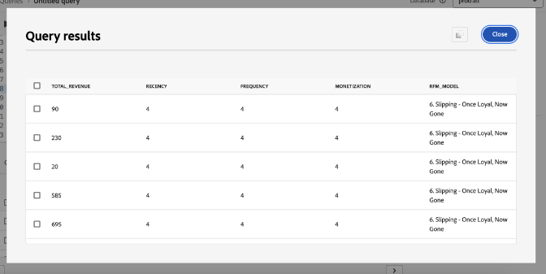

# Top tips to maximize value with Adobe Experience Platform Data Distiller - OS656

This page contains the sample dataset for you to apply what you learned in the Adobe Summit session "OS656 - Top Tips to Maximize Value with Adobe Experience Platform Data Distiller". You'll learn how to accelerate implementations of Adobe Real-Time Customer Data Platform and Journey Optimizer by enriching Real-Time Customer Profile data. This enrichment leverages deep insights into customer behavior patterns to build audiences for experience delivery and optimization.

Through the Luma case study, you'll analyze user behavioral data and create a *Recency, Frequency, Monetary (RFM)* model—a marketing analysis technique for customer segmentation based on purchasing patterns.

## Prerequisite

To execute this use case, your Adobe Experience Platform instance must be licensed for [Data Distiller](./overview.md). Contact your Adobe representative for more information.

To follow this case study, you need to know your organization's **tenant ID**. Your tenant ID is the first part of the URL when you log into your Adobe Solution. In this case Adobe Experience Platform. It appears immediately after @ in the URL.

For example, in the following URL: `https://experience.adobe.com/#/@pfreportingonprod/sname:prod/platform/home`, the tenant ID is `pfreportingonprod`.

## Overview of the RFM model {#rfm-overview}

RFM, short for Recency (R), Frequency (F), and Monetary (M), is a data-driven approach to customer segmentation and analysis. This methodology evaluates three key aspects of customer behavior: how recently a customer made a purchase, how often they engage, and how much they spend. By quantifying these factors, businesses can gain actionable insights into customer segments and develop targeted marketing strategies that better meet individual customer needs.

## Understand customer behavior with the RFM model {#understand-customer-behavior}

The RFM model segments customers based on transactional behavior using three key parameters.

- **Recency** measures the time since a customer's last purchase, indicating engagement levels and future buying potential.
- **Frequency** tracks how often a customer interacts, serving as a clear indicator of loyalty and sustained engagement.
- **Monetary value** assesses the total spending by customers, highlighting their overall value to the business.

By combining these factors, businesses assign numerical scores (typically on a scale from `1` to `4`) to each customer. Lower scores indicate more favorable outcomes. For example, a customer scoring `1` in all categories is considered among the best, demonstrating recent activity, high engagement, and significant spending.

## Benefits and limitations of the RFM model {#benefits-and-limitations}

Every marketing modeling technique involves trade-offs, offering both benefits and limitations. RFM modeling is a valuable tool for understanding customer behavior and refining marketing strategies. Its advantages include segmenting customers to personalize messaging, optimize revenue, and improve response rates, retention, satisfaction, and Customer Lifetime Value (CLTV).

However, RFM modeling has limitations. It assumes uniformity within segments based on recency, frequency, and monetary value, which may oversimplify customer behavior. The model also assigns equal weight to these factors, potentially misrepresenting customer value. Additionally, it does not account for context, such as product-specific traits or customer preferences, which can lead to misinterpretations of purchasing behavior.

## Build a dynamic RFM score-based SQL audience {#build-a-dynamic-rfm-audience}

Before starting the Luma case study, you need to ingest a sample dataset. First, [select the link to download the `luma_web_data.zip` dataset locally](../resources/luma_web_data.zip). The sample dataset is a csv file in a compressed .zip format to align with the use case. Decompress this ZIP file using Adobe Acrobat or a trusted file extraction tool, such as your operating system's built-in utility. In practice, you would typically source data from Adobe Analytics, Adobe Commerce, or Adobe Web/Mobile SDK.

Throughout this tutorial, you will use Data Distiller to extract relevant events and fields into a standardized CSV format. The goal is to include only essential fields while maintaining a flat data structure for efficiency and ease of use.

### Step 1: Upload the CSV data into Experience Platform {#upload-csv-data}

Follow these steps to upload a CSV file to Adobe Experience Platform.

#### Create a dataset from a CSV file {#create-a-dataset}

In the Experience Platform UI, select **[!UICONTROL Datasets]** in the left navigation rail, followed by **[!UICONTROL Create dataset]**. Then select **[!UICONTROL Create dataset from CSV file]** from the available options.

The [!UICONTROL Configure Dataset] panel appears. In the **[!UICONTROL Name]** field, input the dataset name as "luma_web_data" and select **[!UICONTROL Next]**.

The [!UICONTROL Add data] panel appears. Drag and drop the CSV file into the **[!UICONTROL Add data]** box, or select **[!UICONTROL Choose File]** to browse and upload the file.

To learn more about this process, refer to the [batch ingestion tutorial](../../ingestion/tutorials/ingest-batch-data.md) and the [dataset creation workflow](../../catalog/datasets/user-guide.md#create) in the Dataset UI guide.

#### Review and complete the upload {#review-and-complete-upload}

Once the file is uploaded, a data preview appears at the bottom of the UI. Select **[!UICONTROL Finish]** to complete the upload.


The dataset activities view for the "luma_web_data" dataset appears. The manual upload of the CSV file
is ingested as a batch, and identified by a [!UICONTROL Batch ID]. A panel on the right-side displays the table name as `luma_web_data`.

>[!TIP]
>
>When writing queries in Data Distiller, use the table name instead of the dataset name. The dataset name is only used for browsing in the UI.


<!--  
My table name is; luma_web_data_20250312_235611_817 Should we explain the suffix? 
-->

Once the data has finished processing, select [!UICONTROL Preview dataset] in the top right corner to preview the dataset. This is how the dataset preview appears:


#### Schema considerations {#schema-considerations}

A structured XDM schema (for example, record, event, or B2B schemas) is not required because the data is imported as a raw CSV file. Instead, the dataset uses an ad hoc schema. 

>[!TIP]
>
>Ad hoc schemas are XDM schema with fields that are namespaced for use only by a single dataset. Ad hoc schemas are used in various data ingestion workflows for Experience Platform and creating certain kinds of source connections.

While Data Distiller supports all schema types, the final dataset for ingestion into the Real-Time Customer Profile will use a Record XDM schema.

### Step 2: Connect to the data lake and explore available datasets {#connect-to-the-data-lake-and-explore-datasets}

The next step is to explore data in the Adobe Experience Platform data lake to ensure accuracy and integrity. Data must be accurate and complete to generate meaningful insights, but errors, inconsistencies, or missing values can occur during data transfers. This makes data verification and exploration essential.

>[!TIP]
>
>The data lake stores raw, unprocessed data, such as event logs, clickstream data, and bulk-ingested records, for analytics and processing. The Profile Store contains customer-identifiable data, including identity-stitched events and attribute information, to support real-time personalization and activation.

Use Data Distiller to verify dataset quality and completeness through various operations. To confirm that data was accurately translated during ingestion, execute `SELECT` queries to inspect, validate, and analyze it. This process helps identify and resolve discrepancies, inconsistencies, or missing information.

#### Perform a basic exploration query {#basic-exploration-queries}

In the Adobe Experience Platform UI, select **[!UICONTROL Queries]** in the left navigation rail then select **[!UICONTROL Create Query]**. The Query Editor appears.

Paste the following query into the editor and execute it:

```sql
SELECT * FROM luma_web_data; 
```

The query results are displayed below the Query Editor in the **[!UICONTROL Results]** tab. To expand the results in a new dialog, select **[!UICONTROL View results]**. The results look similar to the image below.


See the [general guidance for query execution](../best-practices/writing-queries.md) document for more information.

#### Focus on orders and exclude cancelled transactions {#focus-orders-exclude-cancelled}

The RFM model evaluates recency, frequency, and monetary value based on completed purchases. Non-transactional events, such as page views and checkout interactions, are excluded from analysis. Additionally, cancelled orders must be removed, as they do not contribute to valid RFM calculations and require a different processing approach.

To ensure accuracy:

- Identify purchase IDs associated with cancellations and group them using `GROUP BY`.
- Exclude these purchase IDs from the dataset.
- Filter the data to retain only completed orders.

The following queries demonstrate how to identify and exclude cancelled orders from the dataset.

This first query selects all non-null purchase IDs associated with a cancellation and aggregates them using `GROUP BY`. The resulting purchase IDs must be excluded from the dataset.

```sql
CREATE VIEW orders_cancelled
AS
  SELECT purchase_id
  FROM   luma_web_data
  WHERE  event_type IN ( 'order', 'cancellation' )
         AND purchase_id IS NOT NULL
  GROUP  BY purchase_id
  HAVING Count(DISTINCT event_type) = 2; 
```

The second query retrieves only the purchase IDs that are not in this excluded set.

```sql
SELECT *
FROM   luma_web_data
WHERE  purchase_id NOT IN (SELECT purchase_id
                           FROM   orders_cancelled)
        OR purchase_id IS NULL; 
```

The third query removes all non-order events from the dataset.

```sql
SELECT *
FROM   luma_web_data
WHERE  event_type = 'order'
       AND purchase_id NOT IN (SELECT purchase_id
                               FROM   orders_cancelled); 
```

### Step 3: Enrich the data using Data Distiller functions {#enrich-the-data}

Next, use Data Distiller to extract and transform customer data, generate RFM scores, aggregate transactions, and segment customers by purchasing behavior. Follow these steps to calculate Recency, Frequency, and Monetary (RFM) values, build an audience model, and prepare insights for activation.

#### Calculate the RFM score for each unique user ID

To compute the RFM scores, extract key fields from the raw data using field filtering.

The next query builds on the previous section's logic by selecting email as the `userid`, since every order requires an email login. Data Distiller applies the `TO_DATE` function to convert the timestamp into a date format. The `total_revenue` field represents the price of each transaction and is later aggregated by summing it for each `userid`.

```sql
SELECT email AS userid, 
       purchase_id AS purchaseid, 
       price_total AS total_revenue, -- reflects the price for each individual transaction
       TO_DATE(timestamp) AS purchase_date -- converts timestamp to date format
FROM luma_web_data 
WHERE event_type = 'order' 
      AND purchase_id NOT IN (SELECT purchase_id FROM orders_cancelled) 
      AND email IS NOT NULL;
```

The results look like the image below.


Next, create a `TABLE` to store the results of the previous query in a derived dataset. Copy and paste the following command into the Query Editor to create a `TABLE`.

```sql
CREATE TABLE IF NOT EXISTS order_data AS
  SELECT email              AS userid,
         purchase_id        AS purchaseid,
         price_total        AS total_revenue,
         To_date(timestamp) AS purchase_date
  FROM   luma_web_data
  WHERE  event_type = 'order'
         AND purchase_id NOT IN (SELECT purchase_id FROM orders_cancelled)
         AND email IS NOT NULL; 
```

The result looks similar to the following image but with a different dataset ID.


As best practice, run a simple explore query to inspect the data in the dataset. Use the following statement to view your data.

```sql
SELECT * FROM order_data;
```


#### Aggregate the transactions to generate the RFM values {#aggregate-transactions}

To calculate the RFM values, this query aggregates transactions for each user. 

The `DATEDIFF(CURRENT_DATE, MAX(purchase_date)) AS days_since_last_purchase` function calculates the number of days since the most recent purchase for each user.

Use the following SQL query:

```sql
SELECT 
    userid, 
    DATEDIFF(CURRENT_DATE, MAX(purchase_date)) AS days_since_last_purchase, 
    COUNT(purchaseid) AS orders, 
    SUM(total_revenue) AS total_revenue 
FROM order_data 
GROUP BY userid;
```

The results look like the image below.


To enhance query efficiency and reusability, create a `VIEW` to store the aggregated RFM values.

```sql
CREATE VIEW rfm_values
AS
  SELECT userid,
         DATEDIFF(current_date, MAX(purchase_date)) AS days_since_last_purchase,
         COUNT(purchaseid)                          AS orders,
         SUM(total_revenue)                         AS total_revenue
  FROM   order_data
  GROUP BY userid; 
```

The result resembles the following image but with a different ID.


Again as best practice, run a simple explore query to inspect the data in the view. Use the following statement.

```sql
SELECT * FROM rfm_values;
```

The following screenshot shows a sample result of the query, displaying the calculated RFM values for each user. The result corresponds to the view ID from the `CREATE VIEW` query.


#### Generate the RFM multi-dimensional cube {#generate-multi-dimensional-cube}

To segment customers based on their RFM scores, use an RFM multi-dimensional cube. The `NTILE` window function sorts values into ranked buckets and divides each dimension into four equal groups (quartiles), allowing for structured segmentation.

- Recency: Customers are ranked by how recently they made a purchase (`days_since_last_purchase`). Those who purchased most recently are in group 1, while those who haven't purchased for the longest time are in group 4.
- Frequency: Customers are ranked by how often they make purchases (`ORDER BY orders DESC`). The most frequent buyers are in group 1, while the least frequent are in group 4.
- Monetary: Customers are ranked by total spending (`total_revenue`). The highest spenders are in group 1, while the lowest spenders are in group 4.

Run the following SQL query to generate the RFM multi-dimensional cube:

```sql
SELECT userid,
       days_since_last_purchase,
       orders,
       total_revenue,
       5 - NTILE(4)
             OVER (
               ORDER BY days_since_last_purchase DESC) AS recency,
       NTILE(4)
         OVER (
           ORDER BY orders DESC)                       AS frequency,
       NTILE(4)
         OVER (
           ORDER BY total_revenue DESC)                AS monetization
FROM rfm_values; 
```

The results look like the images below.


Next, use the following statement to create a `VIEW` for this data.

Creating a `VIEW` for the RFM multi-dimensional cube improves efficiency by storing pre-segmented data, eliminating the need to recalculate RFM scores in future queries. It simplifies SQL statements, ensures data consistency, and enhances reusability for further analysis.

```sql
CREATE OR replace VIEW rfm_scores
AS
  SELECT userid,
         days_since_last_purchase,
         orders,
         total_revenue,
         5 - NTILE(4)
               over (
                 ORDER BY days_since_last_purchase DESC) AS recency,
         NTILE(4)
           over (
             ORDER BY orders DESC)                       AS frequency,
         NTILE(4)
           over (
             ORDER BY total_revenue DESC)                AS monetization
  FROM   rfm_values;
```

The result looks similar to the following image but with a different view ID.


#### Model RFM segments {#model-rfm-segments}

With the RFM scores calculated, customers can be categorized into the following six priority segments:

1. `Core`: Best customers with high Recency, Frequency, and Monetary value (Recency = 1, Frequency = 1, Monetary = 1).
1. `Loyal`: Frequent customers who are consistent but not top spenders (Frequency = 1).
1. `Whales`: Highest spenders, regardless of Recency and Frequency (Monetary = 1).
1. `Promising`: Frequent but lower spenders (Frequency = 1, 2, 3; Monetary = 2, 3, 4).
1. `Rookies`: New customers with low frequency (Recency = 1, Frequency = 4).
1. `Slipping`: Formerly loyal customers with decreased activity (Recency = 2, 3, 4; Frequency = 4).

To streamline access and reuse, create a `VIEW` that stores the RFM segments, scores, and values.

The `CASE` statements in the following SQL categorize customers into segments based on their RFM scores and assign the results to the `RFM_Model` variable.

+++Select to view SQL

```sql
CREATE OR replace VIEW rfm_model_segment
AS
  SELECT userid,
         days_since_last_purchase,
         orders,
         total_revenue,
         recency,
         frequency,
         monetization,
         CASE
           WHEN recency = 1
                AND frequency = 1
                AND monetization = 1 THEN '1. Core - Your Best Customers'
           WHEN recency IN( 1, 2, 3, 4 )
                AND frequency = 1
                AND monetization IN ( 1, 2, 3, 4 ) THEN
           '2. Loyal - Your Most Loyal Customers'
           WHEN recency IN( 1, 2, 3, 4 )
                AND frequency IN ( 1, 2, 3, 4 )
                AND monetization = 1 THEN
           '3. Whales - Your Highest Paying Customers'
           WHEN recency IN( 1, 2, 3, 4 )
                AND frequency IN ( 1, 2, 3 )
                AND monetization IN( 2, 3, 4 ) THEN
           '4. Promising - Faithful customers'
           WHEN recency = 1
                AND frequency = 4
                AND monetization IN ( 1, 2, 3, 4 ) THEN
           '5. Rookies - Your Newest Customers'
           WHEN recency IN ( 2, 3, 4 )
                AND frequency = 4
                AND monetization IN ( 1, 2, 3, 4 ) THEN
           '6. Slipping - Once Loyal, Now Gone'
         END RFM_Model
  FROM   rfm_scores; 
```

+++

The generated `VIEW` follows the same structure as previous creations, but with a different ID.

As best practice, run a simple explore query to inspect the data in the view. Use the following statement.

<!-- Double check this SQL. I wrote it.- it was absent fom the KT doc. -->

```sql
SELECT * FROM rfm_model_segment;
```

<!-- Perhaps these VIEW results could be chopped? -->

The following screenshots display a sample result of the `SELECT * FROM rfm_model_segment;` query, showing the segmented RFM model data. The output reflects the structure of the generated `VIEW`, including assigned customer segments based on RFM scores.




### Step 4: Use SQL to batch ingest RFM data into Real-Time Customer Profile {#sql-batch-ingest-rfm-data}

Next, batch ingest RFM-enriched customer data into Real-Time Customer Profile. Begin by creating a Profile-enabled dataset and inserting the transformed data using SQL.

#### Create a derived dataset to store RFM attributes {#create-a-derived-dataset}

As this dataset will be ingested into the Profile Store, it requires a partition key. 

>[!TIP]
>
>The primary identity field serves as the partition key, ensuring efficient data distribution, retrieval, and query performance. Assigning a primary identity with an identity namespace groups related profile records together, optimizing lookups and updates within the Profile Store.

Create an empty dataset to store RFM attributes and assign a primary identity.

In this SQL statement:

- `userId TEXT PRIMARY IDENTITY NAMESPACE 'Email'`: Defines the userId column as the primary identity using the 'Email' namespace.​
- `days_since_last_purchase INTEGER`: Stores the number of days since the user's last purchase.​
- `orders INTEGER`: Represents the total number of orders placed by the user.​
- `total_revenue DECIMAL(18, 2)`: Captures the total revenue generated by the user, with precision up to 18 digits and two decimal places.​
- `recency INTEGER, frequency INTEGER, monetization INTEGER`: Store the respective RFM scores for the user.​
- `rfm_model TEXT`: Holds the RFM segment classification assigned to the user.​
- `WITH (LABEL = 'PROFILE')`: Marks the table as Profile-enabled in Experience Platform, ensuring that the ingested data contributes to building Real-Time Customer Profiles.​

>[!NOTE]
>
>The 'Email' namespace is a [standard identity namespace](../../identity-service/features/namespaces.md#standard) in Adobe Experience Platform. When defining identity fields, ensure that the appropriate namespace is specified to facilitate accurate identity resolution. ​
>
>For more information on defining identity fields and working with identity namespaces, refer to the [Identity Service documentation](../../identity-service/home.md) or the guide on [defining an identity field in the Adobe Experience Platform UI](../../xdm/ui/fields/identity.md).

Since the Query Editor supports sequential execution, you can include the table creation and data insertion queries in a single session. The following SQL first creates a Profile-enabled table to store RFM attributes. Then, it inserts RFM-enriched customer data from `rfm_model_segment` into the `adls_rfm_profile` table, structuring each record under your tenant-specific namespace which is required for Real-Time Customer Profile ingestion.

Since the Query Editor supports sequential execution, you can run the table creation and data insertion queries in a single session. The following SQL first creates a Profile-enabled table to store RFM attributes. Then, it inserts RFM-enriched customer data from `rfm_model_segment` into the `adls_rfm_profile` table, ensuring that each record is properly structured under your tenant-specific namespace (`_{TENANT_ID}`). This namespace is essential for Real-Time Customer Profile ingestion and accurate identity resolution.

>[!IMPORTANT]
>
>Replace `_{TENANT_ID}` with your organization's tenant namespace. This namespace is unique to your organization and ensures that all ingested data is correctly assigned in Adobe Experience Platform.

```sql
CREATE TABLE IF NOT EXISTS adls_rfm_profile (
    userId TEXT PRIMARY IDENTITY NAMESPACE 'Email',
    days_since_last_purchase INTEGER,
    orders INTEGER,
    total_revenue DECIMAL(18, 2),
    recency INTEGER,
    frequency INTEGER,
    monetization INTEGER,
    rfm_model TEXT
) WITH (LABEL = 'PROFILE');

INSERT INTO adls_rfm_profile
SELECT STRUCT(userId, days_since_last_purchase, orders, total_revenue, recency,
              frequency, monetization, rfm_model) _{TENANT_ID}
FROM rfm_model_segment;
```

The result of this query resembles previous dataset creations in this playbook but with a different ID.

After creating the dataset, navigate to **[!UICONTROL Datasets]** > **[!UICONTROL Browse]** > `adls_rfm_profile` to verify that the dataset is empty.


You can also navigate to **[!UICONTROL Schemas]** > **[!UICONTROL Browse]** > `adls_rfm_profile` to view the XDM Individual Profile Schema diagram of your newly created dataset, and its custom field groups.


#### Insert data into the newly created derived dataset {#insert-data-into-derived-dataset}

Next, insert the data from the `rfm_model_segment VIEW` into `adls_rfm_profile`, which is enabled for Real-Time Customer Profile.

Ensure that the field order in the `SELECT` query of the `INSERT` statement matches the structure of `rfm_model_segment` exactly. This alignment ensures that values from `rfm_model_segment` are inserted correctly into the corresponding fields in the target table. Misalignment between source and target fields can cause data mismatches.

>[!NOTE]
>
>This query runs in batch mode, which requires spinning up a cluster to execute the process. The operation reads data from the data lake, processes it within the cluster, and writes the results back to the data lake.

```sql
INSERT INTO adls_rfm_profile
SELECT Struct(userid, days_since_last_purchase, orders, total_revenue, recency,
              frequency, monetization, rfm_model) _{TENANT_ID}
FROM   rfm_model_segment; 
```

Once complete, the query output displays "Query complete" in the console.

### Step 5: Schedule the query for batch processing {#schedule-the-query}

Now that your SQL code generates a derived dataset and enables it for Real-Time Customer Profile, the next step is to automate updates by scheduling the query to run at specific intervals. Through automatic dataset updates, you eliminate the need for manual execution.

#### Schedule the query execution

After saving your SQL, navigate to the **[!UICONTROL Templates]** tab to view the saved query and initiate the scheduling process. There are two ways to schedule a query:

Select **[!UICONTROL Add Schedule]** from the right sidebar.


Alternatively, select the **[!UICONTROL Schedules]** tab below the template name, then select **[!UICONTROL Add Schedule]**.


For more details on scheduling queries, refer to the [Query Schedules documentation](../ui/query-schedules.md).

The [!UICONTROL Schedule details] view appears. From here, input the following details to configure the schedule:

- **[!UICONTROL Execution Frequency]**: **Weekly**
- **[!UICONTROL Day of Execution]**: **Monday & Tuesday**
- **[!UICONTROL Schedule Execution Time]**: **10:10 AM UTC**
- **[!UICONTROL Schedule Period]**: **March 17 – April 30, 2025**

Select **[!UICONTROL Save]** to confirm the schedule.


After you have saved the schedule, you can navigate to the **[!UICONTROL Scheduled Queries]** tab at any point to monitor scheduled Data Distiller jobs. For more details on [viewing query execution status, error messages, and alerts](../ui/monitor-queries.md), see the monitor scheduled queries document.

Once configured, the SQL query runs automatically at the defined intervals, ensuring data remains up to date without requiring manual intervention.

### Step 6: Create and activate an RFM-based audience

<!-- double check this intro paragraph ... -->

There are two methods to create and activate an RFM-based audience in this tutorial.

- Solution 1: Create and activate an audience directly using Data Distiller and SQL queries.
- Solution 2: Define and manage an audience in the Experience Platform UI using precomputed RFM attributes, without SQL.

Choose the approach that best suits your workflow.

#### Solution 1: SQL audience via Data Distiller {#data-distiller-sql-audience}

Use the `CREATE AUDIENCE AS SELECT` command to define a new audience. The created audience is saved in a dataset and registered in the **[!UICONTROL Audiences]** workspace under **[!UICONTROL Data Distiller]**.

Audiences created using the SQL extension are automatically registered under the [!UICONTROL Data Distiller] origin in the [!UICONTROL Audiences] workspace. From [Audience Portal](../../segmentation/ui/audience-portal.md), you can view, manage, and activate your audiences as needed.  

  

 

For more details on SQL audiences, refer to the [Data Distiller Audiences documentation](../data-distiller-audiences/overview.md). To learn how to manage audiences in the UI, see the [Audiences Portal overview](../../segmentation/ui/audience-portal.md#audience-list).

#### Create an audience {#create-an-audience}

To create an audience, use the following SQL commands:

```sql
-- Define an audience for best customers based on RFM scores
CREATE AUDIENCE rfm_best_customer 
WITH (
    primary_identity = _{TENANT_ID}.userId, 
    identity_namespace = queryService
) AS ( 
    SELECT * FROM adls_rfm_profile 
    WHERE _{TENANT_ID}.recency = 1 
        AND _{TENANT_ID}.frequency = 1 
        AND _{TENANT_ID}.monetization = 1 
);

-- Define an audience that includes all customers
CREATE AUDIENCE rfm_all_customer 
WITH (
    primary_identity = _{TENANT_ID}.userId, 
    identity_namespace = queryService
) AS ( 
    SELECT * FROM adls_rfm_profile 
);

-- Define an audience for core customers based on email identity
CREATE AUDIENCE rfm_core_customer 
WITH (
    primary_identity = _{TENANT_ID}.userId, 
    identity_namespace = Email
) AS ( 
    SELECT * FROM adls_rfm_profile 
    WHERE _{TENANT_ID}.recency = 1 
        AND _{TENANT_ID}.frequency = 1 
        AND _{TENANT_ID}.monetization = 1 
);
```

#### Create an empty audience dataset {#create-empty-audience-dataset}

Before adding profiles, create an empty dataset to store audience records.

```sql
-- Create an empty audience dataset
CREATE AUDIENCE adls_rfm_audience 
WITH (
    primary_identity = userId, 
    identity_namespace = Email
) AS 
SELECT 
    CAST(NULL AS STRING) userId, 
    CAST(NULL AS INTEGER) days_since_last_purchase, 
    CAST(NULL AS INTEGER) orders, 
    CAST(NULL AS DECIMAL(18,2)) total_revenue, 
    CAST(NULL AS INTEGER) recency, 
    CAST(NULL AS INTEGER) frequency, 
    CAST(NULL AS INTEGER) monetization, 
    CAST(NULL AS STRING) rfm_model 
WHERE FALSE;
```

#### Insert profiles into an existing audience {#insert-an-audience}

To add profiles to an existing audience, use the INSERT INTO command. This allows you to add individual profiles or entire audience segments to an existing audience dataset.

```sql
-- Insert profiles into the audience dataset
INSERT INTO AUDIENCE adls_rfm_audience 
SELECT 
    _{TENANT_ID}.userId, 
    _{TENANT_ID}.days_since_last_purchase, 
    _{TENANT_ID}.orders, 
    _{TENANT_ID}.total_revenue, 
    _{TENANT_ID}.recency, 
    _{TENANT_ID}.frequency, 
    _{TENANT_ID}.monetization 
FROM adls_rfm_profile 
WHERE _{TENANT_ID}.rfm_model = '6. Slipping - Once Loyal, Now Gone';
```

#### Delete an audience {#delete-an-audience}

To delete an existing audience, use the DROP AUDIENCE command. If the audience does not exist, an exception occurs unless IF EXISTS is specified.

```sql
DROP AUDIENCE IF EXISTS adls_rfm_audience;
```

#### Solution 2: Create an audience with RFM attributes {#create-audience-with-rfm-attributes}

Use RFM attributes to segment users based on their behavior and characteristics. This section guides you through the Adobe Experience Platform UI to define an audience using RFM scores.

To verify that the data has been loaded into Real-Time Customer Profile, navigate to **[!UICONTROL Customers] > [!UICONTROL Profiles] > [!UICONTROL Browse]**. Select **[!UICONTROL Identity Namespace]** as `Email` and enter `user0076@example.com`. Check the profile details to confirm that it contains the expected RFM attributes.  

  


To browse existing audiences, select **[!UICONTROL Audiences]** from the left navigation panel and ensure the **[!UICONTROL Browse]** tab is selected. The list of available audiences in the sandbox appears. Selecting an audience displays its description, qualifying rules, and the number of profiles included.  

To create a new audience, select **[!UICONTROL Create Audience]** in the top-right corner. A dialog box appears with two options. Select **[!UICONTROL Build Rule]** followed by **[!UICONTROL Create]**.  

  

The Audience Composition UI provides access to profile attributes. Navigate to **[!UICONTROL Attributes] > [!UICONTROL XDM Individual Profile]** to view available attributes.

For more details on using Audience Composition, see the [Audience Composition UI guide](../../segmentation/ui/audience-composition.md). For more details on using Segment Builder, see the [Segment Builder UI guide](../../segmentation/ui/segment-builder.md).

  

Custom attributes created in Data Distiller are stored in the folder matching the tenant namespace name, which appears next to the sandbox name. These attributes can be used to define audience segmentation criteria.  

  

To build an audience using RFM attributes, drag and drop the `Rfm_Model` attribute into the Audience Composer. These attributes can be used for Edge, Streaming, and Batch Audiences.  

  

To finalize the audience, select **[!UICONTROL Save and Publish]** in the top-right corner. After saving, the newly created audience appears in the [!UICONTROL Audiences] workspace, where you can review its summary and qualifying criteria.  

Use the Segment Builder to access the derived RFM attributes and design additional audiences. Activate the newly created SQL audience based on RFM scores and send it to any preferred destination, including Adobe Journey Optimizer.  
