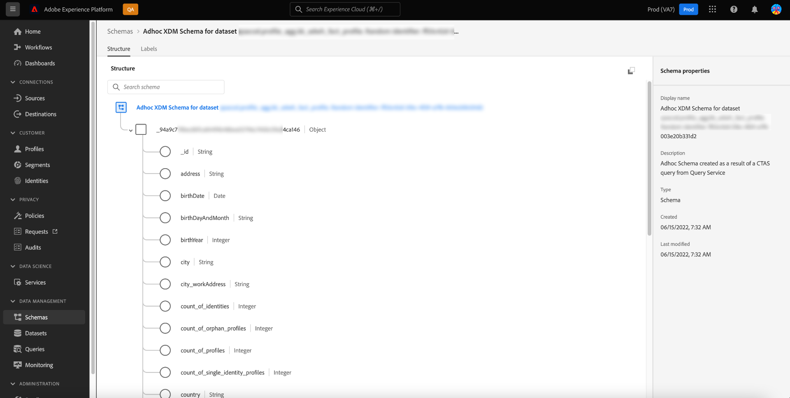
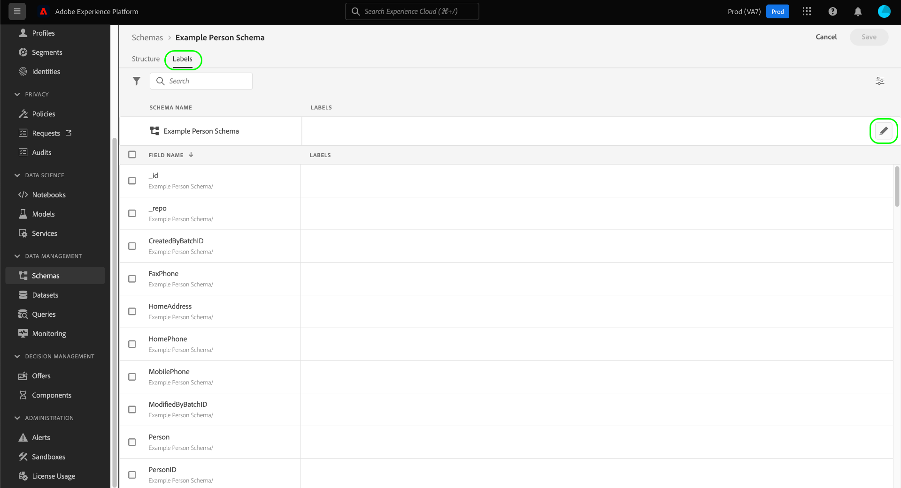
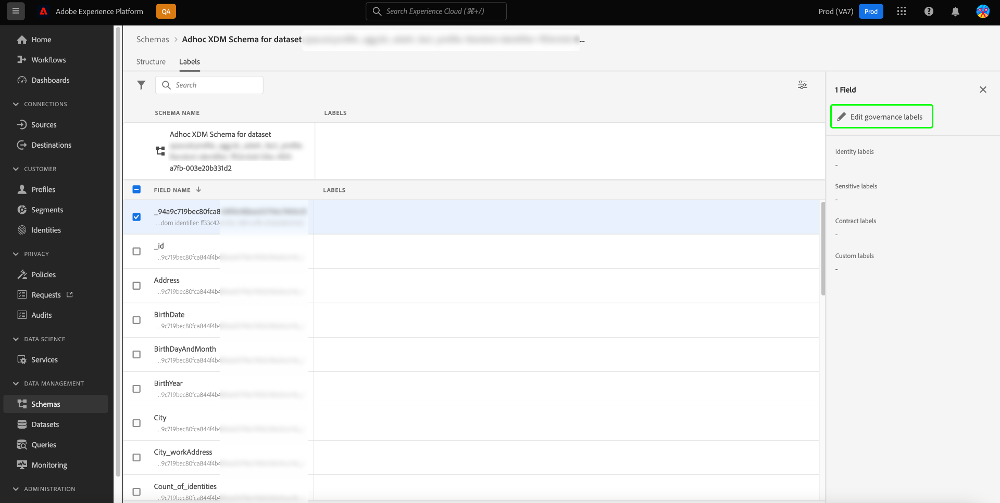
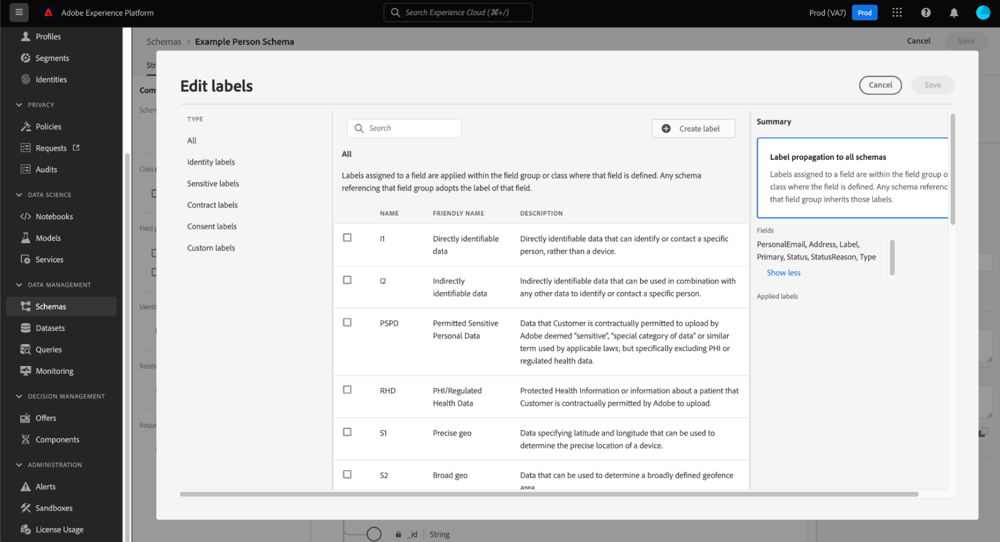

# Attribute-based access control support for ad hoc schemas

Any data that is brought into Adobe Experience Platform is encapsulated by Experience Data Model (XDM) schemas and may be subject to usage restrictions defined by your organization or by legal regulations. 

By executing a CTAS query through Query Service when no schema is specified, an ad hoc schema is automatically generated. It is often necessary to restrict the usage of certain fields, or datasets, of ad hoc schemas to control access to both sensitive personal data and personally identifiable information. Adobe Experience Platform facilitates this access control by allowing you to label schema fields through the Platform UI using the attribute-based access control capability.

Labels can be applied at any time, providing flexibility in how you choose to govern data. Although, it is best practice to label data as soon as it is ingested into Platform, or as soon as the data becomes available for use in Platform.

Schema-based labeling is an important component of attribute-based access control to better manage the access given to users or groups of users. Adobe Experience Platform enables you to restrict access to any field of an ad hoc schema by creating and applying labels.

This document provides a tutorial to manage access to sensitive data by applying labels to data fields of ad hoc schemas generated through Query Service.

## Getting started

This guide requires a working understanding of the following components of Adobe Experience Platform:

* [Experience Data Model (XDM) System](../../xdm/home.md): The standardized framework by which Experience Platform organizes customer experience data.
  * [[!DNL Schema Editor]](../../xdm/ui/overview.md): Learn how to create and manage schemas and other resources in the Platform UI.
* [[!DNL Data Governance]](../../data-governance/home.md): Learn how [!DNL Data Governance] allows you to manage customer data and ensure compliance with regulations, restrictions, and policies applicable to data use. 
* [Attribute-based access control](../../access-control/abac/overview.md): Attribute-based access control is a capability of Adobe Experience Platform that enables administrators to control access to specific objects and/or capabilities based on attributes. Attributes can be metadata added to an object, such as a label added to an ad hoc or regular schema field. An administrator defines access policies that include attributes to manage user access permissions.

## Create an ad hoc schema

Once your query has been executed and results have been generated, an ad hoc schema is automatically generated and added to the schema inventory. 

To add a data label, navigate to [!UICONTROL Schemas] dashboard browse tab by selecting [!UICONTROL Schemas] in the left rail of the Platform UI. The schema inventory is displayed.

>[!NOTE]
>
>Ad hoc schemas are not displayed by default in the schema inventory.

## Discover ad hoc schemas in the schema inventory of the Platform UI {#discover-ad-hoc-schemas}

To enable the display of ad hoc schemas in the Platform UI, select the filter icon () to the left of the search field, and then select **[!UICONTROL Show adhoc schemas] in the left-rail that appears.

Select the name of the recently created ad hoc schema from the available list. A visualization of the ad hoc schema structure appears.

## Edit governance labels

To edit data labels for your ad hoc schema, select the [!UICONTROL Labels] tab. The labels workspace allows you to apply, create, and edit labels to your ad hoc schema fields and control access permissions through the UI. All fields within the ad hoc schema are represented here.

## Edit labels for the schema or field

To edit the labels for the entire schema, select the pencil icon () to the side of the schema's name under the [!UICONTROL Labels] tab.

To apply a label to an existing field, select one or more fields from the list followed by [!UICONTROL Edit governance labels] in the right sidebar.

 

## Edit labels popover

The [!UICONTROL Edit labels] popover appears. From this view you can create or edit existing governance labels through the UI.

See the documentation for guidance on how to [create or edit labels for the selected schema or field](../../xdm/tutorials/labels.md#edit-the-labels-for-the-schema-or-field).

>[!NOTE]
>
>Creating a new label or editing an existing label requires admin permissions for your organization. If you do not have admin privileges please contact your system administrator to arrange access.

Labels can also be created using the permissions workspace. See the [guide on creating labels in the permissions workspace](../../access-control/abac/ui/labels.md) for instructions.

Once the appropriate level of attribute-based access control has been applied, the following system behavior applies to any query executed via Query Service when a user tries to access non-accessible data: 

1. If a user is declined access to one of the fields within a schema, the user will not be able to read or write on the restricted field. This applies to the following common scenarios:

    * When a user tries to execute a query with only a restricted column, the system will throw an error that the column doesn't exist.
    * When a user tries to execute a query with multiple columns that include a restricted column, the system will return output for all non-restricted columns only.

1. If a user requests access to a calculated field, the user is required to have access to all the fields used in the composition or the system will deny access to the calculated field. 

If an identity or primary identity is set on ad hoc schema, the system automatically honors any associated data hygiene requests and cleans the data in those datasets tied to the identity column.

## Next steps

After reading this document you have a better understanding of how to add data usage labels to ad hoc schemas created through Query Service CTAS queries. If you have not done so already, the following documents are useful to improve your understanding of data governance in Query Service:

* [Ad hoc schema identities](./ad-hoc-schema-identities.md)
* [Data governance](../../data-governance/home.md)
