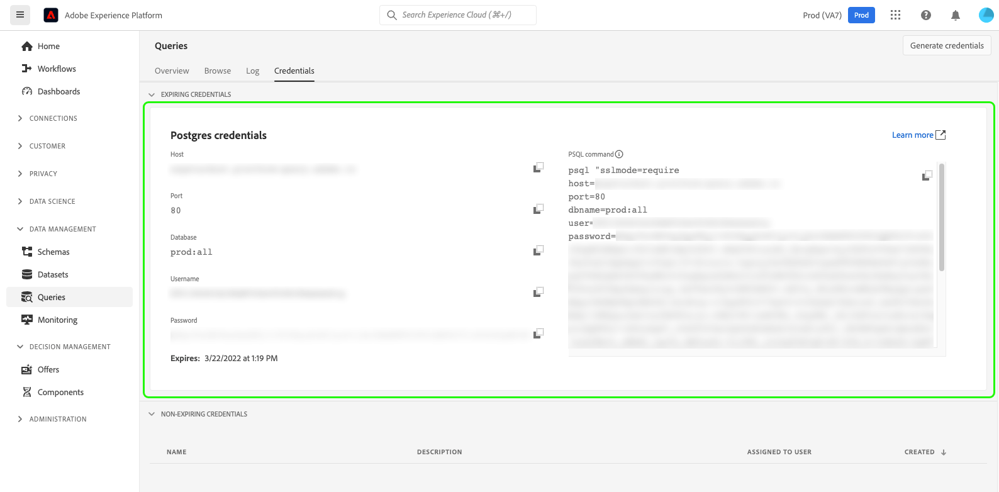
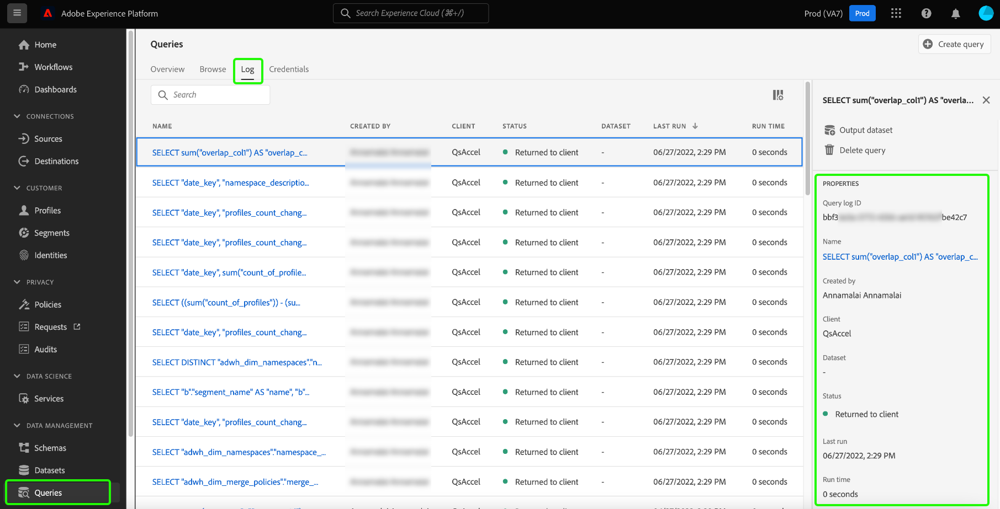

# Data governance in Query Service

Adobe Experience Platform brings data from multiple enterprise systems together and allows you to clean, shape, manipulate and enrich the data through Query Service according to your needs. This allows marketers to identify, understand, and engage customers in a better way. Ensuring adequate data governance is a critical aspect of handling personal information as certain data may be subject to usage restrictions based on organizational policies and legal regulations. It is critical to ensure that your ingested data and its related operations are compliant with the defined data usage policies.

Data governance within Query Service allows you to manage customer data and ensure compliance with regulations, restrictions, and policies applicable to data usage. This plays a key role when ensuring the usage policies have been applied according to the regulations defined by your business.

Organizations that routinely conduct data processing are recommended to outline, practice, and enforce these guidelines to create a privacy-conscious environment for all users.  

The following categories are instrumental in adhering to data compliance regulations when using Query Service:

1. Security
1. Audit
1. Data usage
1. Privacy 
1. Data hygiene

This document examines each of the different areas of governance and demonstrates how to facilitate data compliance when using Query Service. See the [governance, privacy, and security overview](../../landing/governance-privacy-security/overview.md) for broader information on how Experience Platform allows you to manage customer data and ensure compliance.

## Security {#security}

Data security is the process of protecting data from unauthorized access and ensuring secure access throughout its lifecycle. Secure access is maintained in Experience Platform through the application of roles and permissions by capabilities such as role-based access control and attribute-based access control. Credentials, SSL, and data encryption are also used to ensure data protection across Platform. 

Security in regard to Query Service is divided into the following categories:

* [Access control](#access-control): Access is controlled through roles and permissions including dataset and column-level permissions.
* Securing data through [connectivity](#connectivity): Data is secured through Platform and external clients by achieving a limited connection with expiring credentials, or non-expiring credentials.
* Securing data through [encryption and customer-managed keys (CMK)](#encryption-and-customer-managed-keys): Access controlled through encryption when data is at rest.

### Access control {#access-control}

Access control in Adobe Experience Platform lets you use [Adobe Admin Console](https://adminconsole.adobe.com/) to manage access to Query Service features using role-based permissions. Similarly, you can control access to specific data attributes through label management on schemas and data fields.

This section outlines the required access control permissions that a user must have in order to fully utilize Query Service features. See the documents on [managing permissions](../../access-control/ui/permissions.md) and [managing users](../../access-control/ui/users.md) for detailed instructions on assigning access to a product profile.

#### Relevant permissions

The relevant access control permissions are defined in the tables below according to their level of scope.

**Query execution permissions**

To run queries within Query Service, a user must be assigned a role with the following permission: 

| Permission | Description |
|---|---|
| [!UICONTROL Manage Queries] | This permission allows users to execute data exploration and batch queries, which can either read an existing dataset or write data on datasets. This includes both `CREATE TABLE AS SELECT` (`CTAS`) and `INSERT INTO AS SELECT` (`ITAS`) queries. |

**Dataset permissions**

This section serves as a guide for the resource-based access required to access datasets while querying data through Query Service.

Through the Permissions interface you can define resource-based access control for a dataset and schema with the following permissions:

| Permission | Description |
|---|---|
| [!UICONTROL Manage Datasets] | This permission provides read-only access for schemas and allows access to read, create, edit, and delete datasets for use with Query Service.  |
| [!UICONTROL View Datasets] | This permission allows read-only access for datasets and schemas for use with Query Service. | 

#### Access control for columns/fields

The attribute-based access control feature enables Query Service users to restrict access to critical user data. Access can be granted or restricted based on the permissions assigned to a role. User access to individual columns is controlled by the relevant data usage labels and the permission sets applied to the roles assigned to users. 

Tagging schema field groups and classes with data usage labels applies data usage restrictions to all schemas with the same field groups and classes. See the overview on [attribute-based access control](../../access-control/abac/overview.md) for comprehensive information on this feature.
 
This feature enables you to grant access rights on confidential columns to the user groups of your choice. Access control on a column can restrict both the read and write capabilities for a particular type of user.

Access control for columns can be applied at the schema level for both standard and ad hoc schemas. Apply data usage labels to XDM schemas to restrict access to one or more columns. Data labeling is consistently applied, even for datasets created via Query Service using either a predefined schema or an ad hoc schema generated as part of CTAS operation.

Once the appropriate level of access has been applied using labels and roles, the following system behavior occurs when a user tries to access the non-accessible data: 

1. If a user has been denied access to one of the columns within a schema, the user is also denied permission to read or write on the restricted column. This applies to the following common scenarios:
  
    * **Case 1**: When a user tries to execute a query affecting only a restricted column, the system throws an error that the column doesn't exist.
    * **Case 2**: When a user tries to execute a query with multiple columns including a restricted column, the system returns output for all non-restricted columns only.

1. If a user tries to access a calculated field, the user is required to have access to all the fields used in the composition or the system denies access to the calculated field as well. 

#### Access controls for views

Query Service provides the ability to use standard ANSI SQL for [`CREATE VIEW`](../sql/syntax.md#create-view) statements. For highly sensitive data workflows, you must enforce appropriate controls when creating views.

The `CREATE VIEW` keyword defines a view of a query but the view is not physically materialized. Instead, the query is run every time the view is referenced in a query. When a user creates a view from a dataset, the role- and attribute-based access control rules for the parent dataset are **not** hierarchically applied. As a result, you must explicitly set permissions on each of the columns when a view is created.

#### Create field-based access restrictions on accelerated datasets {#create-field-based-access-restrictions-on-accelerated-datasets}

With the [attribute-based access control capability](../../access-control/abac/overview.md) you can define organizational or data usage scopes on fact and dimension datasets in the [accelerated store](../data-distiller/query-accelerated-store/send-accelerated-queries.md). This allows administrators to manage access to specific segments and better manage the access given to users or groups of users.

To create field-based access restrictions on accelerated datasets, you can use Query Service CTAS queries to create accelerated datasets and structure these datasets based on existing XDM schemas or ad hoc schemas. Administrators can then [add and edit data usage labels for the schema](../../xdm/tutorials/labels.md#edit-the-labels-for-the-schema-or-field) or [ad hoc schema](./ad-hoc-schema-labels.md#edit-governance-labels). You can apply, create, and edit labels to your schemas from the [!UICONTROL Labels] workspace in the [!UICONTROL Schemas] UI. 

Data usage labels can also be [applied or edited directly onto the dataset](../../data-governance/labels/user-guide.md#add-labels) through the Datasets UI, or created from the Access Control [!UICONTROL Labels] workspace. See the guide on how to [create a new label](../../access-control/abac/ui/labels.md) for more information.

User access to individual columns can then be controlled by the attached data usage labels and the permission sets applied to the roles that are assigned to users.

### Connectivity {#connectivity}

Query Service is accessible through the Platform UI or by forming a connection with external compatible clients. Access to all available fronts is controlled by a set of credentials.

#### Connectivity through external clients

Access to Query Service using a third-party client requires credentials for authorization. These credentials are mandatory to access Query Service with any of the compatible external clients. You can connect to external clients by using either [expiring credentials](#expiring-credentials) or [non-expiring credentials](#non-expiring-credentials).

#### Limited connection time via expiring credentials {#expiring-credentials}

[Expiring credentials](../ui/credentials.md) allow users to form a temporary connection with an external client. This set of credentials is only valid for 24 hours. The expiry of these types of credentials can be seen along with the credential tab in the Query Service dashboard.

#### Non-expiring credentials {#non-expiring-credentials}

[Non-expiring credentials](../ui/credentials.md#non-expiring-credentials) allow you to form a permanent connection with an external client, making it easier to connect to Query Service without the need for a manual password. 

To enable the option of generating non-expiring credentials, you must follow the outlined [pre-requisite workflow](../ui/credentials.md#prerequisites). As part of this process, your organization administrator is required to configure permissions for the product profile, giving the administrator control over which accounts have access to use non-expiring credentials.

Technical user accounts permitted with non-expiring credentials can be assigned roles to ensure appropriate data governance by defining the scope of their read and write access based on their responsibilities and needs. See the earlier section on [using role-based permissions through access control](#access-control) to manage access to Query Service.

Once the prerequisite workflow has been completed, authorized users can now [generate the required connection credentials](../ui/credentials.md#generate-credentials).

#### SSL data encryption

For increased security, Query Service provides native support for SSL connections to encrypt client/server communications. Platform supports various SSL options to suit your data security needs and balance the processing overhead of encryption and key exchange.

See the guide on available [SSL options for third-party client connections to Query Service](../clients/ssl-modes.md) for more information, including how to connect using the `verify-full` SSL parameter value.

### Encryption and customer-managed keys (CMK) {#encryption-and-customer-managed-keys}

Encryption is the use of an algorithmic process to transform data into encoded and unreadable text to ensure the information is protected and inaccessible without a decryption key. 

Query Service data compliance ensures that data is always encrypted. Data-in-transit is always HTTPS compliant, and data-at-rest is encrypted in an Azure Data Lake store using system-level keys. See the documentation on [how data is encrypted in Adobe Experience Platform](../../landing/governance-privacy-security/encryption.md) for more information. For details on how data at rest is encrypted in Azure Data Lake Storage, see the [official Azure documentation](https://docs.microsoft.com/en-us/azure/data-lake-store/data-lake-store-encryption).

Data-in-transit is always HTTPS compliant and similarly when the data is at rest in the data lake, the encryption is done with Customer Management Key (CMK), which is already supported by Data Lake Management. The currently supported version is TLS1.2. See the [customer-managed keys (CMK) documentation](../../landing/governance-privacy-security/customer-managed-keys.md) to learn how to set up your own encryption keys for data stored in Adobe Experience Platform.

## Audit {#audit}

Query Service records user activity and categorizes that activity in different log types. Logs supply information on **who** performed **what** action, and **when**. Each action recorded in a log contains metadata that indicates the action type, date and time, the email ID of the user who performed the action, and additional attributes relevant to the action type.

Any of the log categories can be requested as desired by a Platform user. This section provides details on the type of information captured for Query Service and where this information can be accessed.

### Query logs {#query-logs}

The query logs UI allows you to monitor and review execution details for all queries that have been run either via the Query Editor or the Query Service API. This brings transparency to Query Service activities, allowing you to check the metadata for **all** the queries that have been executed across Query Service. It includes all types of queries whether it is an exploratory, batch, or scheduled query. 

Query logs can be accessed either through the Platform UI in the [!UICONTROL Logs] tab of the [!UICONTROL Queries] workspace.

### Audit logs {#audit-logs}

Audit logs contain more detailed information than query logs and enable you to filter logs based on attributes such as user, date, type of query, and so on. Beyond the details available in query log UI, Audit Logs stores details on individual users along with their session data or connectivity to a third-party client.

By providing an exact record of user actions, an audit trail can help with troubleshooting issues and help your business effectively comply with corporate data stewardship policies and regulatory requirements. Audit logs provide a record of all Platform activities. Using audit logs you can audit user actions relating to query execution, templates, and scheduled queries to increase the transparency and visibility of actions performed by users in Query Service.

The following table indicates the query categories captured by audit logs and the action types they record: 

|  Category |  Action Type |
|---|---|
| Query |  Execute |
| Query Template | Create, Delete, Update  |
| Scheduled Query | Create, Delete, Update |

Below is a list of three extended server logs that hold more details than those found within the query logs. The extended logs are found within the audit logs query categories:

1. **Meta query logs**: When a query is executed, various associated backend sub-queries (such as parsing) are executed. These types of queries are known as "metadata" queries. Their relevant details can be found in audit logs.
1. **Session logs**: The system creates a session entry log for a user when they log into Query Service regardless of whether they execute a query.
1. **Third-party client connection logs**: A connectivity audit log is generated when a user successfully connects Query Service to a third-party client.

See the [audit logs overview](../../landing/governance-privacy-security/audit-logs/overview.md) for more information on how audit logs can help your organization approach data compliance. 

## Data usage {#data-usage}

The Data Governance framework in Platform provides a uniform way to responsibly use data across all Adobe solutions, services, and platforms. It coordinates the systemic approach to capture, communicate, and use metadata across the entirety of Adobe Experience Cloud. This in turn, helps data controllers label data according to the marketing actions needed, and the restrictions placed on that data from these intended marketing actions. See the overview on [data usage labels](../../data-governance/labels/overview.md) for more information on how Data Governance allows you to apply data usage labels to datasets and fields. 

It is best practice to work towards data compliance at every stage of the data's journey. To this end, derived datasets that use ad hoc schemas should be appropriately labeled as part of the Data Governance framework. There are two types of derived datasets formed by Query Service: datasets that use a standard schema and datasets that use an ad hoc schema. 

>[!NOTE]
>
>Datasets that are created using Query Service are referred to as "derived datasets".

As ad hoc schemas are created by an individual user for a specific purpose, the XDM schema fields are namespaced for that particular dataset and not intended for use across different datasets. As a result, ad hoc schemas are not visible by default in the Experience Platform UI. Although there is no difference in the application of data usage labels between both standard and ad hoc schemas, ad hoc schemas created by Query Service for the purpose of labelling must first be made visible in the Platform UI. See the guide on [discovering ad hoc schemas within the Platform UI](./ad-hoc-schema-labels.md#discover-ad-hoc-schemas) for more details. 
 
After you have accessed the schema, you can [apply labels to individual fields](../../xdm/tutorials/labels.md). Once a schema has been labeled, all datasets that derive from that schema inherit those labels. From here, you can set up data usage policies that can restrict data with certain labels from being activated to certain destinations. For more information, see the overview on [data usage policies](../../data-governance/policies/overview.md).

## Privacy {#privacy}

[Privacy Service](../../privacy-service/home.md) helps you manage customer requests to access and delete their data in accordance with legal privacy regulations. It does this by searching the data for pre-existing identifiers, and either accesses or deletes that data depending on the privacy job requested. Data must be properly labeled in order for the service to determine which fields to access or delete during privacy jobs. Data that is subject to privacy requests must contain customer identity information in order to tie the disparate pieces of data with the individual person to whom the privacy request applies to. Query Service can enrich the data it uses with a unique identifier for the purpose of satisfying privacy jobs. 

Privacy requests can be sent to the data lake or the Profile data store. Records deleted from the data lake do not result in the deletion of profiles that were made from those records. Also, a privacy job to delete personal information from the data lake does not delete their profile so any information (that contains that profile ID) ingested after the completion of the privacy job updates that profile as normal. This reaffirms the need to properly identify data used in hoc schemas.

See the Privacy Service documentation for more information on [identity data for privacy requests](../../privacy-service/identity-data.md) and how to configure your data operations and leverage Adobe technologies to effectively retrieve the appropriate identity information for customer privacy requests.

Query Service features for data governance simplify and streamline the process of data categorization and adherence to data usage regulations. Once the data has been identified, Query Service enables you to allocate the primary identity on all output datasets. You **must** add identities into the dataset to facilitate data privacy requests and work towards data compliance. 

Schema data fields can be set as an identity field through the Platform UI and Query Service also allows you to [mark the primary identities by using the SQL command 'ALTER TABLE'](../sql/syntax.md#alter-table). Setting an identity using the `ALTER TABLE` command is especially useful when datasets are created using SQL rather than directly from a schema through the Platform UI. See the documentation for instructions on how to [define identity fields in the UI](../../xdm/ui/fields/identity.md) when using standard schemas.
 
## Data hygiene {#data-hygiene}

"Data hygiene" refers to the process of repairing or removing data that may be outdated, inaccurate, incorrectly formatted, duplicated, or incomplete. These processes make sure that datasets are accurate and consistent across all systems. It is important to ensure adequate data hygiene along every step of the data's journey and even from the initial data storage location. In Experience Platform Query Service, this is either the data lake or the accelerated store.

You can assign an identity to a derived dataset to allow their data management following Platform's centralized data hygiene services.

Conversely, when you create an aggregated dataset on the accelerated store, the aggregated data cannot be used to derive the original data. As a result of this data aggregation, the need to raise data hygiene requests is eliminated.

An exception to this scenario is the case of deletion. If a data hygiene deletion is requested on a dataset and before the deletion is completed, another derived dataset query is executed, then the derived dataset will capture information from the original dataset. In this case, you must be mindful that if a request to delete a dataset has been sent, you must not execute any newly derived dataset queries using the same dataset source.

See the [data hygiene overview](../../hygiene/home.md) for more information on data hygiene in Adobe Experience Platform.
