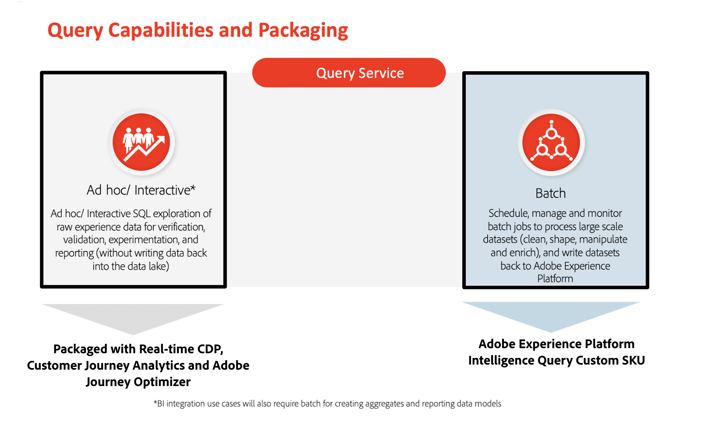

# Guardrails for Query Service

Guardrails are thresholds that provide guidance for data and system usage, performance optimization, and avoidance of errors or unexpected results in Adobe Experience Platform.

This document provides default usage limits for Query Service data to help you optimize system performance when querying data in relation to your licensing entitlements.

## Prerequisites

Before continuing with this document, you should have a good understanding of the two key Query Service capabilities described below:

* **Ad hoc queries**: For executing `SELECT` queries to explore, experiment, and validate data where the results of the queries **are not stored** on the data lake.

* **Batch queries**: For executing `INSERT TABLE AS SELECT` and `CREATE TABLE AS SELECT` queries to clean, shape, manipulate, and enrich data. The results of these queries **are stored** on the data lake. The metric for measuring the consumption of this functionality is computational hours.

The illustration below summarizes how Query Service capabilities are currently packaged and licensed:

## Limit types

There are two types of default limits within this document:

* **Soft limit**: You can go beyond a soft limit, however soft limits provide a recommended guideline for system performance.

* **Hard limit**: A hard limit provides an absolute maximum.

>[!NOTE]
>
>The default limits outlined in this document are constantly being improved. Please check back regularly for updates.

## Primary entity performance guardrails

The tables below provide the recommended guardrail limits and descriptions for query execution when using a particular query pattern.

**Ad hoc queries**

| **Guardrail**| **Limit** | **Limit type** | **Description** |
|---|---|---|---|
| Maximum execution time  | 10 minutes  | Hard  | This defines the maximum output time for an ad-hoc SQL query. Exceeding the time limit to return a result throws the error code 53400.  |
| Query concurrency | <ul><li>As specified in the application product description.</li><li>+1 (with every additional ad hoc query user add-on SKU pack purchased)</li></ul> | Hard | This defines how many queries can be executed concurrently for a particular organization. If the concurrency limit is exceeded, the queries are queued.  |
| Client connector and result output Limit | Client Connector<ul><li>Query UI (100 rows)</li><li>Third-party client (50,000)</li><li>[!DNL PostgresSQL] client (50,000)</li></ul> | Hard | The result of a query can be received through the following means:<ul><li>Query Service UI</li><li>Third-party client</li><li>[!DNL PostgresSQL] client</li></ul>Note: Adding a limitation to the output count may return results faster. For example, `LIMIT 5`, `LIMIT 10`, and so on. |
| Results returned via | Client UI  | N/A  | This defines how the results are made available to the users. |

{style="table-layout:auto"}

**Batch queries**

| **Guardrail**| **Limit** | **Limit type** | **Description** |
|---|---|---|---|
| Maximum execution time| 24 hours  | Hard | This defines the maximum execution time for a batch SQL query. The processing time of a query is dependent on the volume of data to be processed and query complexity.  |
| User concurrency  | No user limitation | N/A | Scheduled Batch Queries are asynchronous jobs so there is no user limitation.  |
| Computational hours for batch data processing | As specified in the Customer's Adobe Experience Platform Intelligence Query Custom SKU Sales order| Soft  | This defines the scoped amount of computational time per year a customer is allowed for executing batch queries to scan, process and write data back into the data lake. |
| Query concurrency  | Supported | N/A | Scheduled batch queries are asynchronous jobs, therefore concurrent queries are supported. |
| Client connector and result output limit | Client Connector<ul><li>Query UI (no upper limit to rows)</li><li>Third-party client (no upper limit to rows)</li><li>[!DNL PostgresSQL] client (no upper limit to rows)</li><li>REST APIs (no upper limit to rows)</li></ul> | Hard  | The result of a query can be made available using the following methods:<ul><li>Can be stored as derived datasets</li><li>Can be inserted into the existing derived datasets</li></ul>Note: There is no upper limit to the record count number from the query result. |
| Results returned via | Dataset | N/A | This defines how the results are made available to the users. |

{style="table-layout:auto"}

## Dashboards insights generated with queries {#dashboard-insights}

To ensure that each query for a Real-Time Customer Data Platform insights dashboard has enough resources to execute efficiently, the API tracks resource usage by assigning concurrency slots to each query. The system can process up to four concurrent queries, and therefore four concurrent query slots are available at any given time. Queries are put into a queue based on concurrency slots, then wait in the queue until enough concurrency slots are available.

## Next steps

After reading this document you should have a better understanding of the default limits for query execution with the available query patterns. 

See the following documentation for more information on Query Service:

* [Query Service API](./api/getting-started.md)
* [Query Service UI](./ui/overview.md)
