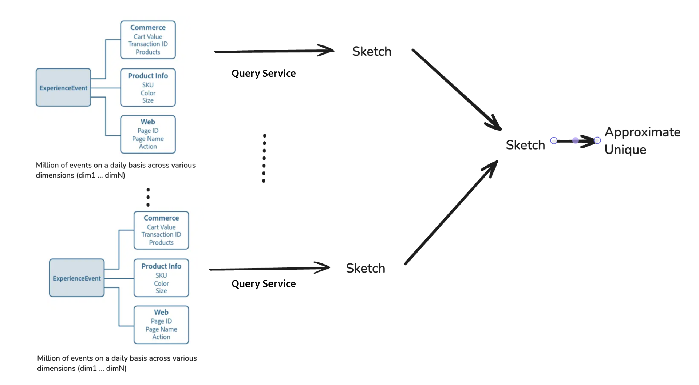

# Efficient big data analysis with hypercubes

>[!AVAILABILITY]
>
>This functionality is only available to users who have purchased the [Data Distiller SKU](../data-distiller/overview.md). Contact your Adobe representative for more information.

Learn how to use hypercubes in Adobe Experience Platform's Experience Query Service to perform advanced data analysis with enhanced efficiency. This document covers how to use advanced functions from the [[!DNL Apache Datasketches] library](https://datasketches.apache.org/) to handle distinct counts and complex calculations incrementally, without having to reprocess historical data each time.

In big data analysis, generating metrics such as distinct counts, quantiles, most-frequent items, joins, and graph analysis often involves non-additive counting (where results can't simply be summed up from subgroups). Traditional methods require reprocessing all historical data, which can be resource-intensive and time-consuming. Use sketches, which are compact summaries that use probabilities to represent large datasets, and advanced Query Service functions to streamline this process by reducing the need for recalculating.

## Key functions of hypercubes {#key-functions}

Hypercubes offer several powerful functions to enhance data analysis efficiency and flexibility. 

1. **Count unique users or distinct queries**: Use SQL capabilities to generate unique counts of users interacting with various dimensions of data, such as product views, site visits, or commerce activity, without repeatedly reanalyzing raw data.
2. **Incremental processing**: Perform incremental updates to fold and merge data points across dimensions and time without recalculating everything from scratch.
3. **Multi-dimensional analysis**: Hypercubes enable multi-dimensional filtering and rearranging of data to create summary rows that represent combinations of dimensions. These summaries can then be used to generate insights with minimal computation overhead.

## Use cases for hypercubes {#use-cases}

Use hypercubes to efficiently generate distinct counts for various user interactions without fully recalculating data each time. The following are some practical scenarios for their use:

- Analyze unique visitors that view specific products during a defined time period.
- Identify users who interact with multiple products in a given period to enhance cross-sell analysis.
- Distinguish users engaging with one product but not another over time to uncover preference patterns.
- Combine online and offline interaction data to get a comprehensive view of user behavior over a given period.
- Track user movement across different activities within an event to optimize layout and services.

## Benefits of using hypercubes

In these situations, you can pre-calculate basic information for specific categories. However, when analyzing data across multiple dimensions and time periods, you have to either recalculate everything from raw data or use a Query Service hypercube. Hypercubes streamline the process by organizing data efficiently, which allows flexible filtering and multi-dimensional analysis without reprocessing. They use advanced functions to estimate results quickly and accurately to offer key benefits such as improved processing efficiency, scalability, and adaptability for complex analytical tasks.

### Data size efficiency for query processing

Query Service can compress millions or billions of data points (for example, user IDs) into a compact form called a sketch. This sketch has a significantly reduced data size for query processing, which maintains scalability and makes it much easier and faster to work with. No matter how large the original data gets, the size of the sketch stays small, which makes analyzing big data much more manageable and efficient.

The diagram below illustrates how Commerce, Product Info, and Web dimension ExperienceEvents are processed into sketches, which are then used to approximate unique counts.


### Merge sketches to make data analysis faster and easier

To avoid recalculating and enhance processing speed, you can merge sketches from different categories or groups. Query Service also simplifies the design by organizing your data into a hypercube, where each row becomes a summary of its partition (a collection of dimensions) alongside the sketch column. Each row of the hyper-cube contains the dimension combination but does not have any raw data. When executing a query, specify the dimensional columns you want to use for building additive metrics and merge the sketches for those rows.



### Cost-effectiveness {#cost-effectiveness}

Customer data is often large-scale, but you can eliminate the need to reprocess historical data by using incremental processing. Sketches are much smaller and allow for faster, real-time results while saving on compute resources and costs. This data transformation makes interactive queries more feasible and efficient.

## Functions Overview

This section outlines how each function optimizes data processing and enhances analytical capabilities through the efficient use of sketches and hypercubes. It details their purpose, example syntax, parameters, and expected output.

### Create unique count estimates with HLL sketches 

`hll_build_agg` is an aggregate function that creates an HLL (HyperLogLog) sketch. This function is a compact, probabilistic method for estimating the number of unique values within a column or expression in a grouped dataset.

#### Function Definition

```sql
hll_build_agg(column [, lgConfigK])
```

**Usage:**

The following example demonstrates how the function can be structured within a query.

```sql
SELECT
   [dim1, dim2 ... ,] hll_build_agg(coalesce(col1, col2, col3)) AS sketch_col
FROM fact_sketch_table
  [GROUP BY dimension1, dimension2 ...]
```

#### Parameters

| Parameter   | Description                          |
|---------------------------|---------------------------------------|
| `column`    | The column or column name on which to create a sketch.                                              |
| `lgConfigK` | *Int* (Optional) The log-base-2 of K, where K is the number of buckets or slots for the HLL Sketch. Min value: 4. Max value: 12. Default value: 12. |

#### Output

| Output Column   | Description                           |
|---------------------------|---------------------------------------|
| `sketch_res`    |  A column of type string containing the stringified HLL sketch. |

#### SQL example

The following example builds an aggregate sketch on the `customer_id` column:

```sql
SELECT
  country,
  hll_build_agg(customer_id, 10) AS sketch
FROM
  EXPLODE(
    ARRAY<STRUCT<country STRING, customer_id STRING, invoice_id STRING>>[
      ('UA', 'customer_id_1', 'invoice_id_11'),
      ('CZ', 'customer_id_2', 'invoice_id_22'),
      ('CZ', 'customer_id_2', 'invoice_id_23'),
      ('BR', 'customer_id_3', 'invoice_id_31'),
      ('UA', 'customer_id_2', 'invoice_id_24')
    ])
GROUP BY country;
```

**SQL example output:**

| Country |                           Sketch                           |
|---------|------------------------------------------------------------|
| UA      | AgEHBAMAAgCR9mUEulKKCQAAAAAAAAAAAAAAAAAAAAAAAAAAAAAAAA==   |
| CZ      | AgEHBAMAAQC6UooJAAAAAAAAAAAAAAAAAAAAAAAAAAAAAAAAAAAAAA==   |
| BR      | AgEHBAMAAQCcmH0HAAAAAAAAAAAAAAAAAAAAAAAAAAAAAAAAAAAAAA==   |

### Estimate distinct counts with HLL sketches

`hll_estimate` is a scalar function that provides an estimation of the distinct count within each row of a dataset. Unlike aggregate functions, `hll_estimate` operates row-wise and is used for estimating the distinct count from a sketch within individual rows. 

>[!NOTE]
>
>This function cannot be used as an aggregated function. For aggregated counts, use `sketch_count`.

#### Function Definition

```sql
hll_estimate(sketch_col)
```

**Usage:**

The following example demonstrates how the function can be structured within a query.

```sql
SELECT
   [col1, col2 ... ,] hll_estimate(sketch_column) AS estimate
FROM fact_sketch_table
```

#### Parameters

| Parameter       | Description            |
|---------------------------|---------------------------------------|
| `sketch_column` | Column containing a stringified HLL sketch. It estimates the distinct count for the sketch in each row. |

#### Output

| Output Column   | Description       |
|---------------------------|---------------------------------------|
| `estimate`      | A column of type double that provides the estimation of the sketch, rounded to two decimal places.   |

#### SQL Example

The following example estimates the distinct count of customers by country using the `hll_estimate` function on an HLL sketch:

```sql
SELECT
  country,
  hll_estimate(hll_build_agg(customer_id, 10)) AS distinct_customers_by_country
FROM
  (
    SELECT
      country,
      hll_build_agg(customer_id, 10) AS sketch
    FROM 
      EXPLODE(
        ARRAY<STRUCT<country STRING, customer_id STRING, invoice_id STRING>>[
          ('UA', 'customer_id_1', 'invoice_id_11'),
          ('CZ', 'customer_id_2', 'invoice_id_22'),
          ('CZ', 'customer_id_2', 'invoice_id_23'),
          ('BR', 'customer_id_3', 'invoice_id_31'),
          ('UA', 'customer_id_2', 'invoice_id_24')
        ])
    GROUP BY country
  );
```

**SQL Example Output:**

| Country | distinct_customers_by_country |
|---------|-------------------------------|
| UA      | 2.00                          |
| CZ      | 1.00                          |
| BR      | 1.00                          |

### Merge multiple HLL sketches with `hll_merge_agg`

`hll_merge_agg` is an aggregate function that merges multiple HLL sketches within a group, producing a new sketch as the output. It allows the combination of sketches across partitions or dimensions, enhancing data analysis flexibility. 

#### Function Definition

```sql
hll_merge_agg(sketch_col [, allowDifferentLgConfigK])
```

**Usage:**

The following example demonstrates how the function can be structured within a query.

```sql
SELECT
   [dim1, dim2 ... ,] hll_merge_agg(sketch_column.sketch) AS estimate
FROM fact_sketch_table
  [GROUP BY dimension1, dimension2 ...]
```

#### Parameters

| Parameter                 | Description              |
|---------------------------|---------------------------------------|
| `sketch_column`           | Column containing the stringified HLL sketch. |
| `allowDifferentLgConfigK` | *Boolean* (Optional) If set to true, allows merging of sketches with different `lgConfigK` values. The default value is false. An exception is thrown if the value is false and sketches have different `lgConfigK` values. |

>[!NOTE]
>
>If `allowDifferentLgConfigK` is set to false, merging sketches with different `lgConfigK` values results in an `UnsupportedOperationException`.

#### Output

| Output Column  | Description     |
|----------------|-------------------------------------------------|
| `sketch_res`   | A column of type HLL sketch containing the stringified merged HLL Sketch.                          |

#### SQL Example

The following example merges multiple HLL sketches on the `customer_id` column:

```sql
SELECT
   hll_merge_agg(hll_sketch) AS uniq_customers_with_invoice
FROM
  (
    SELECT
      country,
      hll_build_agg(customer_id) AS hll_sketch
    FROM
      EXPLODE(
        ARRAY<STRUCT<country STRING, customer_id STRING, invoice_id STRING>>[
          ('UA', 'customer_id_1', 'invoice_id_11'),
          ('BR', 'customer_id_3', 'invoice_id_31'),
          ('CZ', 'customer_id_2', 'invoice_id_22'),
          ('CZ', 'customer_id_2', 'invoice_id_23'),
          ('BR', 'customer_id_3', 'invoice_id_31'),
          ('UA', 'customer_id_2', 'invoice_id_24')
        ])
    GROUP BY country
    UNION
    SELECT
      country,
      hll_build_agg(customer_id) AS hll_sketch
    FROM
      EXPLODE(
        ARRAY<STRUCT<country STRING, customer_id STRING, invoice_id STRING>>[
          ('UA', 'customer_id_1', 'invoice_id_21'),
          ('MX', 'customer_id_3', 'invoice_id_31'),
          ('MX', 'customer_id_2', 'invoice_id_21')
        ])
    GROUP BY country
  )
GROUP BY customer_id;
```

**SQL Example Output:**

| Country | hll_merge_agg(sketch, true)                |
|---------|--------------------------------------------|
| UA      | AgEHDAMAAwiR9mUEulKKCQAAAAAAAAAAAAAAAA==   |
| CZ      | AgEHDAMAAQi6UooJAAAAAAAAAAAAAAAAAAAAAAAA== |
| BR      | AgEHDAMAAQicmH0HAAAAAAAAAAAAAAAAAAAAAAAA== |
| MX      | AgEHFQMAAgiGL/kNdAAAAAAAAAAAAAAAAAAAAAAA== |

### Estimate cardinality with `hll_merge_count_agg`

`hll_merge_count_agg` is an aggregate function that estimates the cardinality (number of unique elements) from one or more sketches within a column. It returns a single estimate for all sketches encountered within the grouping. This function is used for aggregating sketches and cannot be used as a row-wise transformation. For row-wise estimates, use `sketch_estimate`.

#### Function Definition

```sql
hll_merge_count_agg(sketch_col [, allowDifferentLgConfigK])
```

**Usage:**

The following example demonstrates how the function can be structured within a query.

```sql
SELECT
   [dim1, dim2 ... ,] hll_merge_count_agg(sketch_column) AS estimate
FROM fact_sketch_table
  [GROUP BY dimension1, dimension2 ...]
```

#### Parameters

| Parameter               | Description            |
|-------------------------|----------------------------------------------|
| `sketch_column`         | A column containing the stringified HLL sketch. |
| `allowDifferentLgConfigK` | *Boolean* (Optional) The default value is false. If set to true, it allows the merging of sketches with different `lgConfigK` values. Otherwise, an `UnsupportedOperationException` is thrown. |

#### Output

| Output Column | Description          |
|---------------|----------------------------------------------------------|
| `estimate`    | A column of type Double providing the estimation of the sketch. |

#### SQL Example

The following example estimates the number of unique customers with invoices using the `hll_merge_count_agg` function:

```sql
SELECT
   hll_merge_count_agg(hll_sketch) AS uniq_customers_with_invoice
FROM
  (
    SELECT
      country,
      hll_build_agg(customer_id) AS hll_sketch
    FROM
      EXPLODE(
        ARRAY<STRUCT<country STRING, customer_id STRING, invoice_id STRING>>[
          ('UA', 'customer_id_1', 'invoice_id_11'),
          ('BR', 'customer_id_3', 'invoice_id_31'),
          ('CZ', 'customer_id_2', 'invoice_id_22'),
          ('CZ', 'customer_id_2', 'invoice_id_23'),
          ('BR', 'customer_id_3', 'invoice_id_31'),
          ('UA', 'customer_id_2', 'invoice_id_24')
        ])
    GROUP BY country
    UNION
    SELECT
      country,
      hll_build_agg(customer_id) AS hll_sketch
    FROM
      EXPLODE(
        ARRAY<STRUCT<country STRING, customer_id STRING, invoice_id STRING>>[
          ('UA', 'customer_id_1', 'invoice_id_21'),
          ('MX', 'customer_id_3', 'invoice_id_31'),
          ('MX', 'customer_id_2', 'invoice_id_21')
        ])
    GROUP BY country
  )
GROUP BY customer_id;
```

**SQL Example Output:**

| Country | hll_merge_count_agg(sketch, true) |
|---------|----------------------------------|
| UA      | 2.0                              |
| CZ      | 1.0                              |
| BR      | 1.0                              |
| MX      | 2.0                              |

## Limitations

Currently, sketches cannot be updated once created. Future updates will introduce the capability to update sketches. With this functionality you can handle missed runs and late-arriving data more effectively.

## Next steps

By reading this document, you now know how to use hypercubes and associated sketch functions to perform efficient data processing for complex, multi-dimensional analyses without the need to reprocess historical data. This approach saves time, reduces costs, and offers the flexibility required for real-time, interactive queries, making it a valuable tool for big data analysis in Adobe Experience Platform.

Next, explore other key concepts such as [incremental loading](../key-concepts/incremental-load.md) and [data dedupliction](../key-concepts/deduplication.md) to deepen your understanding of how to use these functions effectively for your specific data needs.
