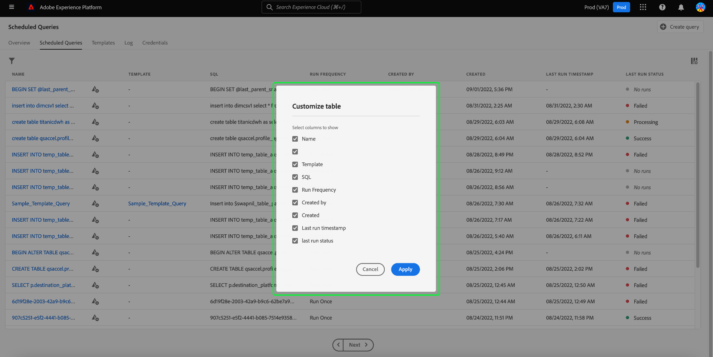
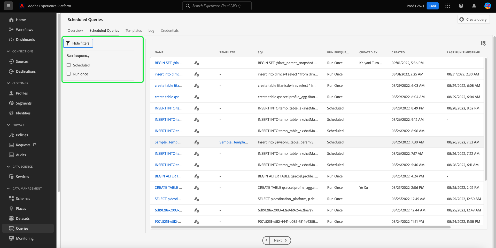

# Monitor queries

Adobe Experience Platform provides improved visibility for the status of all query jobs through the UI. From [!UICONTROL Scheduled Queries] tab you can now find important information about your query runs that includes the status, schedule details, and error messages/codes should they fail. You can also subscribe to alerts for queries based on their status through the UI for any of these queries through [!UICONTROL Scheduled Queries] tab.

## [!UICONTROL Scheduled Queries] 

The [!UICONTROL Scheduled Queries] tab provides an overview of all your scheduled CTAS and ITAS queries. Run details can be found for all scheduled queries as well as error codes and messages for any failed queries.

To navigate to the [!UICONTROL Scheduled Queries] tab, select **[!UICONTROL Queries]** from the left navigation bar followed by **[!UICONTROL Scheduled Queries]**

The table below describes each available column.

>[!NOTE]
>
>The alert subscriptions icon is contained in each row in an untitled column. See the [alert subscriptions](#alert-subscription) section for more information.

| Column | Description  |
|---|---|
| **[!UICONTROL Name]** | The name field is either the template name or the first few characters of your SQL query. Any query created through the UI with the Query Editor is named at inception. If the query was created through the API then its name becomes a snippet of the initial SQL used to create the query. Select any item from the [!UICONTROL Name] column to see a list of all runs associated with the query. For more information see the [query runs schedule details](#query-runs) section. |
| **[!UICONTROL Template]** | The template name of the query. Select a template name to navigate to the Query Editor. The query template is displayed in the Query Editor for convenience. If there is no template name, the row is marked with a hyphen and there is no ability to redirect to the Query Editor to view the query. |
| **[!UICONTROL SQL]** | A snippet of the SQL query.  |
| **[!UICONTROL Run frequency]** | This is the cadence at which your query is set to run. The available values are `Run once` and `Scheduled`. Queries can be filtered according to their run frequency. |
| **[!UICONTROL Created by]** | The name of the user who created the query. |
| **[!UICONTROL Created]** | The timestamp when the query was created, in UTC format.  |
| **[!UICONTROL Last run timestamp]** | The most recent timestamp when the query was run. This column highlights whether a query has been executed according to its current schedule.  |
| **[!UICONTROL Last run status]** | The status of the most recent query execution. The status values are: `Success`, `Failed`, `In progress`, and `No runs`. |

>[!TIP]
>
>If you navigate to the Query Editor, you can select **[!UICONTROL Queries]** to return to the [!UICONTROL Templates] tab.

### Customize table settings for scheduled queries 

You can adjust the columns on the [!UICONTROL Scheduled Queries] tab to your needs. Select the settings icon () to open the [!UICONTROL Customize table] settings dialog and edit available columns.

Toggle the relevant checkboxes to remove or add a table column. Next, select **[!UICONTROL Apply]** to confirm your choices.

>[!NOTE]
>
>Any query that was created through the UI becomes a named template as part of the creation process. The template name is seen in the template column. If the query was created through the API then the template column is blank. 

### Subscribe to alerts {#alert-subscription}

You can subscribe to alerts from the [!UICONTROL Scheduled Queries] tab. Select the alert notification icon () next to a query name to open the [!UICONTROL Alerts] dialog. The [!UICONTROL Alerts] dialog subscribes to both UI notifications and email alerts. Alerts are based on the status of the query. There are three options available: `start`, `success`, and `failure`. Check the appropriate box or boxes and select **[!UICONTROL Save]** to subscribe.

<!-- Link to alert subscriptions doc when available -->

### Filter queries {#filter}

You can filter queries based on run frequency. From the [!UICONTROL Scheduled Queries] tab, select the filter icon () to open the filter sidebar. 

Select either the **[!UICONTROL Scheduled]** or **[!UICONTROL Run once]** run frequency filter checkboxes to filter the list of queries.

>[!NOTE]
>
>Any query that has been executed but not scheduled qualifies as [!UICONTROL Run once].

Once you have enabled your filter criteria, select **[!UICONTROL Hide Filters]** to close the filter panel.

## Query runs schedule details {#query-runs}

Select a query name to navigate to the schedule details page. This view provides a list of all the runs executed as part of that scheduled query. The information provided includes the start and end time, status, and dataset used. 

 

This information is provided in a five-column table. Each row denotes a query execution. 

| Column name  | Description  |
|---|---|
| **[!UICONTROL Query run ID]**  | The query run ID for the daily execution. Select the **[!UICONTROL Query run ID]** to navigate to the [!UICONTROL Query run overview]. |
| **[!UICONTROL Query run start]** | The timestamp when the query was executed. This is in UTC format. |
| **[!UICONTROL Query run complete]** | The timestamp when the query was completed. This is in UTC format. |
| **[!UICONTROL Status]** | The status of the most recent query execution. The three status values are: `successful` `failed` or `in progress`. |
| **[!UICONTROL Dataset]** | The dataset involved in the execution. |

Details of the query being scheduled can be seen in the [!UICONTROL Properties] panel. This panel includes the initial query ID, client type, template name, query SQL, and cadence of the schedule.

Select a query run ID to navigate to the run details page and view query information. 

## Query run overview {#query-run-overview}

The [!UICONTROL Query run overview] provides information on individual runs for this scheduled query and a more detailed breakdown of the run status. This page also includes the client information and details of any errors that may have caused the query to fail. 

The query status section provides the error code and error message should the query have failed. 

You can copy the query SQL to your clipboard from this view. Select the copy icon in the top right of the SQL snippet to copy the query. A popup message confirms that the code has been copied.

### Run details for queries with anonymous block {#anonymous-block-queries}

Queries that use anonymous blocks to comprise their SQL statements are separated into their individual queries. This allows you to inspect the run details for each query block individually. 

Anonymous blocks are denoted through the use of a `$$` prefix before the query. See the [anonymous block document](./best-practices/anonymous-block.md) to find out more about anonymous blocks in query service.

Anonymous block queries have tabs to the left of the run status. Select a tab to display the run details.

In the event an anonymous block query fails, you can find the error code for that particular block through this UI.

Select **[!UICONTROL Query]** to return to the schedule details screen, or **[!UICONTROL Scheduled Queries]** to return to the [!UICONTROL Scheduled Queries] tab.

