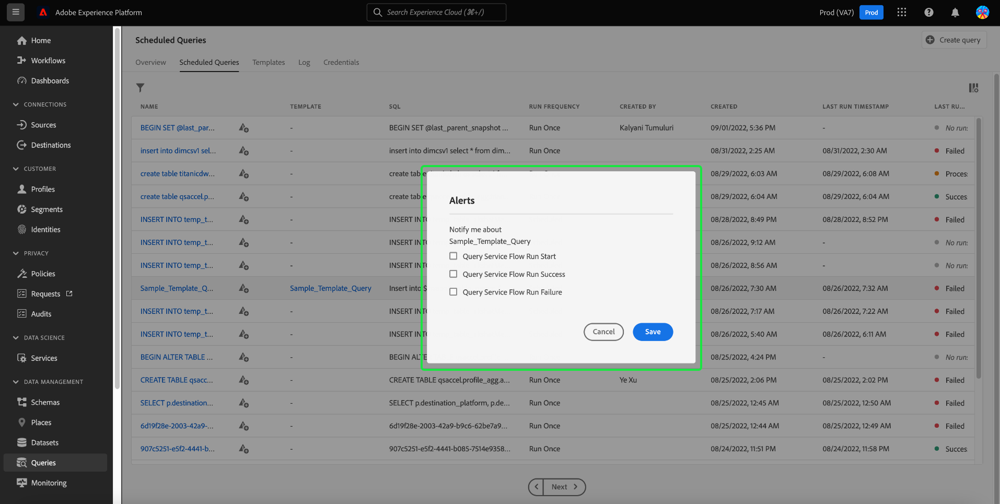

# Monitor queries

Adobe Experience Platform provides improved visibility for the status of all query jobs through the UI. You can now find important information about the status of your query runs, including error messages and codes should they fail, from [!UICONTROL Scheduled Queries] tab. You can also subscribe to alerts through the UI for any of these queries based on their status.

## [!UICONTROL Scheduled Queries] 

The [!UICONTROL Scheduled Queries] tab provides a top level overview of the executed and scheduled queries. The workspace contains all your CTAS and ITAS queries that are either scheduled to run, or have been executed at least once. Run details can be found for all scheduled queries as well as error codes and messages for failed queries.

To navigate to the [!UICONTROL Scheduled Queries] tab, select **[!UICONTROL Queries]** from the left navigation bar followed by **[!UICONTROL Scheduled Queries]**

The table below provides a description of each available column.

>[!NOTE]
>
>The alert subscriptions icon is contained in each row in an untitled column. See the [alert subscriptions](#alert-subscription) section for more information.

| Column | Description  |
|---|---|
| Name | The name field is either the template name or the first few characters of your SQL query. Any query created through the UI with the Query Editor is named at inception. If the query was created through the API then the name of the query is a snippet of the initial SQL used to create the query. |
| Template | The template name of the query. Select the template name to navigate to the Query Editor. The query template is displayed in the Query Editor for convenience. If there is no template name, the row is marked wth a hyphen and there is no ability to redirect to the Query Editor to view the query. |
| SQL | A snippet of the SQL query.  |
| Run frequency | This is the cadence at which your query is set to run. There are currently two values `Run once` and `Scheduled`. Queries can be filtered according to their run frequency. |
| Created by | The name of the user who created the query. |
| Created | The timestamp when the query was created, in UTC format.  |
| Last run timestamp | The most recent timestamp when the query was run. This column highlights whether a query has been executed according to its current schedule.  |
| Last run status | The status of the most recent query execution. The three status values are: `successful` `failed` or `in progress`. |

>[!TIP]
>
>If you navigate away to the Query Editor, you can select **[!UICONTROL Queries]** to return to the [!UICONTROL Templates] tab from the Query Editor 

### Customize table settings for scheduled queries 

You can adjust the columns on the [!UICONTROL Scheduled Queries] tab to your needs. Select the settings icon () to open the [!UICONTROL Customize table] settings dialog and edit available columns.

Toggle the relevant check boxes to remove or add a table column, select **[!UICONTROL Apply]** to confirm your choices.

>[!NOTE]
>
>Any query was created through the UI becomes a named template as part of the creation process was created. The template column holds the name. if {it} was created through the API then the template column is blank. 

<!-- >[!IMPORTANT]
>
> -->

### Subscribe to alerts {#alert-subscription}

You can subscribe to alerts from the [!UICONTROL Scheduled Queries] tab. Select the alert notification icon () next to the query name to open the [!UICONTROL Alerts] dialog. The [!UICONTROL Alerts] dialogue allows to you subscribe to an alert based on the status of the query. The three available options are start, success, or failure. Check the appropriate box or boxes and select **[!UICONTROL Save]** to subscribe.

<!-- Link to alert subscriptions doc when available -->

### Filter queries

You can filter queries based on run frequency. From the [!UICONTROL Scheduled Queries] tab, select the filter icon () to open the filter sidebar. 

Select either the **[!UICONTROL Scheduled]** or **[!UICONTROL Run once]** run frequency filter check boxes to filter the list of queries.

>[!NOTE]
>
>Any executed query that has been executed but not scheduled qualifies as Run once.

Once you have enabled your filter criteria, select **[!UICONTROL Hide Filters]** to close the filter panel.

## Query runs

Select the query name to navigate to the [!UICONTROL Query runs] page. This view provides a list of all the runs executed as part of that scheduled query. This information is provided in a five column table. Each row denotes a query execution. 

| Column name  | Description  |
|---|---|
| Query run ID  | The query run ID for the daily execution.  |
| Query run start | The timestamp when the query was executed. This is in UTC format. |
| Query run complete | The timestamp when the query was completed. This is in UTC format. |
| Status | The status of the most recent query execution. The three status values are: `successful` `failed` or `in progress`. |
| Dataset | The dataset involved in the execution. |

Select a table row to view query information in the details panel. The details panel contains XXXX

![] ()

### Query run overview

Select the query run ID to navigate to the [!UICONTROL Query run overview].

![The Query run overview screen with the run details highlighted.] ()

{breakdown the info provided}

{mention that you can copy the SQL to clipboard}

![The Query run overview screen with copy to clipboard icon highlighted] ()

### Query errors

{Describe the breakdown of query errors that caused the run to fail. list of errors adn error code.}

![Query run details view wit teh query errors highlighted.] ()

Select [!UICONTROL Scheduled Queries] to return to the [!UICONTROL Schedules] tab.

## Run details

Gives more information on a particular run.

