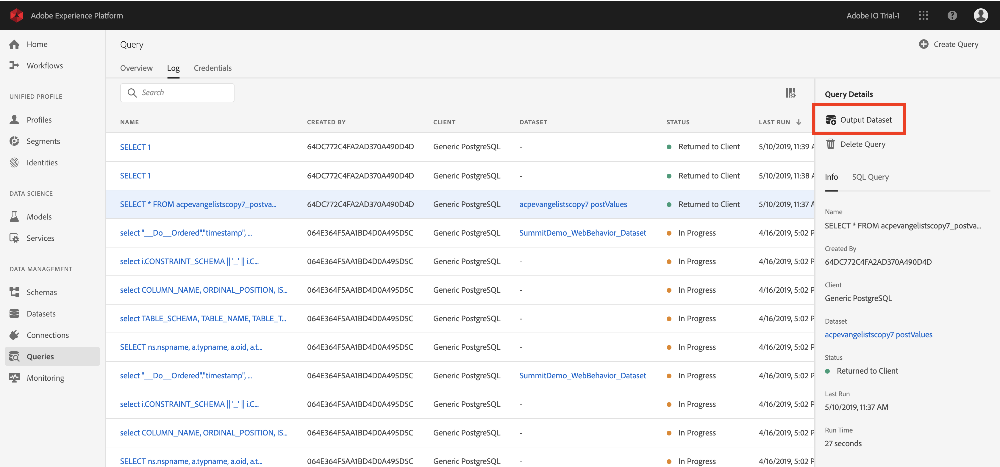
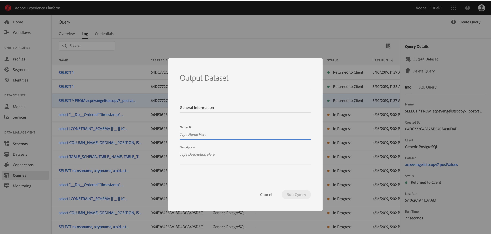

# Generate datasets from query results
The true power of Query Service is revealed when queries are used to generate datasets in the data lake to be used as input into more queries or in other services such as Data Science Workspace, Real-time Customer Profile, or Analysis Workspace. 

Query Service allows the creation of datasets from the UI. Follow these steps:

1. Write your query using a connected client and validate the output.
2. Log in to the Platform UI and go to Queries.
3. Find your query in the list and hover over the row.
4. Click **Create Dataset**. 

5. Enter a dataset name, prepended with your LDAP ID (does not have to be unique or SQL-safe; the system generates a "table name" based on the name given here).
6. Enter a dataset description and click **Run Query**.

7. Watch the query complete, and then go to the dataset list page to see the dataset you just created. 

After a dataset is created, it can be accessed like any other dataset in the data lake and used for a variety of use cases. 

> **Note:** In a live implementation, you must apply Data Governance labels after the dataset is created. 

## Generate datasets with a pre-defined Experience Data Model schema

In order to generate a dataset with a pre-defined Experience Data Model (XDM) schema, you will have to use the SQL syntax.

For more information about what syntax you have to use, please read the [SQL Syntax guide][sql-syntax-guide].

## Output datasets

Datasets created through this functionality are generated with an ad hoc schema that matches the structure of the output data as defined in the SQL statement. Some downstream services require datasets with particular Experience Data Model (XDM) schemas. Verify the data formatting requirements for downstream services prior to writing your queries. 

[sql-syntax-guide]: ../sql/syntax.md#create-table-as-select