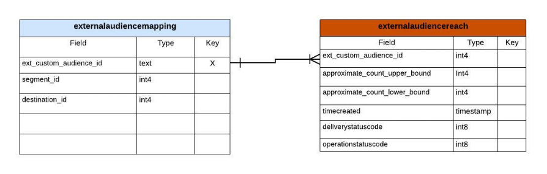
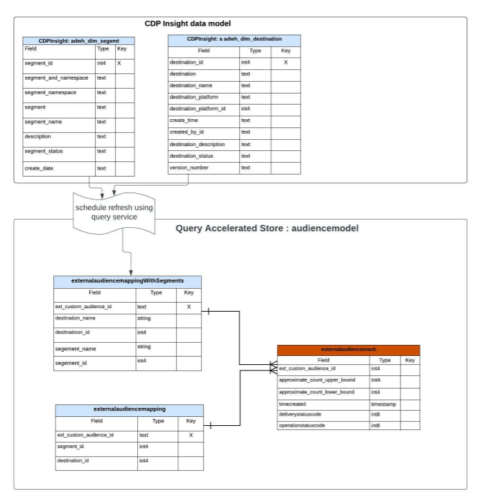
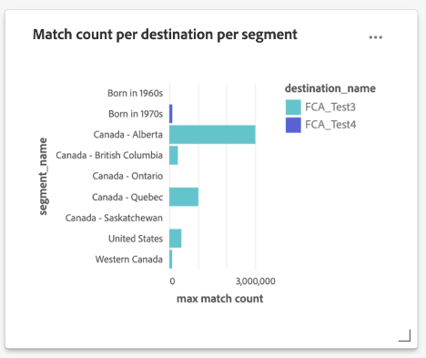

# Query accelerated store reporting insights 

The query accelerated store allows you to reduce the time and processing power required to gain critical insights from your data. Typically, data is processed at regular intervals (for example, on an hourly or daily basis) where aggregate views are created and reported upon. The analysis of these reports generated from aggregated data derives insights intended to improve business performance. The query accelerated store provides a cache service, concurrency, an interactive experience, and a stateless API. However, it assumes the data is preprocessed and optimized for aggregated querying and not for raw data querying.

The query accelerated store allows you to build a custom data model and/or extend on existing Adobe Real-Time Customer Data Platform data models. You can then engage with or embed your reporting insights into a reporting/visualization framework of your choice. Please see the Real-Time Customer Data Platform Insights Data Model documentation to learn how to [customize your SQL query templates to create Real-Time CDP reports for your marketing and key performance indicator (KPI) use cases](../../dashboards/cdp-insights-data-model.md).

The Real-Time CDP data model from Adobe Experience Platform provides insights on profiles, segments, and destinations and enables the Real-Time CDP insight dashboards. This document guides you through the process of creating your reporting insights data model and also how to extend Real-Time CDP data models as needed.

## Prerequisites

This tutorial uses user-defined dashboards to visualize data from your custom data model within the Platform UI. Please see the [user-defined dashboards documentation](../../dashboards/user-defined-dashboards.md) to learn more about this feature.

## Getting started

The Data Distiller SKU is required to build a custom data model for your reporting insights and to extend the Real-Time CDP data models that hold enriched Platform data. Please see the [packaging](../packages.md), [guardrails](../guardrails.md#query-accelerated-store), and [licensing](../data-distiller/licence-usage.md) documentation that relates to the Data Distiller SKU. If you do not have the Data Distiller SKU please contact your Adobe customer service representative for more information.

## Build a reporting insights data model

This tutorial uses an example of building an audience insight data model. If you use one or more advertiser platforms to reach your audience, you can use the advertiser's API to get an approximate match count of your audience.

At the outset, you have an initial data model from your sources (potentially from your advertiser platform API). To make an aggregated view of your raw data, create a reporting insights model as described in the image below. This allows for one dataset to get the upper and lower bounds of the audience match.



In this example, the `externalaudiencereach` table/dataset is based on an ID and tracks the lower and upper bounds for match count. The `externalaudiencemapping` dimension table/dataset maps the external ID to a destination and segment on Platform. 

## Create a model for reporting insights with Data Distiller

Next, create a reporting insight model (`audienceinsight` in this example) and use the SQL command `ACCOUNT=acp_query_batch and TYPE=QSACCEL` to ensure it is created on the accelerated store. Then use Query Service to create an `audienceinsight.audiencemodel` schema for the `audienceinsight` database.

>[!NOTE]
>
>The Data Distiller SKU is required for the `ACCOUNT=acp_query_batch` command. Without it, a regular data model is created on the data lake.

```sql
CREATE database audienceinsight WITH (TYPE=QSACCEL, ACCOUNT=acp_query_batch);
 
CREATE schema audienceinsight.audiencemodel;
```

## Create tables, relationships, and populate data

Now that you have created your `audienceinsight` reporting insight model, create the `externalaudiencereach` and `externalaudiencemapping` tables and establish relationships between them. Next, use the `ALTER TABLE` command to add a foreign key constraint between the tables and define a relationship. The following SQL example demonstrates how to do this.

```sql
CREATE TABLE IF NOT exists audienceinsight.audiencemodel.externalaudiencereach
WITH ( DISTRIBUTION = REPLICATE ) AS
  SELECT cast(null as int) approximate_count_upper_bound,
         cast(null as string) deliverystatusdescription,
         cast(null as timestamp)  timeupdated ,
         cast(null as int) operationstatuscode ,
         cast(null as string) operationstatusdescription,
         cast(null as int) approximate_count_lower_bound,
         cast(null as timestamp)timecreated ,
         cast(null as timestamp)timecontentupdated ,
         cast(null as int) deliverystatuscode ,
         cast(null as int)  ext_custom_audience_id
   WHERE false;
 
CREATE TABLE IF NOT exists audienceinsight.audiencemodel.externalaudiencemapping
WITH ( DISTRIBUTION = REPLICATE ) AS
SELECT cast(null as int) segment_id,
       cast(null as int) destination_id,
       cast(null as int) ext_custom_audience_id
 WHERE false;
 
ALTER TABLE externalaudiencereach ADD  CONSTRAINT FOREIGN KEY (ext_custom_audience_id) REFERENCES externalaudiencemapping (ext_custom_audience_id) NOT enforced;
```

After the successful execution of both `ALTER TABLE` commands, the relationship between the fact and dimension tables is formed.

Once the statements have run, use the `SHOW datagroups;` command to return a list of the available datasets on the accelerated store from the `audienceinsight.audiencemodel`. Your tabulated results should be similar to the example provided below.

>[!IMPORTANT]
>
>Only data in the accelerated store is accessible from the Query Service stateless API endpoint `POST /data/foundation/query/accelerated-queries`.

```console
    Database     |    Schema     | GroupType |      ChildType       |        ChildName        | PhysicalParent |               ChildId               
-----------------+---------------+-----------+----------------------+-------------------------+----------------+--------------------------------------
 audienceinsight | audiencemodel | QSACCEL   | Data Warehouse Table | externalaudiencemapping | true           | 9155d3b4-889d-41da-9014-5b174f6fa572
 audienceinsight | audiencemodel | QSACCEL   | Data Warehouse Table | externalaudiencereach   | true           | 1b941a6d-6214-4810-815c-81c497a0b636
```

## Query the reporting insight data model

Use Query Service to query the `audiencemodel.externalaudiencereach` dimension table. An example query can be seen below.

```sql
SELECT a.ext_custom_audience_id,
       a.approximate_count_upper_bound
FROM   audiencemodel.externalaudiencereach AS a
       LEFT OUTER JOIN audiencemodel.externalaudiencemapping AS b
                    ON ( ( a.ext_custom_audience_id ) =
                         ( b.ext_custom_audience_id ) )
GROUP  BY a.ext_custom_audience_id,
          a.approximate_count_upper_bound
LIMIT  5000 ;
```

The tabulated results include a count and an ID.

```console
ext_custom_audience_id | approximate_count_upper_bound
------------------------+-------------------------------
 23850912218170554      |                          1000
 23850808585120554      |                       1012000
 23850808585220554      |                        100000
 23850814978560554      |                          1000
 23850808585180554      |                        421000
 23850814978510554      |                       3001000
 23850814978530554      |                        300000
 23850912218160554      |                        105000
 23850808584990554      |                          1000
 23850809520110554      |                          1000
(10 rows)
```

## Extend your data model with the Real-Time CDP insights data model

You can extend your audience model with additional details to create a richer dimension table. For example, you can map the segment name and destination name to the external audience identifier. To do this, use Query Service to create or refresh a new dataset and add it to the audience model that combines segments and destinations with an external identity. The diagram below illustrates the concept of this data model extension.



## Create dimension tables to extend your reporting insights model

Use Query Service to add key descriptive attributes from the enriched Real-Time CDP dimension datasets to the `audienceinsight` data model and establish a relationship between your fact table and the new dimension table. The SQL below demonstrates how to integrate existing dimension tables into your reporting insights data model.

```sql
CREATE TABLE audienceinsight.audiencemodel.external_seg_dest_map AS
  SELECT ext_custom_audience_id,
         destination_name,
         segment_name,
         destination_status,
         a.destination_id,
         a.segment_id
  FROM   externalaudiencemapping AS a
         LEFT OUTER JOIN adwh_dim_segments AS b
                      ON ( ( a.segment_id ) = ( b.segment_id ) )
         LEFT OUTER JOIN adwh_dim_destination AS c
                      ON ( ( a.destination_id ) = ( c.destination_id ) );
 
ALTER TABLE externalaudiencereach  ADD  CONSTRAINT FOREIGN KEY (ext_custom_audience_id) REFERENCES external_seg_dest_map (ext_custom_audience_id) NOT enforced;
```

Use the `SHOW datagroups;` command to confirm the creation of the additional `external_seg_dest_map` dimension table.

```console
    Database     |     Schema     | GroupType |      ChildType       |                ChildName  | PhysicalParent |               ChildId               
-----------------+----------------+-----------+----------------------+----------------------------------------------------+----------------+--------------------------------------
 audienceinsight | audiencemodel | QSACCEL   | Data Warehouse Table | external_seg_dest_map      | true           | 4b4b86b7-2db7-48ee-a67e-4b28cb900810
 audienceinsight | audiencemodel | QSACCEL   | Data Warehouse Table | externalaudiencemapping    | true           | b0302c05-28c3-488b-a048-1c635d88dca9
 audienceinsight | audiencemodel | QSACCEL   | Data Warehouse Table | externalaudiencereach      | true           | 4485c610-7424-4ed6-8317-eed0991b9727
```

## Query your extended accelerated store reporting insights data model

Now that the `audienceinsight` data model has been augmented, it is ready to be queried. The following SQL shows the list of mapped destinations and segments.

```sql
SELECT a.ext_custom_audience_id,
       b.destination_name,
       b.segment_name,
       b.destination_status,
       b.destination_id,
       b.segment_id
FROM   audiencemodel.externalaudiencereach1 AS a
       LEFT OUTER JOIN audiencemodel.external_seg_dest_map AS b
                    ON ( ( a.ext_custom_audience_id ) = (
                         b.ext_custom_audience_id ) )
LIMIT  25; 
```

The query returns all the datasets on the query accelerated store:

```console
ext_custom_audience_id | destination_name |       segment_name        | destination_status | destination_id | segment_id 
------------------------+------------------+---------------------------+--------------------+----------------+-------------
 23850808595110554      | FCA_Test2        | United States             | enabled            |     -605911558 | -1357046572
 23850799115800554      | FCA_Test2        | Born in 1980s             | enabled            |     -605911558 | -1224554872
 23850799115790554      | FCA_Test2        | Born in 1970s             | enabled            |     -605911558 |  1899603869
 23850798177620554      | FCA_Test1        | Billionaires              | enabled            |      321720439 |  1401872665
 23850814978560554      | FCA_Test3        | Canada - Saskatchewan     | enabled            |     1182494936 | -1917996562
 23850808585180554      | FCA_Test3        | United States             | enabled            |     1182494936 | -1357046572
 23850814978530554      | FCA_Test3        | Canada - British Columbia | enabled            |     1182494936 |  -652840507
 23850808585120554      | FCA_Test3        | Canada - Quebec           | enabled            |     1182494936 |  -519557860
 23850809520110554      | FCA_Test3        | Born in 1960s             | enabled            |     1182494936 |   237824266
 23850808585220554      | FCA_Test3        | Western Canada            | enabled            |     1182494936 |  1075937528
 23850808584990554      | FCA_Test3        | Canada - Ontario          | enabled            |     1182494936 |  1593438041
 23850814978510554      | FCA_Test3        | Canada - Alberta          | enabled            |     1182494936 |  1862946783
 23850912218170554      | FCA_Test4        | Canada - Alberta          | enabled            |     1549248886 |  1862946783
 23850912218160554      | FCA_Test4        | Born in 1970s             | enabled            |     1549248886 |  1899603869
```

## Visualize your data with user-defined dashboards

Now that you have created your custom data model, you are ready to visualize your data with custom queries and user-defined dashboards. 

The following SQL provides a breakdown of the match count by audiences in a destination and a breakdown of each destination of audiences by segment.

```sql

SELECT b.destination_name,
       a.approximate_count_upper_bound,
       b.segment_name
FROM   audiencemodel.externalaudiencereach AS a
       LEFT OUTER JOIN audiencemodel.external_seg_dest_map AS b
                    ON ( ( a.ext_custom_audience_id ) = (
                         b.ext_custom_audience_id ) )
GROUP  BY b.destination_name,
          a.approximate_count_upper_bound,
          b.segment_name
ORDER BY b.destination_name
LIMIT  5000
```

The image below provides an example of the possible custom visualizations using your reporting insights data model.



Your custom data model can be found in the list of available data models in the user-defined dashboard workspace. See the [user-defined dashboard guide](../../dashboards/user-defined-dashboards.md) for guidance on how to utilize your custom data model.
