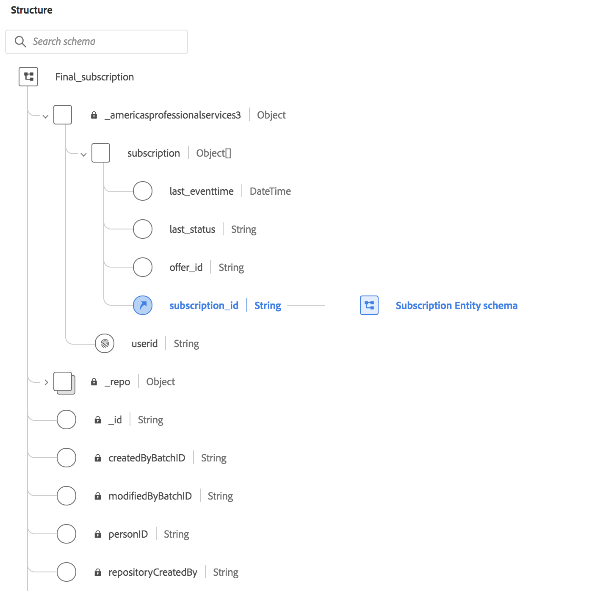

# Use INSERT INTO to update nested data fields

This document provides instruction on how to process or transform datasets with complex data types, including nested data structures.

Adobe Experience Platform Query Service provides a PostgreSQL interface to run SQL queries on all the datasets managed by Experience Platform. Platform supports the use of either primitive or complex data types in table columns, such as struct or arrays. Datasets can also contain nested structures where the column data type can be as complex as an array of nested structures, or a map of maps wherein the value of a key-value pair can be a structure with multiple levels of nesting. 

## Getting started

This tutorial requires an understanding of the Query Editor tool to write, validate, and run queries for customer experience data within the Experience Platform user interface (UI). Full information on how to run queries though the UI can be found in the [Query Editor UI guide](../ui/user-guide.md).

More information on the syntax used in this documents examples can be found in the [SQL syntax reference documentation](./syntax.md). The syntax of the `INSERT INTO` statement can be found in the [INSERT INTO section](./syntax.md#insert-into).

## Nested datasets

To demonstrate the versatility of the data types supported by Query Service for use with nested data fields, this document will cover the creation of datasets with complex types including nested structures and then update these structures using the INSERT INTO statement.

In the initial dataset `final_subscription_test2`, the struct datatype is used to contain both the the `subscription` field, and the `userid` which is unique to each user. The `subscription` field describes the product subscriptions for a user. There can be multiple subscriptions but it can only contain the information for one subscription per row. 

The dataset will be updated to contain a `CustomerService` field that contains all the subscriptions for the user. This will be held in an array of `struct(subscription)`.

The schema for the dataset to be created is seen in the image below.



## Create a dataset

Adobe Experience Platform Query service provides the Create Table as Select (CTAS) functionality to create a table based on the output of a SELECT statement. CTAS is the simplest and fastest way to create a copy of a table. The new dataset is a copy of `Final_subscription`.

<!-- Can we please have better table names for this example -->

The following example demonstrates the SQL used to create the `final_subscription_test2` dataset.

```sql
CREATE TABLE final_subscription_test2 with(schema='Final_subscription') AS (
        SELECT struct(userid, collect_set(subscription) AS subscription) AS _americasprofessionalservices3 FROM(
            SELECT user AS userid,
                   struct( last(eventtime) AS last_eventtime,
                           last(status) AS last_status,
                           offer_id, 
                           subsid AS subscription_id)
                   AS subscription
             FROM (
                   SELECT _americasprofessionalservices3.msftidentities.userid user
                        , _americasprofessionalservices3.subscription.subscription_id subsid
                        , _americasprofessionalservices3.subscription.subscription_status status
                        , _americasprofessionalservices3.subscription.offer_id offer_id
                        , TIMESTAMP eventtime
 
                   FROM
                        xbox_subscription_event
                   UNION   
                   SELECT _americasprofessionalservices3.msftidentities.userid user
                        , _americasprofessionalservices3.subscription.subscription_id subsid
                        , _americasprofessionalservices3.subscription.subscription_status status
                        , _americasprofessionalservices3.subscription.offer_id offer_id
                        , TIMESTAMP eventtime
                   FROM
                        office365_subscription_event
             ) 
             GROUP BY user,subsid,offer_id
             ORDER BY user ASC
       ) GROUP BY userid)
```

## Dataset insertion

After the dataset has been created, the INSERT INTO SELECT statement is used to copy data from one table and insert it into another table. The INSERT INTO SELECT statement requires that the data types in source and target tables match. The incremental data is then added into the target dataset using the following SQL.

```sql
INSERT INTO final_subscription_test
      SELECT struct(userid, collect_set(subscription) AS subscription) AS _americasprofessionalservices3 FROM(
            SELECT user AS userid,
                   struct( last(eventtime) AS last_eventtime,
                           last(status) AS last_status,
                           offer_id, 
                           subsid AS subscription_id)
                   AS subscription
             FROM  SELECT _americasprofessionalservices3.msftidentities.userid user
                        , _americasprofessionalservices3.subscription.subscription_id subsid
                        , _americasprofessionalservices3.subscription.subscription_status status
                        , _americasprofessionalservices3.subscription.offer_id offer_id
                        , TIMESTAMP eventtime
 
                   FROM
                        xbox_subscription_event
                   UNION   
                   SELECT _americasprofessionalservices3.msftidentities.userid user
                        , _americasprofessionalservices3.subscription.subscription_id subsid
                        , _americasprofessionalservices3.subscription.subscription_status status
                        , _americasprofessionalservices3.subscription.offer_id offer_id
                        , timestamp eventtime
                   FROM
                        office365_subscription_event
             ) 
             GROUP BY user,subsid,offer_id
             ORDER BY user ASC
       ) GROUP BY userid)
```

<!-- Is this a suitable generic example of the sql above? -->

```sql
INSERT INTO [dataset]
SELECT
      struct(
      [source field1] as [target field in schema],
      [source field2] as [target field in schema],
      [source field3] as [target field in schema],
      [source field4]as [target field in schema]
      )
      [tenant name]
FROM [dataset]
GROUP BY [source field1],[source field2],[source field3]
ORDER BY [source field1] ASC.
```

## Next Steps

By reading this document, you have a better understanding of how to use INSERT INTO to process or transform datasets that use complex data types. Please see the [queries execution guidance](../best-practices/writing-queries.md) for more information about running SQL queries on datasets within the Data Lake. 
