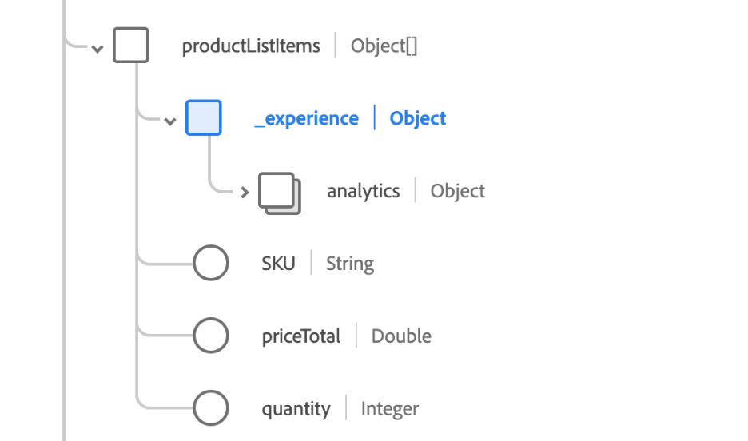

# SQL syntax in Query Service

Adobe Experience Platform Query Service provides the ability to use standard ANSI SQL for `SELECT` statements and other limited commands. This document covers the SQL syntax supported by [!DNL Query Service].

## SELECT queries {#select-queries}

The following syntax defines a `SELECT` query supported by [!DNL Query Service]:

```sql
[ WITH with_query [, ...] ]
SELECT [ ALL | DISTINCT [( expression [, ...] ) ] ]
    [ * | expression [ [ AS ] output_name ] [, ...] ]
    [ FROM from_item [, ...] ]
    [ SNAPSHOT { SINCE start_snapshot_id | AS OF end_snapshot_id | BETWEEN start_snapshot_id AND end_snapshot_id } ]
    [ WHERE condition ]
    [ GROUP BY grouping_element [, ...] ]
    [ HAVING condition [, ...] ]
    [ WINDOW window_name AS ( window_definition ) [, ...] ]
    [ { UNION | INTERSECT | EXCEPT | MINUS } [ ALL | DISTINCT ] select ]
    [ ORDER BY expression [ ASC | DESC | USING operator ] [ NULLS { FIRST | LAST } ] [, ...] ]
    [ LIMIT { count | ALL } ]
    [ OFFSET start ]
```

where `from_item` can be one of the following options:

```sql
table_name [ * ] [ [ AS ] alias [ ( column_alias [, ...] ) ] ]
```

```sql
[ LATERAL ] ( select ) [ AS ] alias [ ( column_alias [, ...] ) ]
```

```sql
with_query_name [ [ AS ] alias [ ( column_alias [, ...] ) ] ]
```

```sql
from_item [ NATURAL ] join_type from_item [ ON join_condition | USING ( join_column [, ...] ) ]
```

and `grouping_element` can be one of the following options:

```sql
( )
```

```sql
expression
```

```sql
( expression [, ...] )
```

```sql
ROLLUP ( { expression | ( expression [, ...] ) } [, ...] )
```

```sql
CUBE ( { expression | ( expression [, ...] ) } [, ...] )
```

```sql
GROUPING SETS ( grouping_element [, ...] )
```

and `with_query` is:

```sql
 with_query_name [ ( column_name [, ...] ) ] AS ( select | values )
```

The following sub-sections provide details on additional clauses that you can use in your queries, provided they follow the format outlined above.

### SNAPSHOT clause

This clause can be used to incrementally read data on a table based on snapshot IDs. A snapshot ID is a checkpoint marker represented by a Long-type number that is applied to a data lake table every time data is written to it. The `SNAPSHOT` clause attaches itself to the table relation it is used next to.

```sql
    [ SNAPSHOT { SINCE start_snapshot_id | AS OF end_snapshot_id | BETWEEN start_snapshot_id AND end_snapshot_id } ]
``` 

#### Example 

```sql
SELECT * FROM Customers SNAPSHOT SINCE 123;

SELECT * FROM Customers SNAPSHOT AS OF 345;

SELECT * FROM Customers SNAPSHOT BETWEEN 123 AND 345;

SELECT * FROM Customers SNAPSHOT BETWEEN HEAD AND 123;

SELECT * FROM Customers SNAPSHOT BETWEEN 345 AND TAIL;

SELECT * FROM (SELECT id FROM CUSTOMERS BETWEEN 123 AND 345) C 

SELECT * FROM Customers SNAPSHOT SINCE 123 INNER JOIN Inventory AS OF 789 ON Customers.id = Inventory.id;
```

Please note that a `SNAPSHOT` clause works with a table or table alias but not on top of a sub-query or view. A `SNAPSHOT` clause will work anywhere a `SELECT` query on a table can be applied.

Additionally, you can use `HEAD` and `TAIL` as special offset values for snapshot clauses. Using `HEAD` refers to an offset before the first snapshot, while `TAIL` refers to an offset after the last snapshot.

>[!NOTE]
>
>If you are querying between two snapshot IDs and the start snapshot is expired, the following two scenarios can occur, depending if the optional fallback behavior flag (`resolve_fallback_snapshot_on_failure`) is set:
>
>- If the optional fallback behavior flag is set, Query Service will choose the earliest available snapshot, set it as the start snapshot, and return the data between the earliest available snapshot and the specified end snapshot. This data is **inclusive** of the earliest available snapshot.
>
>- If the optional fallback behavior flag is not set, an error will be returned.

### WHERE clause

By default, matches produced by a `WHERE` clause on a `SELECT` query are case-sensitive. If you want matches to be case-insensitive, you can use the keyword `ILIKE` instead of `LIKE`.

```sql
    [ WHERE condition { LIKE | ILIKE | NOT LIKE | NOT ILIKE } pattern ]
```

The logic of the LIKE and ILIKE clauses are explained in the following table:

| Clause | Operator |
| ------ | -------- |
| `WHERE condition LIKE pattern` | `~~` |
| `WHERE condition NOT LIKE pattern` | `!~~` |
| `WHERE condition ILIKE pattern` | `~~*` |
| `WHERE condition NOT ILIKE pattern` | `!~~*` |

**Example**

```sql
SELECT * FROM Customers
WHERE CustomerName ILIKE 'a%';
```

This query returns customers with names beginning in "A" or "a".

### JOIN

A `SELECT` query that uses joins has the following syntax:

```sql
SELECT statement
FROM statement
[JOIN | INNER JOIN | LEFT JOIN | LEFT OUTER JOIN | RIGHT JOIN | RIGHT OUTER JOIN | FULL JOIN | FULL OUTER JOIN]
ON join condition
```

### UNION, INTERSECT, and EXCEPT

The `UNION`, `INTERSECT`, and `EXCEPT` clauses are used to combine or exclude like rows from two or more tables:

```sql
SELECT statement 1
[UNION | UNION ALL | UNION DISTINCT | INTERSECT | EXCEPT | MINUS]
SELECT statement 2
```

### CREATE TABLE AS SELECT

The following syntax defines a `CREATE TABLE AS SELECT` (CTAS) query:

```sql
CREATE TABLE table_name [ WITH (schema='target_schema_title', rowvalidation='false') ] AS (select_query)
```

| Parameters | Description |
| ----- | ----- |
| `schema` | The title of XDM schema. Use this clause only if you wish to use an existing XDM schema for the new dataset created by the CTAS query. |
| `rowvalidation` | (Optional) Specifies if the user wants row level validation of every new batches ingested for the newly created dataset. The default value is `true`. |
| `select_query` | A `SELECT` statement. The syntax of the `SELECT` query can be found in the [SELECT queries section](#select-queries). |

**Example**

```sql
CREATE TABLE Chairs AS (SELECT color, count(*) AS no_of_chairs FROM Inventory i WHERE i.type=="chair" GROUP BY i.color)

CREATE TABLE Chairs WITH (schema='target schema title') AS (SELECT color, count(*) AS no_of_chairs FROM Inventory i WHERE i.type=="chair" GROUP BY i.color)

CREATE TABLE Chairs AS (SELECT color FROM Inventory SNAPSHOT SINCE 123)
```

>[!NOTE]
>
>The `SELECT` statement must have an alias for the aggregate functions such as `COUNT`, `SUM`, `MIN`, and so on. Additionally, the `SELECT` statement can be provided with or without parentheses (). You can provide a `SNAPSHOT` clause to read incremental deltas into the target table.

## INSERT INTO

The `INSERT INTO` command is defined as follows:

```sql
INSERT INTO table_name select_query
```

| Parameters | Description |
| ----- | ----- |
| `table_name` | The name of the table that you want to insert the query into. |
| `select_query` | A `SELECT` statement. The syntax of the `SELECT` query can be found in the [SELECT queries section](#select-queries). |

**Example**

>[!NOTE]
>
>The following is a contrived example and simply for instructional purposes. 

```sql
INSERT INTO Customers SELECT SupplierName, City, Country FROM OnlineCustomers;

INSERT INTO Customers AS (SELECT * from OnlineCustomers SNAPSHOT AS OF 345)
```

>[!INFO]
> 
> The `SELECT` statement **must not** be enclosed in parentheses (). Additionally, the schema of the result of the `SELECT` statement must conform to that of the table defined in the `INSERT INTO` statement. You can provide a `SNAPSHOT` clause to read incremental deltas into the target table.

Most fields in a real XDM schema are not found at the root level and SQL does not permit the use of dot notation. To achieve a realistic result using nested fields, you must map each field in your `INSERT INTO` path.

To `INSERT INTO` nested paths, use the following syntax:

```sql
INSERT INTO [dataset]
SELECT struct([source field1] as [target field in schema],
[source field2] as [target field in schema],
[source field3] as [target field in schema]) [tenant name]
FROM [dataset]
```

**Example**

```sql
INSERT INTO Customers SELECT struct(SupplierName as Supplier, City as SupplierCity, Country as SupplierCountry) _Adobe FROM OnlineCustomers;
```

## DROP TABLE

The `DROP TABLE` command drops an existing table and deletes the directory associated with the table from the file system if it is not an external table. If the table does not exist, an exception occurs.

```sql
DROP TABLE [IF EXISTS] [db_name.]table_name
```

| Parameters | Description |
| ------ | ------ |
| `IF EXISTS` | If this is specified, no exception is thrown if the table does **not** exist. |

## CREATE DATABASE

The `CREATE DATABASE` command creates an ADLS database.

```sql
CREATE DATABASE [IF NOT EXISTS] db_name
```

## DROP DATABASE

The `DROP DATABASE` command deletes the database from an instance.

```sql
DROP DATABASE [IF EXISTS] db_name
```

| Parameters | Description|
| ------ | ------ |
| `IF EXISTS` | If this is specified, no exception is thrown if the database does **not** exist. |

## DROP SCHEMA

The `DROP SCHEMA` command drops an existing schema.

```sql
DROP SCHEMA [IF EXISTS] db_name.schema_name [ RESTRICT | CASCADE]
```

| Parameters | Description|
| ------ | ------ |
| `IF EXISTS` | If this is specified, no exception is thrown if the schema does **not** exist. |
| `RESTRICT` | Default value for the mode. If this is specified, the schema will only be dropped if it **doesn't** contain any tables. |
| `CASCADE` | If this is specified, the schema will be dropped along with all the tables present in the schema. |

## CREATE VIEW

The following syntax defines a `CREATE VIEW` query:

```sql
CREATE VIEW view_name AS select_query
```

| Parameters | Description|
| ------ | ------ |
| `view_name` | The name of view to be created. |
| `select_query` | A `SELECT` statement. The syntax of the `SELECT` query can be found in the [SELECT queries section](#select-queries). |

**Example**

```sql
CREATE VIEW V1 AS SELECT color, type FROM Inventory

CREATE OR REPLACE VIEW V1 AS SELECT model, version FROM Inventory
```

## DROP VIEW

The following syntax defines a `DROP VIEW` query:

```sql
DROP VIEW [IF EXISTS] view_name
```

| Parameters | Description|
| ------ | ------ |
| `IF EXISTS` | If this is specified, no exception is thrown if the view does **not** exist. |
| `view_name` | The name of view to be deleted. |

**Example**

```sql
DROP VIEW v1
DROP VIEW IF EXISTS v1
```

## Anonymous block

An anonymous block consists of two sections: executable and exception-handling sections. In an anonymous block, the executable section is mandatory. However, the exception-handling section is optional.

The following example shows how to create a block with one or more statements to be executed together:

```sql
BEGIN
  statementList
[EXCEPTION exceptionHandler]
END

exceptionHandler:
      WHEN OTHER
      THEN statementList

statementList:
    : (statement (';')) +
```

Below is an example using anonymous block.

```sql
BEGIN
   SET @v_snapshot_from = select parent_id  from (select history_meta('email_tracking_experience_event_dataset') ) tab where is_current;
   SET @v_snapshot_to = select snapshot_id from (select history_meta('email_tracking_experience_event_dataset') ) tab where is_current;
   SET @v_log_id = select now();
   CREATE TABLE tracking_email_id_incrementally
     AS SELECT _id AS id FROM email_tracking_experience_event_dataset SNAPSHOT BETWEEN @v_snapshot_from AND @v_snapshot_to;

EXCEPTION
  WHEN OTHER THEN
    DROP TABLE IF EXISTS tracking_email_id_incrementally;
    SELECT 'ERROR';
END;
```

### Auto to JSON {#auto-to-json}

Query Service supports an optional session-level setting to return top-level complex fields from interactive SELECT queries as JSON Strings. The `auto_to_json` setting allows for data from complex fields to be returned as JSON then parsed into JSON objects using standard libraries.

SET the feature flag `auto_to_json` to true before executing your SELECT query that contains complex fields. 

```sql
set auto_to_json=true; 
``` 

#### Before setting the `auto_to_json` flag

The following table provides an example query result before the `auto_to_json` setting is applied. The same SELECT query (as seen below) that targets a table with complex fields was used in both scenarios.

```sql
SELECT * FROM TABLE_WITH_COMPLEX_FIELDS LIMIT 2;
```

The results are as follows:

```console
                _id                |                                _experience                                 | application  |                   commerce                   | dataSource |                               device                               |                       endUserIDs                       |                                                                                                environment                                                                                                |                     identityMap                     |                              placeContext                               |   receivedTimestamp   |       timestamp       | userActivityRegion |                                         web                                          | _adcstageforpqs
-----------------------------------+----------------------------------------------------------------------------+--------------+----------------------------------------------+------------+--------------------------------------------------------------------+--------------------------------------------------------+-----------------------------------------------------------------------------------------------------------------------------------------------------------------------------------------------------------+-----------------------------------------------------+-------------------------------------------------------------------------+-----------------------+-----------------------+--------------------+--------------------------------------------------------------------------------------+-----------------
 31892EE15DE00000-401D52664FF48A52 | ("("("(1,1)","(1,1)")","(-209479095,4085488201,-2105158467,2189808829)")") | (background) | (NULL,"(USD,NULL)",NULL,NULL,NULL,NULL,NULL) | (475341)   | (32,768,1024,205202,https://ns.adobe.com/xdm/external/deviceatlas) | ("("(31892EE080007B35-E6CE00000000000,"(AAID)",t)")")  | ("(en-US,f,f,t,1.6,"Mozilla/5.0 (iPhone; U; CPU iPhone OS 4_1 like Mac OS X; ja-jp) AppleWebKit/532.9 (KHTML, like Gecko) Version/4.0.5 Mobile/8B117 Safari/6531.22.7",490,1125)",xo.net,64.3.235.13)     | [AAID -> "{(31892EE080007B35-E6CE00000000000,t)}"]  | ("("(34.01,-84.0)",lawrenceville,US,524,30043,ga)",600)                 | 2022-09-02 19:47:14.0 | 2022-09-02 19:47:14.0 | (UT1)              | ("(f,Search Results,"(1.0)")","(http://www.google.com/search?ie=UTF-8&q=,internal)") |
 31892EE15DE00000-401B92664FF48AE8 | ("("("(1,1)","(1,1)")","(-209479095,4085488201,-2105158467,2189808829)")") | (background) | (NULL,"(USD,NULL)",NULL,NULL,NULL,NULL,NULL) | (475341)   | (32,768,1024,205202,https://ns.adobe.com/xdm/external/deviceatlas) | ("("(31892EE100007BF3-215FE00000000001,"(AAID)",t)")") | ("(en-US,f,f,t,1.5,"Mozilla/5.0 (iPhone; U; CPU iPhone OS 4_1 like Mac OS X; ja-jp) AppleWebKit/532.9 (KHTML, like Gecko) Version/4.0.5 Mobile/8B117 Safari/6531.22.7",768,556)",ntt.net,219.165.108.145) | [AAID -> "{(31892EE100007BF3-215FE00000000001,t)}"] | ("("(34.989999999999995,138.42)",shizuoka,JP,392005,420-0812,22)",-240) | 2022-09-02 19:47:14.0 | 2022-09-02 19:47:14.0 | (UT1)              | ("(f,Home - JJEsquire,"(1.0)")","(NULL,typed_bookmarked)")                           |
(2 rows)  
```

#### After setting the `auto_to_json` flag

The following table demonstrates the difference in results that the `auto_to_json` setting has on the resulting dataset. The same SELECT query was used in both scenarios.

```console
                _id                |   receivedTimestamp   |       timestamp       |                                                                                                                   _experience                                                                                                                   |           application            |             commerce             |    dataSource    |                                                                  device                                                                   |                                                   endUserIDs                                                   |                                                                                                                                                                                           environment                                                                                                                                                                                            |                             identityMap                              |                                                                                            placeContext                                                                                            |      userActivityRegion      |                                                                                     web                                                                                      | _adcstageforpqs
-----------------------------------+-----------------------+-----------------------+-------------------------------------------------------------------------------------------------------------------------------------------------------------------------------------------------------------------------------------------------+----------------------------------+----------------------------------+------------------+-------------------------------------------------------------------------------------------------------------------------------------------+----------------------------------------------------------------------------------------------------------------+--------------------------------------------------------------------------------------------------------------------------------------------------------------------------------------------------------------------------------------------------------------------------------------------------------------------------------------------------------------------------------------------------+----------------------------------------------------------------------+----------------------------------------------------------------------------------------------------------------------------------------------------------------------------------------------------+------------------------------+------------------------------------------------------------------------------------------------------------------------------------------------------------------------------+-----------------
 31892EE15DE00000-401D52664FF48A52 | 2022-09-02 19:47:14.0 | 2022-09-02 19:47:14.0 | {"analytics":{"customDimensions":{"eVars":{"eVar1":"1","eVar2":"1"},"props":{"prop1":"1","prop2":"1"}},"environment":{"browserID":-209479095,"browserIDStr":"4085488201","operatingSystemID":-2105158467,"operatingSystemIDStr":"2189808829"}}} | {"userPerspective":"background"} | {"order":{"currencyCode":"USD"}} | {"_id":"475341"} | {"colorDepth":32,"screenHeight":768,"screenWidth":1024,"typeID":"205202","typeIDService":"https://ns.adobe.com/xdm/external/deviceatlas"} | {"_experience":{"aaid":{"id":"31892EE080007B35-E6CE00000000000","namespace":{"code":"AAID"},"primary":true}}}  | {"browserDetails":{"acceptLanguage":"en-US","cookiesEnabled":false,"javaEnabled":false,"javaScriptEnabled":true,"javaScriptVersion":"1.6","userAgent":"Mozilla/5.0 (iPhone; U; CPU iPhone OS 4_1 like Mac OS X; ja-jp) AppleWebKit/532.9 (KHTML, like Gecko) Version/4.0.5 Mobile/8B117 Safari/6531.22.7","viewportHeight":490,"viewportWidth":1125},"domain":"xo.net","ipV4":"64.3.235.13"}     | {"AAID":[{"id":"31892EE080007B35-E6CE00000000000","primary":true}]}  | {"geo":{"_schema":{"latitude":34.01,"longitude":-84.0},"city":"lawrenceville","countryCode":"US","dmaID":524,"postalCode":"30043","stateProvince":"ga"},"localTimezoneOffset":600}                 | {"dataCenterLocation":"UT1"} | {"webPageDetails":{"isHomePage":false,"name":"Search Results","pageViews":{"value":1.0}},"webReferrer":{"URL":"http://www.google.com/search?ie=UTF-8&q=","type":"internal"}} |
 31892EE15DE00000-401B92664FF48AE8 | 2022-09-02 19:47:14.0 | 2022-09-02 19:47:14.0 | {"analytics":{"customDimensions":{"eVars":{"eVar1":"1","eVar2":"1"},"props":{"prop1":"1","prop2":"1"}},"environment":{"browserID":-209479095,"browserIDStr":"4085488201","operatingSystemID":-2105158467,"operatingSystemIDStr":"2189808829"}}} | {"userPerspective":"background"} | {"order":{"currencyCode":"USD"}} | {"_id":"475341"} | {"colorDepth":32,"screenHeight":768,"screenWidth":1024,"typeID":"205202","typeIDService":"https://ns.adobe.com/xdm/external/deviceatlas"} | {"_experience":{"aaid":{"id":"31892EE100007BF3-215FE00000000001","namespace":{"code":"AAID"},"primary":true}}} | {"browserDetails":{"acceptLanguage":"en-US","cookiesEnabled":false,"javaEnabled":false,"javaScriptEnabled":true,"javaScriptVersion":"1.5","userAgent":"Mozilla/5.0 (iPhone; U; CPU iPhone OS 4_1 like Mac OS X; ja-jp) AppleWebKit/532.9 (KHTML, like Gecko) Version/4.0.5 Mobile/8B117 Safari/6531.22.7","viewportHeight":768,"viewportWidth":556},"domain":"ntt.net","ipV4":"219.165.108.145"} | {"AAID":[{"id":"31892EE100007BF3-215FE00000000001","primary":true}]} | {"geo":{"_schema":{"latitude":34.989999999999995,"longitude":138.42},"city":"shizuoka","countryCode":"JP","dmaID":392005,"postalCode":"420-0812","stateProvince":"22"},"localTimezoneOffset":-240} | {"dataCenterLocation":"UT1"} | {"webPageDetails":{"isHomePage":false,"name":"Home - JJEsquire","pageViews":{"value":1.0}},"webReferrer":{"type":"typed_bookmarked"}}                                        |
(2 rows)
```

## Data asset organization

It is important to logically organize your data assets within the Adobe Experience Platform data lake as they grow. Query Service extends SQL constructs that enable you to logically group data assets within a sandbox. This method of organization allows for the sharing of data assets between schemas without the need to move them physically.

The following SQL constructs using standard SQL syntax are supported for you to logically organize your data.

```SQL
CREATE DATABASE dg1;
CREATE SCHEMA dg1.schema1;
CREATE table t1 ...;
CREATE view v1 ...;
ALTER TABLE t1 ADD PRIMARY KEY (c1) NOT ENFORCED;
ALTER TABLE t2 ADD FOREIGN KEY (c1) REFERENCES t1(c1) NOT ENFORCED;
```

See the guide on [logical organization of data assets](../best-practices/organize-data-assets.md) for more a detailed explanation on Query Service best practices.

## Table exists

The `table_exists` SQL command is used to confirm whether or not a table currently exists in the system. The command returns a boolean value: `true` if the table **does** exist, and `false` if the table does **not** exist. 

By validating whether a table exists before running the statements, the `table_exists` feature simplifies the process of writing an anonymous block to cover both the `CREATE` and `INSERT INTO` use cases.

The following syntax defines the `table_exists` command:

```SQL
$$
BEGIN

#Set mytableexist to true if the table already exists.
SET @mytableexist = SELECT table_exists('target_table_name');

#Create the table if it does not already exist (this is a one time operation).
CREATE TABLE IF NOT EXISTS target_table_name AS
  SELECT *
  FROM   profile_dim_date limit 10;

#Insert data only if the table already exists. Check if @mytableexist = 'true'
 INSERT INTO target_table_name           (
                     select *
                     from   profile_dim_date
                     WHERE  @mytableexist = 'true' limit 20
              ) ;
EXCEPTION
WHEN other THEN SELECT 'ERROR';

END $$; 
```

## Inline {#inline}

The `inline` function separates the elements of an array of structs and generates the values into a table. It can only be placed in the `SELECT` list or a `LATERAL VIEW`.

The `inline` function **cannot** be placed in a select list where there are other generator functions.

By default, the columns produced are named "col1", "col2", and so on. If the expression is `NULL` then no rows are produced.

>[!TIP]
>
>Column names can be renamed using the `RENAME` command.

**Example**

```sql
> SELECT inline(array(struct(1, 'a'), struct(2, 'b'))), 'Spark SQL';
```

The example returns the following:

```text
1  a Spark SQL
2  b Spark SQL
```

This second example further demonstrates the concept and application of the `inline` function. The data model for the example is illustrated in the image below.



**Example**

```sql
select inline(productListItems) from source_dataset limit 10;
```

The values taken from the `source_dataset` are used to populate the target table.

|         SKU         |  _experience                      | quantity | priceTotal   |
|---------------------|-----------------------------------|----------|--------------|
| product-id-1        | ("("("(A,pass,B,NULL)")")")       |     5    |  10.5        |
| product-id-5        | ("("("(A, pass, B,NULL)")")")     |          |              |
| product-id-2        | ("("("(AF, C, D,NULL)")")")       |      6   |  40          |
| product-id-4        | ("("("(BM, pass, NA,NULL)")")")   |     3    |  12          |

## [!DNL Spark] SQL commands 

The sub-section below covers the Spark SQL commands supported by Query Service.

### SET

The `SET` command sets a property and either returns the value of an existing property or lists all the existing properties. If a value is provided for an existing property key, the old value is overridden.

```sql
SET property_key = property_value
```

| Parameters | Description|
| ------ | ------ |
| `property_key` | The name of the property that you want to list or alter. |
| `property_value` | The value that you want the property to be set as. |

To return the value for any setting, use `SET [property key]` without a `property_value`.

## [!DNL PostgreSQL] commands

The sub-sections below cover the [!DNL PostgreSQL] commands supported by Query Service.

### ANALYZE TABLE

The `ANALYZE TABLE` command computes statistics for a table on the accelerated store. The statistics are calculated on executed CTAS or ITAS queries for a given table on accelerated store.

**Example**

```sql
ANALYZE TABLE <original_table_name>
```

The following is a list of statistical calculations that are available after using the `ANALYZE TABLE` command:-

| Calculated values | Description |
|---|---|
| `field`  | The name of the column in a table.  |
| `data-type` | The acceptable type of data for each column. |
| `count` | The number of rows that contain a non-null value for this field. |
| `distinct-count` | The number of unique or distinct values for this field. |
| `missing` | The number of rows that have a null value for this field. |
| `max` | The maximum value from the analyzed table.  |
| `min` | The minimum value from the analyzed table. |
| `mean` | The average value of the analyzed table.  |
| `stdev` | The standard deviation of the analyzed table. |

### BEGIN

The `BEGIN` command, or alternatively the `BEGIN WORK` or `BEGIN TRANSACTION` command, initiates a transaction block. Any statements that are inputted after the begin command will be executed in a single transaction until an explicit COMMIT or ROLLBACK command is given. This command is the same as `START TRANSACTION`.

```sql
BEGIN
BEGIN WORK
BEGIN TRANSACTION
```

### CLOSE

The `CLOSE` command frees the resources associated with an open cursor. After the cursor is closed, no subsequent operations are allowed on it. A cursor should be closed when it is no longer needed.

```sql
CLOSE name
CLOSE ALL
```

If `CLOSE name` is used, `name` represents the name of an open cursor that needs to be closed. If `CLOSE ALL` is used, all open cursors will be closed.

### DEALLOCATE

The `DEALLOCATE` command allows you to deallocate a previously prepared SQL statement. If you do not explicitly deallocate a prepared statement, it is deallocated when the session ends. More information about prepared statements can be found in the [PREPARE command](#prepare) section.

```sql
DEALLOCATE name
DEALLOCATE ALL
```

If `DEALLOCATE name` is used, `name` represents the name of the prepared statement that needs to be deallocated. If `DEALLOCATE ALL` is used, all the prepared statements will be deallocated.

### DECLARE

The `DECLARE` command allows a user to create a cursor, which can be used to retrieve a small number of rows out of a larger query. After the cursor is created, rows are fetched from it using `FETCH`.

```sql
DECLARE name CURSOR FOR query
```

| Parameters | Description|
| ------ | ------ |
| `name` | The name of the cursor to be created. |
| `query` | A `SELECT` or `VALUES` command which provides the rows to be returned by the cursor. |

### EXECUTE

The `EXECUTE` command is used to execute a previously prepared statement. Since prepared statements only exist for the duration of a session, the prepared statement must have been created by a `PREPARE` statement executed earlier in the current session. More information about using prepared statements can be found in the [`PREPARE` command](#prepare) section.

If the `PREPARE` statement that created the statement specified some parameters, a compatible set of parameters must be passed to the `EXECUTE` statement. If these parameters are not passed in, an error will be raised. 

```sql
EXECUTE name [ ( parameter ) ]
```

| Parameters | Description|
| ------ | ------ |
| `name` | The name of the prepared statement to execute. |
| `parameter` | The actual value of a parameter to the prepared statement. This must be an expression yielding a value that is compatible with the data type of this parameter, as determined when the prepared statement was created.  If there are multiple parameters for the prepared statement, they are separated by commas. |

### EXPLAIN

The `EXPLAIN` command displays the execution plan for the supplied statement. The execution plan shows how the tables referenced by the statement will be scanned.  If multiple tables are referenced, it will show what join algorithms are used to bring together the required rows from each input table.

```sql
EXPLAIN statement
```

Use the `FORMAT` keyword with the `EXPLAIN` command to define the format of the response.

```sql
EXPLAIN FORMAT { TEXT | JSON } statement
```

| Parameters | Description|
| ------ | ------ |
| `FORMAT` | Use the `FORMAT` command to specify the output format. The available options are `TEXT` or `JSON`. Non-text output contains the same information as the text output format, but is easier for programs to parse. This parameter defaults to `TEXT`. |
| `statement` | Any `SELECT`, `INSERT`, `UPDATE`, `DELETE`, `VALUES`, `EXECUTE`, `DECLARE`, `CREATE TABLE AS`, or `CREATE MATERIALIZED VIEW AS` statement, whose execution plan you want to see. |

>[!IMPORTANT]
>
>Any output that a `SELECT` statement might return is discarded when run with the `EXPLAIN` keyword. Other side effects of the statement happen as usual.

**Example**

The following example shows the plan for a simple query on a table with a single `integer` column and 10000 rows:

```sql
EXPLAIN SELECT * FROM foo;
```

```console

                       QUERY PLAN
---------------------------------------------------------
 Seq Scan on foo (dataSetId = "6307eb92f90c501e072f8457", dataSetName = "foo") [0,1000000242,6973776840203d3d,6e616c58206c6153,6c6c6f430a3d4d20,74696d674c746365]
(1 row)
```

### FETCH

The `FETCH` command retrieves rows using a previously created cursor.

```sql
FETCH num_of_rows [ IN | FROM ] cursor_name
```

| Parameters | Description|
| ------ | ------ |
| `num_of_rows` | The number of rows to fetch. |
| `cursor_name` | The name of the cursor you're retrieving information from. |

### PREPARE {#prepare}

The `PREPARE` command lets you create a prepared statement. A prepared statement is a server-side object that can be used to templatize similar SQL statements.

Prepared statements can take parameters, which are values that are substituted into the statement when it is executed. Parameters are referred by position, using $1, $2, etc, when using prepared statements. 

Optionally, you can specify a list of parameter data types. If a parameter's data type isn't listed, the type can be inferred from the context.

```sql
PREPARE name [ ( data_type [, ...] ) ] AS SELECT
```

| Parameters | Description|
| ------ | ------ |
| `name` | The name for the prepared statement. |
| `data_type` | The data types of the prepared statement's parameters. If a parameter's data type isn't listed, the type can be inferred from the context. If you need to add multiple data types, you can add them in a comma separated list. |

### ROLLBACK

The `ROLLBACK` command undoes the current transaction and discards all the updates made by the transaction.

```sql
ROLLBACK
ROLLBACK WORK
```

### SELECT INTO

The `SELECT INTO` command creates a new table and fills it with data computed by a query. The data is not returned to the client, as it is with a normal `SELECT` command. The new table's columns have the names and data types associated with the output columns of the `SELECT` command.

```sql
[ WITH [ RECURSIVE ] with_query [, ...] ]
SELECT [ ALL | DISTINCT [ ON ( expression [, ...] ) ] ]
    * | expression [ [ AS ] output_name ] [, ...]
    INTO [ TEMPORARY | TEMP | UNLOGGED ] [ TABLE ] new_table
    [ FROM from_item [, ...] ]
    [ WHERE condition ]
    [ GROUP BY expression [, ...] ]
    [ HAVING condition [, ...] ]
    [ WINDOW window_name AS ( window_definition ) [, ...] ]
    [ { UNION | INTERSECT | EXCEPT } [ ALL | DISTINCT ] select ]
    [ ORDER BY expression [ ASC | DESC | USING operator ] [ NULLS { FIRST | LAST } ] [, ...] ]
    [ LIMIT { count | ALL } ]
    [ OFFSET start [ ROW | ROWS ] ]
    [ FETCH { FIRST | NEXT } [ count ] { ROW | ROWS } ONLY ]
    [ FOR { UPDATE | SHARE } [ OF table_name [, ...] ] [ NOWAIT ] [...] ]
```

More information about the standard SELECT query parameters can be found in the [SELECT query section](#select-queries). This section will only list parameters that are exclusive to the `SELECT INTO` command.

| Parameters | Description|
| ------ | ------ |
| `TEMPORARY` or `TEMP` | An optional parameter. If specified, the table that is created will be a temporary table. |
| `UNLOGGED` | An optional parameter. If specified, the table that is created as will be an unlogged table. More information about unlogged tables can be found in the [[!DNL PostgreSQL] documentation](https://www.postgresql.org/docs/current/sql-createtable.html). |
| `new_table` | The name of the table to be created. |

**Example**

The following query creates a new table `films_recent` consisting of only recent entries from the table `films`:

```sql
SELECT * INTO films_recent FROM films WHERE date_prod >= '2002-01-01';
```

### SHOW

The `SHOW` command displays the current setting of runtime parameters. These variables can be set using the `SET` statement, by editing the `postgresql.conf` configuration file, through the `PGOPTIONS` environmental variable (when using libpq or a libpq-based application), or through command-line flags when starting the Postgres server.

```sql
SHOW name
SHOW ALL
```

| Parameters | Description|
| ------ | ------ |
| `name` | The name of the runtime parameter you want information about. Possible values for the runtime parameter include the following values:<br>`SERVER_VERSION`: This parameter shows the server's version number.<br>`SERVER_ENCODING`: This parameter shows the server-side character set encoding.<br>`LC_COLLATE`: This parameter shows the database's locale setting for collation (text ordering).<br>`LC_CTYPE`: This parameter shows the database's locale setting for character classification.<br>`IS_SUPERUSER`: This parameter shows if the current role has superuser privileges. |
| `ALL` | Show the values of all configuration parameters with descriptions. |

**Example**

The following query shows the current setting of the parameter `DateStyle`.

```sql
SHOW DateStyle;
```

```console
 DateStyle
-----------
 ISO, MDY
(1 row)
```

### COPY

The `COPY` command duplicates the output of any `SELECT` query to a specified location. The user must have access to this location for this command to succeed.

```sql
COPY query
    TO '%scratch_space%/folder_location'
    [  WITH FORMAT 'format_name']
```

| Parameters | Description|
| ------ | ------ |
| `query` | The query that you want to copy. |
| `format_name` | The format that you want to copy the query in. The `format_name` can be one of `parquet`, `csv`, or `json`. By default, the value is `parquet`. |

>[!NOTE]
>
>The complete output path will be `adl://<ADLS_URI>/users/<USER_ID>/acp_foundation_queryService/folder_location/<QUERY_ID>`

### ALTER TABLE {#alter-table}

The `ALTER TABLE` command lets you add or drop primary or foreign key constraints as well as add columns to the table.


#### ADD or DROP CONSTRAINT

The following SQL queries show examples of adding or dropping constraints to a table. 

```sql

ALTER TABLE table_name ADD CONSTRAINT PRIMARY KEY ( column_name ) NAMESPACE namespace

ALTER TABLE table_name ADD CONSTRAINT FOREIGN KEY ( column_name ) REFERENCES referenced_table_name ( primary_column_name )

ALTER TABLE table_name ADD CONSTRAINT PRIMARY IDENTITY ( column_name ) NAMESPACE namespace

ALTER TABLE table_name ADD CONSTRAINT IDENTITY ( column_name ) NAMESPACE namespace

ALTER TABLE table_name DROP CONSTRAINT PRIMARY KEY ( column_name )

ALTER TABLE table_name DROP CONSTRAINT FOREIGN KEY ( column_name )

ALTER TABLE table_name DROP CONSTRAINT PRIMARY IDENTITY ( column_name )

ALTER TABLE table_name DROP CONSTRAINT IDENTITY ( column_name )
```

| Parameters | Description|
| ------ | ------ |
| `table_name` | The name of the table which you are editing. |
| `column_name` | The name of the column that you are adding a constraint to. |
| `referenced_table_name` | The name of the table that is referenced by the foreign key. |
| `primary_column_name` | The name of the column that is referenced by the foreign key. |


>[!NOTE]
>
>The table schema should be unique and not shared among multiple tables. Additionally, the namespace is mandatory for primary key, primary identity, and identity constraints.

#### Add or drop primary and secondary identities

The `ALTER TABLE` command allows you to add or delete constraints for both primary and secondary identity table columns directly through SQL.

The following examples adds a primary identity and a secondary identity by adding constraints.

```sql
ALTER TABLE t1 ADD CONSTRAINT PRIMARY IDENTITY (id) NAMESPACE 'IDFA';
ALTER TABLE t1 ADD CONSTRAINT IDENTITY(id) NAMESPACE 'IDFA';
```

Identities can also be removed by dropping constraints, as seen in the example below.

```sql
ALTER TABLE t1 DROP CONSTRAINT PRIMARY IDENTITY (c1) ;
ALTER TABLE t1 DROP CONSTRAINT IDENTITY (c1) ;
```

See the document on [setting identities in an ad hoc datasets](../data-governance/ad-hoc-schema-identities.md) for more detailed information.

#### ADD COLUMN

The following SQL queries show examples of adding columns to a table.

```sql
ALTER TABLE table_name ADD COLUMN column_name data_type

ALTER TABLE table_name ADD COLUMN column_name_1 data_type1, column_name_2 data_type2 
```

##### Supported data types

The following table lists the accepted data types for adding columns to a table with [!DNL Postgres SQL], XDM, and the [!DNL Accelerated Database Recovery] (ADR) in Azure SQL.

|---| PSQL client | XDM | ADR | Description |
|---|---|---|---|---|
|1| `bigint` | `int8` | `bigint` | A numerical data type used to store large integers ranging from –9,223,372,036,854,775,807 to 9,223,372,036,854,775,807 in 8 bytes. |
|2| `integer` | `int4` | `integer` | A numerical data type used to store integers ranging from -2,147,483,648 to 2,147,483,647 in 4 bytes. |
|3| `smallint` | `int2` | `smallint` | A numerical data type used to store integers ranging from -32,768 to 215-1 32,767 in 2 bytes.  |
|4| `tinyint` | `int1` | `tinyint` | A numerical data type used to store integers ranging from 0 to 255 in 1 byte. |
|5| `varchar(len)` | `string` | `varchar(len)` | A character data type that is of variable-size. `varchar` is best used when the sizes of the column data entries vary considerably. |
|6| `double` | `float8` | `double precision` | `FLOAT8` and `FLOAT` are valid synonyms for `DOUBLE PRECISION`. `double precision` is a floating-point data type. Floating-point values are stored in 8 bytes. |
|7| `double precision` | `float8` | `double precision` | `FLOAT8` is a valid synonym for `double precision`.`double precision` is a floating-point data type. Floating-point values are stored in 8 bytes. |
|8| `date` | `date` | `date` | The `date` data type are 4-byte stored calendar date values without any timestamp information. The range of valid dates is from 01-01-0001 to 12-31-9999. |
|9| `datetime` | `datetime` | `datetime` | A data type used to store an instant in time expressed as a calendar date and time of day. `datetime` includes the qulaifiers of: year, month, day, hour, second, and fraction. A `datetime` declaration can include any subset of these time units that are joined in that sequence, or even comprise only a single time unit. |
|10| `char(len)` | `string` | `char(len)` | The `char(len)` keyword is used to indicate that the item is fixed-length character. |

#### ADD SCHEMA

The following SQL query shows an example of adding a table to a database / schema.

```sql
ALTER TABLE table_name ADD SCHEMA database_name.schema_name
```

>[!NOTE]
>
> ADLS tables and views cannot be added to DWH databases / schemas.


#### REMOVE SCHEMA

The following SQL query shows an example of removing a table from a database / schema.

```sql
ALTER TABLE table_name REMOVE SCHEMA database_name.schema_name
```

>[!NOTE]
>
> DWH tables and views cannot be removed from physically linked DWH databases / schemas.


**Parameters**

| Parameters | Description|
| ------ | ------ |
| `table_name` | The name of the table which you are editing. |
| `column_name` | The name of the column you want to add. |
| `data_type` | The data type of the column you want to add. Supported data types include the following: bigint, char, string, date, datetime, double, double precision, integer, smallint, tinyint, varchar. |

### SHOW PRIMARY KEYS

The `SHOW PRIMARY KEYS` command lists all the primary key constraints for the given database.

```sql
SHOW PRIMARY KEYS
```

```console
    tableName | columnName    | datatype | namespace
------------------+----------------------+----------+-----------
 table_name_1 | column_name1  | text     | "ECID"
 table_name_2 | column_name2  | text     | "AAID"
```

### SHOW FOREIGN KEYS

The `SHOW FOREIGN KEYS` command lists all the foreign key constraints for the given database.

```sql
SHOW FOREIGN KEYS
```

```console
    tableName   |     columnName      | datatype | referencedTableName | referencedColumnName | namespace 
------------------+---------------------+----------+---------------------+----------------------+-----------
 table_name_1   | column_name1        | text     | table_name_3        | column_name3         |  "ECID"
 table_name_2   | column_name2        | text     | table_name_4        | column_name4         |  "AAID"
```


### SHOW DATAGROUPS

The `SHOW DATAGROUPS` command returns a table of all associated databases. For each database the table includes schema, group type, child type, child name and child ID.

```sql
SHOW DATAGROUPS
```

```console
   Database   |      Schema       | GroupType |      ChildType       |                     ChildName                       |               ChildId
  -------------+-------------------+-----------+----------------------+----------------------------------------------------+--------------------------------------
   adls_db     | adls_scheema      | ADLS      | Data Lake Table      | adls_table1                                        | 6149ff6e45cfa318a76ba6d3
   adls_db     | adls_scheema      | ADLS      | Data Warehouse Table | _table_demo1                                       | 22df56cf-0790-4034-bd54-d26d55ca6b21
   adls_db     | adls_scheema      | ADLS      | View                 | adls_view1                                         | c2e7ddac-d41c-40c5-a7dd-acd41c80c5e9
   adls_db     | adls_scheema      | ADLS      | View                 | adls_view4                                         | b280c564-df7e-405f-80c5-64df7ea05fc3
```


### SHOW DATAGROUPS FOR table

The `SHOW DATAGROUPS FOR` 'table_name' command returns a table of all associated databases that contain the parameter as its child. For each database the table includes schema, group type, child type, child name and child ID.

```sql
SHOW DATAGROUPS FOR 'table_name'
```

**Parameters**

- `table_name`: The name of the table that you want to find associated databases for.

```console
   Database   |      Schema       | GroupType |      ChildType       |                     ChildName                      |               ChildId
  -------------+-------------------+-----------+----------------------+----------------------------------------------------+--------------------------------------
   dwh_db_demo | schema2           | QSACCEL   | Data Warehouse Table | _table_demo2                                       | d270f704-0a65-4f0f-b3e6-cb535eb0c8ce
   dwh_db_demo | schema1           | QSACCEL   | Data Warehouse Table | _table_demo2                                       | d270f704-0a65-4f0f-b3e6-cb535eb0c8ce
   qsaccel     | profile_aggs      | QSACCEL   | Data Warehouse Table | _table_demo2                                       | d270f704-0a65-4f0f-b3e6-cb535eb0c8ce
```
