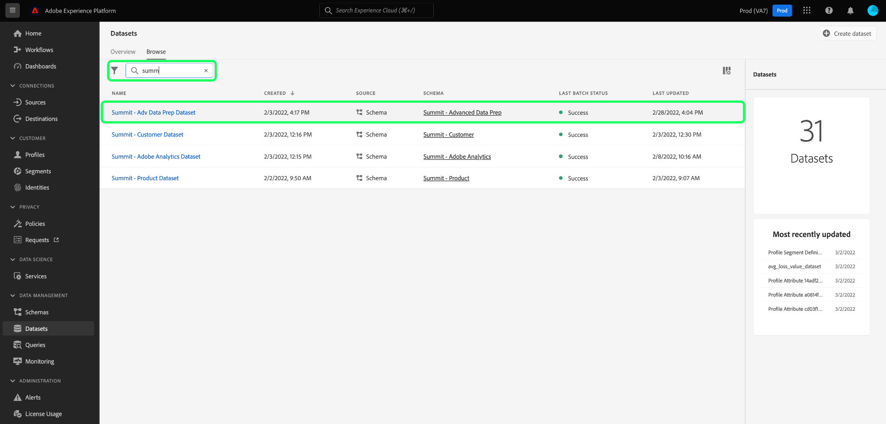
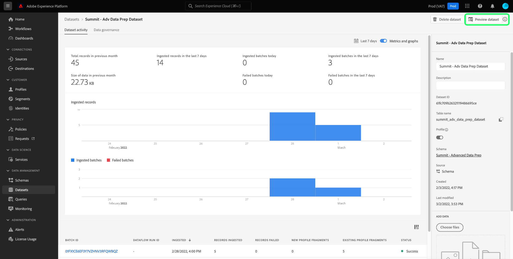
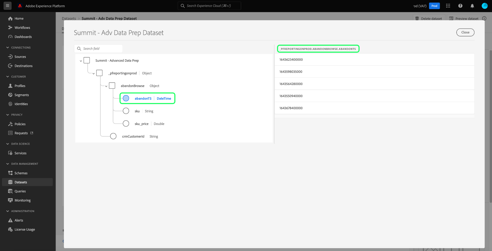
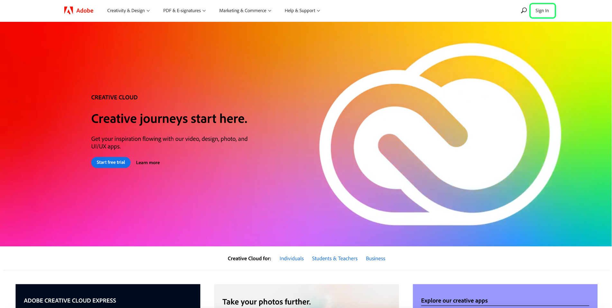
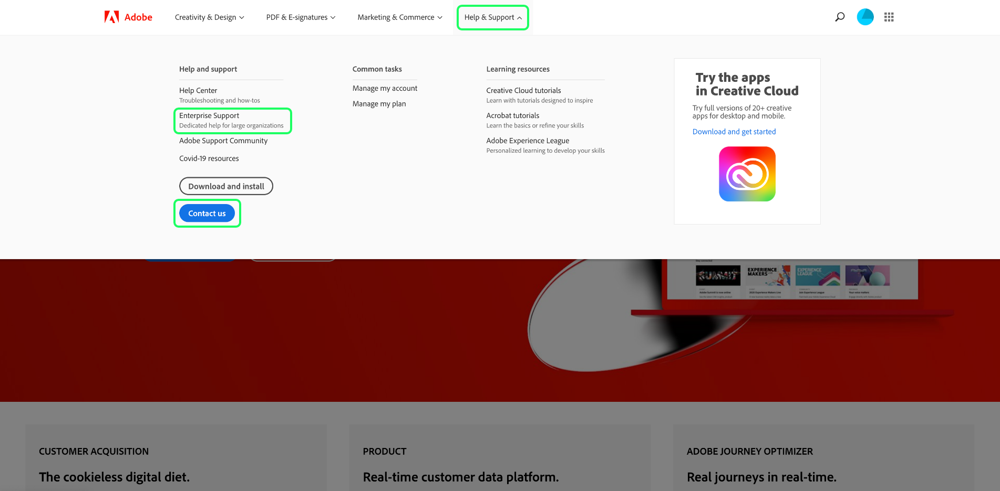

# Frequently asked questions

This document provides answers to frequently asked questions about Query Service and provides a list of commonly seen error codes when using Query Service. For questions and troubleshooting related to other services in Adobe Experience Platform, please refer to the [Experience Platform troubleshooting guide](../landing/troubleshooting.md).

The following list of answers to frequently asked questions is divided into the following categories:

- [General](#general)
- [Exporting data](#exporting-data)
- [Third-party tools](#third-party-tools)
- [PostgreSQL API errors](#postgresql-api-errors)
- [REST API errors](#rest-api-errors)

## General Query Service questions {#general}

This section includes information on performance, limits, and processes.

### Can I turn off the auto-complete feature in the Query Service Editor?

+++Answer
No. Turning off the auto-complete feature is not currently supported by the editor.
+++

### Why does the Query Editor sometimes become slow when I type in a query?

+++Answer
One potential cause is the auto-complete feature. The feature processes certain metadata commands that can occasionally slow the editor during query editing.
+++

### Can I use [!DNL Postman] for the Query Service API?

+++Answer
Yes, you can visualize and interact with all Adobe API services using [!DNL Postman] (a free, third-party application). Watch the [[!DNL Postman] setup guide](https://video.tv.adobe.com/v/28832) for step-by-step instructions on how to set up a project in Adobe Developer Console and acquire all the necessary credentials for use with [!DNL Postman]. See the official documentation for [guidance on starting, running, and sharing [!DNL Postman] collections](https://learning.postman.com/docs/running-collections/intro-to-collection-runs/).
+++

### Is there a limit to the maximum number of rows returned from a query through the UI?

+++Answer
Yes, Query Service internally applies a limit of 50,000 rows unless an explicit limit is specified externally. See the guidance on [interactive query execution](./best-practices/writing-queries.md#interactive-query-execution) for more details.
+++

### Can I use queries to update rows?

+++Answer
In batch queries, updating a row inside the dataset is not supported.
+++

### Is there a data size limit for the resulting output from a query?

+++Answer
No. There is no limit on data size, but there is a query timeout limit of 10 minutes from an interactive session. If the query is executed as a batch CTAS then a 10-minute timeout is not applicable. See the guidance on [interactive query execution](./best-practices/writing-queries.md#interactive-query-execution) for more details.
+++

### How do I bypass the limit on the output number of rows from a SELECT query?

+++Answer
To bypass the output row limit, apply "LIMIT 0" in the query. For example:

```sql
SELECT * FROM customers LIMIT 0;
```

+++

### How do I stop my queries from timing out in 10 minutes?

+++Answer
One or more of the following solutions are recommended in case of queries timing out.

- [Convert the query to a CTAS query](./sql/syntax.md#create-table-as-select) and schedule the run. Scheduling a run can be done either [through the UI](./ui/user-guide.md#scheduled-queries) or the [API](./api/scheduled-queries.md#create).
- Execute the query on a smaller data chunk by applying additional [filter conditions](https://spark.apache.org/docs/latest/api/sql/index.html#filter).
- [Execute the EXPLAIN command](./sql/syntax.md#explain) to gather more details.
- Review the statistics of the data within the dataset.
- Convert the query into a simplified form and re-run using [prepared statements](./sql/prepared-statements.md).
+++

### Is there any issue or impact on Query Service performance if multiple queries run simultaneously?

+++Answer
No. Query Service has an autoscaling capability that ensures concurrent queries do not have any noticeable impact on the performance of the service.
+++

### Can I use reserved keywords as a column name?

+++Answer
There are certain reserved keywords that cannot be used as column name such as, `ORDER`, `GROUP BY`, `WHERE`, `DISTINCT`. If you want to use these keywords, then you must escape these columns.
+++

### How do I find a column name from a hierarchical dataset?

+++Answer
The following steps describe how to display a tabular view of a dataset through the UI, including all nested fields and columns in a flattened form.

- After logging into Experience Platform, select **[!UICONTROL Datasets]** in the left navigation of the UI to navigate to [!UICONTROL Datasets] dashboard.
- The datasets [!UICONTROL Browse] tab opens. You can use the search bar to refine the available options. Select a dataset from the list displayed.



- The [!UICONTROL Datasets activity] screen appears. Select **[!UICONTROL Preview dataset]** to open a dialog of the XDM schema and tabular view of flattened data from the selected dataset. More details can be found in the [preview a dataset documentation](../catalog/datasets/user-guide.md#preview-a-dataset)



- Select any field from the schema to display its contents in a flattened column. The name of the column is displayed above its contents on the right side of the page. You should copy this name to use for querying this dataset.



See the documentation for full guidance on [how to work with nested data structures](./essential-concepts/nested-data-structures.md) using the Query Editor or a third-party client.
+++

### How do I speed up a query on a dataset that contains arrays?

+++Answer
To improve the performance of queries on datasets containing arrays, you should [explode the array](https://spark.apache.org/docs/latest/api/sql/index.html#explode) as a [CTAS query](./sql/syntax.md#create-table-as-select) on runtime, and then explore it for further for opportunities to improve its processing time.
+++

### Why is my CTAS query still processing after many hours for only a small number of rows?

+++Answer
If the query has taken a long time on a very small dataset, please contact customer support.

There can be any number of reasons for a query to be stuck while processing. To determine the exact cause requires an in-depth analysis on a case-by-case basis. [Contact Adobe customer support](#customer-support) to being this process.
+++

### How do I contact Adobe customer support? {#customer-support}

+++Answer
[A complete list of Adobe customer support telephone numbers](https://helpx.adobe.com/ca/contact/phone.html) is available on the Adobe help page. Alternatively, help can be found online by completing the following steps:

- Navigate to [https://www.adobe.com/](https://www.adobe.com/) in your web browser.
- On the right side of the top navigation bar, select **[!UICONTROL Sign In]**.



- Use your Adobe ID and password that is registered with your Adobe license.
- Select **[!UICONTROL Help & Support]** from the top navigation bar. 



A dropdown banner appears containing a [!UICONTROL Help and support] section. Select **[!UICONTROL Contact us]** to open the Adobe Customer Care Virtual Assistant, or select **[!UICONTROL Enterprise support]** for dedicated help for large organizations.
+++

### How do I implement a sequential series of jobs, without executing subsequent jobs if the previous job does not complete successfully? 

+++Answer
The anonymous block feature allows you to chain one or more SQL statements that are executed in sequence. They also allow for the option of exception-handling.

See the [anonymous block documentation](./essential-concepts/anonymous-block.md) for more details.
+++

### How do I implement custom attribution in Query Service?

+++Answer
There are two ways to implement custom attribution:

1. Use a combination of existing [Adobe-defined functions](./sql/adobe-defined-functions.md) to identify if the use-case needs are met. 
1. If the previous suggestion does not satisfy your use case, you should use a combination of [window functions](./sql/adobe-defined-functions.md#window-functions). Window functions look at all the events in a sequence. They also allow you to review the historic data and can be used in any combination.
+++

### Can I templatize my queries so that I can easily re-use them?

+++Answer
Yes, you can templatize queries through the use of prepared statements. Prepared statements can optimize performance and avoid repetitiously re-parsing a query. See the [prepared statements documentation](./sql/prepared-statements.md) for more details.
+++

### How do I retrieve error logs for a query? {#error-logs}

+++Answer
To retrieve error logs for a specific query, you must first use the Query Service API to fetch the query log details. The HTTP response contains the query IDs that are required to investigate a query error.  

Use the GET command to retrieve multiple queries. Information on how to make a call to the API can be found in the [sample API calls documentation](./api/queries.md#sample-api-calls).

From the response, identify the query you want to investigate and make another GET request using its `id` value. Full instructions can be found in the [retrieve a query by ID documentation](./api/queries.md#retrieve-a-query-by-id). 

A successful response returns HTTP status 200 and contains the `errors` array. The response has been shortened for brevity.

```json
{
    "isInsertInto": false,
    "request": {
                "dbName": "prod:all",
                "sql": "SELECT *\nFROM\n  accounts\nLIMIT 10\n"
            },
    "clientId": "8c2455819a624534bb665c43c3759877",
    "state": "SUCCESS",
    "rowCount": 0,
    "errors": [{
      'code': '58000', 
      'message': 'Batch query execution gets : [failed reason ErrorCode: 58000 Batch query execution gets : [Analysis error encountered. Reason: [sessionId: f055dc73-1fbd-4c9c-8645-efa609da0a7b Function [varchar] not defined.]]]', 
      'errorType': 'USER_ERROR'
      }],
    "isCTAS": false,
    "version": 1,
    "id": "343388b0-e0dd-4227-a75b-7fc945ef408a",
}
```

The [Query Service API reference documentation](https://www.adobe.io/experience-platform-apis/references/query-service/) provides more information on all available endpoints.
+++

### What does "Error validating schema" mean?

+++Answer
The "Error validating schema" message means that the system is unable to locate a field within the schema. You should read the best practice document for [organizing data assets in Query Service](./best-practices/organize-data-assets.md) followed by the [Create Table As Select documentation](./sql/syntax.md#create-table-as-select).  

The following example demonstrates the use of a CTAS syntax and a struct datatype:

```sql
CREATE TABLE table_name WITH (SCHEMA='schema_name')

AS SELECT '1' as _id,

 STRUCT

  ('2021-02-17T15:39:29.0Z' AS taskActualCompletionDate,

    '2020-09-09T21:21:16.0Z' AS taskActualStartDate,

    'Consulting' AS taskdescription,

    '5f6527c10011e09b89666c52d9a8c564' AS taskguide,

    'Stakeholder Consulting Engagement' AS taskname, 

    '2020-09-09T15:00:00.0Z' AS taskPlannedStartDate,

    '2021-02-15T11:00:00.0Z' AS taskPlannedCompletionDate

  ) AS _workfront ;
```

+++

### How do I quickly process the new data coming into the system every day?

+++Answer
The [`SNAPSHOT`](./sql/syntax.md#snapshot-clause) clause can be used to incrementally read data on a table based on a snapshot ID. This is ideal for use with the [incremental load](./essential-concepts/incremental-load.md) design pattern that only processes information in the dataset that has been created or modified since the last load execution. As a result, it increases processing efficiency and can be used with both streaming and batch data processing.
+++

### Why is there a difference between the numbers shown in Profile UI and the numbers calculated from the profile export dataset? 

+++Answer
The numbers displayed in the profile dashboard are accurate as of the last snapshot. The numbers generated in the profile export table are dependent entirely on the export query. As a result, querying the number of profiles that qualify for a particular segment is a common cause for this discrepancy.

>[!NOTE]
>
>Querying includes historical data, whereas UI only displays the current profile data.

+++

### Why did my query return an empty subset, and what should I do?

+++Answer
The most likely cause is that your query is too narrow in scope. You should systematically remove a section of the `WHERE` clause until you begin seeing some data.

You can also confirm that your dataset contains data by using a small query such as: 

```sql
SELECT count(1) FROM myTableName
```

+++

### Can I sample my data?

+++Answer
This feature is currently a work-in-progress. Details will be made available in [release notes](../release-notes/latest/latest.md) and through Platform UI dialogs once the feature is ready for release.
+++

### What helper functions are supported by Query Service?

+++Answer
Query Service provides several built-in SQL helper functions to extend SQL functionality. See the document for a complete list of the [SQL functions supported by Query Service](./sql/spark-sql-functions.md).
+++

### Are all native [!DNL Spark SQL] functions supported or are users restricted to only the wrapper [!DNL Spark SQL] functions provided by Adobe?

+++Answer
As yet, not all open-source [!DNL Spark SQL] functions have been tested on data lake data. Once tested and confirmed, they will be added to the supported list. Please refer the [list of supported [!DNL Spark SQL] functions](./sql/spark-sql-functions.md) to check for a specific function. 
+++

### Can users define their own user defined functions (UDF) that can be used across other queries?

+++Answer
Due to data security considerations, the custom definition of UDFs is not allowed.
+++

### What should I do if my scheduled query fails?

+++Answer
First, check the logs to find out the details of the error. The FAQ section on [finding errors within logs](#error-logs) provides more information on how to do this.

You should also check the documentation for guidance on how to perform [scheduled queries in the UI](./ui/user-guide.md#scheduled-queries) and through [the API](./api/scheduled-queries.md). 

Be aware, when using the [!DNL Query Editor] you can only add a schedule to a query that has already been created, saved, and run. This does not apply to the [!DNL Query Service] API.
+++

### What does the "Session Limit Reached" error mean?

+++Answer
"Session Limit Reached" means that the maximum number of Query Service sessions allowed for your organization has been reached. Please connect with your organization's Adobe Experience Platform administrator.
+++

### How does the query log handle queries relating to a deleted dataset? 

+++Answer
Query Service never deletes query history. This means that any queries referencing a deleted dataset would return "No valid dataset" as a result.
+++

### How can I get only the metadata for a query?

+++Answer
You can run a query that returns zero rows to get only the metadata in response. This example query returns only the metadata for the specified table.

```sql
SELECT * FROM <table> WHERE 1=0
```

+++

### How can I quickly iterate on a CTAS (Create Table As Select) query without materializing it?

+++Answer
You can create temporary tables to quickly iterate and experiment on a query before materializing it for use. You can also use temporary tables to validate if a query is functional.

For example, you can create a temporary table:

```sql
CREATE temp TABLE temp_dataset AS
SELECT *
FROM actual_dataset
WHERE 1 = 0;
```

Then you can use the temporary table as follows: 

```sql
INSERT INTO temp_dataset
SELECT a._company AS _company,
a._id AS _id,
a.timestamp AS timestamp
FROM actual_dataset a
WHERE timestamp >= TO_TIMESTAMP('2021-01-21 12:00:00')
AND timestamp < TO_TIMESTAMP('2021-01-21 13:00:00')
LIMIT 100;
```

+++

### How do I change the time zone to and from a UTC Timestamp?

+++Answer
Adobe Experience Platform persists data in UTC (Coordinated Universal Time) timestamp format. An example of the UTC format is `2021-12-22T19:52:05Z`

Query Service supports built-in SQL functions to convert a given timestamp to and from UTC format. Both the `to_utc_timestamp()` and the `from_utc_timestamp()` methods take two parameters: timestamp and timezone. 

| Parameter | Description   |
|-----------|---------------|
| Timestamp | The timestamp can be written in either UTC format or simple `{year-month-day}` format. If no time is provided, the default value is midnight on the morning of the given day. |
| Timezone  | The timezone is written in a `{continent/city})` format. It must be one of the recognized timezone codes as found in the [public-domain TZ database](https://data.iana.org/time-zones/tz-link.html#tzdb). |

#### Convert to the UTC timestamp

The `to_utc_timestamp()` method interprets the given parameters and converts it **to the timestamp of your local timezone** in UTC format. For example, the time zone in Seoul, South Korea is UTC/GMT +9 hours. By providing a date-only timestamp, the method uses a default value of midnight in the morning. The timestamp and timezone are converted into the UTC format from the time of that region to a UTC timestamp of your local region.

```SQL
SELECT to_utc_timestamp('2021-08-31', 'Asia/Seoul');
```

The query returns a timestamp in the user's local time. In this case, 3PM the previous day as Seoul is nine hours ahead.

```
2021-08-30 15:00:00
```

As another example, if the given timestamp was `2021-07-14 12:40:00.0` for the `Asia/Seoul` timezone, the returned UTC timestamp would be `2021-07-14 03:40:00.0`

The console output provided in the Query Service UI is a more human-readable format:

```
8/30/2021, 3:00 PM
```

#### Convert from the UTC timestamp

The `from_utc_timestamp()` method interprets the given parameters **from the timestamp of your local timezone** and provides the equivalent timestamp of the desired region in UTC format. In the example below, the hour is 2:40PM in the user's local timezone. The Seoul timezone passed as a variable is nine hours ahead of the local timezone.

```SQL
SELECT from_utc_timestamp('2021-08-31 14:40:00.0', 'Asia/Seoul');
```

The query returns a timestamp in UTC format for the timezone passed as a parameter. The result is nine hours ahead of the timezone that ran the query.

```
8/31/2021, 11:40 PM
```

### How should I filter my time-series data?

+++Answer
When querying with time-series data, you should use the timestamp filter whenever possible for more accurate analysis.

>[!NOTE]
>
> The date string **must** be in the format `yyyy-mm-ddTHH24:MM:SS`. 

An example of using the timestamp filter can be seen below:

```sql
SELECT a._company  AS _company,
       a._id       AS _id,
       a.timestamp AS timestamp
FROM   dataset a
WHERE  timestamp >= To_timestamp('2021-01-21 12:00:00')
       AND timestamp < To_timestamp('2021-01-21 13:00:00')
```

+++

### How do I correctly use the `CAST` operator to convert my timestamps in SQL queries?

+++Answer
When using the `CAST` operator to convert a timestamp, you need to include both the date **and** time.

For example, missing the time component, as shown below, will result in an error:

```sql
SELECT * FROM ABC
WHERE timestamp = CAST('07-29-2021' AS timestamp)
```

The correct usage of the `CAST` operator is shown below:

```sql
SELECT * FROM ABC
WHERE timestamp = CAST('07-29-2021 00:00:00' AS timestamp)
```

+++

### Should I use wildcards, such as * to get all the rows from my datasets?

+++Answer
You cannot use wildcards to get all the data from your rows, as Query Service should be treated as a **columnar-store** rather than a traditional row-based store system.
+++

### Should I use `NOT IN` in my SQL query?

+++Answer
The `NOT IN` operator is often used to retrieve rows that are not found in another table or SQL statement. This operator can slow down performance and may return unexpected results if the columns that are being compared accept `NOT NULL`, or you have large numbers of records.

Instead of using `NOT IN`, you can use either `NOT EXISTS` or `LEFT OUTER JOIN`.

For example, if you have the following tables created:

```sql
CREATE TABLE T1 (ID INT)
CREATE TABLE T2 (ID INT)
INSERT INTO T1 VALUES (1)
INSERT INTO T1 VALUES (2)
INSERT INTO T1 VALUES (3)
INSERT INTO T2 VALUES (1)
INSERT INTO T2 VALUES (2)
```

If you are using the `NOT EXISTS` operator, you can replicate using the `NOT IN` operator by using the following query:

```sql
SELECT ID FROM T1
WHERE NOT EXISTS
(SELECT ID FROM T2 WHERE T1.ID = T2.ID)
```

Alternatively, if you are using the `LEFT OUTER JOIN` operator, you can replicate using the `NOT IN` operator by using the following query:

```sql
SELECT T1.ID FROM T1
LEFT OUTER JOIN T2 ON T1.ID = T2.ID
WHERE T2.ID IS NULL
```

+++

### Can I create a dataset using a CTAS query with a double underscore name like those displayed in the UI? For example: `test_table_001`.

+++Answer
No, this is an intentional limitation across Experience Platform that applies to all Adobe services, including Query Service. A name with two underscores is acceptable as a schema and dataset name, but the table name for the dataset can only contain a single underscore. 
+++

### How many concurrent queries can you run at a time?  

+++Answer
There is no query concurrency limit as batch queries run as back-end jobs. There is, however, a query timeout limit set to 24 hours. 
+++

### Is there an activity dashboard where you can see query activities and status?

+++Answer
There are monitoring and alerting capabilities to check on query activities and statuses. See the [Query Service audit log integration](./data-governance/audit-log-guide.md) and the [query logs](./ui/overview.md#log) documents for more information.
+++

### Is there any way to roll back updates? For example, if there is an error or some calculations need reconfiguring when writing data back to Platform, how should that scenario be handled?

+++Answer
Currently, we do not support rollbacks or updates in that manner. 
+++

### How can you optimize queries in Adobe Experience Platform?

+++Answer
The system does not have indexes as it is not a database but it does have other optimizations in place tied to the data store. The following options are available to tune your queries:

- A time-based filter on timeseries data.
- Optimized push down for the struct data type.
- Optimized cost and memory push-down for arrays and map data types.
- Incremental processing using snapshots.
- A persisted data format.
+++
  
### Can logins be restricted to certain aspects of Query Service or is it an "all or nothing" solution? 

+++Answer
Query Service is an "all or nothing" solution. Partial access cannot be provided.
+++

### Can I restrict what data Query Service can use, or does it simply access the entire Adobe Experience Platform data lake?

+++Answer
Yes, you can restrict querying to datasets with read-only access. 
+++

### What other options are there for restricting the data that Query Service can access?

+++Answer
There are three approaches to restricting access. They are as follows:

- Use SELECT only statements and give datasets read only access. Also, assign the manage query permission.
- Use SELECT/INSERT/CREATE statements and give datasets write access. Also, assign the query manage permission.
- Use an integration account with the previous suggestions above and assign the query integration permission.

+++
    
### Once the data is returned by Query Service, are there any checks that can be run by Platform to ensure that it hasn't returned any protected data?

- Query Service supports attribute-based access control. You can restrict access to data at the column/leaf level and/or the struct level. See the documentation to learn more about attribute-based access control. 

### Can I specify an SSL mode for the connection to a third-party client? For example, can I use use 'verify-full' with Power BI?

+++Answer
Yes, SSL modes are supported. See the [SSL modes documentation](./clients/ssl-modes.md) for a breakdown of the different SSL modes available and the level of protection they provide.
+++

### Do we use TLS 1.2 for all connections from Power BI clients to query service?

+++Answer
Yes. Data-in-transit is always HTTPS compliant. The currently supported version is TLS1.2.
+++

### Does a connection made on port 80 still use https?

+++Answer
Yes, a connection made on port 80 still uses SSL. You can also use port 5432. 
+++

### Can I control access to specific datasets and columns for a particular connection? How is this configured?

+++Answer
Yes, attribute-based access control is enforced if configured. See the [attribute-based access control overview](../access-control/abac/overview.md) for more information.
+++

### Does Query Service support the "INSERT OVERWRITE INTO" command?

+++Answer
No, Query Service does not support the "INSERT OVERWRITE INTO" command.
+++

## Exporting data {#exporting-data}

This section provides information on exporting data and limits.

### Is there a way to extract data from Query Service after query processing and save the results in a CSV file? {#export-csv}

+++Answer
Yes. Data can be extracted from Query Service and there is also the option to store the results in CSV format via a SQL command. 

There are two ways to save the results of a query when using a PSQL client. You can use the `COPY TO` command or create a statement using the following format:

```sql
SELECT column1, column2 
FROM <table_name>  
\g <table_name>.out
```

[Guidance on the use of the `COPY TO` command](./sql/syntax.md#copy) can be fond in the SQL syntax reference documentation.
+++

### Can I extract the content of the final dataset that has been ingested through CTAS queries (assuming these are larger quantities of data such as Terabytes)? 

+++Answer
No. There is currently no feature available for the extraction of ingested data.
+++

### Why is the Analytics data connector not returning data?

+++Answer
A common cause for this problem is querying time-series data without a time filter. For example:

```sql
SELECT * FROM prod_table LIMIT 1;
```

Should be written as:

```sql
SELECT * FROM prod_table
WHERE
timestamp >= to_timestamp('2022-07-22')
and timestamp < to_timestamp('2022-07-23');
```

+++

## Third-party tools {#third-party-tools}

This section includes information on the use of third-party tools such as PSQL and Power BI.

### Can I connect Query Service to a third-party tool? 

+++Answer
Yes, you can connect multiple third-party desktop clients to Query Service. See the documentation for [full details about the available clients and how to connect them to Query service](./clients/overview.md).
+++

### Is there a way to connect Query Service once for continuous use with a third-party tool?

+++Answer
Yes, third-party desktop clients can be connected to Query Service through a one-time setup of non-expiring credentials. Non-expiring credentials can be generated by an authorized user and received in a JSON file that is automatically downloaded to their local machine. Full [guidance on how to create and download non-expiring credentials](./ui/credentials.md#non-expiring-credentials) can be found in the documentation.
+++

### Why are my non-expiring credentials are not working?

+++Answer
The value for non-expiring credentials are the concatenated arguments from the `technicalAccountID` and the `credential` taken from the configuration JSON file. The password value takes the form: `{{technicalAccountId}:{credential}}`.
See the documentation for more information on how to [connect to external clients with credentials](./ui/credentials.md#using-credentials-to-connect-to-external-clients).
+++

### What kind of third-party SQL editors can I connect to Query Service Editor?

+++Answer
Any third-party SQL editor that is PSQL or [!DNL Postgres] client compliant can be connected to the Query Service Editor. See the documentation for [connecting clients to Query Service](./clients/overview.md) for a list of available instructions.
+++

### Can I connect the Power BI tool to Query Service?

+++Answer
Yes, you can connect Power BI to Query Service. See the documentation for [instructions on connecting the Power BI desktop app to Query Service](./clients/power-bi.md).
+++

### Why do the dashboards take a long time to load when connected to Query Service?

+++Answer
When the system is connected to Query Service, it is connected to an interactive or batch processing engine. This can result in longer loading times to reflect the processed data. 

If you would like to improve the response times for your dashboards, you should implement a Business Intelligence (BI) server as a caching layer between Query Service and BI tools. Generally, most BI tools have an additional offering for a server.

The purpose of adding the cache server layer is to cache the data from Query Service and utilize the same for dashboards to speed up the response. This is possible as the results for queries that are executed would be cached in the BI server each day. The caching server then serves these results for any user with the same query to decrease latency. Please refer to the documentation of the utility or third-party tool that you are using for clarification on this setup.
+++

### Is it possible to access Query Service using the pgAdmin connection tool? 

+++Answer
No, pgAdmin connectivity is not supported. A [list of available third-party clients and instructions on how to connect them to Query Service](./clients/overview.md) can be found in the documentation.
+++

## PostgreSQL API errors {#postgresql-api-errors}

The following table provides PSQL error codes and their possible causes.  

| Error code | Connection state          | Description | Possible cause |
|------------|---------------------------|-------------|----------------|
| **08P01**  | N/A                       | Unsupported message type                               | Unsupported message type                                                                            |
| **28P01**  | Start-up - authentication | Invalid password                                       | Invalid authentication token                                                                        |
| **28000**  | Start-up - authentication | Invalid authorization type                             | Invalid authorization type. Must be `AuthenticationCleartextPassword`.                              |
| **42P12**  | Start-up - authentication | No tables found                                        | No tables found for use                                                                             |
| **42601**  | Query                     | Syntax error                                           | Invalid command or syntax error                                                                     |
| **42P01**  | Query                     | Table not found                                        | Table specified in the query was not found                                                          |
| **42P07**  | Query                     | Table exists                                           | A table with the same name already exists (CREATE TABLE)                                            |
| **53400**  | Query                     | LIMIT exceeds max value                                | User specified a LIMIT clause higher than 100,000                                                   |
| **53400**  | Query                     | Statement timeout                                      | The live statement submitted took more than the maximum of 10 minutes                               |
| **58000**  | Query                     | System error                                           | Internal system failure                                                                             |
| **0A000**  | Query/Command             | Not supported                                          | The feature/functionality in the query/command is not supported                                     |
| **42501**  | DROP TABLE Query          | Dropping table not created by Query Service            | The table that is being dropped was not created by Query Service using the `CREATE TABLE` statement |
| **42501**  | DROP TABLE Query          | Table not created by the authenticated user            | The table that is being dropped was not created by the currently logged in user                     |
| **42P01**  | DROP TABLE Query          | Table not found                                        | The table specified in the query was not found                                                      |
| **42P12**  | DROP TABLE Query          | No table found for `dbName`: please check the `dbName` | No tables were found in the current database                                                        |

### Why did I receive a 58000 error code when using the history_meta() method on my table?

+++Answer
The `history_meta()` method is used to access a snapshot from a dataset. Previously, if you were to run a query on an empty dataset in Azure Data Lake Storage (ADLS), you would receive a 58000 error code saying that the data set does not exist. An example of the old system error is displayed below.

```shell
ErrorCode: 58000 Internal System Error [Invalid table your_table_name. historyMeta can be used on datalake tables only.]
```

This error occurred because there was no return value for the query. This behavior has now been fixed to return the following message:

```text
Query complete in {timeframe}. 0 rows returned. 
```

+++

## REST API errors {#rest-api-errors}

The following table provides HTTP error codes and their possible causes.

| HTTP status code | Description           | Possible causes            |
|------------------|-----------------------|----------------------------|
| 400              | Bad request           | Malformed or illegal query |
| 401              | Authentication failed | Invalid auth token         |
| 500              | Internal server error | Internal system failure    |
