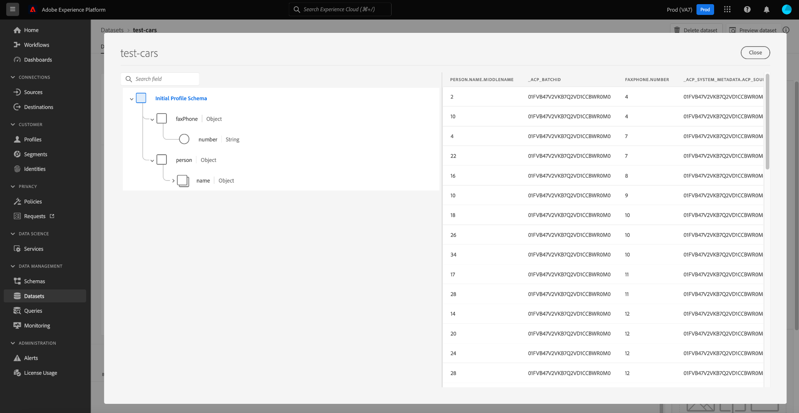

# [!DNL Query Service] troubleshooting guide

This document provides answers to frequently asked questions about Query Service and provides a list of commonly seen error codes when using Query Service. For questions and troubleshooting related to other services in Adobe Experience Platform, please refer to the [Experience Platform troubleshooting guide](../landing/troubleshooting.md).

The following list of answers to frequently asked questions about Query Service divided into the following categories:

- [Query Editor](#query-editor)
- [Exporting Data](#exporting-data)
- [Third-party tools](#third-party-tools)

## Query Editor {#query-editor}

This section includes information on performance, limits, and processes.

### Can I turn off the auto-complete feature in the Query Service Editor?

No. Turning off the auto-complete feature is not currently supported by the platform.

### Why does the Query Editor sometimes become slow when I type in a query?

One potential causes is the auto-complete feature. The feature processes certain metadata commands that can occasionally slow the editor.

### Can I use Postman for Query Service API?

Yes, you can visualize and interact with all Adobe API services using Postman (a free, third-party application). Watch the [Postman setup guide](https://video.tv.adobe.com/v/28832) for step by-step instructions on how to set up a project in Adobe Developer Console and acquire all the necessary credentials for use with Postman. See the official documentation for [guidance on starting, running, and sharing Postman collections](https://learning.postman.com/docs/running-collections/intro-to-collection-runs/).

### Is there a limit to the maximum number of rows returned from a query through the UI?

Yes, Query service internally applies a limit of 50000 rows unless an explicit limit is specified externally. See the guidance on [interactive query execution](./best-practices/writing-queries.md#interactive-query-execution) for more details.

### Is there a data size limit for the resulting output from a query?

No, there is no limit on data size. But, there is a query timeout limit of 10 minutes from an interactive session, and if the query is executed as a batch CTAS then a 10-minute timeout is not applicable. See the guidance on [interactive query execution](./best-practices/writing-queries.md#interactive-query-execution) for more details.

### How do I bypass the limit on the output number of rows from a SELECT query?

To bypass the output row limit, apply "LIMIT 0" in the query. For example:

```sql
SELECT * FROM customers LIMIT 0;
```

### How do I stop my queries from timing out in 10 minutes?

One or more of the following solutions are recommended in case of queries timing out.

- [Convert the query to a CTAS query](./sql/syntax.md#create-table-as-select) and schedule the run. Scheduling a run can be done either [through the UI](./ui/user-guide.md#scheduled-queries) or the [API](./api/scheduled-queries.md#create).
- Execute the query on a smaller data chunk by applying additional [filter conditions](https://spark.apache.org/docs/latest/api/sql/index.html#filter).
- [Execute the EXPLAIN command](./sql/syntax.md#explain) to gather more details.
- Review the statistics of the data within the dataset.
- Convert the query into a simplified form and re-run using [prepared statements](./sql/prepared-statements.md).

### Is there any issue or impact on Query Service performance if multiple queries run simultaneously?

No. Query Service has an autoscaling capability that ensures concurrent queries do not have any noticeable impact on the performance of the service.

### How do I select a column from a hierarchical dataset? How do I find what those columns are?

<!-- I need elaboration on this question. It needs to be reworded. Why do users need to 'select a column'? Does it mean how do i managed nested datasets? -->

See the documentation for full guidance on [how to work with nested data structures](./best-practices/nested-data-structures.md) using the Query Editor or a third party client.

The following steps provide guidance on how to display a tabular view of a dataset, including all nested fields and columns, in a flattened form through the UI:

- After logging into Experience Platform, navigate to [!UICONTROL Datasets] in the left rail of the UI.
- The datasets [!UICONTROL Browse] tab opens. Either use the search bar to refine the available options or select a dataset from the list displayed.
- The [!UICONTROL Datasets activity] screen appears. Select [!UICONTROL Preview] to open a dialog of the XDM schema and tabular view of flattened data from the selected dataset. More details can be found in the [preview a dataset documentation](../catalog/datasets/user-guide.md#preview-a-dataset)



- Select any field from the schema to display its contents in a flattened column.

### How do I speed up a query on a dataset that contains arrays?

To improve the performance of queries on datasets containing arrays, you should [explode the array](https://spark.apache.org/docs/latest/api/sql/index.html#explode) as a [CTAS query](./sql/syntax.md#create-table-as-select) on runtime, and then explore it for further for opportunities to improve its processing time.

### Why is my CTAS query still processing after many hours for only a small number of rows?

If the query has taken a long time on a very small dataset, please contact customer support.

There can be any number of reasons for a query to be stuck while processing. To determine the exact cause requires an in-depth analysis on a case-by-case basis. [Contact Adobe customer support](#customer-support) to being this process.

### How do I contact Adobe customer support? {#customer-support}

[A complete list of Adobe customer support telephone numbers](https://helpx.adobe.com/ca/contact/phone.html) is available on the Adobe help page. Alternatively help can be found online by completing the following steps:

- Navigate to [https://www.adobe.com/](https://www.adobe.com/) in your web browser.
- On the right side of the top navigation bar, select **[!UICONTROL Sign In]**.
- Use your Adobe ID and password that is registered with your Adobe license.
- Select **[!UICONTROL Help & Support]** from the top navigation bar. 

A dropdown banner appears containing a [!UICONTROL Help and support] section. Select **[!UICONTROL Contact us]** to open the Adobe Customer Care Virtual Assistant, or select **[!UICONTROL Enterprise support]** for dedicated help for large organizations.

### How do I implement a sequential series of jobs, without executing subsequent jobs if the previous job does not completed successfully? 

The anonymous block feature allows you to chain one or more SQL statements that are executed in sequence. They also allow for the option of exception-handling.

See the [anonymous block documentation](./sample-queries/anonymous-block.md) for more details.

### How do I implement custom attribution in Query Service?

There are two ways to implement custom attribution:

1. Use a combination of existing [Adobe defined functions](./sql/adobe-defined-functions.md) to identify if the use-case needs are met. 
1. If the previous suggestion doesn’t meet your use case, you should use a combination of [window functions](./sql/adobe-defined-functions.md#window-functions). Window functions look at all the events in a sequence. They also allow you to review the historic data and can be used in any combination.

### Can I templatize my queries so that I can easily re-use them?

Yes, you can templatize queries through the use of prepared statements. Prepared statements can optimize performance, and avoid repetitiously re-parsing a query. See the [prepared statements documentation](./sql/prepared-statements.md) for more details.

### How do I retrieve error logs for a query?

To retrieve error logs for a query, you must first use the Query Service API to fetch the query log details. This allows you to find the specific query ID that you wish to investigate.  

First, use the GET command to retrieve multiple queries. Information on how to make a call to the API can be found in the [sample API calls documentation](./api/queries.md#sample-api-calls).

From the response, identify the query you want to investigate and make another GET request using its `queryid`. The response contains an `errors` array. An example of an `errors` array is shown below:

```json
'rowCount': 0,
'errors': [
       {'code': '58000',
        'message': 'Batch query execution gets : [failed reason ErrorCode: 58000 Batch query execution gets : [Analysis error encountered. Reason: [sessionId: f055dc73-1fbd-4c9c-8645-efa609da0a7b Function [varchar] not defined.]]]',
        'errorType': 'USER_ERROR'}],
```

The [Query Service API reference documentation](https://www.adobe.io/experience-platform-apis/references/query-service/) provides more information on all available endpoints.

### What does "Error validating schema" mean?

If you see the "Error validating schema"message, it means that the system is unable to locate a field within the schema. You should read the best practice document for [organizing data assests in Query Service](./best-practices/organize-data-assets.md) followed by the [Create Table As Select documentation](./sql/syntax.md#create-table-as-select).  

The following example demonstrates the use of a CTAS syntax and a struct datatype:

```sql
CREATE TABLE table_name WITH (SCHEMA='schema_name')

AS

 SELECT '1' as _id,

 STRUCT

  ('2021-02-17T15:39:29.0Z' AS taskActualCompletionDate,

    '2020-09-09T21:21:16.0Z' AS taskActualStartDate,

    'Consulting' AS taskdesctiption,

    '5f5937c10011e09b89666c52d9a8c564' AS taskguid,

    'Partner Consulting Engagement' AS taskname, 

    '2020-09-09T15:00:00.0Z' AS taskPlannedStartDate,

    '2021-02-15T11:00:00.0Z' AS taskPlannedCompletionDate

  ) AS _workfrontshared ;
```

<!-- Q) Why this example contain actual values? Does this scale? It seems very specific-->

### How do I quickly process the new data coming into the system every day?

The [SNAPSHOT](.md#snapshot-clause) clause can be used to incrementally read data on a table based on a snapshot ID. This is ideal for use with the [incremental load](./sample-queries/incremental-load.md) design pattern that only processes information in the dataset that has been created or modified since the last load execution. As a result it increases processing efficiency and can be used with both streaming and batch data processing.


<!-- Below is original content -->

## Exporting Data {#exporting-data}

This section includes information on exporting data to activated destinations.

## Third-party tools {#third-party-tools}

This section includes information on the use of third-party tools such as PSQL and Power BI. 

### How can I get only the metadata for a query?

To get only the metadata for a query, you can run a query that returns zero rows, as follows:

```sql
SELECT * FROM <table> WHERE 1=0
```

This query returns only the metadata for the specified table.

### How can I quickly iterate on a CTAS (Create Table As Select) query without materializing it?

You can create temporary tables to quickly iterate and experiment on a query before materializing it for use. You can also use temporary tables to validate if a query is functional.

For example, you can create a temporary table:

```sql
CREATE temp TABLE temp_dataset AS
SELECT *
FROM actual_dataset
WHERE 1 = 0;
```

Then you can use the temporary table as follows: 

```sql
INSERT INTO temp_dataset
SELECT a._company AS _company,
a._id AS _id,
a.timestamp AS timestamp
FROM actual_dataset a
WHERE timestamp >= TO_TIMESTAMP('2021-01-21 12:00:00')
AND timestamp < TO_TIMESTAMP('2021-01-21 13:00:00')
LIMIT 100;
```

### How do I change the time zone to and from a UTC Timestamp?

Adobe Experience Platform persists data in UTC (Coordinated Universal Time) timestamp format. An example of the UTC format is `2021-12-22T19:52:05Z`

Query Service supports built-in SQL functions to convert a given timestamp to and from UTC format. Both the `to_utc_timestamp()` and the `from_utc_timestamp()` methods take two parameters: timestamp and timezone. 

| Parameter  | Description  |
|---|---|
| Timestamp  | The timestamp can be written in either UTC format or simple `{year-month-day}` format. If no time is provided, the default value is midnight on the morning of the given day.  |
| Timezone  |  The timezone is written in a `{continent/city})` format. It must be one of the recognized timezone codes as found in the [public-domain TZ database](https://data.iana.org/time-zones/tz-link.html#tzdb). |

#### Convert to the UTC timestamp

The `to_utc_timestamp()` method interprets the given parameters and converts it **to the timestamp of your local timezone** in UTC format. For example, the time zone in Seoul, South Korea is UTC/GMT +9 hours. By providing a date-only timestamp, the method uses a default value of midnight in the morning. The timestamp and timezone are converted into the UTC format from the time of that region to a UTC timestamp of your local region.

```SQL
SELECT to_utc_timestamp('2021-08-31', 'Asia/Seoul');
```

The query returns a timestamp in the user's local time. In this case, 3PM the previous day as Seoul is nine hours ahead.

```
2021-08-30 15:00:00
```

As another example, if the given timestamp was `2021-07-14 12:40:00.0` for the `Asia/Seoul` timezone, the returned UTC timestamp would be `2021-07-14 03:40:00.0`

The console output provided in the Query Service UI is a more human-readable format:

```
8/30/2021, 3:00 PM
```

#### Convert from the UTC timestamp

The `from_utc_timestamp()` method interprets the given parameters **from the timestamp of your local timezone** and provides the equivalent timestamp of the desired region in UTC format. In the example below, the hour is 2:40PM in the user's local timezone. The Seoul timezone passed as a variable is nine hours ahead of the local timezone.

```SQL
SELECT from_utc_timestamp('2021-08-31 14:40:00.0', 'Asia/Seoul');
```

The query returns a timestamp in UTC format for the timezone passed as a parameter. The result is nine hours ahead of the timezone that ran the query.

```
8/31/2021, 11:40 PM
```

### How should I filter my time-series data?

When querying with time-series data, you should use the timestamp filter whenever possible for more accurate analysis.

>[!NOTE]
>
> The date string **must** be in the format `yyyy-mm-ddTHH24:MM:SS`. 

An example of using the timestamp filter can be seen below:

```sql
SELECT a._company  AS _company,
       a._id       AS _id,
       a.timestamp AS timestamp
FROM   dataset a
WHERE  timestamp >= To_timestamp('2021-01-21 12:00:00')
       AND timestamp < To_timestamp('2021-01-21 13:00:00')
```

### Should I use wildcards, such as * to get all the rows from my datasets?

You cannot use wildcards to get all the data from your rows, as Query Service should be treated as a **columnar-store** rather than a traditional row-based store system.

### Should I use `NOT IN` in my SQL query?

The `NOT IN` operator is often used to retrieve rows that are not found in another table or SQL statement. This operator can slow down performance and may return unexpected results if the columns that are being compared accept `NOT NULL`, or you have large numbers of records.

Instead of using `NOT IN`, you can use either `NOT EXISTS` or `LEFT OUTER JOIN`.

For example, if you have the following tables created:

```sql
CREATE TABLE T1 (ID INT)
CREATE TABLE T2 (ID INT)
INSERT INTO T1 VALUES (1)
INSERT INTO T1 VALUES (2)
INSERT INTO T1 VALUES (3)
INSERT INTO T2 VALUES (1)
INSERT INTO T2 VALUES (2)
```

If you are using the `NOT EXISTS` operator, you can replicate using the `NOT IN` operator by using the following query:

```sql
SELECT ID FROM T1
WHERE NOT EXISTS
(SELECT ID FROM T2 WHERE T1.ID = T2.ID)
```

Alternatively, if you are using the `LEFT OUTER JOIN` operator, you can replicate using he `NOT IN` operator by using the following query:

```sql
SELECT T1.ID FROM T1
LEFT OUTER JOIN T2 ON T1.ID = T2.ID
WHERE T2.ID IS NULL
```

### What is the correct usage of the `OR` and `UNION` operators?

### How do I correctly use the `CAST` operator to convert my timestamps in SQL queries?

When using the `CAST` operator to convert a timestamp, you need to include both the date **and** time.

For example, missing the time component, as shown below, will result in an error:

```sql
SELECT * FROM ABC
WHERE timestamp = CAST('07-29-2021' AS timestamp)
```

A correct usage of the `CAST` operator is shown below:

```sql
SELECT * FROM ABC
WHERE timestamp = CAST('07-29-2021 00:00:00' AS timestamp)
```

### How can I download my query results as a CSV file?

This is not a feature that Query Service offers directly. However, if the [!DNL PostgreSQL] client used to connect to the database server has the capability, the response of a SELECT query can be written and downloaded as a CSV file. Please refer to the documentation of the utility or third-party tool that you are using for clarification on this process.

## REST API errors

| HTTP status code | Description | Possible causes |
| ---------------- | ----------- | --------------- |
| 400 | Bad request | Malformed or illegal query |
| 401 | Authentication failed | Invalid auth token |
| 500 | Internal server error | Internal system failure |

## PostgreSQL API errors

| Error code | Connection state | Description | Possible cause |
| ---------- | ---------------- | ----------- | -------------- |
| **08P01** | N/A | Unsupported message type | Unsupported message type |
| **28P01** | Start-up - authentication | Invalid password | Invalid authentication token |
| **28000** | Start-up - authentication | Invalid authorization type | Invalid authorization type. Must be `AuthenticationCleartextPassword`. |
| **42P12** | Start-up - authentication | No tables found | No tables found for use |
| **42601** | Query | Syntax error | Invalid command or syntax error |
| **42P01** | Query | Table not found | Table specified in the query was not found |
| **42P07** | Query | Table exists | A table with the same name already exists (CREATE TABLE) |
| **53400** | Query | LIMIT exceeds max value | User specified a LIMIT clause higher than 100,000 |
| **53400** | Query | Statement timeout | The live statement submitted took more than the maximum of 10 minutes |
| **58000** | Query | System error | Internal system failure |
| **0A000** | Query/Command | Not supported | The feature/functionality in the query/command is not supported |
| **42501** | DROP TABLE Query | Dropping table not created by Query Service | The table that is being dropped was not created by Query Service using the `CREATE TABLE` statement |
| **42501** | DROP TABLE Query | Table not created by the authenticated user | The table that is being dropped was not created by the currently logged in user |
| **42P01** | DROP TABLE Query | Table not found | The table specified in the query was not found |
| **42P12** | DROP TABLE Query | No table found for `dbName`: please check the `dbName` | No tables were found in the current database |
