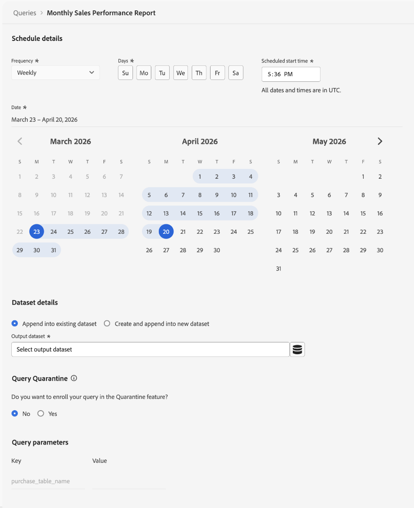

# Data Distiller accelerators {#data-distiller-accelerators}

Data Distiller accelerators are Adobe-authored, parameterized SQL templates designed for common analytical scenarios. Use accelerators to run common analyses without writing SQL from scratch. Accelerators are read-only and maintained by Adobe, ensuring consistency across your organization. If you need to modify one, you can clone it as a custom template.

Read this guide to learn how to run, schedule, and clone accelerators in the [!UICONTROL Queries] workspace.

>[!AVAILABILITY]
>
>Data Distiller Accelerators are only available to organizations with a Data Distiller SKU. The [!UICONTROL Accelerators] tab and related workflows require the Data Distiller add-on. See the [Data Distiller overview](../data-distiller/overview.md) or contact your Adobe representative for more information.

## Prerequisites {#prerequisites}

Before you begin, ensure you meet the following requirements:

* You have access to the [!UICONTROL Queries] workspace in Experience Platform.
* You understand [how to use the Query Editor and run queries](./user-guide.md).
* You are familiar with [parameterized queries](./parameterized-queries.md) (placeholders in SQL replaced at runtime).

## When to use accelerators {#when-to-use}

Use accelerators when you need pre-built SQL for common analytical patterns such as funnel analysis, moving averages, or audience overlap. If no accelerator fits your use case, [write a custom query in the Query Editor](./user-guide.md#query-authoring) or request a new accelerator (see [Request a new accelerator](#request-accelerator)).

A small set of accelerators open as dashboards for immediate analysis, while others open in the Query Editor where you can run, schedule, or adapt the logic. See the [Dashboard-linked accelerators](#dashboard-accelerators) section to find out how these pre-configured visualisations provide insights on your audience data.

To begin using accelerators, navigate to the **[!UICONTROL Queries]** workspace and open the **[!UICONTROL Accelerators]** tab or the **[!UICONTROL Overview]** tab.

## Accelerator discovery paths {#discovery-paths}

You can access accelerators from the Queries workspace in two ways, depending on whether you want the full catalog or recommended templates.

### Use the Accelerators tab

Use this path when you want to browse all available accelerators. To open the full accelerator catalog, select **[!UICONTROL Queries]** in the left navigation, then select the **[!UICONTROL Accelerators]** tab.

The workspace displays a table of accelerators with names, SQL previews, and timestamps. Select an accelerator name to open it in the Query Editor.

>[!NOTE]
>
>All accelerators selected from the **[!UICONTROL Accelerators]** tab open in the Query Editor.

### Use the Overview tab

Use this path when you want quick access to highly recommended accelerators. Navigate to **[!UICONTROL Queries]**, then select the **[!UICONTROL Overview]** tab. Next, select a card from the **[!UICONTROL Recommended Data Distiller accelerators]** section. 

Most accelerators open in the Query Editor. A small set of accelerators open as dashboards with prebuilt visualizations. If the card opens a dashboard instead of the Query Editor, see [Dashboard-linked accelerators](#dashboard-accelerators).

## Open an accelerator in the Query Editor {#open-accelerator}

After opening an accelerator, you can **run** the accelerator to view results, **schedule** the accelerator to run automatically, or **create a custom template** to modify the SQL.

>[!NOTE]
>
>When you open an accelerator in the Query Editor, the SQL is preloaded in a read-only state and toolbar actions such as [!UICONTROL Show results], [!UICONTROL Undo text], [!UICONTROL Format text] are disabled.

The right-hand panel displays metadata such as **[!UICONTROL Accelerator ID]**, **[!UICONTROL Name]**, and modification details, and provides access to scheduling through **[!UICONTROL Add schedule]**.

### Provide parameters and run an accelerator {#provide-parameters-execute}

To run the accelerator, you must first provide values for all required parameters. Parameters use the `${PARAMETER_NAME}` syntax and appear in the **[!UICONTROL Query parameters]** tab below the editor. For example, `${START_DATE}` requires a date value in `YYYY-MM-DD` format (for example, `2024-01-01`), and `${AUDIENCE_ID}` requires a specific audience identifier.

To run an accelerator.

1. Select **[!UICONTROL Query parameters]** and enter a value for each parameter.
2. Select the play icon () in the toolbar.

The accelerator runs and displays results in the **[!UICONTROL Results]** tab. These results are not persisted to a dataset unless you explicitly use the [**[!UICONTROL Run as CTAS]**](#persist-results) or [scheduling workflow](#schedule-accelerator).

For more information on parameterized queries, see [Parameterized queries in Query Editor](./parameterized-queries.md).

## Persist results from an accelerator {#persist-results}

After you run an accelerator and confirm the results, you can persist the output to a dataset.

To create a dataset from the results, select **[!UICONTROL Save]** to save the accelerator as a template, then select **[!UICONTROL Run as CTAS]**. The **[!UICONTROL Enter output dataset details]** dialog appears. Enter a dataset name and optional description, then confirm to create the dataset. This action creates a new dataset and writes the results to it.

![The [!UICONTROL Enter output dataset details] dialog with a dataset name and description populated.](../images/ui/accelerators/output-dataset-details-dialog.png)

## Schedule an accelerator {#schedule-accelerator}

To schedule an accelerator to run automatically with fixed parameter values, select **[!UICONTROL Add schedule]** in the right-hand panel.

>[!TIP]
>
>Before scheduling, ensure you understand the required parameter values. You are recommended to run the accelerator first to validate the results. This is optional.

The schedule configuration dialog appears.

In the schedule configuration dialog, you must provide a frequency, timeframe, output dataset and parameter values again. Parameter values entered in the Query Editor are not carried into the schedule configuration. In the **[!UICONTROL Dataset details]** section, you can choose to **[!UICONTROL Append into existing dataset]** or **[!UICONTROL Create and append into new dataset]**. After you configure the schedule, the accelerator runs automatically based on your settings and writes results to the selected dataset.

For complete step-by-step instructions, see the [Create a query schedule](./query-schedules.md#create-schedule) guide.

## Create a custom template from an accelerator {#create-custom-template}

If you need to modify the SQL or reuse the logic under your own configuration, you can create a custom template from an accelerator. First, open an accelerator in the Query Editor, then select **[!UICONTROL Create custom template]**. Modify the SQL and details as needed, and select **[!UICONTROL Save]** or **[!UICONTROL Save and close]** to store the template.

Once saved, the template is editable and can be run, scheduled, or used with CTAS. The template is saved to the **[!UICONTROL Templates]** tab, where you can manage it like any other template. For more information, see [Query templates](./query-templates.md).

### What changes when you create a custom template {#custom-template-differences}

The cloned template differs from the original accelerator because the SQL is editable, you can save changes, delete the template, and schedule it. The **[!UICONTROL Modified by]** field shows your name. The template is found in the **[!UICONTROL Templates]** tab instead of **[!UICONTROL Accelerators]**.

## Dashboard-linked accelerators {#dashboard-accelerators}

Some accelerators on the **[!UICONTROL Overview]** tab open as dashboards instead of SQL queries. These accelerators provide prebuilt visualizations for analyzing audience data and do not require parameter input or manual execution.

The following accelerators open in the **[!UICONTROL Dashboards]** workspace:

* **[!UICONTROL Advanced Audience Overlaps]**: Analyze intersections between selected audiences or across your full audience set to identify overlap patterns. Use these insights to refine segmentation and reduce redundant targeting.
* **[!UICONTROL Audience Comparison]**: Compare key metrics between two audiences side by side, including size, identity composition, and changes over time. Use this view to evaluate performance differences and inform targeting decisions.
* **[!UICONTROL Audience Trends]**: Track how audience metrics change over time, including audience size and identity counts. Use these trends to monitor growth and evaluate the impact of segmentation strategies.
* **[!UICONTROL Audience Identity Overlaps]**: Examine how identity types overlap within selected audiences to understand identity relationships. Use this analysis to improve identity stitching and segmentation accuracy.

After the dashboard opens, use available controls and filters to explore and compare audience data. For more details, see [dashboard templates](../../dashboards/sql-insights-query-pro-mode/templates/overview.md).

## Request a new accelerator {#request-accelerator}

If you have a recurring use case that is not covered by existing accelerators, submit a request through your Adobe support channel. Adobe evaluates requests based on common usage patterns and industry applicability.

## Next steps {#next-steps}

You can now use accelerators to run and automate common analytical queries.

To extend your workflows, create and browse [query templates](./query-templates.md#browse), author [parameterized queries](./parameterized-queries.md), schedule [queries](./query-schedules.md), or explore [Query Service workflows](./user-guide.md).
