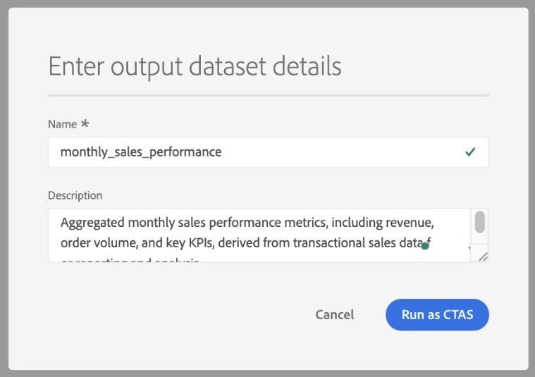

# Data Distiller Accelerators {#data-distiller-accelerators}

Data Distiller Accelerators are Adobe-authored, parameterized SQL templates designed for common analytical scenarios. You use accelerators to run common analyses without writing SQL from scratch. Accelerators are read-only and maintained by Adobe, ensuring consistency across your organization. If you need to modify one, you can clone it as a custom template.

After completing this guide, you can discover, run, schedule, and clone accelerators in the Queries workspace.

>[!AVAILABILITY]
>
>Data Distiller Accelerators are only available to organizations with a Data Distiller SKU. The Accelerators tab and related workflows require the Data Distiller add-on. See the [Data Distiller overview](../data-distiller/overview.md) for more information.

## Prerequisites {#prerequisites}

Before you begin, ensure you meet the following requirements:

- You have access to the Queries workspace in Experience Platform.
- You understand [how to use the Query Editor and run queries](./user-guide.md).
- You are familiar with [parameterized queries](./parameterized-queries.md) (placeholders in SQL replaced at runtime).

## When to use accelerators {#when-to-use}

Use accelerators when you need pre-built SQL for common analytical patterns such as funnel analysis, moving averages, or audience overlap. If no accelerator fits your use case, [write a custom query in the Query Editor](./user-guide.md#query-authoring) or request a new accelerator (see [Request a new accelerator](#request-accelerator)).

Accelerators include a broad set of Adobe-provided SQL templates for recurring analytical use cases. Some recommended accelerators provide direct access to preconfigured dashboards for audience analysis, while others open in the Query Editor for query execution and customization.

To begin using accelerators, navigate to the **[!UICONTROL Queries]** workspace and open the **[!UICONTROL Accelerators]** tab or the **[!UICONTROL Overview]** tab.

## Accelerator discovery paths {#discovery-paths}

You can access accelerators from the Queries workspace in two ways, depending on whether you want the full catalog or recommended templates.

### Use the Accelerators tab

Use this path when you want to browse all available accelerators. To open the full accelerator catalog, select **[!UICONTROL Queries]** in the left navigation, then select the **[!UICONTROL Accelerators]** tab.

The workspace displays a table of accelerators with names, SQL previews, and timestamps. Select an accelerator name to open it in the Query Editor.

### Use the Overview tab

Use this path when you want quick access to commonly used accelerators. Navigate to **[!UICONTROL Queries]**, then select the **[!UICONTROL Overview]** tab.

In **[!UICONTROL Recommended Data Distiller accelerators]**, select a card.

Recommended accelerators can open in different workspaces depending on their configuration. Some cards open the Query Editor with SQL preloaded, while others open a dashboard with prebuilt visualizations for audience analysis. If the card opens a dashboard instead of the Query Editor, see [Dashboard-linked accelerators](#dashboard-accelerators).

## Open an accelerator in the Query Editor {#open-accelerator}

This section describes how accelerators behave when they open in the Query Editor and what actions you can take before execution.

All accelerators selected from the **[!UICONTROL Accelerators]** tab open in the Query Editor. Some recommended accelerators from the **[!UICONTROL Overview]** tab also open in the Query Editor, depending on the selected card.

After you select an accelerator, the Query Editor opens with the accelerator SQL preloaded.

The SQL is read-only, and toolbar actions such as **[!UICONTROL Show results]**, **[!UICONTROL Undo text]**, **[!UICONTROL Format text]**, and **[!UICONTROL Save]** are disabled. The right-hand panel displays metadata such as **[!UICONTROL Accelerator ID]**, **[!UICONTROL Name]**, and modification details, and provides access to scheduling through **[!UICONTROL Add schedule]**.

Before you can execute the query, you must select **[!UICONTROL Create custom template]** to make the SQL editable and run it as a standard query, or add query parameters and select [!UICONTROL Add schedule].

>[!TIP]
>
>You can edit the [!UICONTROL Name] for your new template or keep it the same as the accelerator name.

<!-- When you select **[!UICONTROL Run as CTAS]**, the **[!UICONTROL Enter output dataset details]** dialog appears. Enter a dataset name and optional description, then confirm to run the query.

The system creates a new dataset and writes the results to it. You can review results in the **[!UICONTROL Datasets]** workspace or the **[!UICONTROL Logs]** tab. -->

## Provide parameters and execute an accelerator {#provide-parameters-execute}

After opening an accelerator, you must provide values for all parameters before running the query.

Parameters use the `${PARAMETER_NAME}` syntax and appear in the **[!UICONTROL Query parameters]** tab below the editor. For example, a parameter such as `${START_DATE}` might require a date value in `YYYY-MM-DD` format (for example, `2024-01-01`), while `${AUDIENCE_ID}` might require a specific audience identifier. The required format depends on how the parameter is defined in the accelerator SQL.

>[!TIP]
>
>The query parameter names for accelerators are pre-populated an only require values to be added.

To run an accelerator:

1. Select **[!UICONTROL Query parameters]** and enter a value for each parameter.  
2. Select the play icon () in the toolbar to run the query.

The query executes and writes results based on your selected execution method. If you run the query as CTAS, the system creates a dataset with your results. If you run a custom template, results appear in the **[!UICONTROL Results]** tab.

>[!IMPORTANT]
>
>You must supply values for all parameters before running an accelerator. Running the query with missing or empty parameter values causes the query to fail.

For more information on parameterized queries, see [Parameterized queries in Query Editor](./parameterized-queries.md). For full query execution details, including limits and output options, see the [Query Editor user guide](./user-guide.md#run-a-query).

## Schedule an accelerator {#schedule-accelerator}

After you validate the syntax of an accelerator, schedule it to run automatically with fixed parameter values.

Select **[!UICONTROL Add schedule]** in the right-hand panel to open the schedule configuration dialog.

The schedule configuration includes the frequency, start and end dates, output dataset, and parameter values that are reused for each run. In the **[!UICONTROL Dataset details]** section, choose how results are written:

- **[!UICONTROL Append into existing dataset]** to add new results to an existing dataset.
- **[!UICONTROL Create and append into new dataset]** to create a dataset and append results over time.

Each scheduled execution writes results according to this configuration, enabling you to persist and reuse query output.

For complete step-by-step instructions, see [Create a query schedule](./query-schedules.md#create-schedule).

## Create a custom template from an accelerator {#create-custom-template}

Create a custom template when you need to modify the SQL or reuse the logic under your own configuration.

Open an accelerator in the Query Editor, then select **[!UICONTROL Create custom template]**. Modify the SQL as needed, and select **[!UICONTROL Save]** or **[!UICONTROL Save and close]** to store the template. The template is saved to the **[!UICONTROL Templates]** tab, where you can manage it like any other template. For more information, see [Query templates](./query-templates.md).

### What changes when you create a custom template {#custom-template-differences}

The cloned template differs from the original accelerator because the SQL is editable, you can save changes, delete the template, and schedule it. The **[!UICONTROL Modified by]** field shows your name.

The template appears in the **[!UICONTROL Templates]** tab instead of **[!UICONTROL Accelerators]**.

## Dashboard-linked accelerators {#dashboard-accelerators}

Some accelerators open as dashboards instead of SQL queries. These accelerators provide prebuilt visualizations for analyzing audience data and do not require manual query execution or parameter input.

The following accelerators open in the **[!UICONTROL Dashboards]** workspace:

- Advanced Audience Overlaps: Analyze intersections between selected audiences or across your full audience set to identify overlap patterns. Use these insights to refine segmentation and reduce redundant targeting.
- Audience Comparison: Compare key metrics between two audiences side by side, including size, identity composition, and changes over time. Use this view to evaluate performance differences and inform targeting decisions.
- Audience Trends: Track how audience metrics change over time, including audience size and identity counts. Use these trends to monitor growth and evaluate the impact of segmentation strategies.
- Audience Identity Overlaps: Examine how identity types overlap within selected audiences to understand identity relationships. Use this analysis to improve identity stitching and segmentation accuracy.

After the dashboard opens, use available controls and filters to explore and compare audience data. These dashboards are preconfigured and continuously reflect your underlying data.

For more details, see [dashboard templates](../../dashboards/sql-insights-query-pro-mode/templates/overview.md).

## Request a new accelerator {#request-accelerator}

If you have a recurring use case that is not covered by existing accelerators, submit a request through your Adobe support channel.

Adobe evaluates requests based on common usage patterns and industry applicability.

## Next steps {#next-steps}

You can now use accelerators to run and automate common analytical queries.

To extend your workflows, create and browse [query templates](./query-templates.md#browse), author [parameterized queries](./parameterized-queries.md), schedule [queries](./query-schedules.md), or explore [Query Service workflows](./user-guide.md).
