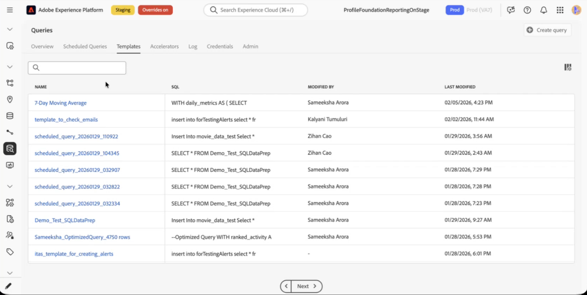
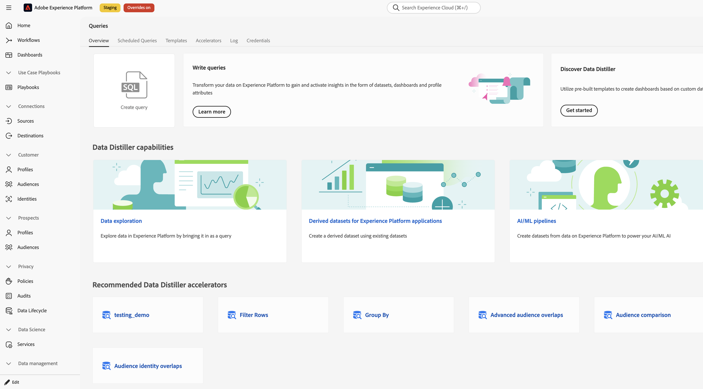
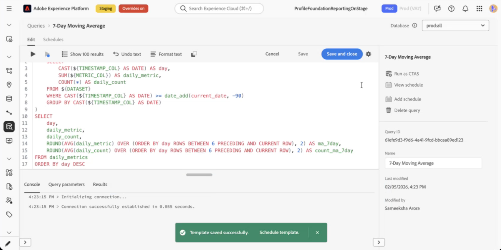

# Data Distiller Accelerators {#data-distiller-accelerators}

Data Distiller Accelerators are a library of Adobe-approved, parameterized SQL templates for common analytical scenarios. Accelerators reduce setup time and errors by providing pre-tested SQL for common workflows. You can discover accelerators, supply parameter values, and run or schedule the resulting queries without writing SQL from scratch. To customize an accelerator, use **[!UICONTROL Create custom template]** to clone it into an editable query template that you own.

This guide is for Data Engineers and Analysts who run SQL in Experience Platform and want to use pre-built templates for common analyses. After reading this guide, you will be able to discover, run, schedule, and clone accelerators for your use cases.

>[!AVAILABILITY]
>
>Data Distiller Accelerators are only available to organizations with a Data Distiller SKU. The Accelerators tab and related workflows require the Data Distiller add-on. See the [Data Distiller overview](../data-distiller/overview.md) for more information.

## Prerequisites {#prerequisites}

To use accelerators, you must have access to the Queries workspace in Experience Platform. You should understand the Query Editor, how to run queries, and the concept of parameterized queries (placeholders in SQL that are replaced with values at runtime). See the [Query Editor user guide](./user-guide.md) and [Parameterized queries in Query Editor](./parameterized-queries.md) for background.

## Overview {#overview}

Accelerators are Adobe-authored, parameterized SQL templates. They are read-only; you cannot edit or delete them. You can save an accelerator as a custom template and edit that. Only Adobe can add, modify, or remove accelerators. Accelerators are shared across teams in your organization so everyone can use the same templates for consistent analysis. You cannot see who authored or modified accelerators; Adobe manages all changes.

### When to use accelerators {#when-to-use}

Use accelerators when you need pre-built SQL for common patterns such as funnel analysis, moving averages, audience overlap, or similar analytical workflows. If no accelerator fits your use case, [write a custom query in the Query Editor](./user-guide.md#query-authoring) or request a new accelerator (see [Request a new accelerator](#request-accelerator)).

### Accelerator discovery paths {#discovery-paths}

You can discover accelerators in two ways:

- **[!UICONTROL Accelerators] tab:** Use this tab to browse the full catalog of accelerators. In Experience Platform, select **[!UICONTROL Queries]** in the left navigation to open the Queries workspace. Then select the **[!UICONTROL Accelerators]** tab to view a table of all available accelerators. The table shows each accelerator name, a SQL preview, and creation and modification dates. Select an accelerator name to open it in the Query Editor.

- **[!UICONTROL Overview] tab:** Use this tab for a curated subset of common templates. The **[!UICONTROL Recommended Data Distiller accelerators]** section on the **[!UICONTROL Overview]** tab displays a subset of accelerator cards. Some cards open the Query Editor; others open dashboard visualizations in the Dashboards workspace. If a card opens a dashboard instead of the Query Editor, see [Dashboard-linked accelerators](#dashboard-accelerators). Select a card to open the corresponding accelerator or dashboard.

## Open an accelerator in the Query Editor {#open-accelerator}

Select an accelerator name from the **[!UICONTROL Accelerators]** tab or from the **[!UICONTROL Recommended Data Distiller accelerators]** cards on the **[!UICONTROL Overview]** tab. The Query Editor opens with the accelerator's SQL pre-populated. When you open an accelerator, the SQL and parameters appear so you can review the syntax and purpose before running. The SQL is read-only: toolbar actions such as **[!UICONTROL Show results]**, **[!UICONTROL Undo text]**, **[!UICONTROL Format text]**, and **[!UICONTROL Save]** are disabled. The following actions remain available: run the query, cancel and exit (via **[!UICONTROL Cancel]**), and **[!UICONTROL Create custom template]**.

The right-hand panel displays accelerator metadata: **[!UICONTROL Accelerator ID]**, **[!UICONTROL Name]**, **[!UICONTROL Last modified]**, **[!UICONTROL Modified by]**, and **[!UICONTROL Add schedule]**.

## Provide parameters and execute an accelerator {#provide-parameters-execute}

Accelerators use the `${PARAMETER_NAME}` syntax for parameters. Parameters appear in the **[!UICONTROL Query parameters]** tab below the editor. Supply a value for each parameter before running the query.

>[!IMPORTANT]
>
>You must supply values for all parameters before running an accelerator. Running the query with missing or empty parameter values causes the query to fail.

When you open an accelerator, parameters are auto-populated from the SQL in the **[!UICONTROL Query parameters]** tab. When all parameters are set, select the play icon  in the toolbar above the Query Editor to run the query. Results appear in the **[!UICONTROL Results]** tab.

For general parameter concepts and authoring your own parameterized queries, see [Parameterized queries in Query Editor](./parameterized-queries.md).

For full details on running queries, including result limits, cancel, and output dataset options, see the [Query Editor user guide](./user-guide.md#run-a-query).

## Schedule an accelerator {#schedule-accelerator}

You can schedule an accelerator directly without cloning it. Select **[!UICONTROL Add schedule]** in the right-hand panel when the accelerator is open in the Query Editor. The scheduling workflow is the same as for other query templates: set frequency, start and end dates, and the output dataset. For accelerators, you are prompted to enter parameter values in the schedule setup before saving. Parameter values are reused for each run.

For step-by-step scheduling instructions, see [Create a query schedule](./query-schedules.md#create-schedule). For parameterized query scheduling details, see [Schedule a parameterized query](./parameterized-queries.md#schedule).

## Create a custom template from an accelerator {#create-custom-template}

Create a custom template when you need to modify the SQL, run it under a different name, or apply org-specific changes. This clones the accelerator into a new query template that you own. The original accelerator is not modified.

1. [Open an accelerator in the Query Editor](#open-accelerator).
2. Select **[!UICONTROL Create custom template]** in the editor toolbar.
3. The editor switches to editable mode. Modify the SQL if needed, then select **[!UICONTROL Save]** or **[!UICONTROL Save and close]**.
4. The cloned template appears in the **[!UICONTROL Templates]** tab. You can edit, schedule, or delete it like any other template.

See [Query templates](./query-templates.md) for managing templates.

### What changes when you create a custom template {#custom-template-differences}

The cloned template differs from the original accelerator in these ways:

- The SQL is editable and you can save changes.
- You can delete the template.
- **[!UICONTROL Modified by]** shows your name (or the user who last modified it).
- You can schedule the template.
- The template appears in the **[!UICONTROL Templates]** tab, not in **[!UICONTROL Accelerators]**.

## Dashboard-linked accelerators {#dashboard-accelerators}

Some accelerators from the **[!UICONTROL Recommended Data Distiller accelerators]** section on the **[!UICONTROL Overview]** tab link to the Dashboards workspace instead of the Query Editor. Examples include Audience Identity Overlaps and Advanced audience overlaps. These open dashboard templates that provide visualizations for audience analysis. The full set of dashboard-linked accelerators is available in the product. See the [Query pro mode overview](../../dashboards/sql-insights-query-pro-mode/overview.md) for details on dashboard templates.

## Request a new accelerator {#request-accelerator}

Customers cannot add accelerators through the UI. If you have a recurring use case that you want as an accelerator, contact your Adobe support team to submit the request. Adobe evaluates requests and adds new accelerators based on industry applicability and common patterns.

## Next steps {#next-steps}

You can now discover, run, schedule, and clone Data Distiller Accelerators to perform common analyses with pre-tested SQL and fewer setup errors. To extend your workflows, consider these related tasks:

- [Create and browse query templates](./query-templates.md#browse), including those cloned from accelerators.
- [Author your own parameterized queries](./parameterized-queries.md) using the `$` syntax.
- [Schedule queries](./query-schedules.md) for automated runs.
- [Learn general Query Service workflows](./user-guide.md).
