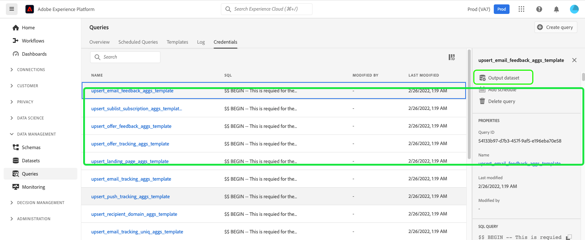
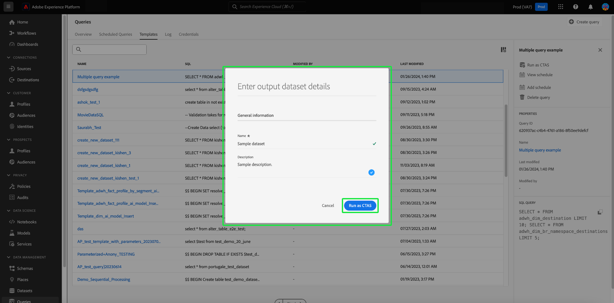

# Generate datasets from results in [!DNL Query Service]

[!DNL Query Service] allows you to use queries to generate datasets in the [!DNL Data Lake]. These datasets can then be used as input for more queries or in other services such as [!DNL Data Science Workspace], Real-time Customer Profile, or [!DNL Analysis Workspace].

## Generate datasets from the Adobe Experience Platform user interface

<!-- Screenshot for #3 will need to be updated if schedule queries is moved. -->

To create datasets from the Adobe Experience Platform user interface (UI), follow these steps:

1. Create a query using a connected client and validate the output. To learn how to write queries using [!DNL Query Editor], read the [!DNL Query Editor] UI guide [on writing queries](./user-guide.md#writing-queries).

2. In the Platform UI, navigate to **[!UICONTROL Queries]** followed by the **[!UICONTROL Browse]** tab and select the query you have created. For more details on how to view queries that were created and saved for your organization within the Platform UI, read the [[!DNL Query Service] overview](./overview.md#browse).

3. In the Query details panel, select **[!UICONTROL Output dataset]**.

    

4. In the dialog that appears, enter a dataset name prepended with your LDAP ID. The dataset name does not have to be unique or SQL-safe. Note that the table name for your dataset will be generated based on the dataset name you create here.

5. Next, enter a description for your dataset in the [!UICONTROL Description] field and select **[!UICONTROL Run query]**.

    

6. Once the query run is complete, navigate to **[!UICONTROL Datasets]** to view the dataset you have created. To learn more about how to perform common actions when working with datasets within the Platform UI, see the [Datasets UI guide](../../catalog/datasets/user-guide.md).

After a dataset is created, it can be accessed like any other dataset in the [!DNL Data Lake] and used for a variety of use cases. 

>[!NOTE]
>
>In a live implementation, you must apply Data Governance labels after the dataset is created. To learn more about how to apply data usage labels to datasets, see the [Data usage labels overview](../../data-governance/labels/overview.md).

## Generate datasets with a pre-defined [!DNL Experience Data Model] schema

Use the SQL syntax to generate a dataset with a pre-defined [!DNL Experience Data Model] (XDM) schema. For more information about the syntax that is supported by [!DNL Query Service], please read the [SQL Syntax guide](../sql/syntax.md#create-table-as-select).

## Output datasets

Datasets created through this functionality are generated with an ad hoc schema that matches the structure of the output data as defined in the SQL statement. Some downstream services require datasets with particular XDM schemas. Verify the data formatting requirements for downstream services prior to writing your queries.

## Next steps

After reading this document, you should now understand how to use [!DNL Query Service] to generate datasets from the Platform UI. For more information on how to access, write, and execute queries within the Platform UI, see the [[!DNL Query Service] UI overview](./overview.md).
