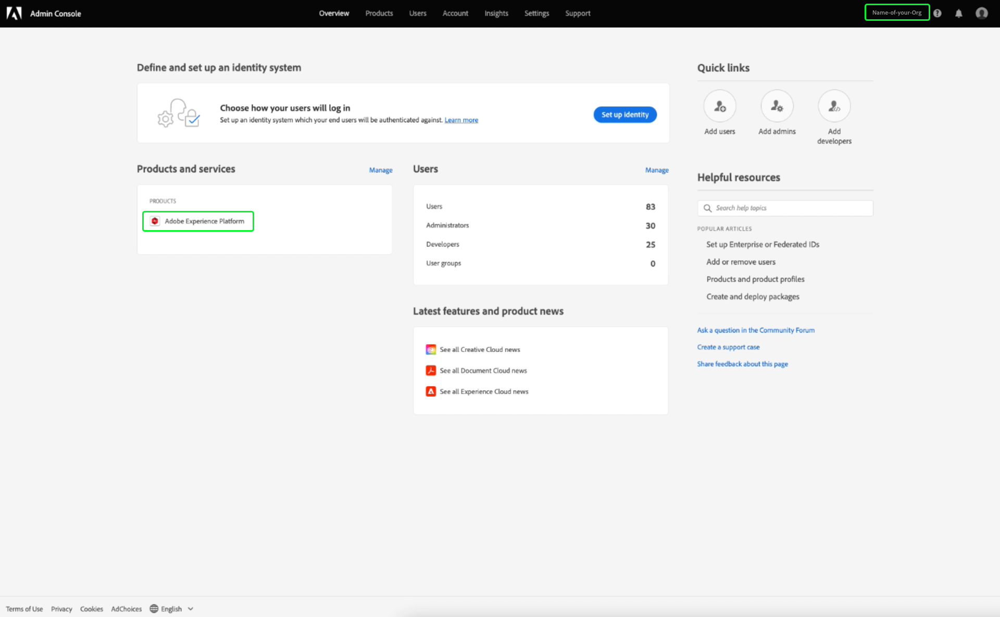
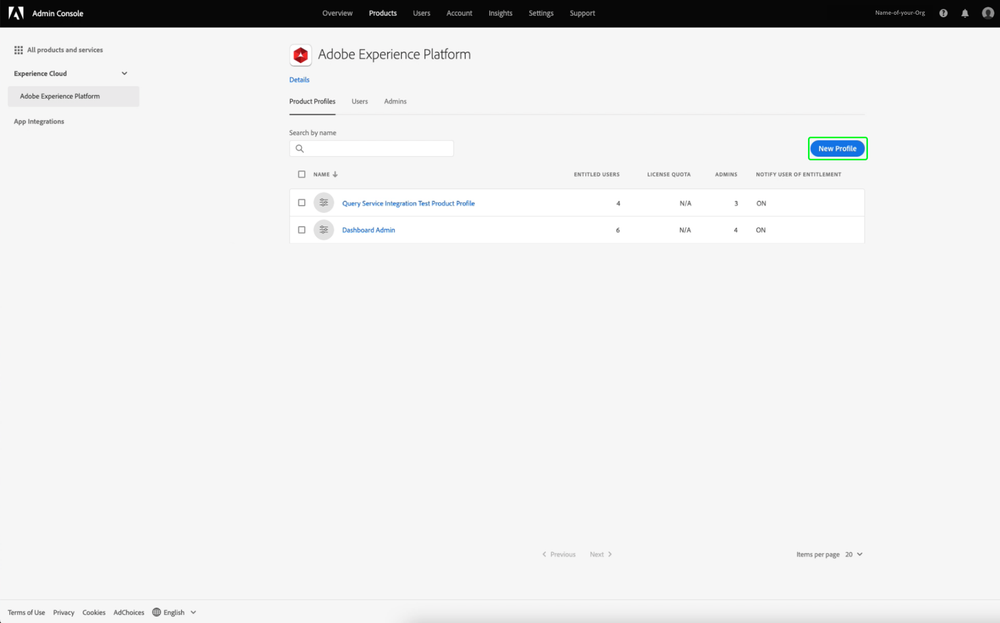
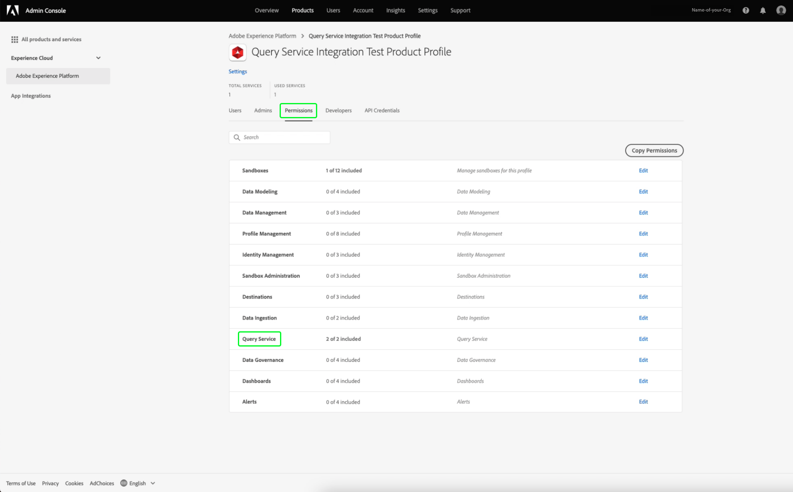
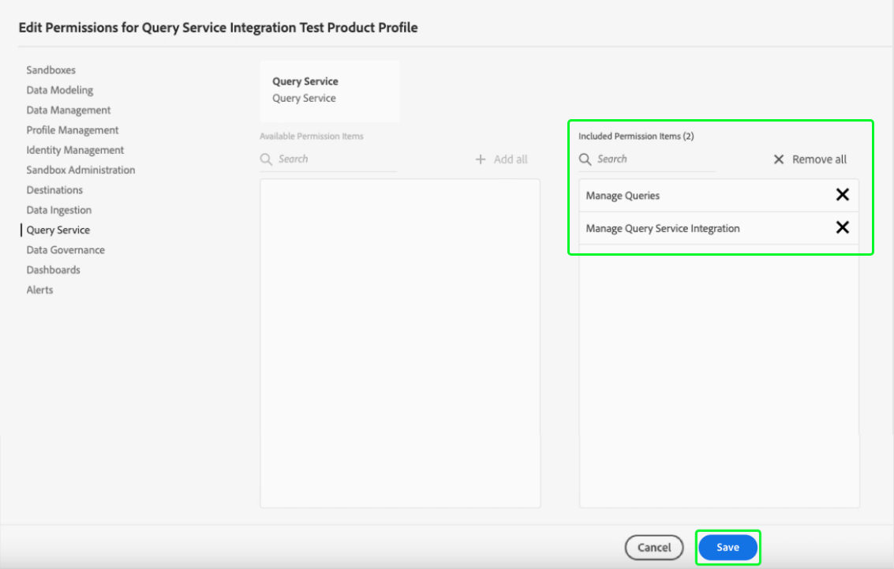
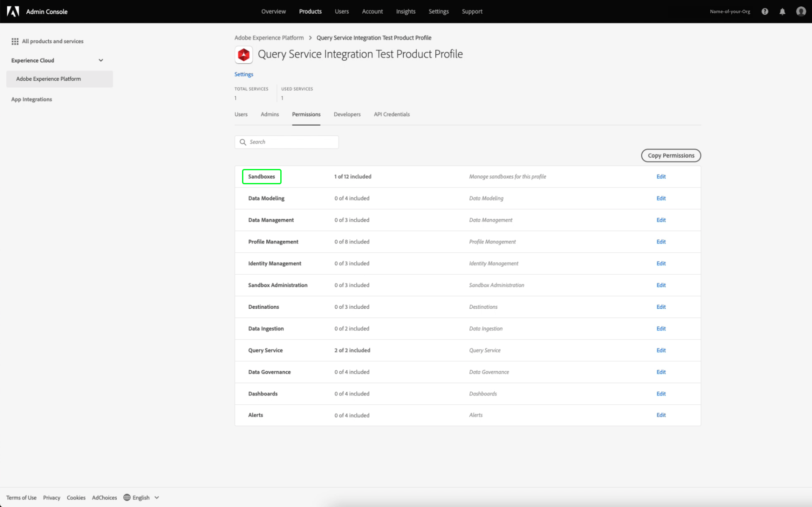
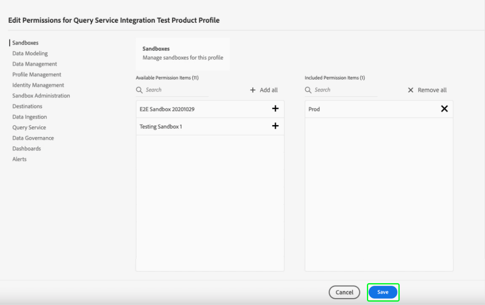
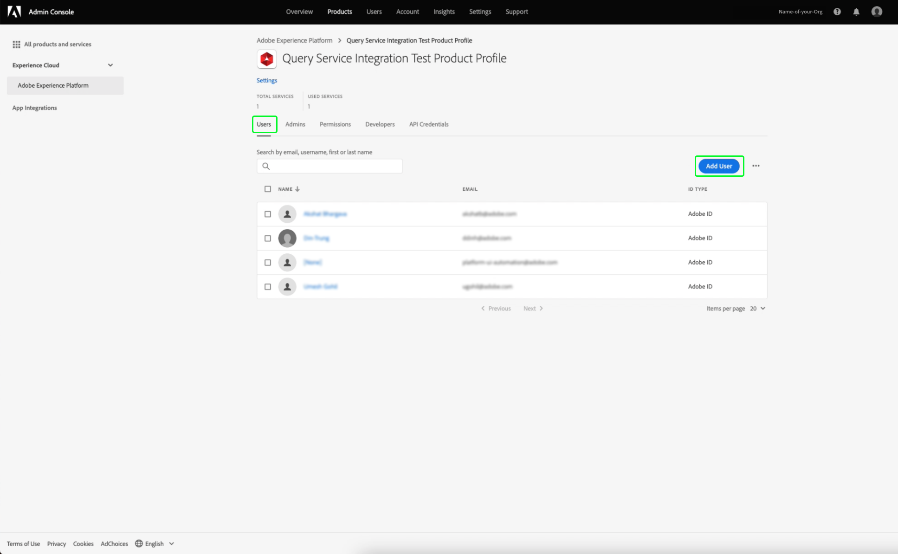
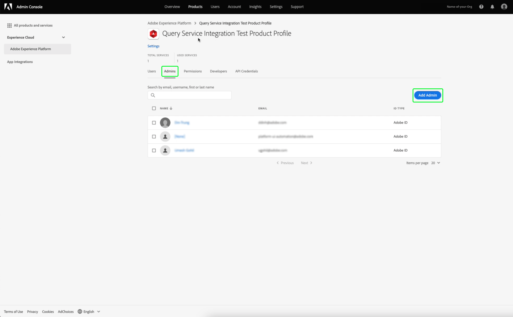
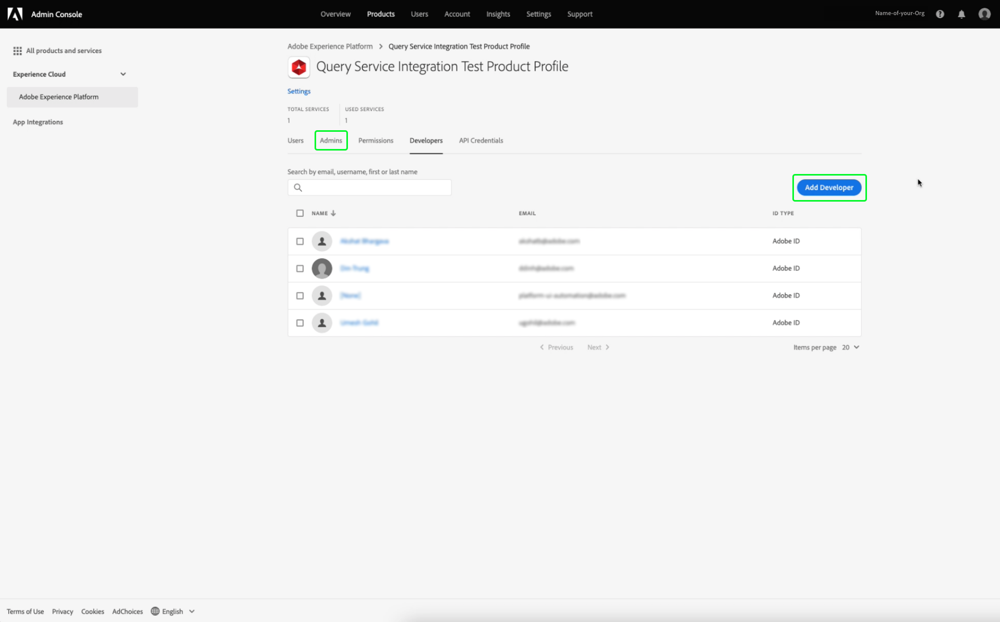

# Credentials guide

Adobe Experience Platform Query Service allows you to connect with external clients. You can connect to these external clients by using either expiring credentials or non-expiring credentials.

## Expiring credentials

You can use expiring credentials to quickly set up a connection to an external client.


The **[!UICONTROL Expiring credentials]** section provides the following information:

- **[!UICONTROL Host]**: The name of the host that you will be connecting to. For connecting to Query Service, this will include the name of the IMS Organization you are currently using.
- **[!UICONTROL Port]**: The port number of the host that you will be connecting to.
- **[!UICONTROL Database]**: The name of the database that you will be connecting to.
- **[!UICONTROL Username]**: The username that you will use to connect to Query Service.
- **[!UICONTROL Password]**: The password that you will use to connect to Query Service.
- **[!UICONTROL PSQL command]**: A command that automatically has inserted all the relevant information for you to connect to Query Service using PSQL on the command line.
- **[!UICONTROL Expires]**: The expiry date for the expiring credentials. The credentials expire 24 hours after they are generated.

## Non-expiring credentials 

You can use non-expiring credentials to set up a more permanent connection to an external client.

Before you can create non-expiring credentials, you must configure both the **Sandboxes** and **Manage Query Service Integration** permissions for your Org in the Adobe Admin Console. 

Log into [Adobe Admin Console](https://adminconsole.adobe.com/) and select the relevant Org from the top navigation bar.

In the [!UICONTROL Products and services] section of the [!UICONTROL Overview], select **Adobe Experience Platform**.



The Adobe Experience Platform Details page appears. Next, create a new profile. Select [!UICONTROL **New Profile**].



A profile creation dialog appears. Enter a descriptive name for the new profile and select [!UICONTROL **Save**]. The [!UICONTROL Settings] page for your new profile appears. Select the [!UICONTROL **Permissions**] tab from the available options.

### Enable Query Service Permissions

To ensure the correct Query Service permissions are enabled for your Org, find and select the [!UICONTROL **Query Service**] category from the list.



The [!UICONTROL Edit Permissions] workspace for Query Service appears. Select the plus (**+**) icon for [!UICONTROL **Manage Queries**], and [!UICONTROL **Manage Query Service Integration**] to add them to the [!UICONTROL Included Permission Items] column. Next, select [!UICONTROL **Save**] to confirm your changes.



This returns you to the Settings > Permissions tab.

### Enable Sandbox Permissions

To ensure the correct sandbox is selected for your Org, find and select the [!UICONTROL **Sandboxes**] category from the list.



The Sandboxes workspace appears. From the [!UICONTROL Available Permission Items], find the relevant sandbox, in this image it is the Prod sandbox. Select the plus (**+**) icon to add it to the [!UICONTROL Included Permission Items]. Next, select [!UICONTROL **Save**] to confirm your changes.



This returns you to the Settings > Permissions tab.

There are three more steps required to allow a user access to the non-expiring account feature.

1. Add a new user to grant the newly created permissions to. Select the [!UICONTROL **Users**] tab, followed by [!UICONTROL **Add User**]. 



- The create user dialog appears. Input a name and email for the new user and select [!UICONTROL **Save**].

1. The user must then be added as an admin to allow an account creation for any active product profile. Select the [!UICONTROL **Admins**] tab, followed by [!UICONTROL**Add Admins**] to add the newly created user as an admin.  
 


- The add admin dialog appears. Input the new admin's details into the text fields and select [!UICONTROL **Save**].

1. The user must then be added as a developer for an integration to be created. Select the **Developers** tab, followed by the **Add Developer**.



- The add developer dialog appears. Input the new developer's details into the text fields and select **Save**.

To learn more about how to assign permissions, please read the documentation on [Access Control](../../access-control/home.md).

All the required permissions are now configured in the Adobe Developer console for the user to use the expiring credentials feature. 

To create a set of non-expiring credentials, in the Queries Credentials workspace select **[!UICONTROL Generate credentials]**.


The generate credentials modal appears. To create non-expiring credentials, you will need to provide the following details:

- **[!UICONTROL Name]**: The name of the credentials you are generating.
- **[!UICONTROL Description]**: (Optional) A description for the credentials you are generating.
- **[!UICONTROL Assigned to]**: The user that the credentials will be assigned to. This value should be the email address of the user who is creating the credentials.
- **[!UICONTROL Password]** (Optional) An optional password for your credentials. If the password is not set, Adobe will automatically generate a password for you. 

Once you have provided all the required details, select **[!UICONTROL Generate credentials]** to generate your credentials.


>[!IMPORTANT]
>
>Once the **[!UICONTROL Generate credentials]** button is selected, a configuration JSON file is downloaded to your local machine. Since Adobe does **not** record the generated credential, you **must** securely store the downloaded file and keep a record of the credential.
>
>Additionally, if the credentials are not used for 90 days, the credentials will be pruned.

The configuration JSON file contains information such as technical account name, technical account ID, and credential. It is provided in the following format.

```json
{"technicalAccountName":"9F0A21EE-B8F3-4165-9871-846D3C8BC49E@TECHACCT.ADOBE.COM","credential":"3d184fa9e0b94f33a7781905c05203ee","technicalAccountId":"4F2611B8613AA3670A495E55"}
```

Now that you have saved your generated credentials, select **[!UICONTROL Close]**. You can now see a list of all your non-expiring credentials.


You can either edit or delete your non-expiring credentials. To edit a non-expiring credential, select the pencil icon (). To delete a non-expiring credential, select the delete icon ().

When editing a non-expiring credential, a modal appears. You can provide the following details to update:

- **[!UICONTROL Name]**: The name of the credentials you are generating.
- **[!UICONTROL Description]**: (Optional) A description for the credentials you are generating.
- **[!UICONTROL Assigned to]**: The user that the credentials will be assigned to. This value should be the email address of the user who is creating the credentials.


Once you have provided all the required details, select **[!UICONTROL Update account]** to complete the update to your credentials.

## Using credentials to connect to external clients

You can use either the expiring or non-expiring credentials to connect with external clients, such as Aqua Data Studio, Looker, or Power BI. 

The table below contains the list of parameters and their description, typically required to connect to external clients.

>[!NOTE]
>
>When connecting to a host using non-expiring credentials, it is still necessary to use all the parameters listed in the [!UICONTROL EXPIRING CREDENTIALS] section except for the password.

| Parameter | Description |
|---|---|
| **Server/Host**  | The name of the server/host that you are connecting to. This value takes the form of `server.adobe.io` and can be found under **[!UICONTROL Host]**.  |
| **Port**  | The port for the server/host you are connecting to. This value can be found under **[!UICONTROL Port]**. An example value for the port would be `80`.  |
| **Database**  | The database that you are connecting to. This value can be found under **[!UICONTROL Database]**. An example value for the database would be `prod:all`. |
| **Username**  | The username for the user who is connecting to the external client. This takes the form of an alphanumeric string before `@AdobeOrg`. This value is found under **[!UICONTROL Username]**.  |
| **Password**  | The password for the user who is connecting to the external client. <ul><li>If you're using expiring credentials, this can be found under **[!UICONTROL Password]** within the expiring credentials section.</li><li>If you're using non-expiring credentials, this value is comprised of the arguments from the technicalAccountID and the credential taken from the configuration JSON file. The password value takes the form: `{technicalAccountId}:{credential}`.</li></ul>  |

## Next steps

Now that you understand how both expiring and non-expiring credentials work, you can use these credentials to connect to external clients. For more information detailed information about external clients, please read the [connect clients to Query Service guide](../clients/overview.md).
