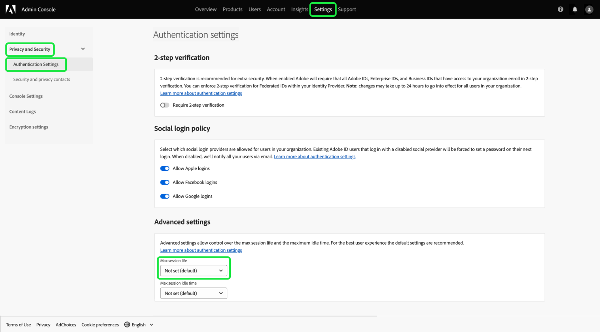
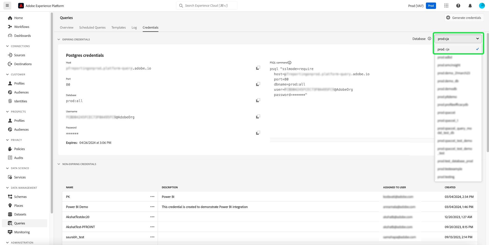

# Credentials guide

Adobe Experience Platform Query Service allows you to connect with external clients. You can connect to these external clients by using either expiring credentials or non-expiring credentials.

>[!NOTE]
>
>The credentials panel is not automatically available to all users. Please contact your Adobe account team to request the [!UICONTROL Credentials] tab to be included in the Query Service workspace should you require it. If requested, this change is organization wide and is conducted by Adobe's engineering team. It is not a setting controlled by users.

## Expiring credentials {#expiring-credentials} 

>[!CONTEXTUALHELP]
>id="platform_queryservice_credentials_expiringcredentials"
>title="Client's SSL mode"
>abstract="SSL must be enabled in clients connected to Query Service. Ensure the SSL mode is set to 'require'."

You can use expiring credentials to quickly set up a connection to an external client. 


The **[!UICONTROL Expiring credentials]** section provides the following information:

- **[!UICONTROL Host]**: The name of the host to connect your client to. This incorporates the name of your organization as seen in the top ribbon of the Experience Platform UI.
- **[!UICONTROL Port]**: The port number of the host to connect to.
- **[!UICONTROL Database]**: The name of the database to connect a client to.
- **[!UICONTROL Username]**: The username used to connect to Query Service.
- **[!UICONTROL Password]**: The password used to connect to Query Service. Passwords in the UI have been hashed for security. Select the copy icon () to copy your complete, un-hashed credentials to the clipboard.
- **[!UICONTROL PSQL command]**: A command that automatically has inserted all the relevant information for you to connect to Query Service using PSQL on the command line.
- **[!UICONTROL Expires]**: The expiry date and time for the expiring credentials. The default validity duration of the token is 24 hours but it can be changed in the advanced settings of the Admin Console.

>[!TIP]
>
>To change the session life for your expiring credentials connection to Query Service, navigate to the [Admin Console](https://adminconsole.adobe.com/) and select the following on screen options: **Settings** > **Privacy and Security** > **Authentication Settings** > **Advanced settings** > **Max session life**.
>
>
>
>See the Adobe Help documentation for more information on the [Advanced settings](https://helpx.adobe.com/enterprise/using/authentication-settings.html#advanced-settings) offered by Admin console.

### Connect to Customer Journey Analytics data within query sessions {#connect-to-customer-journey-analytics}

Use the Customer Journey Analytics BI extension with Power BI or Tableau to access your Customer Journey Analytics [data views](https://experienceleague.adobe.com/en/docs/analytics-platform/using/cja-dataviews/data-views) with SQL. By integrating Query Service with the BI extension, you can access your data views directly within Query Service sessions. This integration streamlines functionality for BI tools that use Query Service as their PostgreSQL interface. This functionality eliminates the need to duplicate data views in BI tools, ensures consistent reporting across platforms, and simplifies the integration of Customer Journey Analytics data with other sources in BI platforms.

See the documentation to learn how to [connect Query Service to a variety of desktop client applications](../clients/overview.md) such as [Power BI](../clients/power-bi.md) or [Tableau](../clients/tableau.md)

>[!IMPORTANT]
>
>A Customer Journey Analytics workspace project and a data view are required to use this functionality.

To access your Customer Journey Analytics data in either Power BI or Tableau, select the [!UICONTROL Database] dropdown menu, then select `prod:cja` from the available options. Next, copy your [!DNL Postgres] credentials parameters (Host, Port, Database, Username, and others) for use in your Power BI or Tableau configuration. 



>[!NOTE]
>
>When you connect Power BI or Tableau to Customer Journey Analytics, the Query Service 'concurrent sessions' entitlement is consumed. If additional sessions and queries are required, an additional ad hoc query users pack add-on can be purchased to obtain five additional concurrent sessions and one additional concurrent query.

You can also access your Customer Journey Analytics data directly from the Query Editor or Postgres CLI. To do this, reference the `cja` database when writing your query. See the Query Editor [query authoring guide](./user-guide.md#query-authoring) for more information on how to write, execute, and save queries. 

See the [BI extension guide](https://experienceleague.adobe.com/en/docs/analytics-platform/using/cja-dataviews/bi-extension) for complete instructions on accessing your Customer Journey Analytics data views with SQL.

## Non-expiring credentials {#non-expiring-credentials}

>[!CONTEXTUALHELP]
>id="platform_queryservice_credentials_migratenonexpiringcredentials"
>title="Migrate to OAuth Server-to-Server Credential"
>abstract="This migration is required as JWT credentials will stop working after June 30, 2025. It takes about 30–40 seconds and can't be canceled once started. All existing jobs and integrations will continue to work with OAuth after migration. You can leave this screen and return any time to check the status."

You can use non-expiring credentials to set up a more permanent connection to an external client.

>[!IMPORTANT]
>
>The first time you create or migrate a non-expiring credential to OAuth Server-to-Server, you must use a System Admin account. Only a System Admin can perform this action for your organization. If a non-System Admin attempts this step, the process will fail with an authorization error. After the initial setup, subsequent non-expiring credentials can be created or migrated by users with the required permissions.

>[!NOTE]
>
>Non-expiring credentials have the following limitations:
>
>- Users must log in with their username and password in the format of `{technicalAccountId}:{credential}`. More information can be found in the [Generate credentials](#generate-credentials) section.
>- By default, non-expiring credentials are granted permissions to execute only `SELECT` queries. To run `CTAS` or `ITAS` queries, manually add the "Manage Dataset" and "Manage Schemas" permissions to the role associated with the non-expiring credential. The "Manage Schemas" permission can be found under the "Data Modeling" section, and the "Manage Datasets" permission is located under the "Data Management" section of the [Adobe Developer Console](<https://developer.adobe.com/console/>).
>- Third-party clients may perform differently than expected when listing out query objects. For example, some third-party clients such as [!DNL DB Visualizer] will not display the view name in the left panel. However, the view name is accessible if called within a `SELECT` query. Similarly, [!DNL PowerUI] might not list the temporary views created through SQL for selection in dashboard creation.

### Prerequisites

Before you can generate non-expiring credentials, you must complete the following steps in Adobe Admin Console:

1. Log into [Adobe Admin Console](https://adminconsole.adobe.com/) and select the relevant organization from the top navigation bar.
2. [Select a product profile.](../../access-control/ui/browse.md)
3. [Configure both the **Sandboxes** and **Manage Query Service Integration** permissions](../../access-control/ui/permissions.md) for the product profile.
4. [Add a new user to a product profile](../../access-control/ui/users.md) so they are granted its configured permissions.
5. [Add the user as a product profile admin](https://helpx.adobe.com/enterprise/using/manage-product-profiles.html) to allow an account creation for any active product profile.
6. [Add the user as a product profile developer](https://helpx.adobe.com/enterprise/using/manage-developers.html) in order to create an integration.

After these steps, the required permissions are configured in [Adobe Developer Console](https://developer.adobe.com/console/) for you to generate OAuth Server-to-Server credentials and use the expiring or non-expiring credentials features.

For detailed information on assigning permissions, see the [access control documentation](../../access-control/home.md).

### Generate credentials {#generate-credentials}

To create a set of non-expiring credentials, return to the Experience Platform UI and select **[!UICONTROL Queries]** from the left navigation to access the [!UICONTROL Queries] workspace. Next, select the **[!UICONTROL Credentials]** tab followed by **[!UICONTROL Generate credentials]**.


A dialog appears that allows you to generate credentials. To create non-expiring credentials, you must provide the following details:

- **[!UICONTROL Name]**: The name of the credentials you are generating.
- **[!UICONTROL Description]**: (Optional) A description for the credentials you are generating.
- **[!UICONTROL Assigned to]**: The user to which the credentials will be assigned. This value should be the email address of the user who is creating the credentials.
- **[!UICONTROL Password]** (Optional) An optional password for your credentials. If the password is not set, Adobe will automatically generate a password for you. 

Once you have provided all the required details, select **[!UICONTROL Generate credentials]** to generate your credentials.


>[!IMPORTANT]
>
>When **[!UICONTROL Generate credentials]** is selected, a configuration JSON file is downloaded to your local machine. Since Adobe does **not** record the generated credentials, you must securely store the downloaded file and keep a record of the credential.
>
>Additionally, if the credentials are not used for 90 days, the credentials will be expunged.

The configuration JSON file contains information such as technical account name, technical account ID, and credential. It is provided in the following format.

```json
{"technicalAccountName":"9F0A21EE-B8F3-4165-9871-846D3C8BC49E@TECHACCT.ADOBE.COM","credential":"3d184fa9e0b94f33a7781905c05203ee","technicalAccountId":"4F2611B8613AA3670A495E55"}
```

After you have saved your generated credentials, select **[!UICONTROL Close]**. You can now see a list of all your non-expiring credentials.


You can either edit or delete your non-expiring credentials. To edit a non-expiring credential, select the pencil icon (). To delete a non-expiring credential, select the delete icon ().

When editing a non-expiring credential, a modal appears. You can provide the following details to update:

- **[!UICONTROL Name]**: The name of the credentials you are generating.
- **[!UICONTROL Description]**: (Optional) A description for the credentials you are generating.
- **[!UICONTROL Assigned to]**: The user to which the credentials will be assigned. This value should be the email address of the user who is creating the credentials.


Once you have provided all the required details, select **[!UICONTROL Update account]** to complete the update to your credentials.

### Migrate credentials to OAuth {#migrate-credentials}

If you are using non-expiring JWT credentials, you must migrate each one to OAuth Server-to-Server before June 30, 2025 to avoid service disruption.

>[!IMPORTANT]
>
>JWT credentials will stop working after June 30, 2025. You must manually complete this migration to maintain authorization.

To learn how to identify affected credentials and complete the migration, see the [migrate from JWT to OAuth Server-to-Server credentials guide](./migrate-jwt-to-oauth.md).

For common questions, refer to the [migration FAQ](./migrate-jwt-to-oauth.md#faq).

## Use credentials to connect to external clients {#use-credential-to-connect}

You can use either the expiring or non-expiring credentials to connect with external clients, such as Aqua Data Studio, Looker, or Power BI. The method of input for these credentials will vary depending on the external client. Refer to the external client's documentation for specific instructions on the use of these credentials.

The image indicates the location of each parameter found in the UI except for the password of the non-expiring credentials. While non-expiring credentials are provided by their JSON configuration files, you can view your expiring credentials under the **Credentials** tab in the UI.


The table below outlines the parameters that are typically required to connect to external clients.

>[!NOTE]
>
>When connecting to a host using non-expiring credentials, it is still necessary to use all the parameters listed in the [!UICONTROL EXPIRING CREDENTIALS] section except for the password and username.
>The format for entering your username and password uses colon separated values as seen in this example `username:{your_username}` and `password:{password_string}`.

| Parameter | Description | Example |
|---|---|---|
| **Server/Host**  | The name of the server/host that you are connecting to. <ul><li>This value is used for both expiring credentials and non-expiring credentials and takes the form of `server.adobe.io`. The value is found under **[!UICONTROL Host]** in the [!UICONTROL EXPIRING CREDENTIALS] section.</ul></li> | `acme.platform.adobe.io` |
| **Port**  | The port for the server/host you are connecting to. <ul><li>This value is used for both expiring credentials and non-expiring credentials and is found under **[!UICONTROL Port]** in the [!UICONTROL EXPIRING CREDENTIALS] section.</ul></li>  | `80` |
| **Database**  | The database that you are connecting to. <ul><li>This value is used for both expiring credentials and non-expiring credentials and found under **[!UICONTROL Database]** in the [!UICONTROL EXPIRING CREDENTIALS] section. </ul></li> | `prod:all` |
| **Username**  | The username for the user who is connecting to the external client. <ul><li>This value is used for both expiring credentials and non-expiring credentials. It takes the form of an alphanumeric string before `@AdobeOrg`. This value is found under **[!UICONTROL Username]**.</li></ul>  | `ECBB80245ECFC73E8A095EC9@AdobeOrg` |
| **Password**  | The password for the user who is connecting to the external client. <ul><li>If you're using expiring credentials, this can be found under **[!UICONTROL Password]** within the [!UICONTROL EXPIRING CREDENTIALS] section.</li><li>If you're using non-expiring credentials, this value is the concatenated arguments from the technicalAccountID and the credential taken from the configuration JSON file. The password value takes the form: `{technicalAccountId}:{credential}`.</li></ul>  | <ul><li>An expiring credential password is over a thousand character alpha-numeric string. No example will be given.</li><li>A non-expiring credential password is as follows:<br>`4F2611B8613DK3670V495N55:3d182fa9e0b54f33a7881305c06203ee`</li></ul> |

{style="table-layout:auto"}

## Next steps

Now that you understand how both expiring and non-expiring credentials work, you can use these credentials to connect to external clients. For more information detailed information about external clients, please read the [connect clients to Query Service guide](../clients/overview.md).
