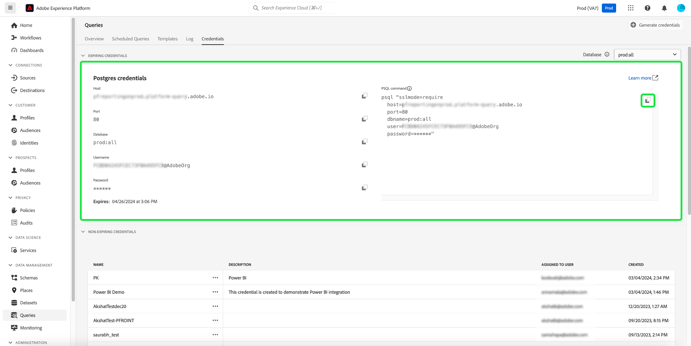
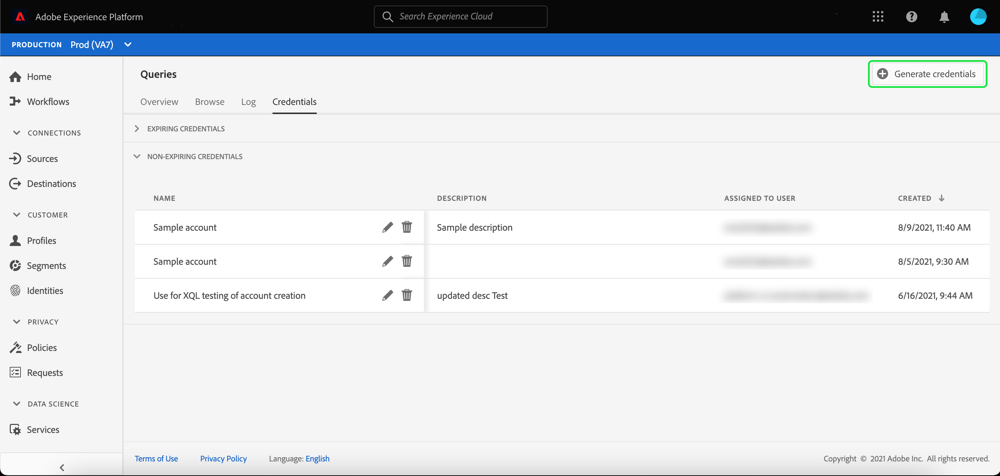
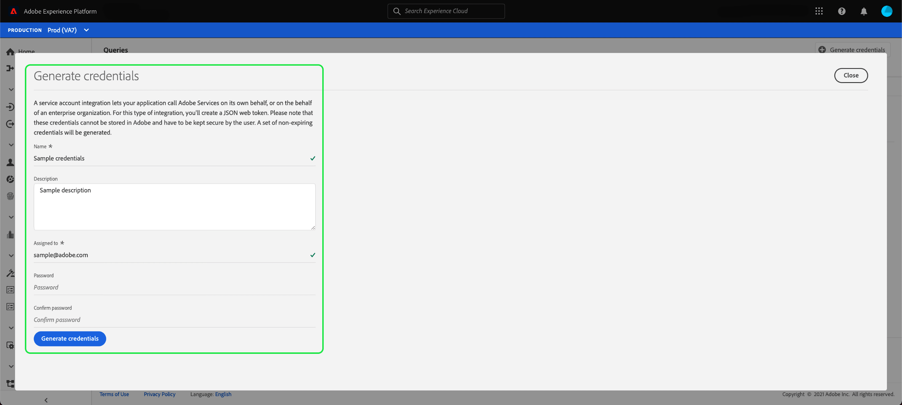
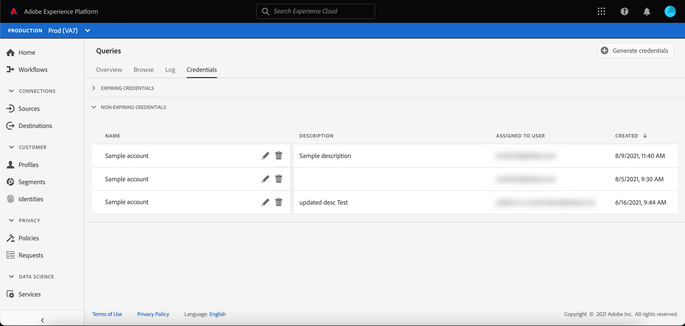
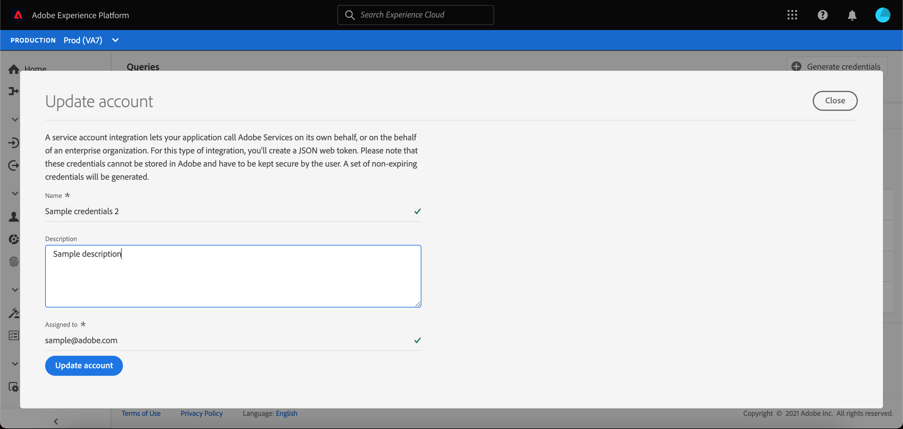

# Credentials guide

Adobe Experience Platform Query Service allows you to connect with external clients. You can connect to these external clients by using either expiring credentials or non-expiring credentials.

## Expiring credentials {#expiring-credentials}

>[!CONTEXTUALHELP]
>id="platform_queryservice_credentials_expiringcredentials"
>title="Client's SSL mode"
>abstract="SSL must be enabled in clients connected to Query Service. Ensure the SSL mode is set to 'require'."

You can use expiring credentials to quickly set up a connection to an external client.



The **[!UICONTROL Expiring credentials]** section provides the following information:

- **[!UICONTROL Host]**: The name of the host that you will be connecting to. For connecting to Query Service, this will include the name of the IMS Organization you are currently using.
- **[!UICONTROL Port]**: The port number of the host that you will be connecting to.
- **[!UICONTROL Database]**: The name of the database that you will be connecting to.
- **[!UICONTROL Username]**: The username that you will use to connect to Query Service.
- **[!UICONTROL Password]**: The password that you will use to connect to Query Service.
- **[!UICONTROL PSQL command]**: A command that automatically has inserted all the relevant information for you to connect to Query Service using PSQL on the command line.
- **[!UICONTROL Expires]**: The expiry date and time for the expiring credentials. The default validity duration of the token is 24 hours but it can be changed in the advanced settings of the [Admin Console](https://adminconsole.adobe.com/). The credentials expire 24 hours after they are generated.

## Non-expiring credentials {#non-expiring-credentials}

You can use non-expiring credentials to set up a more permanent connection to an external client.

### Prerequisites

Before you can generate non-expiring credentials, you must complete the following steps in Adobe Admin Console:

1. Log into [Adobe Admin Console](https://adminconsole.adobe.com/) and select the relevant Org from the top navigation bar.
2. [Select a product profile.](../../access-control/ui/browse.md)
3. [Configure both the **Sandboxes** and **Manage Query Service Integration** permissions](../../access-control/ui/permissions.md) for the product profile.
4. [Add a new user to a product profile](../../access-control/ui/users.md) so they are granted its configured permissions.
5. [Add the user as a product profile admin](https://helpx.adobe.com/enterprise/using/manage-product-profiles.html) to allow an account creation for any active product profile.
6. [Add the user as a product profile developer](https://helpx.adobe.com/enterprise/using/manage-developers.html) in order to create an integration.

To learn more about how to assign permissions, please read the documentation on [access control](../../access-control/home.md).

All the required permissions are now configured in Adobe Developer Console for the user to use the expiring credentials feature.

### Generate credentials

To create a set of non-expiring credentials, return to the Platform UI and select **[!UICONTROL Queries]** from the left navigation to access the [!UICONTROL Queries] workspace. Next, select the **[!UICONTROL Credentials]** tab followed by **[!UICONTROL Generate credentials]**.



A dialog appears that allows you to generate credentials. To create non-expiring credentials, you must provide the following details:

- **[!UICONTROL Name]**: The name of the credentials you are generating.
- **[!UICONTROL Description]**: (Optional) A description for the credentials you are generating.
- **[!UICONTROL Assigned to]**: The user to which the credentials will be assigned. This value should be the email address of the user who is creating the credentials.
- **[!UICONTROL Password]** (Optional) An optional password for your credentials. If the password is not set, Adobe will automatically generate a password for you. 

Once you have provided all the required details, select **[!UICONTROL Generate credentials]** to generate your credentials.



>[!IMPORTANT]
>
>When **[!UICONTROL Generate credentials]** is selected, a configuration JSON file is downloaded to your local machine. Since Adobe does **not** record the generated credentials, you must securely store the downloaded file and keep a record of the credential.
>
>Additionally, if the credentials are not used for 90 days, the credentials will be expunged.

The configuration JSON file contains information such as technical account name, technical account ID, and credential. It is provided in the following format.

```json
{"technicalAccountName":"9F0A21EE-B8F3-4165-9871-846D3C8BC49E@TECHACCT.ADOBE.COM","credential":"3d184fa9e0b94f33a7781905c05203ee","technicalAccountId":"4F2611B8613AA3670A495E55"}
```

After you have saved your generated credentials, select **[!UICONTROL Close]**. You can now see a list of all your non-expiring credentials.



You can either edit or delete your non-expiring credentials. To edit a non-expiring credential, select the pencil icon (). To delete a non-expiring credential, select the delete icon ().

When editing a non-expiring credential, a modal appears. You can provide the following details to update:

- **[!UICONTROL Name]**: The name of the credentials you are generating.
- **[!UICONTROL Description]**: (Optional) A description for the credentials you are generating.
- **[!UICONTROL Assigned to]**: The user to which the credentials will be assigned. This value should be the email address of the user who is creating the credentials.



Once you have provided all the required details, select **[!UICONTROL Update account]** to complete the update to your credentials.

## Use credentials to connect to external clients {#use-credential-to-connect}

You can use either the expiring or non-expiring credentials to connect with external clients, such as Aqua Data Studio, Looker, or Power BI. The method of input for these credentials will vary depending on the external client. Refer to the external client's documentation for specific instructions on the use of these credentials.

The image indicates the location of each parameter found in the UI except for the password of the non-expiring credentials. While non-expiring credentials are provided by their JSON configuration files, you can view your expiring credentials under the **Credentials** tab in the UI.


The table below outlines the parameters that are typically required to connect to external clients.

>[!NOTE]
>
>When connecting to a host using non-expiring credentials, it is still necessary to use all the parameters listed in the [!UICONTROL EXPIRING CREDENTIALS] section except for the password and username.
>The format for entering your username and password uses colon separated values as seen in this example `username:{your_username}` and `password:{password_string}`.

| Parameter | Description |
|---|---|
| **Server/Host**  | The name of the server/host that you are connecting to. <ul><li>This value is used for both expiring credentials and non-expiring credentials and takes the form of `server.adobe.io`. The value is found under **[!UICONTROL Host]** in the [!UICONTROL EXPIRING CREDENTIALS] section.</ul></li> |
| **Port**  | The port for the server/host you are connecting to. <ul><li>This value is used for both expiring credentials and non-expiring credentials and is found under **[!UICONTROL Port]** in the [!UICONTROL EXPIRING CREDENTIALS] section. An example value for the port would be `80`.</ul></li>  |
| **Database**  | The database that you are connecting to. <ul><li>This value is used for both expiring credentials and non-expiring credentials and found under **[!UICONTROL Database]** in the [!UICONTROL EXPIRING CREDENTIALS] section. An example value for the database would be `prod:all`.</ul></li> |
| **Username**  | The username for the user who is connecting to the external client. <ul><li>This value is used for both expiring credentials and non-expiring credentials. It takes the form of an alphanumeric string before `@AdobeOrg`. This value is found under **[!UICONTROL Username]**.</li></ul>  |
| **Password**  | The password for the user who is connecting to the external client. <ul><li>If you're using expiring credentials, this can be found under **[!UICONTROL Password]** within the [!UICONTROL EXPIRING CREDENTIALS] section.</li><li>If you're using non-expiring credentials, this value is the concatenated arguments from the technicalAccountID and the credential taken from the configuration JSON file. The password value takes the form: `{technicalAccountId}:{credential}`.</li></ul>  |

## Next steps

Now that you understand how both expiring and non-expiring credentials work, you can use these credentials to connect to external clients. For more information detailed information about external clients, please read the [connect clients to Query Service guide](../clients/overview.md).
