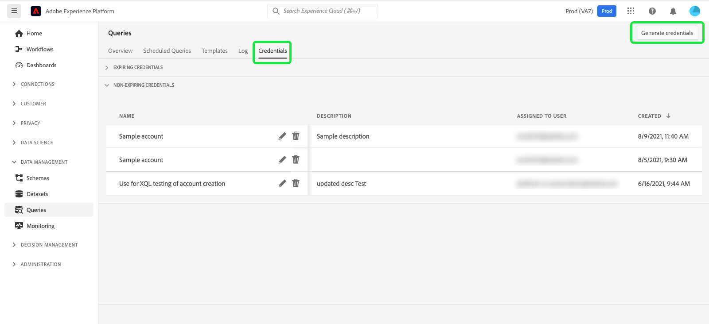

# Credentials guide

Adobe Experience Platform Query Service allows you to connect with external clients. You can connect to these external clients by using either expiring credentials or non-expiring credentials.

## Expiring credentials

You can use expiring credentials to quickly set up a connection to an external client.

The **[!UICONTROL Expiring credentials]** section provides the following information:

- **[!UICONTROL Host]**: The name of the host that you will be connecting to. For connecting to Query Service, this will include the name of the IMS Organization you are currently using.
- **[!UICONTROL Port]**: The port number of the host that you will be connecting to.
- **[!UICONTROL Database]**: The name of the database that you will be connecting to.
- **[!UICONTROL Username]**: The username that you will use to connect to Query Service.
- **[!UICONTROL Password]**: The password that you will use to connect to Query Service.
- **[!UICONTROL PSQL command]**: A command that automatically has inserted all the relevant information for you to connect to Query Service using PSQL on the command line.
- **[!UICONTROL Expires]**: The expiry date for the expiring credentials. The credentials expire 24 hours after they are generated.

## Non-expiring credentials 

You can use non-expiring credentials to set up a more permanent connection to an external client.

To create a set of non-expiring credentials, select **[!UICONTROL Generate credentials]**.

>[!NOTE]
>
>Before you can create non-expiring credentials, you must have both the **Sandboxes** and **Manage Query Service Integration** permissions. To learn how to assign these permissions, please read the documentation on [Access Control](../../access-control/home.md).

The generate credentials modal appears. To create non-expiring credentials, you will need to provide the following details:

- **[!UICONTROL Name]**: The name of the credentials you are generating.
- **[!UICONTROL Description]**: (Optional) A description for the credentials you are generating.
- **[!UICONTROL Assigned to]**: The user that the credentials will be assigned to. This value should be the email address of the user who is creating the credentials.
- **[!UICONTROL Password]** (Optional) An optional password for your credentials. If the password is not set, Adobe will automatically generate a password for you. 

Once you have provided all the required details, select **[!UICONTROL Generate credentials]** to generate your credentials.

>[!IMPORTANT]
>
>Once the **[!UICONTROL Generate credentials]** button is selected, a configuration file that contains information such as technical account name, technical account ID, and credential. Since Adobe does **not** record the generated credential, you **must** securely store the downloaded file and keep a record of the credential.

Now that you have saved your generated credentials, select **[!UICONTROL Close]**. You can now see a list of all your non-expiring credentials.

You can either edit or delete your non-expiring credentials. To edit a non-expiring credential, select the pencil icon (). To delete a non-expiring credential, select the delete icon ().

When editing a non-expiring credential, a modal appears. You can provide the following details to update:

- **[!UICONTROL Name]**: The name of the credentials you are generating.
- **[!UICONTROL Description]**: (Optional) A description for the credentials you are generating.
- **[!UICONTROL Assigned to]**: The user that the credentials will be assigned to. This value should be the email address of the user who is creating the credentials.

Once you have provided all the required details, select **[!UICONTROL Update account]** to complete the account update.

## Next steps

Now that you understand how both expiring and non-expiring credentials work, you can use these credentials to connect to external clients. For more information about external clients, please read the [connect clients to Query Service guide](../clients/overview.md).