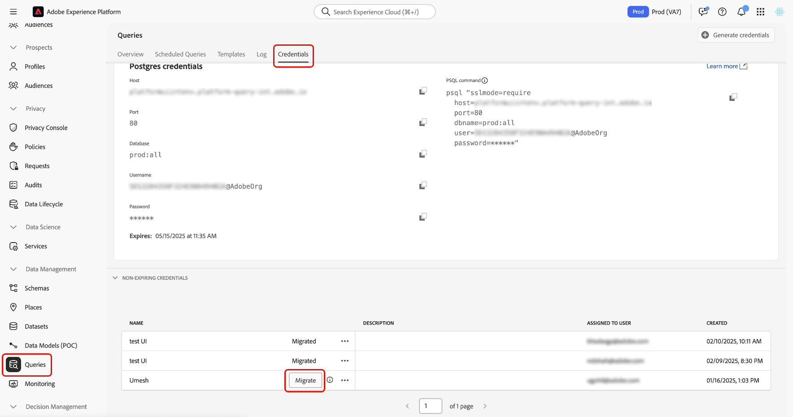

# Migrate from JWT to OAuth Server-to-Server credentials

>[!IMPORTANT]
>
>Adobe is deprecating support for Service Account (JWT) credentials used by Query Service. After June 30, 2025, non-expiring credentials based on JWT will no longer refresh or authenticate API requests. To prevent service interruptions, you must migrate each eligible credential to OAuth Server-to-Server authentication.

This guide shows you how to migrate non-expiring JWT credentials to OAuth Server-to-Server credentials in Adobe Experience Platform. Completing this process ensures uninterrupted access to Query Service before support for JWT credentials ends on June 30, 2025.

This document provides step-by-step instructions for performing the migration, understanding the impact, and verifying your updated credentials.

## Who needs to migrate {#who-needs-to-migrate}

If you use non-expiring credentials in Query Service, you must migrate each one. This applies to credentials used in automated workflows, scheduled queries, or custom API integrations.

If you see credentials listed under the **[!UICONTROL Non-expiring Credentials]** section in the **[!UICONTROL Credentials]** tab, those credentials are affected.

## How to migrate a credential {#how-to-migrate}

You can migrate credentials directly in the Experience Platform UI. To do so, navigate to **[!UICONTROL Queries]** in the left navigation, then select the **[!UICONTROL Credentials]** tab. In the **[!UICONTROL Non-expiring Credentials]** section, identify a credential marked as eligible for migration and select **[!UICONTROL Migrate]** next to it.

>[!NOTE]
>
>The migration takes 8 to 10 seconds and cannot be canceled once started.

After migration, the system updates the credential to use OAuth Server-to-Server authentication. The JWT-based method is retired automatically, and the status updates to **[!UICONTROL Migrated]**.

No reconfiguration is required. Existing jobs and integrations continue to work without interruption.

## What happens after migration {#after-migration}

After you complete the migration:

- Your credential continues to work seamlessly, so no changes are needed in your jobs or integrations.
- Query Service automatically uses OAuth Server-to-Server authentication.
- The JWT-based authentication method is retired and no longer in use.

>[!IMPORTANT]
>
>You cannot undo this change. Once migrated, the credential cannot be reverted to JWT.

## Frequently asked questions {#faq}

These questions address common concerns and help you ensure a smooth, interruption-free migration.

### Why is Adobe deprecating JWT credentials?

OAuth Server-to-Server is a more secure and standardized authentication method. It provides better lifecycle management and supports broader platform consistency.

### What happens if I don't migrate by June 30, 2025?

JWT credentials will stop refreshing, and integrations that rely on them will fail. Adobe cannot migrate credentials on your behalf unless you initiate the process.

### How do I know if I need to migrate?

If a credential appears under the **[!UICONTROL Non-expiring Credentials]** section in the Credentials tab, those credentials must be migrated.

### Do I need to update my integrations or reconfigure anything?

No. After migration, the OAuth credential automatically takes over. No manual changes are required in your jobs or integrations.

### Can I migrate all credentials at once?

No. You must migrate each credential individually using the **[!UICONTROL Migrate]** button.

### Can I continue using expiring credentials?

Yes. Expiring credentials are not affected by this change. Only non-expiring JWT credentials must be migrated.

### I see a message saying "[!UICONTROL No non-expiring credentials found.]" What does that mean? Do I need to take any action?

This message means that you haven't created any non-expiring credentials yet, so there's nothing you need to do.

### I see a message saying "[!UICONTROL AEP admin verification failed]..." What does that mean? Do I need to take any action?

This message indicates that you are either not an Admin or don't have the necessary permissions to create non-expiring credentials.

- If your permissions haven't changed recently, it means you never had access to create credentials, so no action is needed.
- If your permissions were changed recently, contact your organization Admin and ask them to migrate the credentials for you.

### Can I migrate non-expiring credentials for someone else?

Yes, but only if you're an Admin. Only Admins have the permissions needed to create and migrate non-expiring credentials for other users, so they can continue working without disruption.

## Next steps {#next-steps}

Review each non-expiring credential in the [!UICONTROL Credentials] tab and migrate them individually before June 30, 2025. For questions or support, contact your Adobe account representative.
