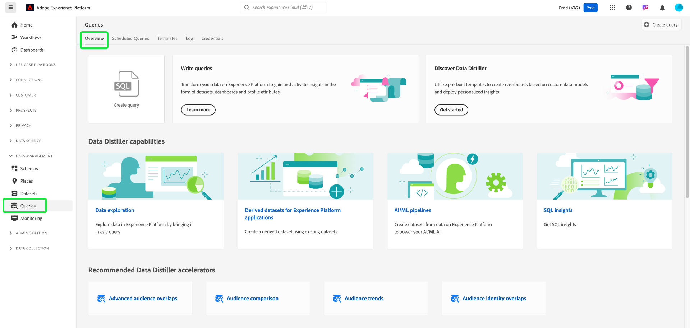
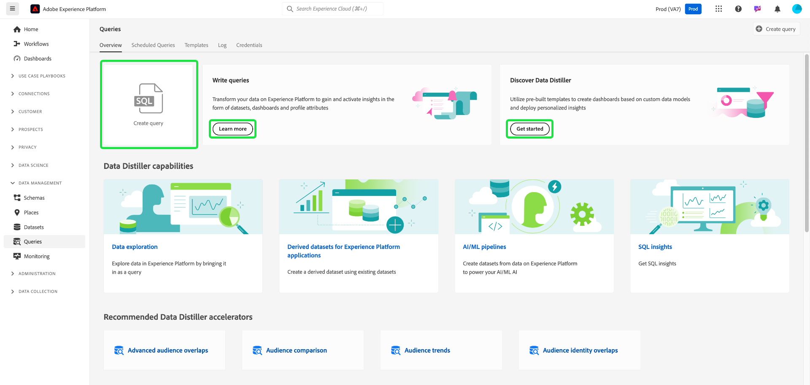
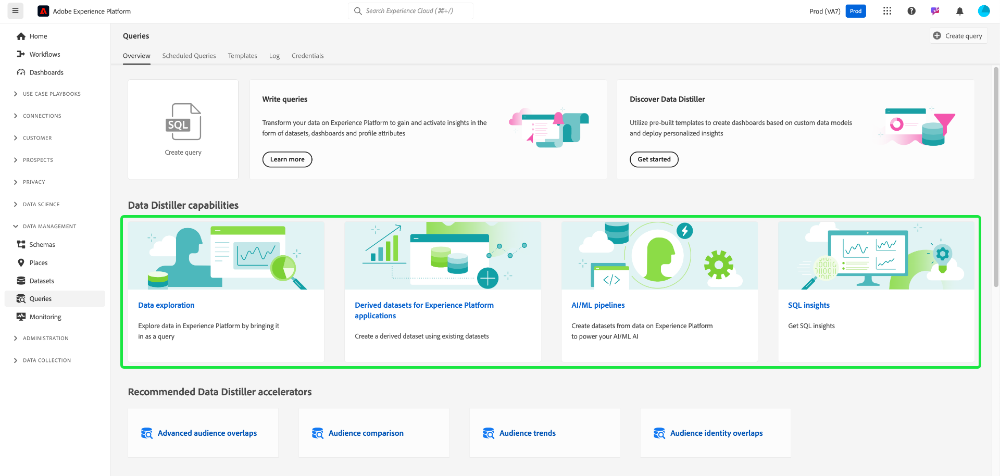
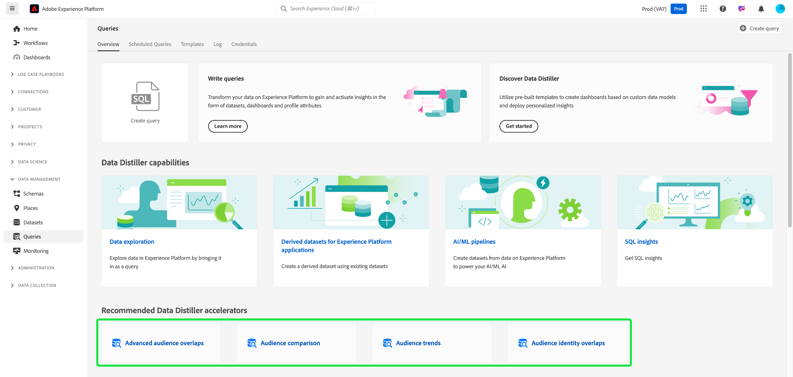
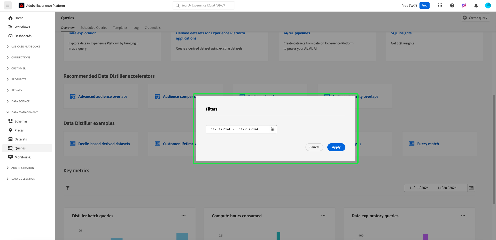
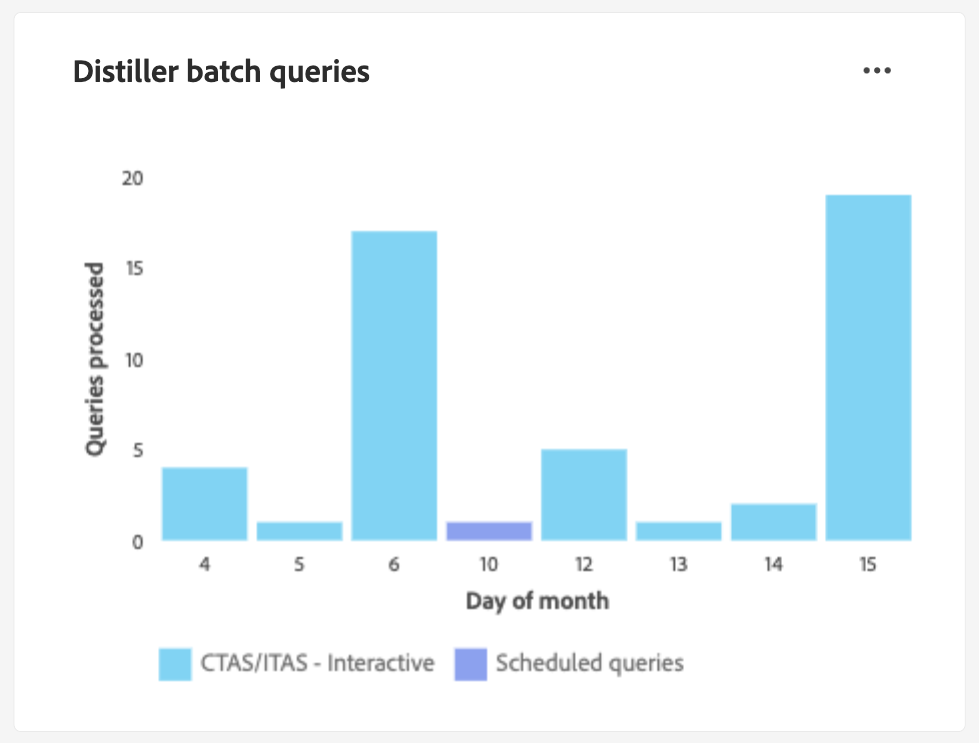
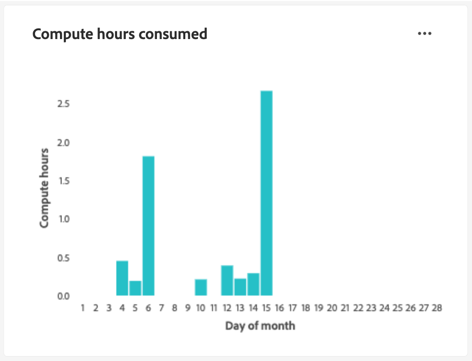
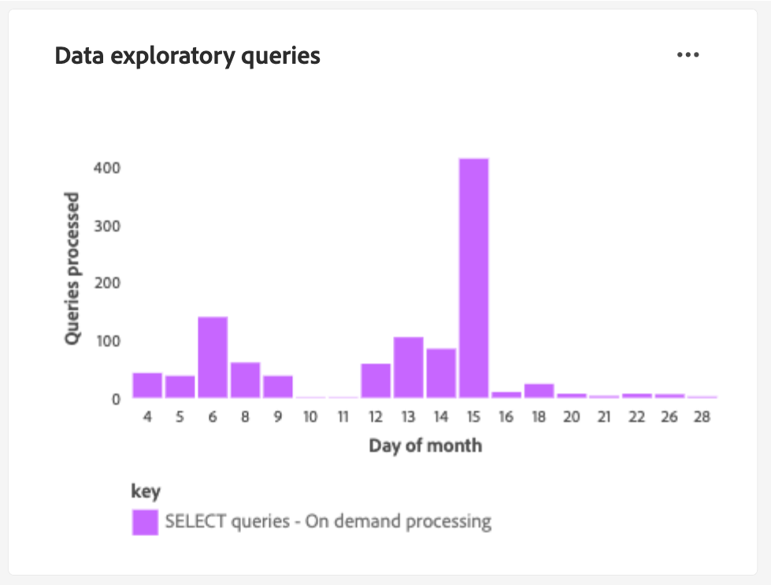
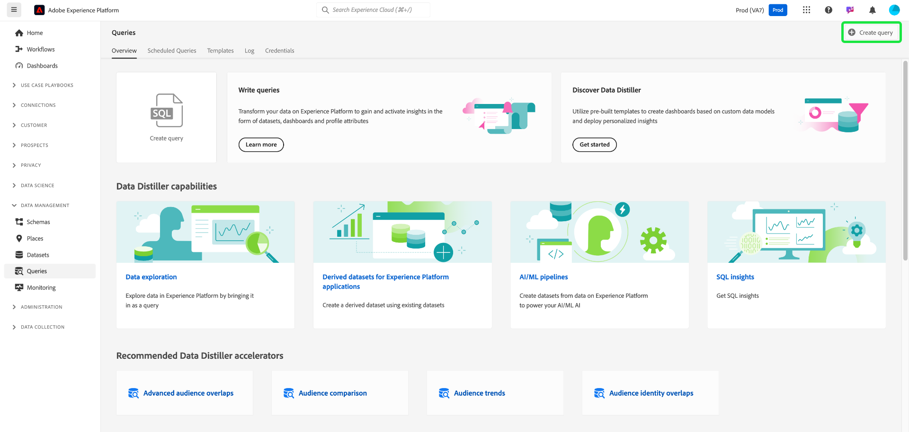
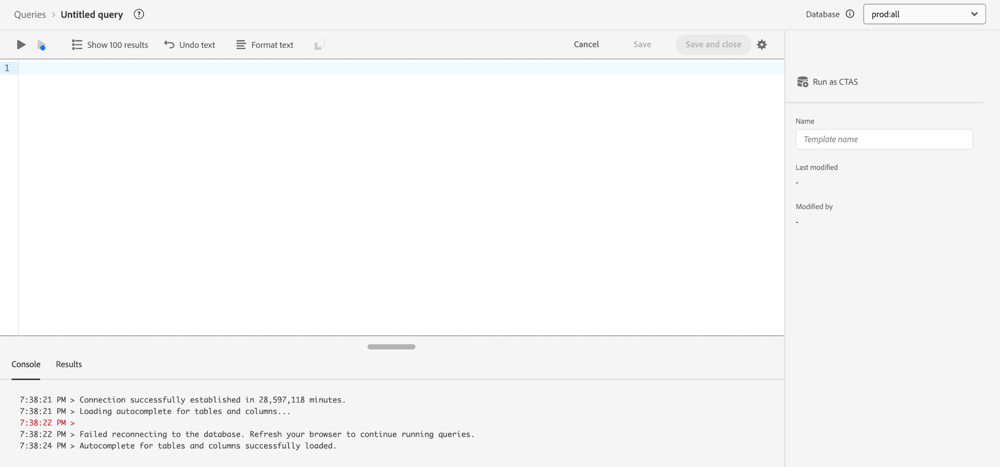

# Query Service UI guide

The Adobe Experience Platform Query Service provides a user interface that can be used to write and execute queries, view previously executed queries, and access queries saved by users within your organization. To access the UI within [Adobe Experience Platform](https://platform.adobe.com), select **[!UICONTROL Queries]** in the left navigation. The [!UICONTROL Queries] [!UICONTROL Overview] appears.

## Overview {#overview}

The [!UICONTROL Overview] tab provides a streamlined entry point for working with queries and Data Distiller templates. Here, you can access all the features needed to write queries, explore datasets, and analyze audience data, to ensure a smooth workflow for your data analytics and audience insights. Use this overview to learn what you can achieve with Data Distiller and discover key metrics about your Query Service usage.

### Main panels {#main-panels}

The [!UICONTROL Overview] page contains several main sections to help you get started:

1. Select **[!UICONTROL Create query]** to quickly navigate to the Query Editor to write and execute new queries.
2. Select **[!UICONTROL Learn more]** to view detailed documentation on how to **[!UICONTROL Write queries]**.
3. Select **[!UICONTROL Get started]** in the **[!UICONTROL Discover Data Distiller]** section to open the Data Distiller overview and learn about available features.

### Data Distiller capabilities {#data-distiller-capabilities}

The [!UICONTROL Data Distiller capabilities] section provides documentation links to more advanced Data Distiller features:

- **[[!UICONTROL Data exploration]](../use-cases/data-exploration.md)**: Learn how to explore, troubleshoot, and verify batch ingested data using SQL.
- **[[!UICONTROL Derived datasets for Experience Platform applications]](../data-distiller/derived-datasets/overview.md)**: Learn how to create derived datasets to support complex and diverse use cases that maximize your data utility.
- **[[!UICONTROL AI/ML pipelines]](../data-distiller/ml-feature-pipelines/overview.md)**: Learn about important concepts behind your preferred machine learning tools and how to build custom models that support your marketing use cases. This series of guides describes the necessary steps to build feature pipelines that prepare data from Experience Platform to feed custom models in your machine learning environment.
- **[[!UICONTROL SQL insights]](../data-distiller/sql-insights/overview.md)**: Learn about the key capabilities and required steps to develop an insights dashboard from SQL with Data Distiller.

### Recommended Data Distiller accelerators {#recommended-accelerators}

Select a quick link to navigate to the relevant Data Distiller dashboards [!UICONTROL Templates]. Each accelerator provides powerful tools and visualizations to help you analyze audience data, optimize segmentation, and enhance targeting strategies.

- **[[!UICONTROL Advanced audience overlaps]](../../dashboards/sql-insights-query-pro-mode/templates/overlaps.md)**: From this dashboard you can analyze audience intersections between multiple audience segments to uncover valuable insights and optimize segmentation strategies. You can also export your insights for further offline analysis or reporting purposes.
- **[[!UICONTROL Audience comparison]](../../dashboards/sql-insights-query-pro-mode/templates/comparison.md)**: From this dashboard, you can compare and contrast key audience metrics side-by-side to analyze two audience groups in detail. These insights help you understand audience size, growth, and other key performance indicators, enabling you to refine segmentation and optimize targeting strategies with data-driven decisions.
- **[[!UICONTROL Audience trends]](../../dashboards/sql-insights-query-pro-mode/templates/trends.md)**: Use the [!UICONTROL Audience trends] dashboard to visualize how your audiences evolve over time through key metrics like audience growth, identity counts, and single identity profiles. Track trends to uncover valuable insights into audience behavior, empowering you to refine segmentation, enhance engagement, and optimize targeting strategies for more effective campaigns.
Track audience metrics over time to monitor changes in audience size, identity growth, and overall engagement.
- **[[!UICONTROL Audience identity overlaps]](../../dashboards/sql-insights-query-pro-mode/templates/identity-overlaps.md)**: Use the Audience Identity Overlaps dashboard to analyze identity overlaps within selected audiences. Visualizations and tabulated data provide insights to optimize identity stitching, reduce redundancy, and improve segmentation. These insights enable more effective targeting, enhanced personalization, and streamlined customer interactions.

### Data Distiller examples {#data-distiller-examples}

Select a card to open documentation guides and examples to help you make the most of Data Distiller:

- **[[!UICONTROL Decile-based derived datasets]](../use-cases/deciles-use-case.md)**: Learn how to create decile-based derived datasets for segmentation and audience creation in Adobe Experience Platform. Using an airline loyalty scenario, it covers schema design, decile calculations, and query examples for ranking and aggregating data.
- **[[!UICONTROL Customer lifetime value]](../use-cases/customer-lifetime-value.md)**: Learn how to track and visualize customer lifetime value with Real-Time CDP and custom dashboards. Use these insights to develop strategies for acquiring new customers, retain existing ones, and maximize profit margins.
- **[[!UICONTROL Propensity score]](../use-cases/propensity-score.md)**: Learn how to determine propensity scores using machine-learning predictive models. This guide covers sending data for training, applying trained models with SQL, and predicting customer purchase likelihood.
- **[[!UICONTROL Consent analysis]](../../dashboards/insights-use-cases/consent-analysis.md)**: Learn how to analyze and track customer consent using Real-Time CDP, Query Service, and Data Distiller. This guide covers building consent dashboards, refining segmentation, tracking trends, and ensuring compliance, helping you build trust and deliver personalized experiences.
- **[[!UICONTROL Fuzzy match]](../use-cases/fuzzy-match.md)**: Learn how to perform a 'fuzzy' match on your Experience Platform data to find approximate matches and analyze string similarity across datasets. Follow this guide to save time and make your data more accessible. The example demonstrates how to match hotel room attributes between two travel agency datasets, showing how to efficiently match, compare, and reconcile large, complex datasets for consistency and accuracy.

### Key metrics {#key-metrics}

The key metrics section displays visualizations of important data that helps you monitor Query Service usage. For each chart, you can select the ellipsis (`...`) in the top right followed by [!UICONTROL View more] to view either a tabulated form of the results, or download the data as a CSV file to view in a spreadsheet. For more details, refer to the [View more guide](../../dashboards/sql-insights-query-pro-mode/view-more.md).

#### Set a date filter {#set-date-filter}

To apply a global date filter for these visualizations, select the filter icon () and adjust the date range in the **[!UICONTROL Filters]** dialog. Apply this filter to tailor the displayed metrics for a specific time frame and enhance the relevance of your analysis.

#### [!UICONTROL Distiller batch queries] {#distiller-batch-queries}

The [!UICONTROL Distiller batch queries] chart provides a breakdown of query activity by day, highlighting the number of processed CTAS and ITAS (interactive and scheduled) queries. The chart highlights patterns, such as spikes in interactive queries on certain days and the infrequent use of scheduled queries. Use these insights to optimize performance by identifying peak activity periods, refining scheduling strategies, and balancing query execution to improve workflow efficiency and resource utilization.

#### [!UICONTROL Compute hours consumed] {#compute-hours-consumed}

The [!UICONTROL Compute hours consumed] chart provides a day-by-day visualization of compute hours used to process Query Service operations. Use these compute hour trends to monitor resource consumption, identify high-demand periods, and optimize query execution to ensure efficient resource allocation and performance.

#### [!UICONTROL Data exploratory queries]

The [!UICONTROL Data exploratory queries] chart displays the number of SELECT queries processed on demand each day. This visualization highlights query activity trends, such as spikes in usage on specific days, to help you understand when your data exploration efforts are most active. Use these insights to monitor query usage patterns, balance workloads, and optimize resource allocation for exploratory data analysis. This analysis ensures more efficient use of Query Service and improved planning for high-demand periods.

## Query Editor

Use the Query Editor to write and execute queries without using an external client. Select **[!UICONTROL Create Query]** to open the Query Editor and create a new query. You can also access the Query Editor by selecting a query from the **[!UICONTROL Log]** or **[!UICONTROL Templates]** tabs. If you select a previously executed or saved query, the Query Editor opens and displays the SQL for your selected query.

As you type in the Query Editor, the editor automatically completes SQL reserved words, tables, and field names within tables. When you have finished writing your query, select the play icon () to run the query. The **[!UICONTROL Console]** tab below the editor shows what Query Service is currently doing, and indicates when a query has been returned. The **[!UICONTROL Result]** tab, next to [!UICONTROL Console], displays the query results. See the [Query Editor guide](./user-guide.md) for more information on using the Query Editor.

## Scheduled queries {#scheduled-queries}

Queries that have already been saved as a template can be scheduled to run on a regular cadence. When scheduling a query, you can choose the frequency of runs, the start and end date, the day of the week the scheduled query runs, as well as the dataset to export the query to. Query schedules are set using Query Editor.

To learn how to schedule a query through the UI, see the [scheduled queries guide](./user-guide.md#scheduled-queries). To learn how to add schedules using the API, please read the [scheduled queries endpoint guide](../api/scheduled-queries.md).

Once a query has been scheduled, it appears in the list of scheduled queries on the [!UICONTROL Scheduled Queries] tab. Full details regarding the query, runs, creator, and timings can be found by selecting a scheduled query from the list.

<!--  -->

| Column | Description |
| --- | --- |
| **[!UICONTROL Name]** | The name field is either the template name or the first few characters of your SQL query. Any query created through the UI with the Query Editor is named at inception. If the query was created through the API, then the name of the query is a snippet of the initial SQL used to create the query. |
| **[!UICONTROL Template]** | The template name of the query. Select a template name to navigate to the Query Editor. The query template is displayed in the Query Editor for convenience. If there is no template name, the row is marked with a hyphen and there is no ability to redirect to the Query Editor to view the query.   |
| **[!UICONTROL SQL]** | A snippet of the SQL query.  |
| **[!UICONTROL Run frequency]** |  This column indicates the cadence at which your query is set to run. The available values are `Run once` and `Scheduled`. Queries can be filtered according to their run frequency. |
| **[!UICONTROL Created by]** | The name of the user who created the query.  |
| **[!UICONTROL Created]** |  The timestamp when the query was created, in UTC format.  |
| **[!UICONTROL Last run timestamp]** | The most recent timestamp when the query was run. This column highlights whether a query has been executed according to its current schedule. |
| **[!UICONTROL Last run status]** | The status of the most recent query execution. The three status values are: `successful` `failed` or `in progress`.|

See the documentation for more information on how to [monitor queries through the Query Service UI](./monitor-queries.md).

## Templates {#browse}

The **[!UICONTROL Templates]** tab shows queries saved by users in your organization. It is useful to think of these as query projects, as queries saved here may still be under construction. Queries displayed on the **[!UICONTROL Templates]** tab also display as run queries in the **[!UICONTROL Log]** tab if they have been previously executed by Query Service.

| Column | Description |
| --- | --- |
| **[!UICONTROL Name]** | The name field is either the query name created by the user or the first few characters of your SQL query. Any query created through the UI with the Query Editor is named at inception. If the query was created through the API then the name of the query is a snippet of the initial SQL used to create the query. You can select the query name to open the query in the Query Editor. You can also use the search bar to search for the [!UICONTROL Name] of a query. Searches are case sensitive. |
| **[!UICONTROL SQL]** | The first few characters of the SQL query. Hovering over the code displays the full query. |
| **[!UICONTROL Modified by]** | The last user who modified the query. Any user in your organization with access to Query Service can modify queries. |
| **[!UICONTROL Last modified]** | The date and time of the last modification to the query, in the browser's time zone. |

See the [query templates](./query-templates.md) documentation for more information on templates in the Platform UI.

## Log {#log}

The **[!UICONTROL Log]** tab provides a list of queries that have previously been executed. By default, the log lists the queries in reverse chronology.

| Column | Description |
| --- | --- |
| **[!UICONTROL Name]** | The query name, consisting of the first several characters of the SQL query. Select the template name to open the [!UICONTROL Query log details] view for that run. You can use the search bar to search on the name of a query. Searches are case sensitive. |
| **[!UICONTROL Start time]** | The time that the query was executed. |
| **[!UICONTROL Complete time]** | The time that the query run completed. |
| **[!UICONTROL Status]** | The current status of the query. |
| **[!UICONTROL Dataset]** | The input dataset used by the query. Select the dataset to go to the input dataset details screen. |
| **[!UICONTROL Client]** | The client used for the query. |
| **[!UICONTROL Created by]** | The name of the person who created the query. |

>![Note]
>
>Select the pencil icon () from any row of the query log to navigate to the Query Editor. The query is pre-populated for convenient editing.

See the [query logs documentation](./query-logs.md) for more information on the log files automatically generated by a query event.

## Credentials

The **[!UICONTROL Credentials]** tab displays both your expiring and non-expiring credentials. For more information on how to use these credentials to connect with external clients, please read the [credentials guide](../clients/overview.md).

## Next steps

Now that you are familiar with the Query Service user interface on [!DNL Experience Platform], you can access Query Editor to start creating your own query projects to share with other users in your organization. For more information on authoring and running queries in Query Editor, see the [Query Editor user guide](./user-guide.md).
