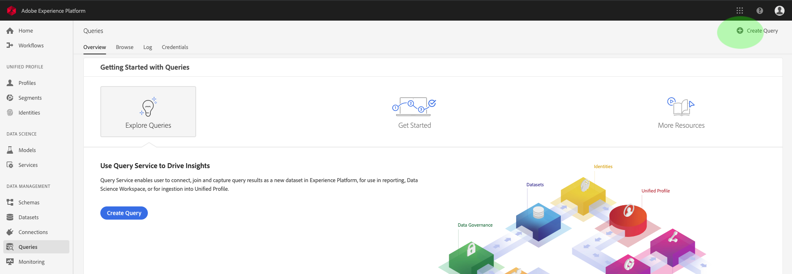

# [!DNL Query Service] guide

The Adobe Experience Platform [!DNL Query Service] provides a user interface that can be used to write and execute queries, view previously executed queries, and access queries saved by users within your IMS Organization. To access the UI within [Adobe Experience Platform][platform-ui], select **[!UICONTROL Queries]** in the left navigation.

## [!DNL Query Editor]

The [!DNL Query Editor] enables you to write and execute queries without using an external client. Click **[!UICONTROL Create Query]** to open the [!DNL Query Editor] and create a new query. You can also access the [!DNL Query Editor] by selecting a query from the **[!UICONTROL Log]** or **[!UICONTROL Browse]** tabs. Selecting a previously executed or saved query will open the [!DNL Query Editor] and display the SQL for the selected query.

[!DNL Query Editor] provides editing space where you can begin typing a query. As you type, the editor autocompletes SQL reserved words, tables, and field names within tables. When finished writing your query, click the **Play** button to run the query. The **[!UICONTROL Console]** tab below the editor shows what [!DNL Query Service] is currently doing, indicating when a query has been returned. The **[!UICONTROL Result]** tab, next to the Console, displays query results. See the [Query Editor guide][query-editor] for more information on using the [!DNL Query Editor].

## Browse

The **[!UICONTROL Browse]** tab shows queries saved by users in your organization. It is useful to think of these as query projects, as queries saved here may still be under construction. Queries displayed on the **[!UICONTROL Browse]** tab also display as run queries in the **[!UICONTROL Log]** tab if they have been previously executed by [!DNL Query Service].

| Column | Description |
| --- | --- |
| Name | The query name created by the user. You can click on the name to open the query in the [!DNL Query Editor]. You can also use the search bar to search on the Name of a query. Searches are case sensitive. |
| SQL | The first few characters of the SQL query. Hovering over the code displays the full query. |
| Modified By | The last user who modified the query. Any user in your organization with access to [!DNL Query Service] can modify queries. |
| Last Modified | The date and time of the last modification to the query, in the browser's time zone. |

## Log

The **[!UICONTROL Log]** tab provides a list of queries that have previously been executed. By default, the log lists the queries in reverse chronology.

| Column | Description |
| --- | --- |
| **[!UICONTROL Name]** | The query name, consisting of the first several characters of the SQL query. Clicking on the name opens the [!DNL Query Editor], allowing you to edit the query. You can use the search bar to search on the Name of a query. Searches are case sensitive. |
| **[!UICONTROL Created By]** | The name of the person who created the query. |
| **[!UICONTROL Client]** | The client used for the query. |
| **[!UICONTROL Dataset]** | The input dataset used by the query. Click on the dataset to go to the input dataset details screen. |
|**[!UICONTROL Status]** | The current status of the query. |
| **[!UICONTROL Last Run]** | When the query was run last. You can sort the list in either ascending or descending order by clicking the arrow over this column. |
| **[!UICONTROL Run Time]** | The amount of time it took to run the query. |

## Credentials

The **[!UICONTROL Credentials]** tab displays your [!DNL Postgres] credentials. Click the **[!UICONTROL Copy]** icon next to any field to store its contents in your keyboard buffer. For more information on how to use these credentials to connect with external clients, please read the [connect with clients guide][connect-clients].

## Next steps

Now that you are familiar with [!DNL Query Service] user interface on [!DNL Platform], you can access [!DNL Query Editor] to start creating your own query projects to share with other users in your organization. For more information on authoring and running queries in [!DNL Query Editor], see the [Query Editor user guide][query-editor].

[platform-ui]: https://platform.adobe.com
[query-editor]: user-guide.md
[connect-clients]: ../clients/overview.md
