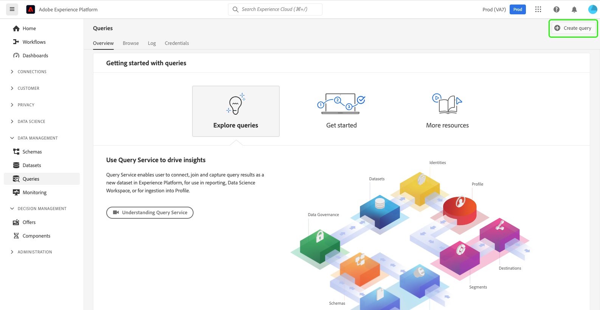
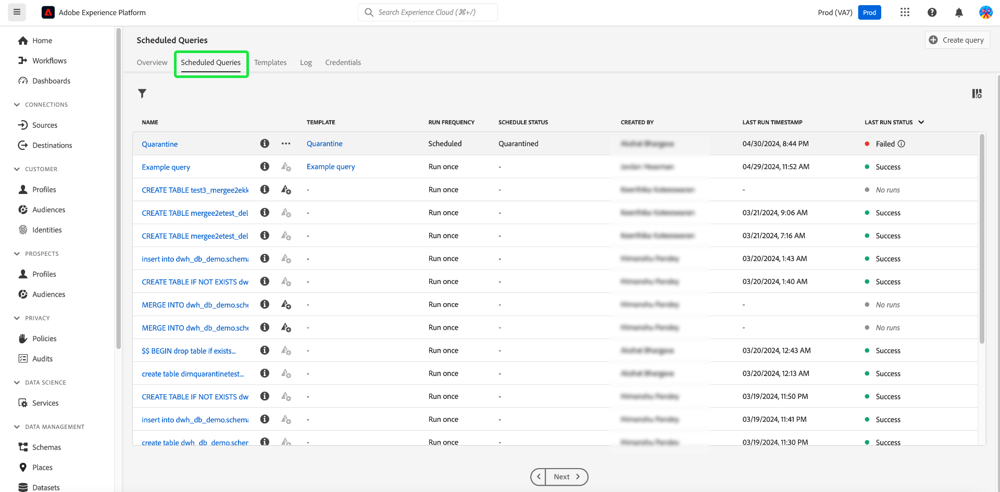
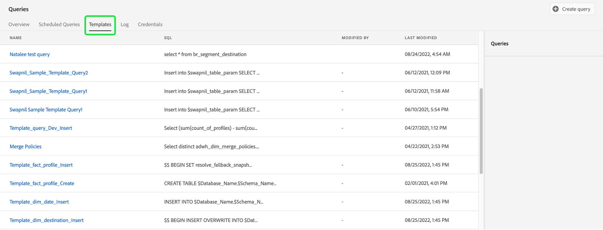
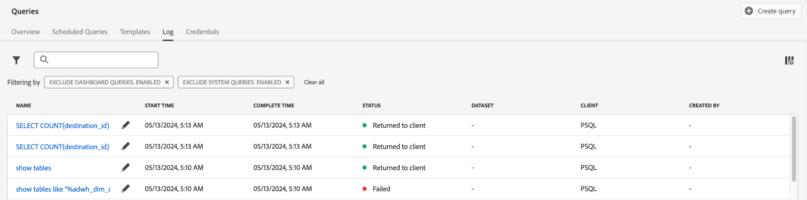
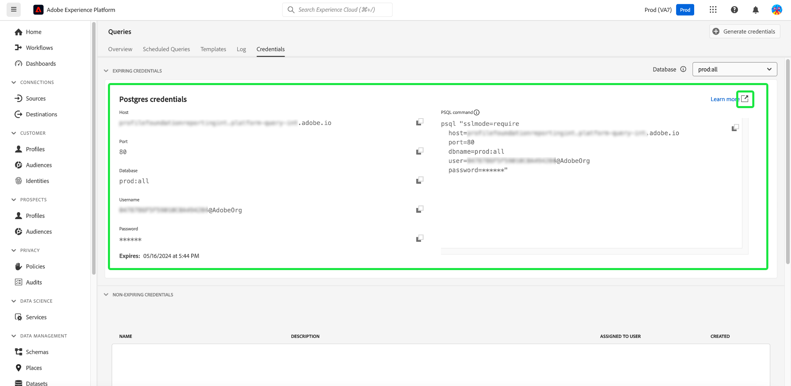

# [!DNL Query Service] UI guide

The Adobe Experience Platform [!DNL Query Service] provides a user interface that can be used to write and execute queries, view previously executed queries, and access queries saved by users within your IMS Organization. To access the UI within [Adobe Experience Platform](https://platform.adobe.com), select **[!UICONTROL Queries]** in the left navigation.

## [!DNL Query Editor]

The [!DNL Query Editor] enables you to write and execute queries without using an external client. Select **[!UICONTROL Create Query]** to open the [!DNL Query Editor] and create a new query. You can also access the [!DNL Query Editor] by selecting a query from the **[!UICONTROL Log]** or **[!UICONTROL Templates]** tabs. Selecting a previously executed or saved query will open the [!DNL Query Editor] and display the SQL for the selected query.

[!DNL Query Editor] provides editing space where you can begin typing a query. As you type, the editor automatically completes SQL reserved words, tables, and field names within tables. When finished writing your query, select the **Play** button to run the query. The **[!UICONTROL Console]** tab below the editor shows what [!DNL Query Service] is currently doing, indicating when a query has been returned. The **[!UICONTROL Result]** tab, next to the Console, displays query results. See the [Query Editor guide](./user-guide.md) for more information on using the [!DNL Query Editor].

![A zoomed in view of the [!DNL Query Editor].](../images/ui/overview/query-editor.png)

## Scheduled queries {#scheduled-queries}

Queries that have already been saved as a template can be scheduled to run on a regular cadence. When scheduling a query, you can choose the frequency of runs, the start and end date, the day of the week the scheduled query runs, as well as the dataset to export the query to. Query schedules are set using Query Editor. 

To learn how to schedule a query through the UI, see the [scheduled queries guide](./user-guide.md#scheduled-queries). To learn how to add schedules using the API, please read the [scheduled queries endpoint guide](../api/scheduled-queries.md).

Once a query has been scheduled it appears in the list of scheduled queries on the [!UICONTROL Scheduled Queries] tab. Full details regarding the query, runs, creator, and timings can be found by selecting a scheduled query from the list.

| Column | Description |
| --- | --- |
| **[!UICONTROL Name]** | The name field is either the template name or the first few characters of your SQL query. Any query created through the UI with the Query Editor is named at inception. If the query was created through the API then the name of the query is a snippet of the initial SQL used to create the query. |
| **[!UICONTROL Template]** | The template name of the query. Select a template name to navigate to the Query Editor. The query template is displayed in the Query Editor for convenience. If there is no template name, the row is marked with a hyphen and there is no ability to redirect to the Query Editor to view the query.   |
| **[!UICONTROL SQL]** | A snippet of the SQL query.  |
| **[!UICONTROL Run frequency]** |  This is the cadence at which your query is set to run. The available values are `Run once` and `Scheduled`. Queries can be filtered according to their run frequency. |
| **[!UICONTROL Created by]** | The name of the user who created the query.  |
| **[!UICONTROL Created]** |  The timestamp when the query was created, in UTC format.  |
| **[!UICONTROL Last run timestamp]** | The most recent timestamp when the query was run. This column highlights whether a query has been executed according to its current schedule. |
| **[!UICONTROL Last run status]** | The status of the most recent query execution. The three status values are: `successful` `failed` or `in progress`.|

See the documentation for more information on how to [monitor queries through the Query Service UI](../monitor-queries.md).

## Templates {#browse}

The **[!UICONTROL Templates]** tab shows queries saved by users in your organization. It is useful to think of these as query projects, as queries saved here may still be under construction. Queries displayed on the **[!UICONTROL Templates]** tab also display as run queries in the **[!UICONTROL Log]** tab if they have been previously executed by [!DNL Query Service].

| Column | Description |
| --- | --- |
| **[!UICONTROL Name]** | The name field is either the query name created by the user or the first few characters of your SQL query. Any query created through the UI with the Query Editor is named at inception. If the query was created through the API then the name of the query is a snippet of the initial SQL used to create the query. You can select the query name to open the query in the [!DNL Query Editor]. You can also use the search bar to search for the [!UICONTROL Name] of a query. Searches are case sensitive. |
| **[!UICONTROL SQL]** | The first few characters of the SQL query. Hovering over the code displays the full query. |
| **[!UICONTROL Modified by]** | The last user who modified the query. Any user in your organization with access to [!DNL Query Service] can modify queries. |
| **[!UICONTROL Last modified]** | The date and time of the last modification to the query, in the browser's time zone. |

## Log

The **[!UICONTROL Log]** tab provides a list of queries that have previously been executed. By default, the log lists the queries in reverse chronology.

| Column | Description |
| --- | --- |
| **[!UICONTROL Name]** | The query name, consisting of the first several characters of the SQL query. Selecting the name opens the [!DNL Query Editor], allowing you to edit the query. You can use the search bar to search on the Name of a query. Searches are case sensitive. |
| **[!UICONTROL Created by]** | The name of the person who created the query. |
| **[!UICONTROL Client]** | The client used for the query. |
| **[!UICONTROL Dataset]** | The input dataset used by the query. Select the dataset to go to the input dataset details screen. |
|**[!UICONTROL Status]** | The current status of the query. |
| **[!UICONTROL Last run]** | When the query was run last. You can sort the list in either ascending or descending order by selecting the arrow over this column. |
| **[!UICONTROL Run time]** | The amount of time it took to run the query. |

## Credentials

The **[!UICONTROL Credentials]** tab displays both your expiring and non-expiring credentials. For more information on how to use these credentials to connect with external clients, please read the [credentials guide](../clients/overview.md).

## Next steps

Now that you are familiar with [!DNL Query Service] user interface on [!DNL Platform], you can access [!DNL Query Editor] to start creating your own query projects to share with other users in your organization. For more information on authoring and running queries in [!DNL Query Editor], see the [[!DNL Query Editor] user guide](./user-guide.md).