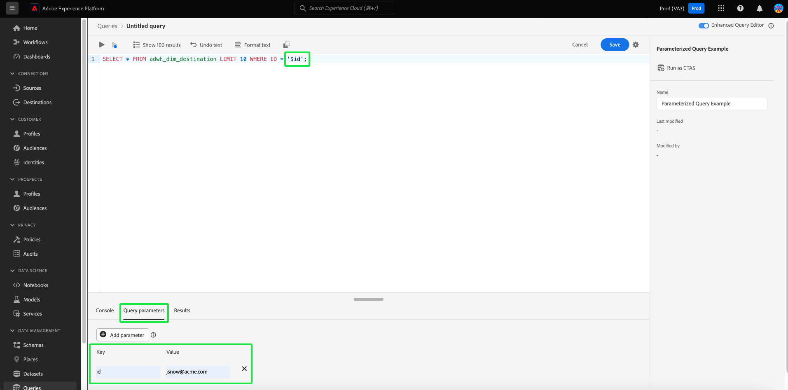
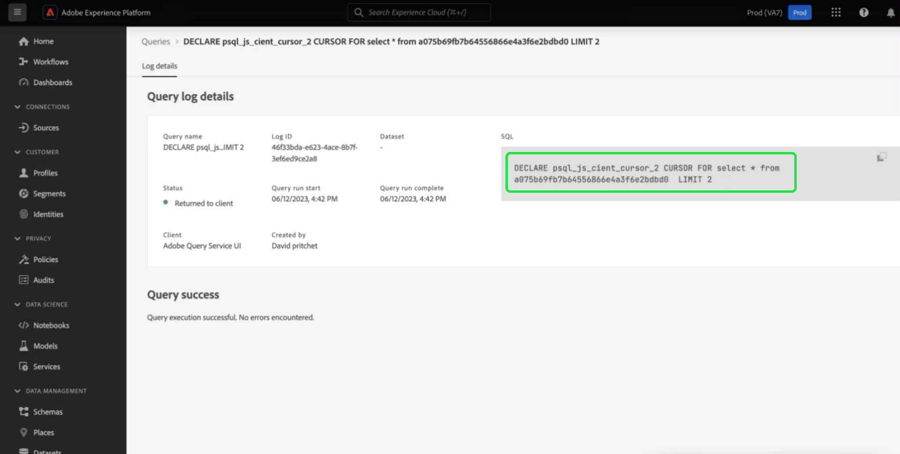

# Parameterized queries

>[!IMPORTANT]
>
>The parameterized query UI feature is available in a **limited release only** and is not available to all customers.

Query Service supports the use of parameterized queries in the Query Editor. With parameterized queries, you can now use placeholders for parameters and add the parameter values at execution time. Placeholders allow you to work with dynamic data where you don't know what the values will be until the statement is executed. You can also prepare your queries ahead of time and reuse them for similar purposes. Reusing queries saves considerable effort as you avoid creating distinct SQL queries for each use case.

## Prerequisites

Before continuing with this guide, read the [Query Editor UI guide](./user-guide.md). The Query Editor guide provides detailed information on how to write, validate, and run queries for customer experience data within the Experience Platform user interface.

>[!NOTE]
>
>Within the Adobe Experience Platform UI, parameterized queries are only supported at the parent level of inline templates. This means that parameterized queries only work when used in the original template. Child templates must be a static template and cannot have dynamic parameters. See the [inline templates documentation](../essential-concepts/inline-templates.md) to learn more.

## Parameterized query syntax {#syntax}

Parameterized queries use the format `'$YOUR_PARAMETER_NAME'` and can be concatenated using dot notation. An example SQL statement that uses parameterized queries can be seen below.

```sql
INSERT INTO
   $Database_Name.Schema_Name.adwh_lkup_process_delta_log
   (process_name, merge_policy_id, process_status, process_date, create_ts, change_ts)
SELECT
   '$Table_Process_Name' process_name,
   hash('$Merge_PolicyID') merge_policy_id,
   '$process_status' process_status,
   to_date('$date_key') process_date,
   CURRENT_TIMESTAMP create_ts,
   CURRENT_TIMESTAMP change_ts;
```

## Create a parameterized query {#create}

To create your parameterized query in the UI, navigate to the Query Editor. See the section on [accessing the Query Editor](./user-guide.md#accessing-query-editor) for more instructions.

Use the `'$'` preface to enter a query parameter into your query in the text editor. Next, add the missing value for the key in the [!UICONTROL Query parameters] section below the editor. The query cannot be executed if you neglect to add a value to any of the required keys. An alert icon () appears in the Query Parameters section next to any empty [!UICONTROL Value] input fields.



>[!TIP]
>
>Change tabs from [!UICONTROL Query parameters] to [!UICONTROL Console] to view the console output of the query. 

If you remove a parameter and try to execute the query again after it has already been run, an error message is displayed in the [!UICONTROL Query parameters] section to alert you.

>[!NOTE]
>
>If your query does not take parameters, you can still enter unnecessary parameters within the Query Editor. The Query Editor ignores all unnecessary key-value pairs and they have no effect the execution or the results of the query.


## Use query logs details to check parameter values {#check-parameter-values}

You cannot save parameters within templates as the values used are not persistent. However, you can check the [!UICONTROL Query log details] page to find the parameter values used in a query run. In this case, the logs do not indicate that the query was a parameterized query. See the [query logs documentation](./query-logs.md) for instructions on how to find the values used.



<!-- improve screenshot above ^ I am waiting for a scheduled run to complete -->

## Schedule a parameterized query {#schedule}

Parameter values are saved when you schedule a parameterized query. To schedule a parameterized query, follow the typical process to create a scheduled query as described in the guide to [create a query schedule](./query-schedules.md#create-schedule), then enter the parameter values to be used in the query run. This UI section only appears for parameterized queries. See the section on [setting parameters for a scheduled parameterized query](./query-schedules.md#set-parameters) for specific instructions.

>[!TIP]
>
>Query Service supports prepared statements through the use of parameterized queries. See the [prepared statements syntax guide](../sql/prepared-statements.md) for more information on the SQL syntax involved.

## Next steps

By reading this document, you have learned how to parameterize queries in the Adobe Experience Platform UI and use them in scheduled query runs. The document also highlighted how to check the logs for the parameter values used in query executions.

If you have not already, you are recommended to read the guide on [monitoring scheduled queries](./monitor-queries.md) to gain a better understanding of the status of all query jobs through the Platform UI.
