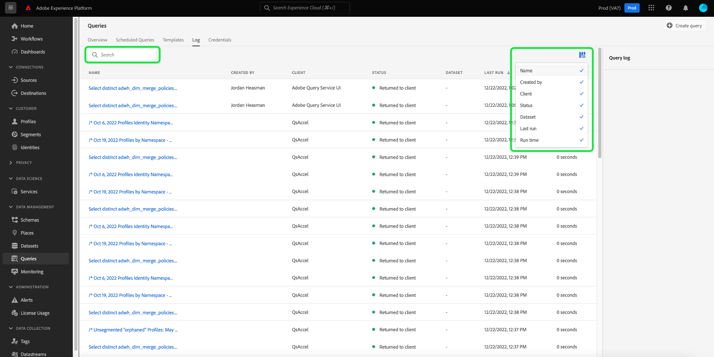
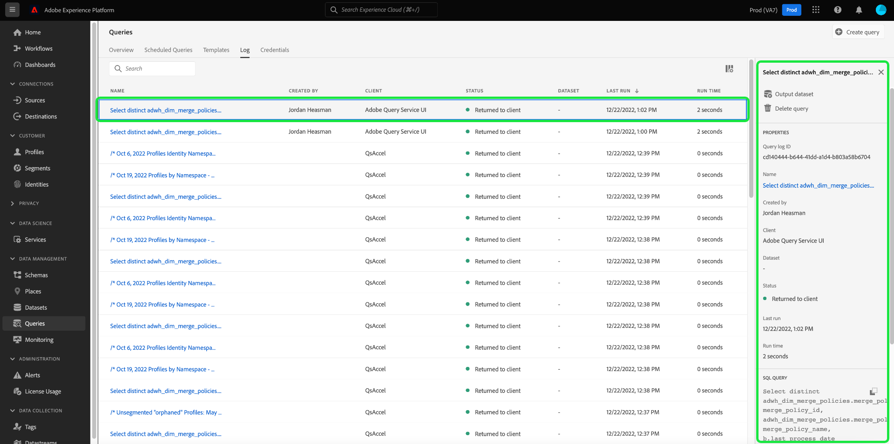
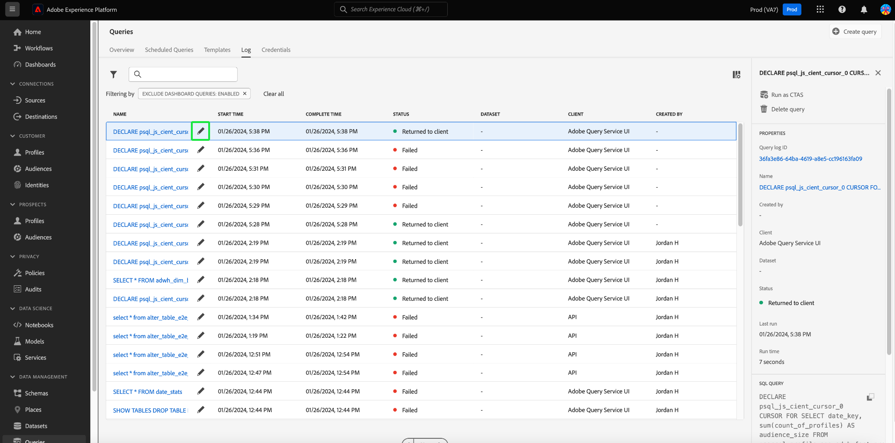

# Query logs

Adobe Experience Platform maintains a log of all query events that occur through both the API and the UI. This information is available in the Query Service UI from the [!UICONTROL Logs] tab.  

The log files are generated automatically by any query event and contain information including the SQL used, the status of the query, how long it took, and last run time. You can use query log data as a powerful tool for troubleshooting inefficient or problem queries. More comprehensive log information are kept as part of the audit log feature and can be found in the [audit log documentation](../../landing/governance-privacy-security/audit-logs/overview.md).

## Check query logs

To check the query logs, select [!UICONTROL Queries] to navigate to the Query Service workspace and select [!UICONTROL Log] from the available options

## Customize and search {#customize-and-search}

Query Service logs are presented in a customizable table format. To customize the table columns, select the settings icon () to the right of the screen. A dropdown menu appears where each column can be deselected.

You can also search for logs relating to specific query templates by typing the template name into the search field.

## Discover log data

Each row represents log data for a query run associated with a query template. Select any row from the table to populate the right sidebar with query log data for that run.

In the Query log panel, you can select a new output dataset and see or copy the complete SQL query that was used in the run.

You can also select a query template name from the [!UICONTROL Name] column to navigate directly to the Query Editor. The query is pre-populated in the editor.

>[!NOTE]
>
>If the query was created using the API and no template name was provided during initialization, the first few dozen characters of the SQL query are displayed instead.

## Next steps

By reading this document, you now have a better understanding of how query logs are accessed and used in the Query Service UI. 

See the [UI overview](./overview.md), or the [Query Service API guide](../api/getting-started.md) to learn more about Query Service capabilities.

See the [monitor queries document](../monitor-queries.md) to learn how Query Service improves the visibility of scheduled query runs.
