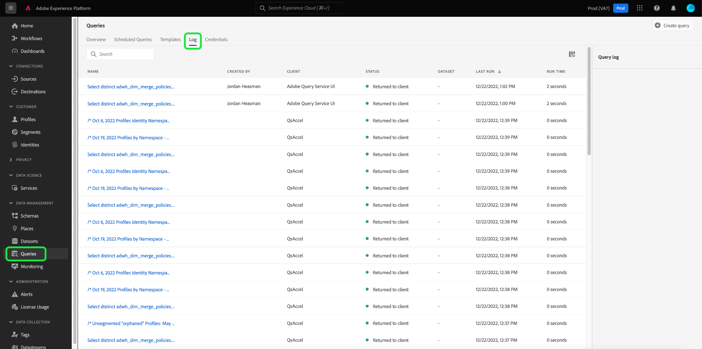
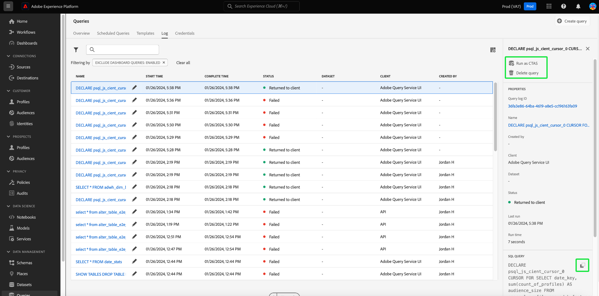
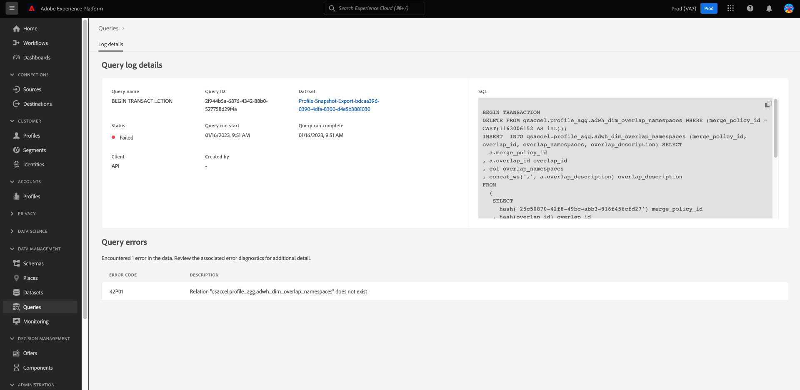
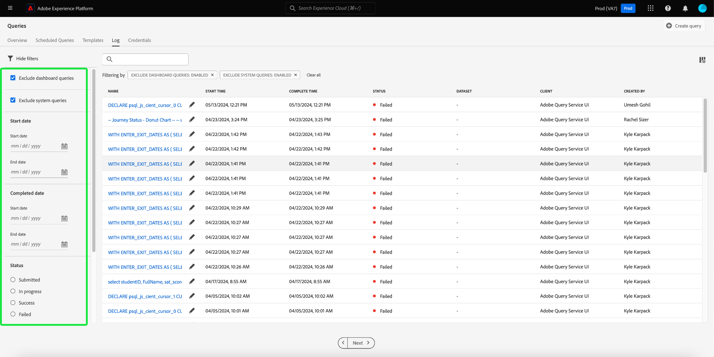
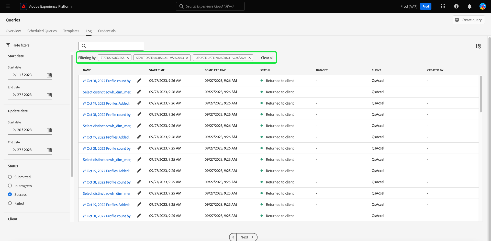

# Query logs

>[!IMPORTANT]
>
>Certain query logs features are currently in a limited release and not available to all customers. Your UI may appear slightly differently without an edit icon. Also, the process of selecting a query name may to navigate to the Query Editor instead of the [!UICONTROL Query log details] view.

Adobe Experience Platform maintains a log of all query events that occur through both the API and the UI. This information is available in the Query Service UI from the [!UICONTROL Logs] tab.  

The log files are generated automatically by any query event and contain information including the SQL used, the status of the query, how long it took, and last run time. You can use query log data as a powerful tool for troubleshooting inefficient or problem queries. More comprehensive log information is kept as part of the audit log feature and can be found in the [audit log documentation](../../landing/governance-privacy-security/audit-logs/overview.md).

## Check query logs

To check the query logs, select [!UICONTROL Queries] to navigate to the Query Service workspace and select [!UICONTROL Log] from the available options.

## Customize and search {#customize-and-search}

Query Service logs are presented in a customizable table format. To customize the table columns, select the settings icon () to the right of the screen. A [!UICONTROL Customize Table] dialog appears where each column can be deselected.

You can also search for logs relating to specific query templates by typing the template name into the search field.

A [description for each of the log table columns](./overview.md#log) can be found in the Log section of the Query Service overview. 

## Discover log data

Each row represents log data for a query run associated with a query template. Select any row from the table to populate the right sidebar with log data for that run.

In the log details panel, you can select a new output dataset and see or copy the complete SQL query that was used in the run.

>[!IMPORTANT]
>
>Certain query logs features are currently in a limited release and not available to all customers.

You can also select a query template name from the [!UICONTROL Name] column to navigate directly to the [!UICONTROL Query log details] view.

>[!NOTE]
>
>If the query was created using the API and no template name was provided during initialization, the first few dozen characters of the SQL query are displayed instead.

## Edit logs {#edit-logs}

Next to each row's template name or SQL snippet is a pencil icon () that you can use to navigate to the Query Editor. The query is then pre-populated in the editor for editing.

## Filter logs {#filter-logs}

You can filter the list of query logs based on a variety of settings. Select the filter icon () at the top left of the workspace to open a set of filter options in the left rail. 

The list of available filters is displayed.

The following table proved a description of each filter.

| Filter | Description |
| ------ | ----------- |
| [!UICONTROL Exclude dashboard queries] | This checkbox is enabled by default and excludes logs generated by the queries used for generating insights. These queries are system generated and obscure the records of user generated logs necessary for monitoring, administering and troubleshooting. To view system generated logs, de-select the checkbox. |
| [!UICONTROL Start date] | To filter the logs for queries that were created during a specific period, set the [!UICONTROL Start] and [!UICONTROL End] dates in the [!UICONTROL Start date] section. |
| [!UICONTROL Completed date] | To filter the logs for queries that were completed during a specific period, set the [!UICONTROL Start] and [!UICONTROL End] dates in the [!UICONTROL Completed date] section. |
| [!UICONTROL Status] | To filter logs based on the [!UICONTROL Status] of the query, select the appropriate radio button. The available options include [!UICONTROL Submitted], [!UICONTROL In progress], [!UICONTROL Success], and [!UICONTROL Failed]. You can only filter logs based on one status condition at a time. |
| [!UICONTROL Client] | To filter logs based on the query client used, enter one of the following accepted values into the free text field: `API`, `Adobe Query Service UI`, or `QsAccel`. |
| [!UICONTROL My queries] | Use the [!UICONTROL My queries] toggle to filter the logs for queries executed by you. |
| [!UICONTROL query log ID] | To filter based on the unique log ID of a query, enter the log ID into the free text field. This information can be found in the [!UICONTROL Log details]. |

Any applied filters are displayed above the filtered log results.

## Next steps

By reading this document, you now have a better understanding of how query logs are accessed and used in the Query Service UI. 

See the [UI overview](./overview.md), or the [Query Service API guide](../api/getting-started.md) to learn more about Query Service capabilities.

See the [monitor queries document](./monitor-queries.md) to learn how Query Service improves the visibility of scheduled query runs.
