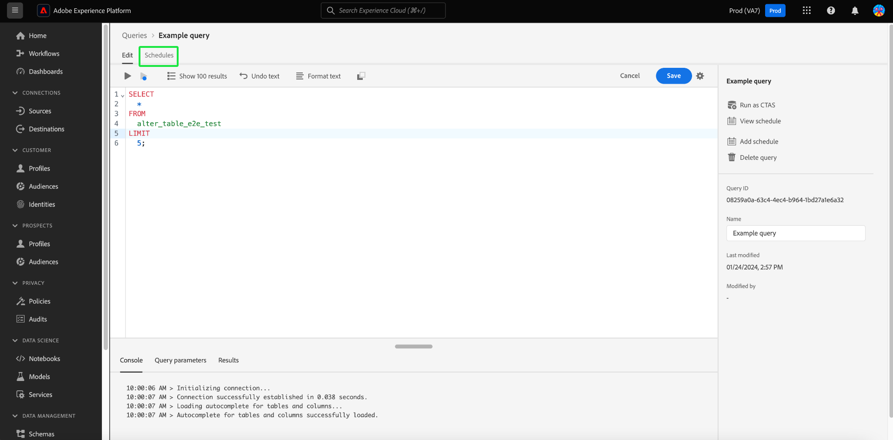
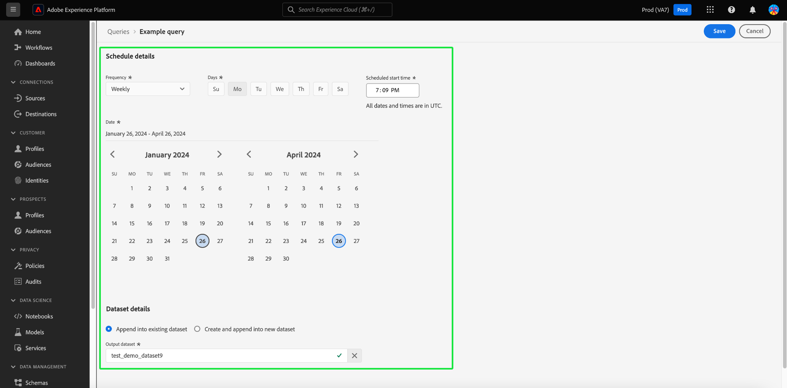
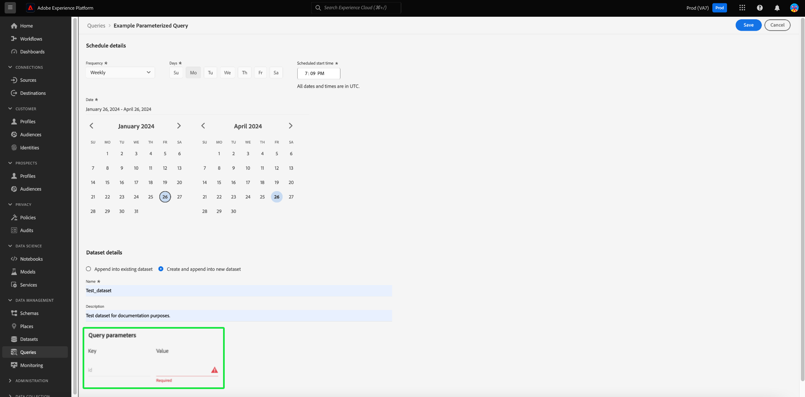
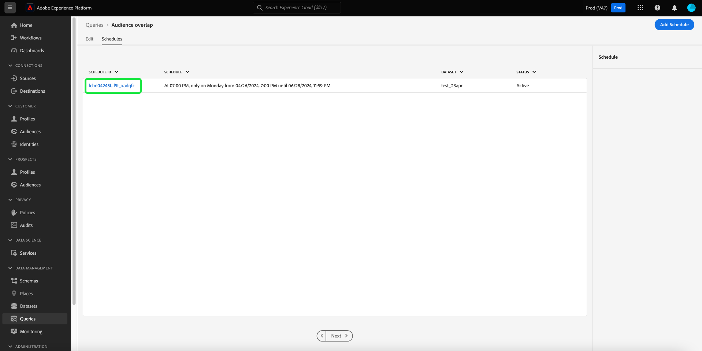
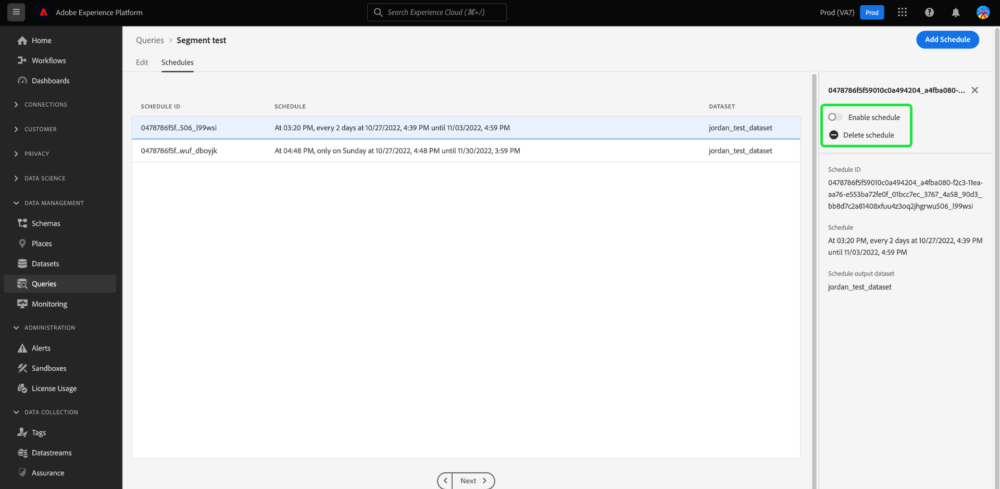

# Query schedules

You can automate query runs by creating query schedules. Scheduled queries run on a custom cadence to manage your data based on frequency, date, and time. You can also choose an output dataset for your results if required. Queries that have been saved as a template can be scheduled from the Query Editor.

>[!IMPORTANT]
>
>You can only add a schedule to a query that has already been created, saved, and run.

Any scheduled queries are added to the list in the [!UICONTROL Scheduled queries] tab. From that workspace you can monitor the status of all scheduled query jobs through the UI. On the [!UICONTROL Scheduled queries] tab you can find important information about your query runs and subscribe to alerts. The available information includes the status, schedule details, and error messages/codes should a run fail. See the [Monitor scheduled queries document](./monitor-queries.md) for more information.

## Create a query schedules {#create-schedule}

To add a schedule to a query, select a query template from either the [!UICONTROL Templates] tab or the [!UICONTROL Scheduled Queries] tab to navigate to the Query Editor. 

To learn how to add schedules using the API, please read the [scheduled queries endpoint guide](../api/scheduled-queries.md). 

When a saved query is accessed from the Query Editor, The [!UICONTROL Schedules] tab appears below the query name. Select **[!UICONTROL Schedules]**. 

The schedules workspace appears. Select **[!UICONTROL Add Schedule]** to create a schedule. 

The schedule details page appears. On this page, you can choose the frequency of the scheduled query, the start and end date, the day of the week the scheduled query will run, as well as what dataset to export the query to.

You can choose the following options for **[!UICONTROL Frequency]**:

- **[!UICONTROL Hourly]**: The scheduled query will run every hour for the date period you selected.
- **[!UICONTROL Daily]**: The scheduled query will run every X days at the time and the date period you selected. Please note that the time selected is in **UTC**, and not your local time zone.
- **[!UICONTROL Weekly]**: The selected query will run on the days of the week, time, and the date period you selected. Please note that the time selected is in **UTC**, and not your local time zone.
- **[!UICONTROL Monthly]**: The selected query will run every month at the day, time, and the date period you selected. Please note that the time selected is in **UTC**, and not your local time zone.
- **[!UICONTROL Yearly]**: The selected query will run every year at the day, month, time, and the date period you selected. Please note that the time selected is in **UTC**, and not your local time zone.

For the output dataset, you have the option to use either an existing dataset or create a new dataset.

>[!IMPORTANT]
>
> Since you are using either an existing or creating a new dataset, you do **not** need to include either `INSERT INTO` or `CREATE TABLE AS SELECT` as part of the query, since the datasets are already set. Including either `INSERT INTO` or `CREATE TABLE AS SELECT` as part of your scheduled queries will result in an error.

If you do not have access to parameterized queries, continue on to the [delete or disable a schedule](#delete-schedule) section.

### Set parameters for a scheduled parameterized query {#set-parameters}

>[!IMPORTANT]
>
>The parameterized query UI feature is currently available in a **limited release only** and is not available to all customers.

If you are creating a scheduled query for a parameterized query, you must now set the parameter values for these query runs.

After confirming all these details, select **[!UICONTROL Save]** to create a schedule. You are returned to the schedules workspace that displays details of the newly created schedule, including the schedule ID, the schedule itself, and the schedule's output dataset. You can use the schedule ID to look up more information about the runs of the scheduled query itself. To learn more, please read the [scheduled query run endpoints guide](../api/runs-scheduled-queries.md).

## Delete or disable a schedule {#delete-schedule}

You can delete or disable a schedule from the schedules workspace of a particular query or from the [!UICONTROL Scheduled Queries] workspace that lists all the scheduled queries. 

To access the [!UICONTROL Schedules] tab of your chosen query, you must select the name of a query template from either the [!UICONTROL Templates] tab or the [!UICONTROL Scheduled Queries] tab. This navigates to the Query Editor for that query. Form the Query Editor, select **[!UICONTROL Schedules]** to access the schedules workspace. 

Select a schedule from the rows of available schedules. You can use the toggle to disable or enable the scheduled query.

>[!IMPORTANT]
>
>You must disable the schedule before you can delete a schedule for a query.

Select **[!UICONTROL Delete a schedule]** to delete the disabled schedule.

Alternatively, the [!UICONTROL Scheduled Queries] tab offers a collection of inline actions for each scheduled query. The available inline actions include [!UICONTROL Disable schedule] or [!UICONTROL Enable schedule], [!UICONTROL Delete schedule], and [!UICONTROL Subscribe] to alerts for the scheduled query. For complete instructions on how to delete or disable a scheduled query through the scheduled Queries tab, please see the [monitor scheduled queried guide](./monitor-queries.md#inline-actions).
