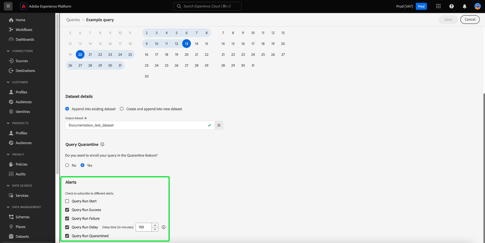

# Query schedules

You can automate query runs by creating query schedules. Scheduled queries run on a custom cadence to manage your data based on frequency, date, and time. You can also choose an output dataset for your results if required. Queries that have been saved as a template can be scheduled from the Query Editor.

>[!IMPORTANT]
>
>You can only add a schedule to a query that has already been created, and saved.

## Account requirements for scheduled queries {#technical-account-user-requirements}

To help scheduled queries run reliably, Adobe recommends that administrators provision a technical account (using OAuth Server-to-Server credentials) for creating scheduled queries. Scheduled queries can also be created with a personal user account, but queries created this way will stop running if that user's access is removed or disabled.

For details on setting up technical accounts and assigning the required permissions, see the [Credentials guide prerequisites](./credentials.md#prerequisites) and [API authentication](../../landing/api-authentication.md).

For additional guidance on creating and configuring a technical account, refer to:

- [Developer Console setup](https://experienceleague.adobe.com/en/docs/platform-learn/getting-started-for-data-architects-and-data-engineers/set-up-developer-console-and-postman): Step-by-step instructions for configuring the Adobe Developer Console and obtaining OAuth credentials.
- [End-to-end technical account setup](https://experienceleague.adobe.com/en/docs/platform-learn/tutorial-comprehensive-technical/setup): A comprehensive walkthrough for creating and configuring a technical account in Adobe Experience Platform.

If you only use the Query Service UI, ensure you have the necessary permissions or coordinate with an administrator who manages technical accounts. Any scheduled queries are added to the list in the [!UICONTROL Scheduled queries] tab, where you can monitor the status, schedule details, and error messages for all scheduled query jobs, as well as subscribe to alerts. For more information on monitoring and managing your queries, see the [monitor scheduled queries document](./monitor-queries.md).

This workflow covers the scheduling process in the Query Service UI. To learn how to add schedules using the API, refer to the [scheduled queries endpoint guide](../api/scheduled-queries.md).

>[!NOTE]
>
>Use a technical account to ensure scheduled queries continue to run even if users leave the organization or their roles change. Choose a technical account whenever possible for uninterrupted query automation.

## Create a query schedule {#create-schedule}

To schedule a query, select a query template from either the [!UICONTROL Templates] tab or the [!UICONTROL Template] column of the [!UICONTROL Scheduled Queries] tab. Selecting the template name navigates you to the Query Editor. 

If you access a saved query from the Query Editor, you can create a schedule for the query or view the query's schedule from the details panel.

>[!TIP]
>
>Select **[!UICONTROL View schedule]** to navigate to the schedules workspace and see any scheduled query runs at a glance.

![The Query Editor wih [!UICONTROL View schedule] and [!UICONTROL Add schedule] highlighted.](../images/ui/query-schedules/view-add-schedule.png)

Select **[!UICONTROL Add schedule]** to navigate to the [schedule details page](#schedule-details).

Alternatively, select the **[!UICONTROL Schedules]** tab below the query's name. 

The schedules workspace appears. The UI displays a list of any scheduled runs that the template is associated with. Select **[!UICONTROL Add Schedule]** to create a schedule. 

### Add schedule details {#schedule-details}

The schedule details page appears. On this page, you can edit a variety of details for the scheduled query. Details include the [frequency and weekday of the scheduled query](#scheduled-query-frequency) run, the start and end date, the dataset to export the results to, and [query status alerts](#alerts-for-query-status).

>[!IMPORTANT]
>
>The queries scheduler UI does not support indefinite or perpetual scheduling. An end date must be specified. There is no upper limit for the end date.

#### Scheduled query frequency {#scheduled-query-frequency}

You can choose the following options for **[!UICONTROL Frequency]**:

- **[!UICONTROL Hourly]**: The scheduled query will run every hour for the date period you selected.
- **[!UICONTROL Daily]**: The scheduled query will run every X days at the time and the date period you selected. Please note that the time selected is in **UTC**, and not your local time zone.
- **[!UICONTROL Weekly]**: The selected query will run on the days of the week, time, and the date period you selected. Please note that the time selected is in **UTC**, and not your local time zone.
- **[!UICONTROL Monthly]**: The selected query will run every month at the day, time, and the date period you selected. Please note that the time selected is in **UTC**, and not your local time zone.
- **[!UICONTROL Yearly]**: The selected query will run every year at the day, month, time, and the date period you selected. Please note that the time selected is in **UTC**, and not your local time zone.

### Provide dataset details {#dataset-details}

Manage the query results by either appending the data to an existing dataset or creating a new dataset and appending the data to it. 

Select **[!UICONTROL Create and append into new dataset]** to create a data set when you execute a query for the first time. Subsequent executions continue to insert data into that data set. Lastly, provide a name and description for the dataset. 

>[!IMPORTANT]
>
> Since you are using either an existing or creating a new dataset, you do **not** need to include either `INSERT INTO` or `CREATE TABLE AS SELECT` as part of the query, since the datasets are already set. Including either `INSERT INTO` or `CREATE TABLE AS SELECT` as part of your scheduled queries will result in an error.

![The Schedule details panel with Dataset details and the [!UICONTROL Create and append into new dataset] options highlighted.](../images/ui/query-schedules/dataset-details-create-and-append.png)

Alternatively, select **[!UICONTROL Append into existing dataset]** followed by the dataset icon ().

The **[!UICONTROL Select output dataset]** dialog appears. 

Next, either browse the existing datasets or use the search field to filter the options. Select the row of the dataset that you wish to use. The dataset details are displayed in the panel on the right. Select **[!UICONTROL Done]** to confirm your choice.

### Quarantine queries if they continuously fail {#quarantine}

When creating a schedule, you can enroll your query in the quarantine feature to safeguard system resources and prevent potential disruptions. The quarantine feature automatically identifies and isolates queries that repeatedly fail by placing them in a [!UICONTROL Quarantined] state. By quarantining queries after ten consecutive failures, you can intervene, review, and rectify issues before allowing further executions. This helps to maintain your operational efficiency and data integrity.

![The Queries Schedules workspace with [!UICONTROL Query Quarantine] highlighted and Yes selected.](../images/ui/query-schedules/quarantine-enroll.png)

Once a query is enrolled for the quarantine feature, you can subscribe to alerts for this query status change. If a scheduled query is not enrolled in quarantine, it does not appear as an option on [the Alerts dialog](./monitor-queries.md#alert-subscription).

You can also enroll a scheduled query into the quarantine feature from the inline actions of the [!UICONTROL Scheduled Queries] tab. See the [monitor queries documentation](./monitor-queries.md#alert-subscription) for more details.

### Set alerts for a scheduled query status {#alerts-for-query-status}

You can also subscribe to query alerts as part of your scheduled query settings. You can configure your settings to receive notifications for a variety of situations. Alerts can be set for a quarantined state, delays in query processing, or a change in status of your query. The available query-state alert options include start, success, and failure. Alerts can be received either as pop-up notifications or emails. Select the checkbox to subscribe to alerts for that status of scheduled query. 

The table below explains the supported query alert types: 

| Alert type | Description |
|---|---|
| `start` | This alert notifies you when a scheduled query run is initiated or starts to process. |
| `success` | This alert informs you when a scheduled query run completes successfully, indicating that the query executed without any errors. |
| `failed` | This alert triggers when a scheduled query run encounters an error or fails to execute successfully. It helps you identify and address issues promptly. |
| `quarantine` | This alert is activated when a scheduled query run is put into a quarantined state. Once a query is [enrolled in the quarantine feature](#quarantine), any scheduled query that fails ten consecutive runs is automatically put into a [!UICONTROL Quarantined] state. A quarantined query then requires your intervention before any further executions can take place. Note: Queries must be enrolled for the quarantine feature for you to subscribe to quarantine alerts. |
| `delay` | This alert notifies you if there is a [delay in the outcome of a scheduled query execution](./monitor-queries.md#query-run-delay) beyond a specified threshold. You can set a custom time that triggers the alert when the query runs for that duration without either completing or failing. The default behavior sets an alert for 150 mins after the query begins processing. |

>[!NOTE]
>
>If you choose to set a [!UICONTROL Query Run Delay] alert, you must set your desired delay time in minutes in the Experience Platform UI. Enter the duration in minutes. The maximum delay is 24 hours (1440 minutes).

For an overview of alerts in Adobe Experience Platform, including the structure of how alert rules are defined, see the [alerts overview](../../observability/alerts/overview.md). For guidance on managing alerts and alert rules within the Adobe Experience Platform UI, see the [Alerts UI guide](../../observability/alerts/ui.md).

### Set parameters for a scheduled parameterized query {#set-parameters}

If you are creating a scheduled query for a parameterized query, you must now set the parameter values for these query runs.

After confirming your schedule details, select **[!UICONTROL Save]** to create a schedule. You are returned to your template's schedules tab. This workspace displays details of the newly created schedule, including the schedule ID, the schedule itself, and the schedule's output dataset. 

## View scheduled query runs {#scheduled-query-runs}

From your template's [!UICONTROL Schedules] tab, select the schedule ID to navigate to the list of query runs for your newly scheduled query.

Alternatively, to view a list of a query template's scheduled runs, navigate to the **[!UICONTROL Scheduled queries]** tab and select a template name from the list available.

The list of query runs for that scheduled query appears. 

### Compute hours at job level {#compute-hours}

Track compute hours consumed at the query execution level for your CTAS/ITAS batch queries. This feature offers insights into compute usage, helping you optimize resource allocation and improve query performance.

>[!AVAILABILITY]
>
>The Compute Hours functionality is exclusive to users who have purchased the [Data Distiller SKU](../data-distiller/overview.md). Contact your Adobe representative for more information.

The following table provides descriptions of each column available in the details section that lists scheduled query runs.

| Column Title        | Description  |
|---------------------|----------------------------------|
| [!UICONTROL Query Run ID]        | Displays a unique identifier for each query run, allowing you to track and reference individual executions of your scheduled queries.            |
| [!UICONTROL Query Run Start]     | Indicates the start date and time of the query run, to help you monitor when each execution began. |
| [!UICONTROL Query Run Complete]  | Shows the completion date and time of the query run, to provide insight into execution duration and status.  |
| [!UICONTROL Status]              | Displays the current status of the query run, such as `Completed,` `Running,` or `Failed,` to assess the outcome quickly. |
| [!UICONTROL Datasets]            | Lists datasets used in the query run, to show which data sources were involved in the execution. |
| [!UICONTROL Compute Hours]       | Shows the compute time used for each query run, measured in hours. This helps to track resource usage and optimize query performance. |

{style="table-layout:auto"}

>[!NOTE]
>
>Compute Hours data is available from 08/15/2024. Data before this date appears as 'Not Available'.

See the [monitor scheduled queried guide](./monitor-queries.md#inline-actions) for complete information on how to monitor the status of all query jobs through the UI. 

Select a **[!UICONTROL Query run ID]** from the list to navigate to the query run overview. For a full breakdown of the information available on the [query run overview](./monitor-queries.md#query-run-overview), see the monitor scheduled queries documentation.

To monitor scheduled queries using the Query Service API, see the [scheduled query run endpoints guide](../api/runs-scheduled-queries.md).

## Enable, disable, or delete a schedule {#delete-schedule}

You can enable, disable, or delete a schedule from the schedules workspace of a particular query or from the [!UICONTROL Scheduled Queries] workspace that lists all the scheduled queries.

To access the [!UICONTROL Schedules] tab of your chosen query, you must select the name of a query template from either the [!UICONTROL Templates] tab or the [!UICONTROL Scheduled Queries] tab. This navigates to the Query Editor for that query. Form the Query Editor, select **[!UICONTROL Schedules]** to access the schedules workspace. 

Select a schedule from the rows of available schedules to populate the details panel. Use the toggle to disable (or enable) the scheduled query.

### Delete disabled queries

>[!IMPORTANT]
>
>You must disable the schedule before you can delete a schedule for a query.

A confirmation dialog appears. Select **[!UICONTROL Disable]** to confirm the action.

Select **[!UICONTROL Delete a schedule]** to delete the disabled schedule. 

Alternatively, the [!UICONTROL Scheduled Queries] tab offers a collection of inline actions for each scheduled query. The available inline actions include [!UICONTROL Disable schedule] or [!UICONTROL Enable schedule], [!UICONTROL Delete schedule], and [!UICONTROL Subscribe] to alerts for the scheduled query. For complete instructions on how to delete or disable a scheduled query through the scheduled Queries tab, please see the [monitor scheduled queried guide](./monitor-queries.md#inline-actions).
