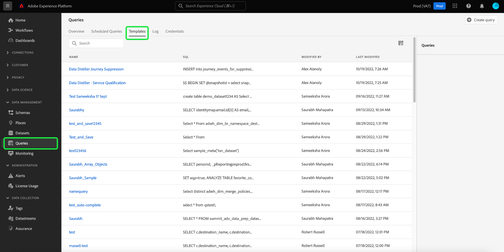
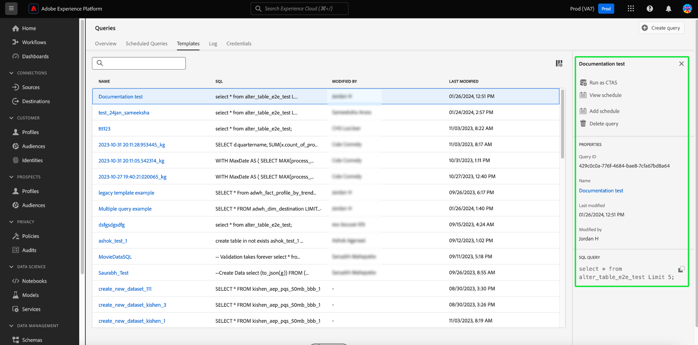

# Query Templates

Adobe Experience Platform Query Service allows you to save and reuse SQL code in the form of query templates. Templates save effort by avoiding the repetition of commonly performed tasks. You can share templates within your organization and easily change the query values without needing to access or understand the underlying SQL.

This document provides the information required to create query templates in Query Service.

## Prerequisites

You must have the [!UICONTROL Manage queries] permission enabled to access the Query Editor and view the queries dashboard within the Platform UI. The permission is enabled through the Adobe [Admin Console](https://adminconsole.adobe.com/). Please contact your organization's administrator if you do not have administrator privileges to enable this permission. See the access control documentation for [full instructions on adding permissions through Admin Console](../../access-control/home.md).

## Create a query template

You can create query templates through two methods, either by making a POST request to the Query Service API `query-templates` endpoint, or by writing, naming, and saving a query through the Query Editor.

### Use the Query Editor to author and save a query as a template

See the documentation for instructions on how to use the Query Editor to [write](./user-guide.md#query-authoring) and [save queries](./user-guide.md#saving-queries). Once you have named and saved your query, it is available to be reused as a query template from the [!UICONTROL Templates] tab.

## Browse query templates {#browse}

From the Queries workspace of the Platform UI, select **[!UICONTROL Templates]** to display the list of available saved queries.

To find relevant template information, select any query template from the available list to open the details panel.

From the details panel you can execute four separate actions:

* Select **[!UICONTROL Output dataset]** to edit the output dataset for the selected template.
* Select **[!UICONTROL View schedule]** to navigate to the [!UICONTROL Schedules] tab. This view contains any schedule information associated with the query.
* Select **[!UICONTROL Delete query]** to delete the template.
* Select the template name to navigate to the Query Editor where the SQL is pre-populated for editing. 

### Use the Query Service API to create a template

See the documentation for instructions on [how to make a query template](../api/query-templates.md#create-a-query-template) using the Query Service API. The details for a newly created query template are contained in the response body.

>[!NOTE]
>
>Templates created using the API are also visible in the Platform UI Query Service Templates tab.

## Next steps

By reading this document, you now have a better understanding of how to create query templates in Query Service. See the [UI overview](./overview.md), or the [Query Service API guide](../api/getting-started.md) to learn more about Query Service capabilities. 

See the [scheduled queries endpoint guide](../api/scheduled-queries.md) to learn how to schedule queries using the API, or the [Query Editor guide](./user-guide.md#scheduled-queries) for the UI.
